# Airline Check-In System: Transactions, Indexes, and Locks

Imagine an airline check-in system where many passengers are selecting seats at the same time.

The risky case:

1. Passenger A opens seat `6A`.
2. Passenger B opens seat `6A`.
3. Both see the seat as available.
4. Both try to reserve it.

The database has to do two different jobs well:

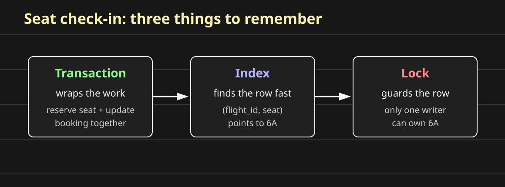

- **Find the row quickly:** use an index.
- **Change the row safely:** use a transaction and a lock.

## Transaction

A transaction wraps multiple database operations so they behave like one logical operation.

For check-in, reserving a seat may involve several writes:

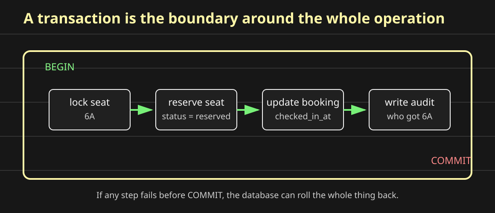

```sql
BEGIN;

SELECT *
FROM seats
WHERE flight_id = 42
  AND seat_number = '6A'
FOR UPDATE;

UPDATE seats
SET status = 'reserved',
    passenger_id = 1001
WHERE flight_id = 42
  AND seat_number = '6A'
  AND status = 'available';

UPDATE bookings
SET checked_in_at = CURRENT_TIMESTAMP
WHERE id = 5001;

COMMIT;
```

If the seat update succeeds but the booking update fails, the database should not leave the system half-finished. That is the point of the transaction boundary.

## ACID Properties

ACID is the set of promises a relational database tries to provide around a transaction.

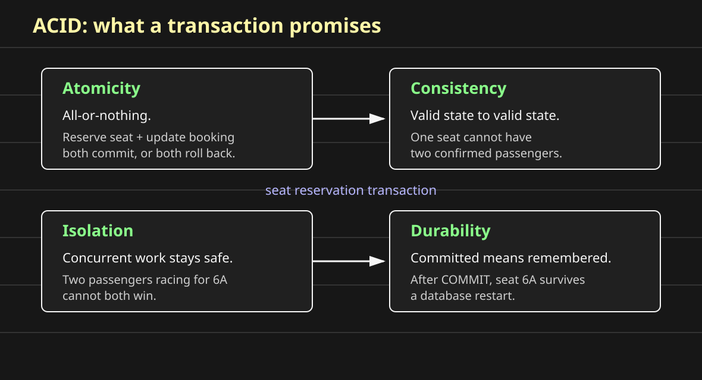

**Atomicity:** all-or-nothing.  
Either the seat is reserved and the booking is checked in, or neither change is kept.

**Consistency:** valid state to valid state.  
One seat cannot belong to two passengers. A checked-in booking must belong to a real passenger. A seat cannot be both `available` and `reserved`.

**Isolation:** concurrent transactions should not corrupt each other.  
If two passengers race for seat `6A`, isolation prevents both transactions from acting as if they were alone.

**Durability:** committed data survives failures.  
Once the database commits passenger A to seat `6A`, that assignment should survive a database restart.

## Why Indexes Make Reads Faster

Before the database can lock or update seat `6A`, it has to find the row.

The hot lookup is:

```sql
SELECT *
FROM seats
WHERE flight_id = 42
  AND seat_number = '6A';
```

Without a useful index, the database may scan many table blocks to find one row.

With this index:

```sql
CREATE INDEX idx_seats_flight_seat
ON seats(flight_id, seat_number);
```

the database gets a smaller ordered structure for lookup.

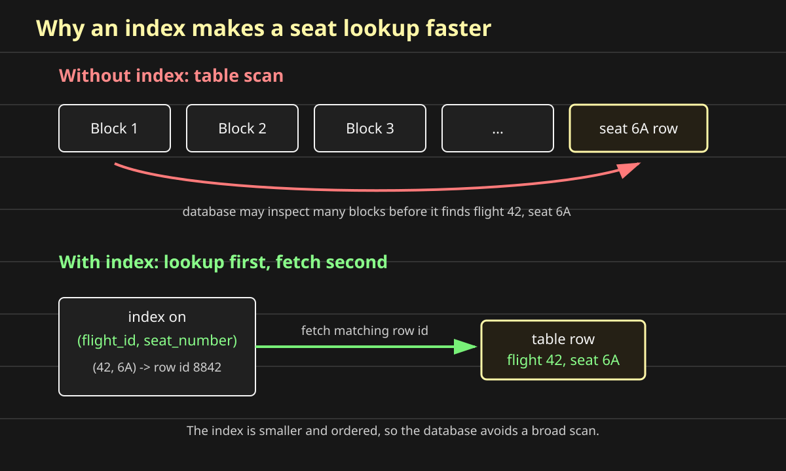

The fast path becomes:

1. search the index for `(42, '6A')`
2. get the row id
3. fetch the matching row from the table

That is why indexes make reads faster: they replace broad table scans with targeted row fetches.

Indexes are not free. Every insert, update, or delete must also maintain the index. So an index is a write tax you choose because a specific read path matters.

For airline check-in, `(flight_id, seat_number)` is a good index because the product constantly asks: "for this flight, what is the state of this seat?"

## Why Locks Are Needed

Indexes make the row easy to find. Locks make the row safe to change.

Without a lock, two transactions can both read the same old state:

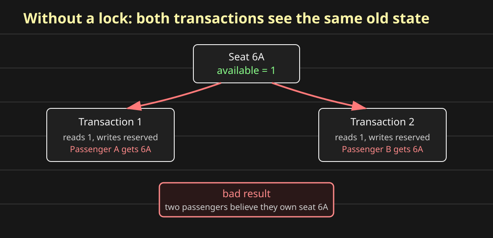

Both transactions saw `available = 1`. Both wrote a reservation. Now two passengers may believe they own seat `6A`.

Locks protect the sanity of the data:

- **consistency:** the database remains valid
- **integrity:** seat assignment rules are not broken

The rule here is simple: one seat can have only one confirmed passenger.

## Pessimistic Locking

Pessimistic locking means the database assumes conflict can happen, so the transaction takes the lock before entering the critical section.

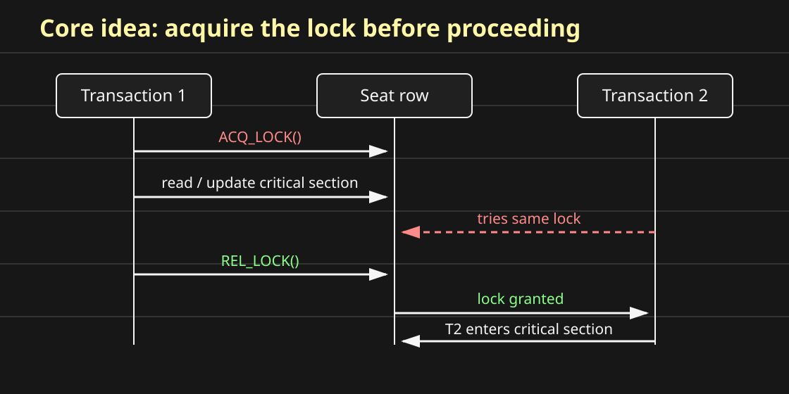

The shape is:

```text
ACQ_LOCK()
READ / UPDATE critical section
REL_LOCK()
```

Only one incompatible transaction can own the same row at the same time. The other transaction waits, skips the row, or fails immediately depending on the query.

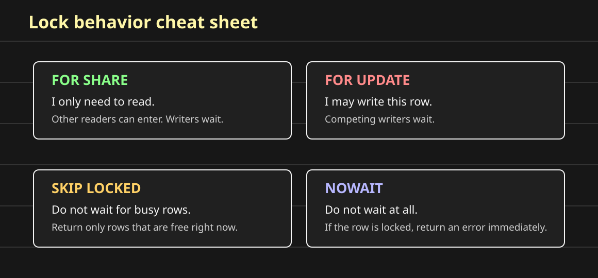

## Locking Demonstration

Now make the problem concrete.

All 120 passengers on the same trip press check-in at nearly the same time. The application asks the database for the first empty seat:

Remember the pattern:

```text
fixed inventory + contention = locking
```

Seats, vaccine slots, train tickets, movie tickets, and flash-sale inventory all have the same shape. Many users are racing for a small set of concrete items. If the system does not coordinate the race, the product can promise the same item twice.

```sql
SELECT id, name, trip_id, user_id
FROM seats
WHERE trip_id = 1
  AND user_id IS NULL
ORDER BY id
LIMIT 1;
```

Before looking at the answers, predict what happens in each version:

- plain `SELECT`
- `SELECT ... FOR UPDATE`
- `SELECT ... FOR UPDATE SKIP LOCKED`
- `SELECT ... FOR UPDATE NOWAIT`

The useful question is not "which passenger clicked first?" The useful question is "what does the database do when multiple transactions reach the same first empty row?"

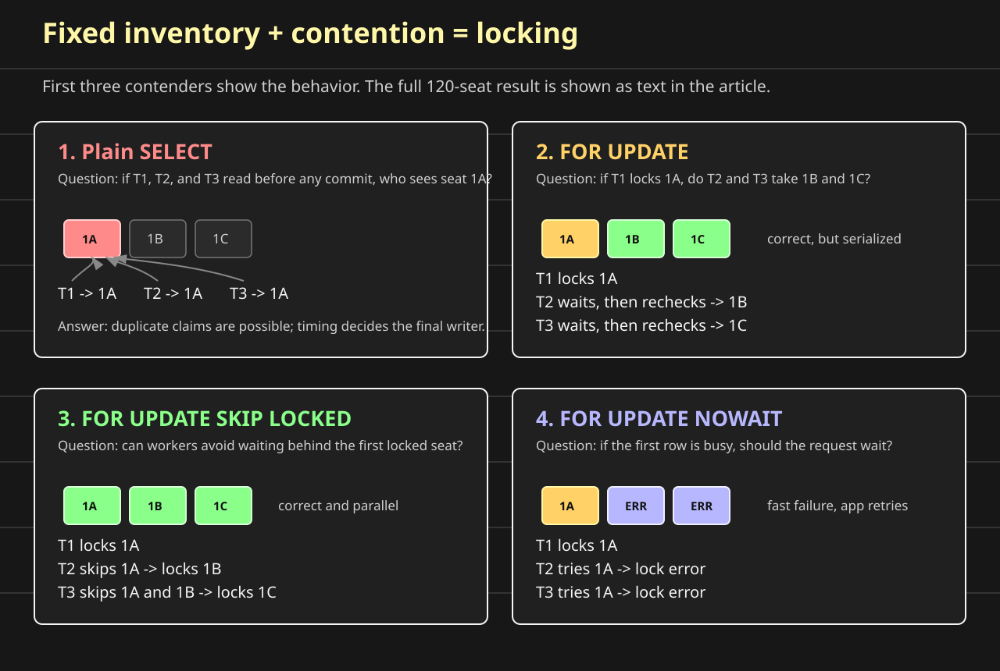

Each scenario below uses three transactions to explain the mechanism. After that, the text map shows the full 120-seat result for the whole check-in run.

For the text maps, read each block as 120 seats: 6 rows with 20 seats per row.

```text
. = available
X = booked
D = booked row with duplicate claims
```

### Scenario 1: Plain `SELECT`

Question: if transaction `T1`, `T2`, and `T3` all run the query before anyone commits, which row do they read?

Answer: they may all read the same row.

```text
time 0: seat 1B has user_id = NULL

T1 SELECT -> seat 1B
T2 SELECT -> seat 1B
T3 SELECT -> seat 1B

T1 UPDATE seats SET user_id = 101 WHERE id = 1
T2 UPDATE seats SET user_id = 102 WHERE id = 1
T3 UPDATE seats SET user_id = 103 WHERE id = 1
```

The terminal may print two passengers assigned to the same seat because the read did not reserve anything. It only observed an old value.

```text
Zoila Rau was assigned the seat 1-B
Mr. Ferne King was assigned the seat 1-B
```

This is the unsafe version. It has high apparent concurrency, but the concurrency is not controlled.

```text
plain SELECT after 120 concurrent attempts

D . . . . . . . . . . . . . . . . . . .
. . . . . . . . . . . . . . . . . . . .
. . . . . . . . . . . . . . . . . . . .
. . . . . . . . . . . . . . . . . . . .
. . . . . . . . . . . . . . . . . . . .
. . . . . . . . . . . . . . . . . . . .

This is one possible unsafe outcome. The exact map is timing-dependent.
The `D` seat is booked in the database, but more than one transaction may have claimed it.
In the worst case, all 120 transactions read the same first seat before any commit, so 120 users can be told they got one seat even though the row can store only one final `user_id`.
```

### Scenario 2: `FOR UPDATE`

Now add the lock:

```sql
SELECT id, name, trip_id, user_id
FROM seats
WHERE trip_id = 1
  AND user_id IS NULL
ORDER BY id
LIMIT 1
FOR UPDATE;
```

Question: if `T1` locks seat `1B`, does `T2` immediately take seat `1C`?

Answer: no. `T2` usually waits behind the locked first row.

```text
T1 SELECT ... FOR UPDATE -> locks 1B
T2 SELECT ... FOR UPDATE -> waits on 1B
T3 SELECT ... FOR UPDATE -> waits on 1B

T1 UPDATE 1B
T1 COMMIT -> releases lock

T2 wakes up, rechecks 1B, sees user_id is no longer NULL
T2 moves to the next matching row -> locks 1C
```

This version is correct. Two transactions do not claim the same row. But it can serialize the workload because many transactions wait on the same first available seat.

The allocation order is mostly seat order because of `ORDER BY id`, but the passenger order is not guaranteed. The database does not promise that the first request, first connection, or lowest user id gets the next seat.

```text
seat order:       1B, 1C, 1D, ...
passenger order:  scheduler-dependent
```

```text
FOR UPDATE after 120 concurrent attempts

X X X X X X X X X X X X X X X X X X X X
X X X X X X X X X X X X X X X X X X X X
X X X X X X X X X X X X X X X X X X X X
X X X X X X X X X X X X X X X X X X X X
X X X X X X X X X X X X X X X X X X X X
X X X X X X X X X X X X X X X X X X X X

Correct result: all 120 seats are booked exactly once.
Cost: many transactions may wait behind the first locked row.
```

### Scenario 3: `FOR UPDATE SKIP LOCKED`

Now tell the database not to wait on busy rows:

```sql
SELECT id, name, trip_id, user_id
FROM seats
WHERE trip_id = 1
  AND user_id IS NULL
ORDER BY id
LIMIT 1
FOR UPDATE SKIP LOCKED;
```

Question: if `T1` has locked seat `1B`, what should `T2` do?

Answer: skip `1B` and try the next available unlocked row.

```text
T1 SELECT ... FOR UPDATE SKIP LOCKED -> locks 1B
T2 SELECT ... FOR UPDATE SKIP LOCKED -> skips 1B, locks 1C
T3 SELECT ... FOR UPDATE SKIP LOCKED -> skips 1B and 1C, locks 1D

T1 UPDATE 1B
T2 UPDATE 1C
T3 UPDATE 1D
```

This is why `SKIP LOCKED` is powerful for fixed-inventory allocation, job queues, flash sales, and standby seat assignment. The workers spread out over different rows instead of forming one long waiting line.

The tradeoff is fairness. The system gets throughput, not strict first-come-first-served behavior.

```text
correctness: no duplicate seats
throughput:  high
fairness:    not guaranteed
```

```text
FOR UPDATE SKIP LOCKED after 120 concurrent attempts

X X X X X X X X X X X X X X X X X X X X
X X X X X X X X X X X X X X X X X X X X
X X X X X X X X X X X X X X X X X X X X
X X X X X X X X X X X X X X X X X X X X
X X X X X X X X X X X X X X X X X X X X
X X X X X X X X X X X X X X X X X X X X

Same correct final shape as FOR UPDATE: all 120 seats booked exactly once.
The difference is the path: workers skip busy rows and spread out in parallel.
```

### Scenario 4: `FOR UPDATE NOWAIT`

Now tell the database to fail instead of waiting:

```sql
SELECT id, name, trip_id, user_id
FROM seats
WHERE trip_id = 1
  AND user_id IS NULL
ORDER BY id
LIMIT 1
FOR UPDATE NOWAIT;
```

Question: if `T1` has locked the first available seat, should `T2` block?

Answer: no. `T2` gets a lock error immediately.

```text
T1 SELECT ... FOR UPDATE NOWAIT -> locks 1B
T2 SELECT ... FOR UPDATE NOWAIT -> error, row is locked
T3 SELECT ... FOR UPDATE NOWAIT -> error, row is locked
```

This is useful when waiting would create a bad user experience. For example, if a passenger explicitly chose seat `6E`, the app can fail fast, refresh the seat map, and ask them to pick another seat.

For automatic allocation of the next available seat, `NOWAIT` is usually less useful than `SKIP LOCKED`, unless the application has a retry loop.

```text
FOR UPDATE NOWAIT after 120 concurrent attempts without retry

X . . . . . . . . . . . . . . . . . . .
. . . . . . . . . . . . . . . . . . . .
. . . . . . . . . . . . . . . . . . . .
. . . . . . . . . . . . . . . . . . . .
. . . . . . . . . . . . . . . . . . . .
. . . . . . . . . . . . . . . . . . . .

One transaction got the lock and booked the seat.
The other 119 attempts failed fast and must retry or return an error to the app.
With retries, more seats can be booked, but each retry is a new attempt.
```

## Shared Locks

A shared lock is a read lock.

Other transactions can read the locked rows, but they cannot modify those rows until the lock is released.

```sql
SELECT *
FROM seats
WHERE seat_id IN (1, 2, 6)
FOR SHARE;
```

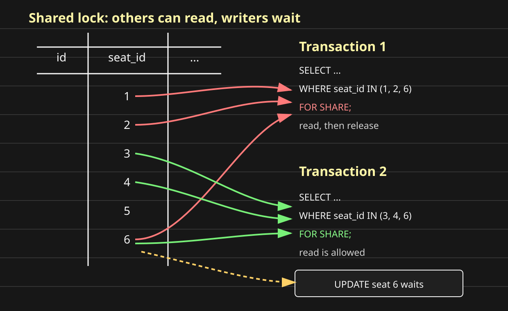

Transaction 1 takes shared locks on seats `1`, `2`, and `6`.

Transaction 2 can still read seat `6`, because shared locks are compatible with other shared locks.

But if transaction 2 tries to update seat `6`, it waits. A write needs an exclusive lock.

## Exclusive Locks

An exclusive lock is a write lock.

Other transactions cannot modify the locked rows. Locking reads that need those rows also wait.

```sql
SELECT *
FROM seats
WHERE seat_id IN (1, 2, 6)
FOR UPDATE;
```

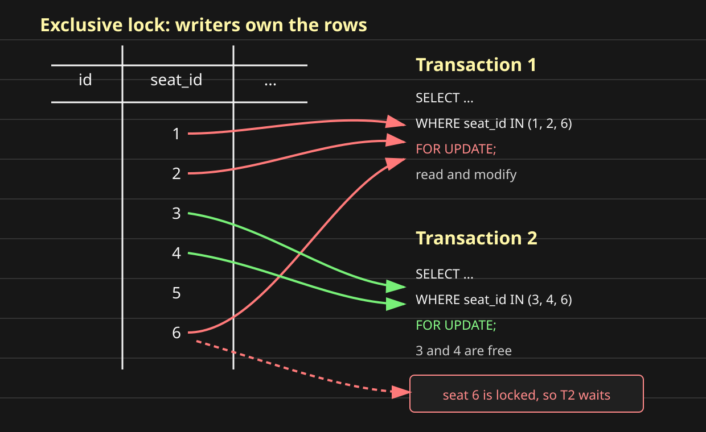

Transaction 1 locks seats `1`, `2`, and `6` for update.

Transaction 2 asks for seats `3`, `4`, and `6`. Seats `3` and `4` are free, but seat `6` is already locked, so transaction 2 waits.

This protects correctness, but it lowers throughput when many transactions fight for the same rows.

## Deadlocks

A deadlock is a waiting cycle.

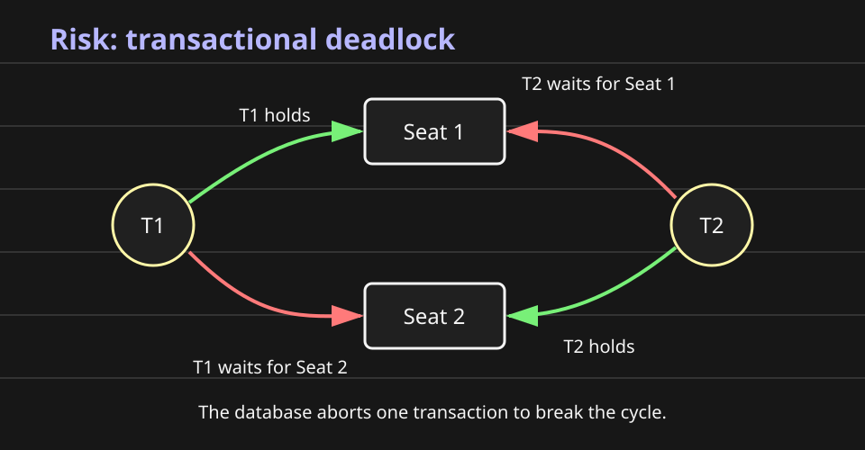

Example:

```text
T1 locks seat 1
T2 locks seat 2

T1 now wants seat 2
T2 now wants seat 1
```

Neither transaction can continue.

Relational databases detect this cycle and abort one transaction. The aborted transaction releases its locks, the other transaction continues, and the application can retry the aborted work when safe.

## `SKIP LOCKED`

Sometimes waiting is not useful.

For a standby-seat worker, it may be fine to skip a locked seat and take another available seat.

```sql
SELECT *
FROM seats
WHERE seat_id IN (3, 4, 6)
FOR UPDATE SKIP LOCKED;
```

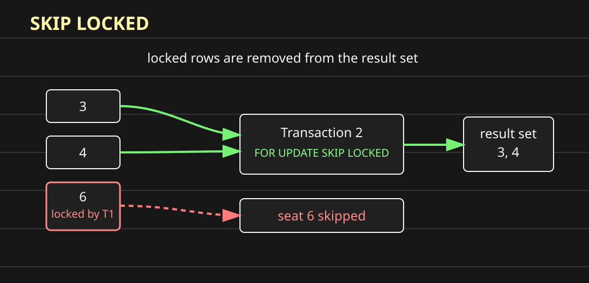

The result set contains only seats `3` and `4`.

Seat `6` is locked, so the database removes it from the result set instead of making the transaction wait.

## `NOWAIT`

Sometimes waiting is wrong, but skipping is also wrong.

If a passenger explicitly selected seat `6A`, the application may want fast failure instead of blocking.

```sql
SELECT *
FROM seats
WHERE seat_id = 6
FOR UPDATE NOWAIT;
```

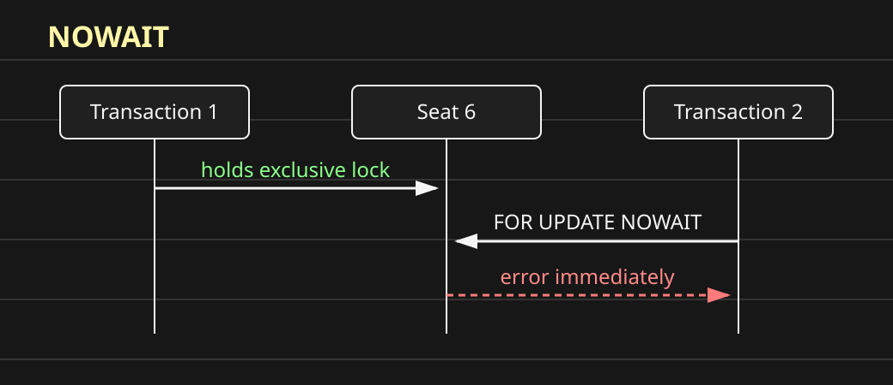

`NOWAIT` means:

```text
Try to acquire the lock.
If the row is already locked, fail immediately.
Do not wait.
```

The app can then refresh the seat map or ask the passenger to choose another seat.

## The Tradeoff

Indexes and locks solve different problems:

```text
index -> find the row fast
lock  -> change the row safely
```

Locking protects data sanity, but it is not free:

```text
more locking  -> safer critical sections, lower concurrency
less locking  -> higher concurrency, more conflict risk
```

For airline check-in, correctness matters more than raw speed on the final seat reservation step. It is better to make one passenger wait briefly than to double-book the same seat.
