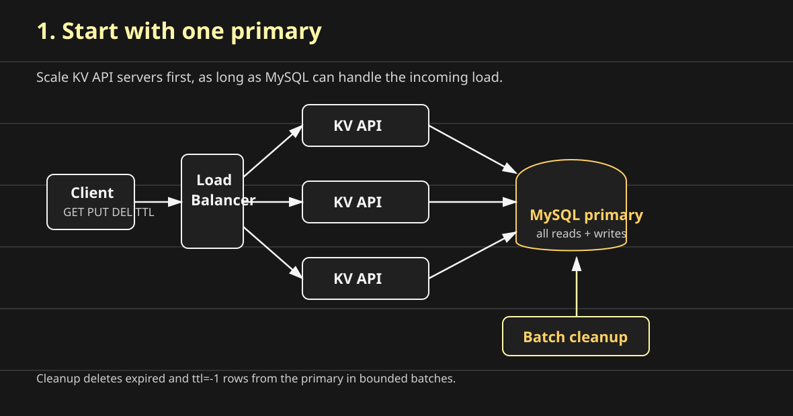
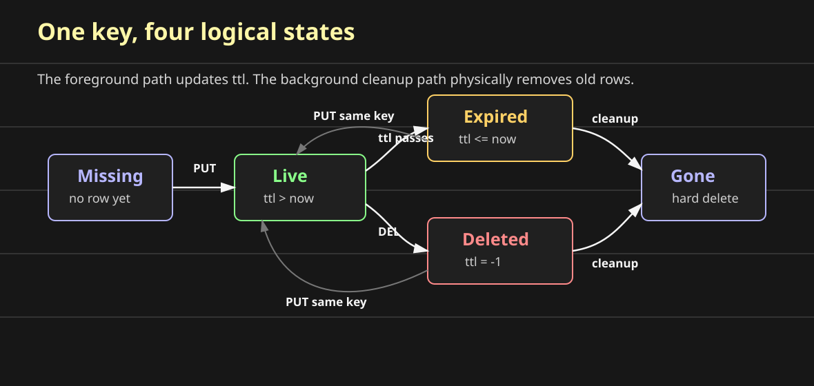
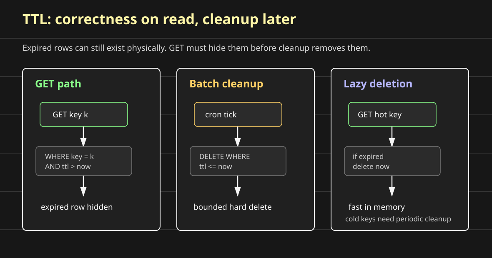
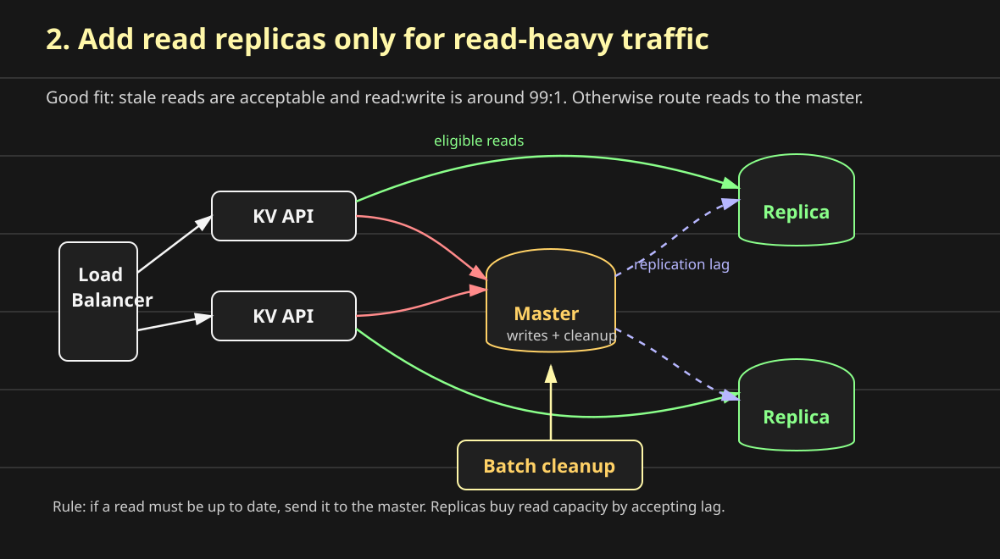
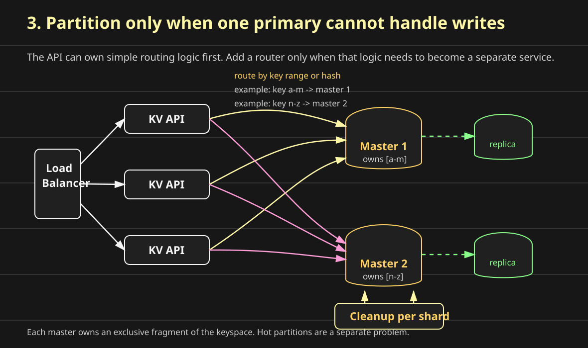

# Designing a Distributed KV Store on a Relational Database

Can a relational database be used to build something that looks like Apache Ignite: a scalable key-value store with `GET`, `PUT`, `DEL`, and `TTL`?

Yes, but only if we are honest about the shape of the problem.

A key-value store has a simple external contract:

```text
GET key      -> value
PUT key val  -> store value
DEL key      -> delete key
TTL key t    -> expire key after time t
```

Question: why can this simple shape scale so far?

Because the system limits the access pattern. Every operation starts from one key. That key can decide where the data lives:

```text
partition = hash(key)
```

This is the core idea behind heavily partitioned key-value systems such as DynamoDB and Redis. They do not try to support arbitrary joins, broad aggregations, or flexible queries as the main contract. They optimize for `GET`, `PUT`, and `DEL` by key.

The limitation is what makes the routing simple:

```text
key-bound access -> easy partitioning -> huge storage and throughput
```

The hard part is not the API. The hard part is storage growth, hot keys, cleanup, write contention, and deciding when one relational database is no longer enough.

Start with a single MySQL node. Then scale only when the system demands it.



The scaling sequence should be bottom up:

1. Add more stateless KV API servers while MySQL can handle the load.
2. Add read replicas only when reads dominate and stale reads are acceptable.
3. Partition the keyspace only when one primary cannot handle writes.

## Start with One Table

Question: what is the smallest relational schema that can support a key-value store?

Answer: a primary-key lookup table.

The first version is easy to understand:

```sql
CREATE TABLE store (
  key VARCHAR(255) PRIMARY KEY,
  value BLOB NOT NULL,
  ttl BIGINT NOT NULL,
  is_deleted BOOLEAN NOT NULL DEFAULT FALSE
);
```

The row means:

```text
key -> value, ttl, is_deleted

key:        varchar(255), primary key
value:      blob
ttl:        absolute expiration time
is_deleted: soft-delete marker
```

`ttl` is an absolute expiration time, stored as an integer epoch timestamp. The primary key is the important part. It gives every key one home inside the table and lets the database coordinate same-key updates.

But we can optimize this schema.

Do we really need both `ttl` and `is_deleted`? Not necessarily. We can encode delete as a special TTL value:

```text
ttl = -1      -> soft deleted
ttl > now()   -> live until that timestamp
ttl <= now()  -> expired
```

If the product needs keys that never expire, use a far-future timestamp or add that behavior deliberately. Keeping the teaching model to `ttl > now()` makes the core read/delete logic easier to see.

So the compact schema becomes:

```sql
CREATE TABLE store (
  key VARCHAR(255) PRIMARY KEY,
  value BLOB NOT NULL,
  ttl BIGINT NOT NULL
);
```

The mental model is:

```text
before:

key | value | ttl | is_deleted
----+-------+-----+-----------
k1  | v1    | 900 | false
k2  | v2    | 800 | true

after:

key | value | ttl
----+-------+----
k1  | v1    | 900
k2  | v2    | -1

ttl = -1 now carries the delete state.
```

This is the main storage idea:

```text
soft delete is an UPDATE, not a DELETE
```

That matters because hard deletes create churn in the storage engine. A soft delete is just a row update. The system can physically remove old rows later in controlled batches.



## Implement `GET`

Question: should an expired key still be visible before the cleanup worker deletes it?

Answer: no. Reads must filter expired and deleted keys.

```sql
SELECT value
FROM store
WHERE key = k
  AND ttl > now();
```

This means cleanup can lag safely. Even if an expired row is still on disk, the read path treats it as gone.

```text
row exists on disk + ttl expired = invisible to GET
```

## Implement `PUT`

Question: where should the insert-versus-update decision happen: in the API server or in SQL?

The naive API-side version is:

```text
API -> DB: GET key
DB  -> API: key exists or not
API -> DB: INSERT or UPDATE
```

That has two problems:

- extra network round trips
- a race between the `GET` and the later write

The better version pushes the decision into the database:

```text
API -> DB: UPSERT key, value, ttl
```

An upsert means:

```text
if key exists:     update it
if key is missing: insert it
```

At the design level, write it as one database operation:

```sql
UPSERT INTO store (key, value, ttl)
VALUES (k, v, ttl);
```

Or, if you want the behavior spelled out:

```text
UPSERT store(key, value, ttl)
  if key exists:
    update value and ttl
  else:
    insert key, value, ttl
```

Most relational databases have an upsert form. The system design point is simpler: do not make the API server do `GET` and then choose `INSERT` or `UPDATE`; let the database handle that decision atomically.

This handles all of these cases in one database call:

```text
PUT k1, v1   -> insert row
PUT k1, v2   -> update existing row
PUT deleted key -> update row and make it live again
PUT expired key -> update row and make it live again
```

Two concurrent `PUT`s for the same key are still contention. The primary-key row becomes the coordination point.

```text
same key + concurrent writes = locking
```

If two requests run at the same time:

```text
PUT k1, v1
PUT k1, v2
```

the database protects the primary-key row. One update gets the row lock, the other waits.

```text
T1 updates k1 -> holds row lock
T2 updates k1 -> waits
T1 commits
T2 continues and writes its value
```

The final value is whichever transaction commits last. This is safe for data integrity, but it may or may not be the product behavior you want.

If the product prefers fast failure instead of waiting, explicitly try to lock the key with `NOWAIT`:

```sql
SELECT *
FROM store
WHERE key = k
FOR UPDATE NOWAIT;
```

Then update only if the lock was acquired:

```sql
UPDATE store
SET value = v2,
    ttl = new_ttl
WHERE key = k;
```

That gives the API a clear choice:

```text
lock acquired -> update
row locked    -> fail fast or retry
```

If the product needs stronger semantics than "last commit wins," add a version column and compare the expected version during update.

## Implement `DEL`

Question: should delete immediately remove the row from disk?

Answer: usually no. Make delete a soft delete.

```sql
UPDATE store
SET ttl = -1
WHERE key = k
  AND ttl > now();
```

The last predicate is an optimization:

```text
AND ttl > now()
```

If the key is already expired, do not write the row again. That avoids unnecessary database work.

```text
DEL live key      -> update ttl to -1
DEL deleted key   -> no-op
DEL expired key   -> no-op
```

The row may still exist on disk, but the logical delete is complete because `GET` already filters it out.

Hard delete should happen outside the request path. Run a separate cleanup process periodically:

```text
foreground DEL:
  UPDATE store SET ttl = -1 WHERE key = k

background cleanup:
  every N seconds or minutes
  delete a bounded batch of expired and soft-deleted rows
```

That keeps user-facing deletes cheap and moves disk cleanup to a controlled worker.

## Implement `TTL`

Question: does `TTL` need a timer per key?

Answer: no. Store an absolute expiration time.

```sql
UPDATE store
SET ttl = now() + duration
WHERE key = k
  AND ttl > now();
```

Then the read path enforces the TTL:

```text
GET ignores expired rows
cleanup eventually removes expired rows
```

That separation is important. Expiration is a correctness rule on reads. Cleanup is a storage-management job.

## TTL Cleanup Strategies

Question: what happens to an expired key before it is physically deleted?

Answer: `GET` filters it out.



```text
client
  |
  | GET k
  v
KV API
  |
  | SELECT value
  | FROM store
  | WHERE key = k
  |   AND ttl > now
  v
MySQL

expired row exists on disk -> not returned to the user
```

That means hard deletion can be delayed. The user-facing correctness path does not depend on the cleanup job running at exactly the expiration time.

```text
time ---------------------------------------------------->

PUT k ttl=100
          |
          v
       ttl passes
          |
          | GET k returns "not found"
          | row may still exist on disk
          v
    cleanup job hard deletes row later
```

There are three cleanup patterns worth knowing.

### Approach 1: Batch Deletion with a Cron Job

Run a separate worker every few minutes and delete expired rows in bounded batches.

```text
Every few minutes:
  delete expired rows
  delete soft-deleted rows
  stop after a fixed batch size
```

This is simple and works well for disk-backed relational databases.

Example cleanup query:

```sql
DELETE FROM store
WHERE ttl <= now()
LIMIT 1000;
```

Run it from a separate process:

```text
cleanup worker
  |
  | every 60s
  v
DELETE expired or soft-deleted rows in small batches
```

The worker should use a bounded batch size so cleanup does not monopolize the primary database.

The advantage is predictable cleanup. The downside is that expired rows can stay on disk until the next run.

```text
cron tick       cron tick       cron tick
   |               |               |
   v               v               v
delete batch    delete batch    delete batch

expired rows between ticks are filtered out by GET
```

### Approach 2: Lazy Deletion

This is the Redis-style idea: do not proactively scan for this key. When someone fetches the key, check whether it is expired. If it is expired, delete it right there and return not found.

```text
GET key
  if key is live:
    return value
  if key is expired:
    delete it immediately
    return not found
```

This helps when expired keys are frequently read because the read naturally discovers stale data.

The weakness is obvious: if the key is never fetched again, lazy deletion never runs for that key.

```text
expired key is fetched      -> cleanup happens on read
expired key is never fetched -> row stays on disk
```

For in-memory stores, lazy deletion covers the common case well. If an application puts a key with a TTL, there is a good chance that a hot key will be accessed again. Checking metadata and deleting that expired key during `GET` is fast because the data is in memory. Cleanup work gets spread across normal reads.

The edge case is a cold key that expires and is never fetched again. To cover that, an in-memory store can run a small periodic cleanup job. The point is not to rely on a huge batch job as the only mechanism. Lazy deletion handles the majority access path, and the periodic job cleans up the leftovers.

```text
lazy deletion:
  hot expired keys are cleaned during GET
  cleanup work is spread out
  smaller pauses

batch-only deletion:
  expired keys wait for the batch job
  cleanup work arrives in chunks
  longer pauses
```

For the relational MySQL-backed design in this article, be more conservative. Scattered deletes can be much more expensive on disk, so batch cleanup remains the main cleanup strategy. Lazy deletion is useful as a concept, but it is not the primary design lever for disk-backed storage.

### Approach 3: Random Sampling

```text
Sample a small set of keys with TTL.
Delete expired keys from the sample.
Repeat if too many sampled keys were expired.
```

This is useful for in-memory systems such as Redis. It is usually a poor fit for disk-backed relational databases because random sampling creates scattered reads.

## Day-Zero Architecture

Question: what should the first version look like?

Answer: keep it boring.

```text
clients
  |
  v
KV API servers
  |
  v
Primary relational database
  |
  v
Batch cleanup worker
```

Add more API servers when stateless request handling becomes the bottleneck. Keep the database single-primary while it can handle the write load.

## Scaling Reads

Question: what if the workload is 99 percent reads?

Answer: add read replicas, if the product can tolerate stale reads.



Replicas improve read throughput, but they introduce replication lag. A recent `PUT` may not appear on a replica immediately. If read-after-write correctness matters, route that read to the primary or use a consistency strategy that accounts for lag.

Add replicas only when both conditions are true:

- reading stale data is acceptable
- the read-to-write ratio is high, such as `99:1`

The KV API chooses the connection target. Writes go to the master. Reads can go to replicas only when stale data is acceptable for that request. Batch cleanup runs on the master, and the resulting changes replicate out like other writes.

If the number of reads is not high, replicas add operational complexity without solving a real bottleneck.

## Scaling Writes

Question: what if the primary cannot handle writes anymore?

Answer: first scale up the primary. If that is still not enough, partition by key.



```text
hash(key) -> shard

shard 1 owns keys [0000, 3fff]
shard 2 owns keys [4000, 7fff]
shard 3 owns keys [8000, bfff]
shard 4 owns keys [c000, ffff]
```

Each shard has its own primary database and cleanup worker.

```text
clients
  |
  v
KV API servers
  |
  +--> shard 1 primary + replicas + cleanup
  +--> shard 2 primary + replicas + cleanup
  +--> shard 3 primary + replicas + cleanup
  +--> shard 4 primary + replicas + cleanup
```

Now the system scales because no single database owns every key. Each primary owns an exclusive fragment of the keyspace.

The KV API can own the routing logic at first:

```text
key -> partition rule -> target primary
```

Add a separate router only when routing needs to become its own service. Keeping routing in the API is simpler for the first partitioned version.

The new cost is routing and rebalancing. If a shard becomes too large or too hot, keys must move. Hot partitions are a separate design problem and should be handled after the basic partitioning model is clear.

## What to Remember

Relational databases can back a serious key-value store when the access pattern is key-based and the design accepts the database's strengths:

- primary-key lookup
- transactions for same-key contention
- upsert for insert-or-update races
- read filtering for expiration correctness
- batch cleanup for disk hygiene
- replicas for read-heavy scale
- partitioning for write-heavy scale

The simplest useful rule:

```text
correctness first, cleanup second, partitioning only when the primary is truly the bottleneck
```
