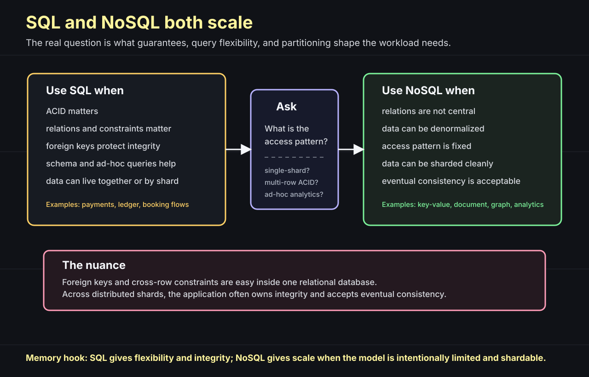
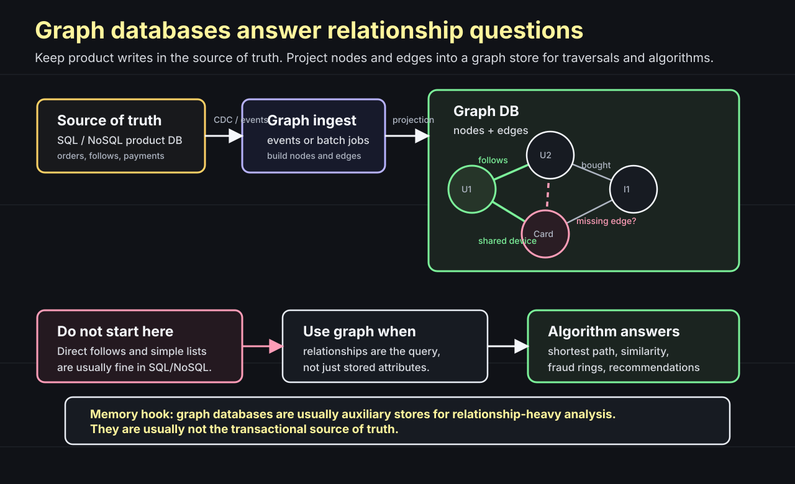
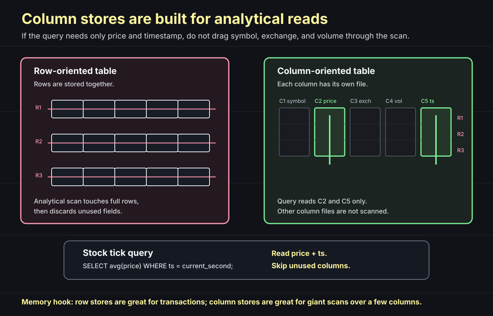
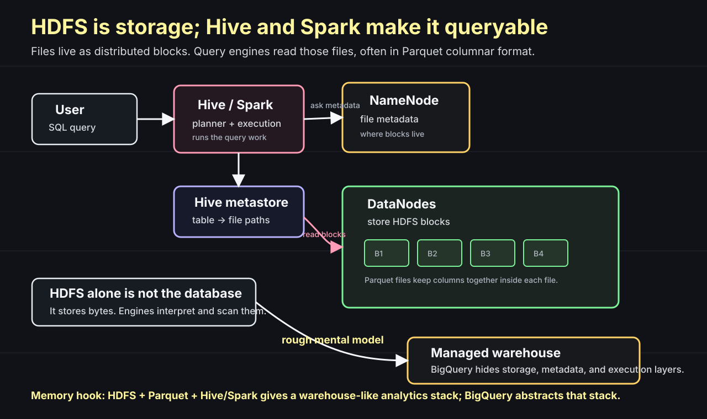
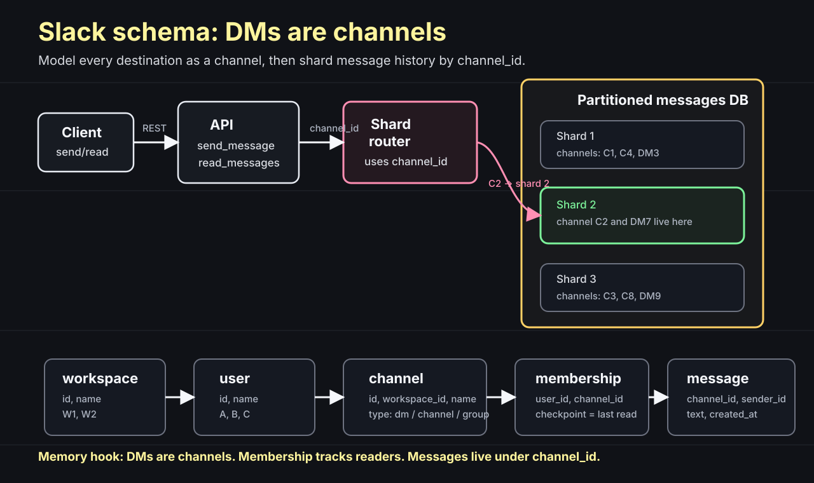
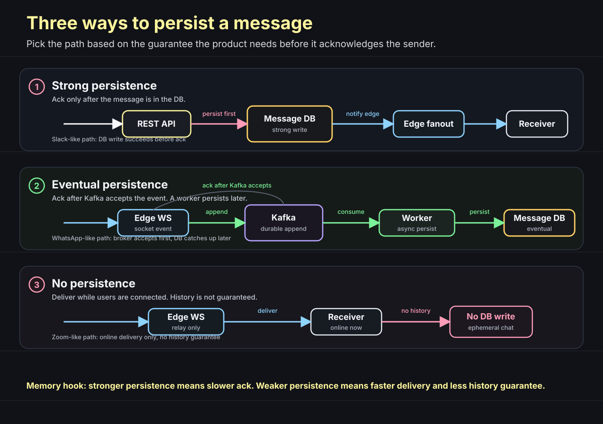
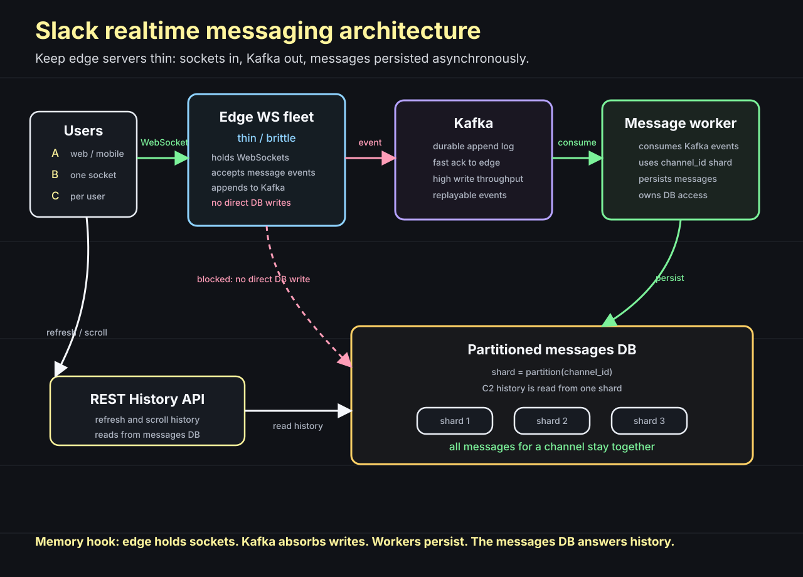
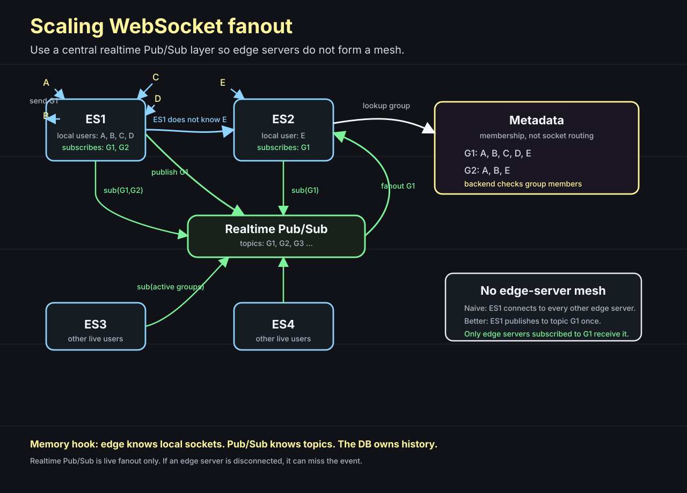
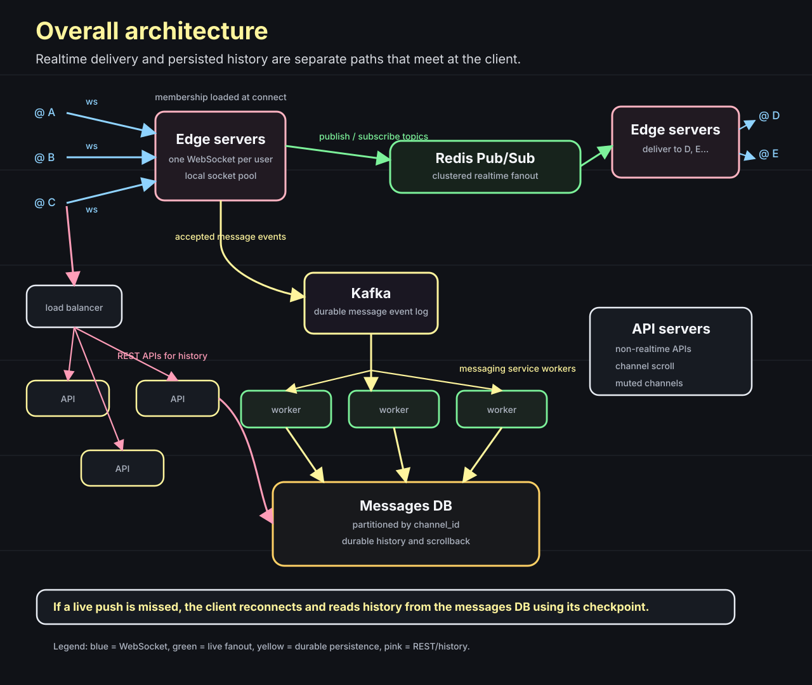

# Designing Slack's Realtime Communication

Question: when someone sends a Slack message, what is the system really doing?

It is tempting to answer "send it to everyone in the channel." That is only half the system.

The real design has two different jobs:

```text
history storage -> make sure the message can be read later
realtime push   -> make online users see it now
```

If we mix those two jobs too early, the architecture becomes confusing. So we will build it in layers.

First, store messages so channel history can be scrolled. Then add realtime delivery. Then handle the case where realtime delivery misses.

The memory hook is:

```text
storage is channel-sharded
edge servers stay thin
Kafka buffers message writes
history comes from the messages DB
```

## Start with the Database Question

Question: does "non-relational database" mean SQL cannot scale?

No.

A non-relational database is usually chosen because the data model and access pattern are simple enough to avoid joins and distribute the data cleanly. SQL databases can also scale when the data is modeled well. The stronger statement is:

```text
systems scale when the data model matches the access pattern
```

## When to Use SQL or NoSQL

Question: why do non-relational databases often scale well?

Because they usually remove or weaken something relational databases are good at:

```text
relations
foreign-key constraints
joins
ad-hoc query flexibility
multi-row transactional guarantees
```

That does not mean SQL cannot scale. It means SQL and NoSQL scale under different assumptions.



A relational database is strong when correctness depends on relationships and constraints.

For example, a foreign key can stop this:

```text
create blog post with user_id = 10
but user_id = 10 does not exist
```

The database rejects the row. That protects the system from orphan data.

This is especially useful when the related data lives in one database. Payments, ledgers, booking systems, and many IRCTC-style flows lean toward relational databases because ACID, constraints, and consistent updates matter.

If the query pattern is transactional and can stay in one database or one shard, SQL can work very well:

```text
single-shard query
data lives together
ACID matters
constraints matter
fixed schema helps
```

NoSQL becomes attractive when the data can be modeled around a smaller access pattern.

For example, a key-value store says:

```text
give me key K
write key K
delete key K
```

That is limiting, but the limitation helps. If every request starts with a key, the system can route the request to one partition.

NoSQL systems often accept denormalization:

```text
copy display_name into many documents
copy product snapshot into an order
copy channel metadata into a message view
```

Denormalization avoids joins and can make reads faster. The tradeoff is redundancy.

If the user's last name changes, every copied value may need to be updated later. Until all copies are updated, different parts of the system may show different values.

That is eventual consistency.

```text
write happens at time T
some replicas or denormalized copies update at T + 1
all copies eventually converge
until then, reads may see old data
```

Sometimes that is acceptable. Sometimes it is not.

If a user's profile card shows an old last name for a few seconds, the product may tolerate it. If a ledger shows the wrong account balance, it should not.

There is also a middle category: distributed SQL, often discussed as NewSQL. Systems such as [Google Spanner](https://research.google/pubs/pub39966) try to keep SQL-style modeling and strong transactional guarantees while spreading data across many nodes. The database takes on the hard coordination work: sharding, replication, and distributed transactions. That buys power, but it also brings latency, cost, and operational complexity.

A SQL proxy or routing layer can route queries to shards, but it does not magically make foreign keys and transactions across shards cheap. The coordination still has to happen somewhere.

For an early startup, the default should usually be boring:

```text
start with a relational database
keep query flexibility
use SELECT, JOIN, GROUP BY, ORDER BY
learn the access patterns
move only the painful parts later
```

Early on, data usually does not explode as fast as the team thinks. Product questions change. SQL gives the team room to ask new questions, such as:

```text
average revenue on day 1
orders by customer segment
failed payments by hour
```

Doing that in a pure key-value store like DynamoDB can be awkward unless the access pattern was designed ahead of time.

The decision is not:

```text
SQL = does not scale
NoSQL = scales
```

The decision is:

```text
SQL    -> flexibility, constraints, ACID, rich queries
NoSQL  -> fixed access pattern, denormalization, easier partitioning
NewSQL -> SQL plus distributed coordination, with extra complexity
```

For this lecture, the useful NoSQL categories are:

```text
Document database
  examples: MongoDB, Elasticsearch-style document indexes
  JSON-like documents
  flexible schema
  partial document updates
  richer queries than a key-value store
  good when fields inside the document matter

Key-value store
  examples: DynamoDB, Redis
  key-wise access pattern
  heavily partitioned
  no complex query model
  good when every operation starts with a key

Column-oriented database
  examples: Amazon Redshift, Google BigQuery
  reads only the columns needed for analytics
  useful for large analytical scans

Graph database
  examples: Neo4j, Amazon Neptune, Dgraph, TigerGraph
  nodes and edges
  useful for traversals, fraud detection, and recommendations
```

Question: what is the tradeoff between a document database and a key-value store?

A document database is useful when the system needs to work with parts of a document. For example, a blog post document may have `title`, `body`, `tags`, `author`, and `updated_at`. If the request is "update only the title," partial document updates matter. The application should not need to fetch and rewrite the whole blob just to change one field.

If the product often updates one field, filters by fields, searches text, or aggregates over document attributes, a document-shaped database gives the system more room.

MongoDB is the common example. Elasticsearch is also document-shaped, but it is usually used as a search and analytics index. It is strong when the product needs search, filtering, and aggregations over document fields.

A key-value store makes a different bet. It restricts the access pattern:

```text
GET key
PUT key value
DEL key
```

That limitation is the feature.

Because every request is key-bound, the database can partition aggressively:

```text
partition = hash(key)
```

The system does not need to solve arbitrary joins, broad scans, or general aggregations on the write path. That is why systems such as DynamoDB and Redis can scale so far for key-based workloads. They trade query flexibility for massive partitioning and predictable routing.

## Graph Databases

Question: should every follow/friend relationship go into a graph database?

Not automatically.

If the product only needs this:

```text
who does user A follow?
who follows user A?
```

then SQL or a key-value/document store can work well. A follow table, an index, or a key like `followers:userA` may be enough.

A graph database becomes interesting when the relationship itself is the query:

```text
what is the shortest path between A and B?
which users are similar to this user?
which missing edge should we recommend?
which accounts form a suspicious fraud ring?
```

Graph databases store data as nodes and edges:

```text
User A --follows--> User B
User A --bought----> Item X
User C --used------> Card K
Card K --used_at---> Merchant M
```

They are meant to make graph traversal and graph algorithms easier to run.



Common graph algorithms include:

```text
shortest path          -> how close are two nodes?
connected components   -> which nodes belong to the same cluster?
centrality / PageRank  -> which nodes are important?
community detection    -> which groups naturally form?
link prediction        -> which edge is missing but likely?
similarity             -> which users/items behave alike?
cycle detection        -> is there a suspicious loop?
```

For recommendations, the graph might connect users to items:

```text
User A bought item 1 and item 2
User B bought item 1 and item 2
User C bought item 1

Question: what should we recommend to User C?
Possible answer: item 2
```

For fraud detection, the graph might connect accounts, cards, devices, merchants, phone numbers, and IP addresses. If many accounts share strange paths through the same device or payment method, the graph can expose a pattern that is awkward to find with ordinary row lookups.

This is a common graph database use case in financial fraud detection. The point is not that every bank must use the same graph product. The point is that fraud is relationship-heavy, and graph models are good at relationship-heavy questions.

The tradeoff is operational cost. Graph databases can be high-maintenance and bulky. They are usually not the first transactional database for normal product writes.

Use the graph as an auxiliary store:

```text
source-of-truth DB -> events / batch ingest -> graph DB -> graph answers
```

Keep the user-facing transaction in the system of record. Feed the graph from that data, then run graph queries and algorithms to compute recommendations, similarity, suspicious clusters, and missing edges.

## Transactional vs Analytical Queries

Question: why not run every query on the same kind of database?

Because request-path queries and analytical queries have different jobs.

A transactional query usually sits inside a user request:

```text
user clicks "send"
API reads or writes a few rows
response must come back quickly
```

That is the world of point lookups, small updates, locks, indexes, and correctness in the request context.

An analytical query is different. It may scan terabytes or petabytes. It may run for minutes, hours, or as part of a batch pipeline that takes a day. The user is not waiting for it in the same way a checkout or chat-send request waits.

```text
transactional query -> serve this request now
analytical query    -> scan a huge dataset and compute an answer
```

That difference explains why analytical column stores exist.

## Analytical Column Stores

Question: if a table has 100 columns, and the query needs only two columns, should the database read the other 98?

For a transactional row store, it often reads row by row. That is useful when the request wants the whole row:

```text
SELECT * FROM orders WHERE id = 10;
```

But analytics looks different.

Imagine a stock tick table:

```text
symbol | price | exchange | volume | ts
AAPL   | 195   | NASDAQ   | 1000   | 10:00:00
MSFT   | 424   | NASDAQ   | 800    | 10:00:00
TSLA   | 177   | NASDAQ   | 500    | 10:00:00
```

Every second, the system bulk inserts new prices. Later, an analyst asks:

```sql
SELECT avg(price)
FROM stock_ticks
WHERE ts = current_second;
```

The query needs `price` and `ts`. It does not need `symbol`, `exchange`, or `volume`.

That is the point of a column-oriented database.



Day zero, think of a five-column table as five files:

```text
symbol file:   AAPL, MSFT, TSLA
price file:    195, 424, 177
exchange file: NASDAQ, NASDAQ, NASDAQ
volume file:   1000, 800, 500
ts file:       10:00:00, 10:00:00, 10:00:00
```

If the query needs `price` and `ts`, the engine reads those two column files and skips the others.

That is why column-oriented databases are used for massive analytics and data warehouses.

They are not a replacement for transactional databases. If the product is doing single-row updates, point lookups, account balance changes, or seat booking transactions, use a transactional store. Column stores shine when the workload scans huge data but only a few columns.

The memory hook is:

```text
row store    -> read and update entities
column store -> scan metrics across many rows
```

Cassandra sits in a different category. It is often called a wide-column store. It combines ideas around partitions, rows, and clustered columns. Do not confuse that with analytical columnar warehouses like Redshift or BigQuery.

The foundational paper to know is [C-Store: A Column-oriented DBMS](https://web.eecs.umich.edu/~mozafari/fall2015/eecs584/papers/c-store.pdf). It is one of the classic papers behind modern column-store thinking.

## Redshift and BigQuery

Question: where do Redshift and BigQuery fit?

They are analytical data warehouses.

Amazon Redshift uses columnar storage for tabular data and combines it with massively parallel query processing. Google BigQuery stores table data in columnar format and separates storage from compute so analytical work can scale independently.

Use this mental model:

```text
Redshift / BigQuery:
  huge analytical scans
  aggregations across many rows
  dashboards and reporting
  batch or streaming ingestion into analytical tables

Not the default choice for:
  per-request transactional writes
  high-frequency row updates
  lock-heavy booking flows
```

So when stock ticks are arriving every second, the warehouse is useful for later questions like:

```text
average price by minute
max spread per exchange
volume trend by symbol
```

It is not the system that should sit directly in the critical request path for every tiny transactional update.

## HDFS and the Analytics Stack

Question: where does HDFS fit in this picture?

HDFS is separate from Redshift and BigQuery. It is not a managed warehouse by itself. HDFS is distributed file storage.

The data sits in files. Those files are split into blocks. The NameNode tracks metadata about files and blocks. DataNodes store the actual blocks.

To query that data, teams commonly add table metadata and a query engine:

```text
HDFS    -> stores files as blocks
Parquet -> stores files in a columnar format
Hive    -> gives table metadata
Spark   -> executes analytical queries
```



This is why people often describe the old open-source warehouse stack like this:

```text
HDFS + Parquet + Hive + Spark
```

BigQuery gives a similar high-level product shape as a managed warehouse. It hides most of the storage, metadata, execution, and scaling work behind the service.

That does not mean the systems are identical internally. It means the reader should understand the layers:

```text
storage layer  -> where files live
format layer   -> how rows/columns are encoded
catalog layer  -> what tables mean
engine layer   -> who runs the query
```

References used for these database sections:

- [Spanner: Google's Globally-Distributed Database](https://research.google/pubs/pub39966)
- [Spanner reads, writes, and consistency](https://cloud.google.com/spanner/docs/whitepapers/life-of-reads-and-writes)
- [Amazon Redshift columnar storage](https://docs.aws.amazon.com/redshift/latest/dg/c_columnar_storage_disk_mem_mgmnt.html)
- [BigQuery storage overview](https://cloud.google.com/bigquery/docs/storage_overview)
- [Apache HDFS architecture](https://hadoop.apache.org/docs/current3/hadoop-project-dist/hadoop-hdfs/HdfsDesign.html)
- [C-Store: A Column-oriented DBMS](https://web.eecs.umich.edu/~mozafari/fall2015/eecs584/papers/c-store.pdf)

## What Are We Designing?

**Question: what are the core requirements?**

We need:

- multiple workspaces
- multiple users
- multiple channels
- direct messages
- realtime chat
- historical messages that can be scrolled

Similar systems show up everywhere:

```text
Slack channels
direct messages
multiplayer games
realtime polls
collaborative creator tools
Instagram live chat
Zoom chat
live comment streams
```

The common problem is the same: many users are connected now, but the system must also remember what happened.

## Insight: DMs Are Channels

**Question: do we need one design for DMs and another design for channels?**

No. A DM is a channel with two people.

That means the real modeling problem is:

```text
model channels very well
```

A workspace has multiple channels. A channel has multiple messages. A membership row says which users belong to which channel.

```text
workspace
  id
  name

user
  id
  name

channel
  id
  workspace_id
  name
  type        // dm, public channel, private channel, group chat

membership
  channel_id
  user_id
  checkpoint // last message the user has read

message
  id
  channel_id
  from_user_id
  text
  created_at
```

So both of these become the same operation:

```text
send DM       -> write message to a dm channel
post channel  -> write message to a public/private channel
```

The UI can still render them differently. The storage model does not need two message systems.

## Message Storage: Shard by Channel

Now ask the storage question.

**Question: if a channel has millions of messages, where should those messages live?**

Messages tend to explode in size compared with users, channels, and memberships. They are append-heavy, naturally paginated, and usually read through one channel at a time.

```text
send message to channel C
read recent messages from channel C
scroll older messages from channel C
```

That makes `channel_id` the natural partition key.

Pick any database that can be partitioned this way. Cassandra, MongoDB, DynamoDB-style systems, or even SQL can work if the sharding is designed around the access pattern.

```text
partition key = channel_id
```

The shard ownership must be mutually exclusive:

```text
one channel_id -> one owning shard
```

That gives the system the important property:

```text
channel C2 -> shard 7 -> all C2 messages
```



The routing rule can be simple:

```text
shard = partition(channel_id)
```

Now scrolling is simple:

```text
read channel C history -> query one shard
scroll channel C older -> query the same shard again
```

No cross-shard query is needed for normal channel scroll.

The basic write path can start as a REST call:

```text
send_message(from_user, channel_id, text)
  API finds the shard using channel_id
  API stores the message there
```

The read path uses the same key:

```text
read_messages(channel_id)
  API finds the shard using channel_id
  API returns the latest page

scroll_older(channel_id, cursor)
  API queries the same shard again
```

This solves persisted history. It does not solve realtime delivery.

If another user is sitting in the channel, they do not want to refresh the page or wait for short polling. Messaging with REST polling is a poor user experience because the client keeps asking:

```text
any new messages?
any new messages?
any new messages?
```

The answer is to keep a connection open.

Browsers also have practical limits on concurrent connections. A chat product should not open a separate socket for every channel, DM, typing indicator, and notification stream. Keep one WebSocket per user and piggyback realtime communication over that one connection.

## Three Ways To Persist A Message

**Question: when should the sender get an ack?**

That depends on the persistence guarantee the product gives.

There are three common paths.



Path 1 is strong persistence:

```text
user -> REST API -> message DB -> edge fanout -> receiver
```

The API talks to the database first. The sender gets an ack only after the database write succeeds.

This is the right shape when message history must be strongly consistent. A Slack-like product may send the message over a normal REST API, persist it, and then use the realtime edge path only to notify connected receivers. Sending does not have to be over WebSocket. Receiving can still feel realtime.

Path 2 is eventual persistence:

```text
user -> edge WebSocket server -> Kafka -> worker -> message DB
```

The edge server accepts the socket event and appends it to Kafka. Once Kafka accepts the event, the edge can ack the sender and the worker persists the message later.

This is useful when high throughput and quick ack matter more than immediate database visibility. A WhatsApp-like path can work this way: once the durable broker accepts the event, persistence is expected to happen eventually.

Path 3 has no persistence:

```text
user -> edge WebSocket server -> receiver
```

The system only relays the message to connected users. It does not write to the database.

This is valid when history is not part of the product guarantee. In a Zoom meeting chat, if the meeting started at 9 and you join later, you may not need to see every older chat message. The product can choose ephemeral delivery.

The decision is not "WebSocket or REST". The decision is:

```text
what persistence guarantee do we need before ack?
```

## Edge, Kafka, and Messages DB

**Question: what does the eventual persistence path look like?**

Now zoom into path 2. Keep the architecture focused:

```text
user
  -> edge WebSocket server
  -> Kafka
  -> message persistence worker
  -> partitioned messages DB
```



The edge server is the public-facing socket machine. It should stay thin:

```text
edge server:
  holds one WebSocket per user
  accepts message events
  writes events to Kafka
  does not write directly to the DB
```

**Why not let the edge server write to the message DB?**

Because then the public edge needs DB credentials and synchronous database write behavior. That is a poor boundary for a machine exposed to the public internet.

It also couples the most connection-heavy part of the system to the database. If the DB is slow, the edge server becomes slow. If the DB is down, the edge server has to decide whether to block, retry, fail, or deliver a message that may never be persisted.

The edge fleet also fans out across many machines. If every edge server writes synchronously to the database, the database gets a bursty write workload from all public-facing socket servers.

The edge server should mainly do this:

```text
hold TCP connections
receive socket events
append accepted events to Kafka
```

Kafka keeps the edge server thin:

```text
edge receives message
edge appends event to Kafka
edge can ack after Kafka accepts the event
message worker persists later
```

**Why Kafka instead of a simple queue?**

Messaging needs high write throughput, fast append, ordered partitions, replay, and quick acknowledgement. Kafka is good at that shape. The durable history is still the messages DB. Kafka is the buffer and handoff layer.

Once Kafka accepts the event, the edge can safely stop doing synchronous DB work. The message worker later consumes the event and persists it.

**When is this safe?**

It is safe when the message write does not depend on a later runtime check that may reject it. If a SQL database might reject the row because of a foreign-key check or a payment rule, the system cannot say the message is persisted until that validation passes.

Here, the event is already shaped as a valid message append:

```text
message event:
  channel_id
  from_user_id
  text
  created_at
```

The worker computes the shard from `channel_id` and writes the row there.

**What does the user see?**

The edge can deliver the event in near realtime after Kafka accepts it. The message worker persists it shortly after.

If a user refreshes the page, the app can load recent history from the messages DB. If a message has reached Kafka but the worker has not persisted it yet, that message may not appear in history for a moment. That is the cost of making persistence asynchronous.

## Scaling WebSocket Fanout

**Question: if A sends a message to group G1, and E is connected to another edge server, how does E receive it?**

Assume we have four edge servers. Each edge server can hold only a limited number of WebSocket connections.

```text
ES1 has A, B, C, D
ES2 has E
G1 has A, B, C, D, E
```

A does not send the message to `B, C, D, E` directly. That would be the wrong API. Imagine a Telegram or Discord group with thousands of users. The client should not know the full membership list or decide who gets the message.

The client sends this:

```text
send message to G1
```

The backend checks who belongs to `G1`.

Now look at the edge server. `ES1` knows the sockets connected to `ES1`. It can deliver to local users such as `B`, `C`, and `D`. But `ES1` does not know that `E` is connected to `ES2`.

Inside one edge server, delivery is simple. The edge keeps a local connection pool:

```text
user_id -> socket
```

If `A` sends a DM to `B` and both users are connected to `ES1`, `ES1` can find `B` locally and send the event after the persistence path accepts it. The hard case begins when the receiver is connected to another edge server.

One naive answer is to make every edge server talk to every other edge server.

```text
ES1 -> ES2
ES1 -> ES3
ES1 -> ES4
...
```

That becomes a mesh topology. It is messy because every edge server must discover, connect to, and coordinate with many other edge servers.

Use a star topology instead.

Put a realtime Pub/Sub layer in the center. Edge servers subscribe to group topics only when they have local users in those groups.

```text
B connects to ES1 and joins G1, G2
ES1 subscribes to G1 and G2

E connects to ES2 and joins G1
ES2 subscribes to G1
```

When `A` sends to `G1`, `ES1` can deliver to local sockets and publish the event to topic `G1`. The Pub/Sub layer forwards the event to every edge server subscribed to `G1`. `ES2` receives it and delivers to `E`.



This Pub/Sub layer is not the durable message store. It is live fanout.

Redis Pub/Sub is a common mental model for this. Publishers send messages to channels, and subscribers receive messages for the channels they subscribed to. Redis documents this as at-most-once delivery: if a subscriber is disconnected or cannot handle the message, the message can be lost. That is why history still belongs in the messages DB. If the product needs stronger queue-like guarantees, use a durable stream or broker instead of plain Pub/Sub.

So the live path is:

```text
edge server -> realtime Pub/Sub topic -> subscribed edge servers -> local sockets
```

The history path is still:

```text
message DB -> recent messages / scrollback
```

## Missed Realtime Delivery

**Question: what if a message is not pushed in realtime?**

Treat this as a transient delivery problem, not a storage problem.

If the product chose path 1 or path 2 above, the message is either already in the messages DB or accepted into Kafka and on its way to the messages DB. The realtime Pub/Sub layer is only a live notification path.

So when the socket reconnects, the client should catch up through the history path:

```text
client reconnects
client sends last checkpoint for channel C
API reads messages after checkpoint from the messages DB
edge server resumes Pub/Sub subscriptions for active channels
```

That is why `membership.checkpoint` matters. It lets the product repair small realtime misses without turning the edge server into a database server.

If the product needs stronger live replay, add a second durable delivery buffer and replay missed events when the socket comes back. Keep that as an extra guarantee, not the first design.

## Final Architecture

**Question: what should the final mental model be?**

Use REST/API servers for non-realtime work: channel scroll, DM scroll, muted channels, fetching latest history, and other reads that can go to the messages DB.

Use edge servers for realtime work: one WebSocket per user, local socket lookup, and Pub/Sub fanout. The edge server knows the users connected to itself. It should not own durable storage.

Use Kafka for the durable write handoff. Workers consume Kafka events and persist messages into the partitioned messages DB.

Use realtime Pub/Sub for live cross-edge fanout. If `A` is on `ES1` and `E` is on `ES2`, Pub/Sub bridges the gap.



The memory hook is:

```text
DMs are channels.
Messages are sharded by channel_id.
Edge holds sockets.
Kafka absorbs message writes.
Pub/Sub fans out live events across edge servers.
Messages DB answers history.
```

## Common Questions

**How do we ensure message ordering?**

Do not trust client time alone. Assign ordering on the server side.

For a channel, store messages with a stable order key:

```text
channel_id
server_created_at
message_id
```

When the UI renders a channel, keep the local array sorted by `(server_created_at, message_id)`.

If the write path uses Kafka and ordering matters per channel, use `channel_id` as the Kafka key so messages for the same channel go to the same Kafka partition. Kafka ordering is per partition, not global across the whole cluster.

**Does the load balancer guarantee strong persistence?**

No. The load balancer only routes traffic.

Strong persistence comes from the API waiting for the messages DB write to commit before it acks the sender:

```text
user -> load balancer -> API -> DB commit -> ack
```

If the product acks after Kafka accepts the event, persistence is eventual:

```text
user -> edge -> Kafka ack -> later worker writes DB
```

**What is REST used for, and what is WebSocket used for?**

REST is for normal request-response work:

```text
fetch profile
load channel history
scroll older messages
mark channel muted
upload metadata
analytics/beacon calls
```

WebSocket is for server-to-client realtime communication:

```text
new message
typing indicator
presence update
notification event
```

Images, videos, and large files should not flow through the message DB. Upload the binary object to object storage such as S3, then store and send the object link in the message.

**Why not open one WebSocket per channel?**

Because every WebSocket is a long-lived TCP connection. Browsers and networks have practical connection limits, and a page also needs connections for normal API calls, images, analytics, and assets.

So keep one WebSocket per user and multiplex all realtime events over it:

```text
one user -> one socket -> many channels, DMs, notifications
```

Do not depend on the exact browser limit. The design principle is simpler: do not waste persistent connections.

**Does an edge server need a load balancer?**

Yes. Users still need to reach an edge server.

```text
client -> load balancer -> edge server
```

After the WebSocket is established, that TCP connection stays attached to the chosen edge server. If it disconnects, the client can reconnect through the load balancer, land on another edge server, and resubscribe to its active channels.

**What does the edge server store in memory?**

It stores local socket state, not durable messages.

```text
user_id -> socket
channel_id -> local users connected on this edge
```

If 1 million connected users each belong to 50 active channels, and every membership id were stored as a 4-byte integer, the raw integer storage is:

```text
1,000,000 * 50 * 4 bytes = 200 MB
```

Real memory will be higher because maps, sets, strings, and runtime objects add overhead. Still, the important idea is that this is edge-local, in-memory routing state. It can be rebuilt when users reconnect.

**How does NoSQL sharding happen here?**

Pick the partition key from the main access pattern.

For messages, the access pattern is:

```text
read messages for channel C
append message to channel C
scroll older messages for channel C
```

So use:

```text
partition key = channel_id
sort key      = server_created_at or message_id
```

The database hashes the partition key and routes that partition to an owning node or shard. This keeps all messages for one channel together and makes channel scroll a single-shard query.

**When is a DM channel created?**

Usually lazily, when `A` first opens or sends a DM to `B`.

```text
A clicks B
API creates channel(type = dm)
API inserts membership rows for A and B
API returns channel_id
edge/client subscribes to that channel_id
messages use the same channel message path
```

After that, a DM is just a channel with two members.

**What if A creates a new group and B is connected to another edge server?**

Group creation is metadata, so it goes through the API and database first.

```text
API creates channel G1
API inserts memberships
clients learn G1 exists
edge servers subscribe when local users need G1
```

If `B` is on `ES2`, then `ES2` subscribes to topic `G1` when `B` opens the group, reconnects, or receives membership sync. If `B` misses the live event, the history path repairs it through the messages DB.

**What happens if Redis Pub/Sub is down?**

Live fanout is degraded. Durable history is not lost if the message was committed to the DB or accepted by Kafka.

The client can recover by reconnecting or periodically asking the history API:

```text
give me messages after checkpoint X
```

Then the UI catches up from the messages DB. This is why Pub/Sub should not be the only place a durable message exists.

**Who connects to Redis Pub/Sub?**

Edge servers connect to Redis over backend TCP connections. Browsers do not connect to Redis.

```text
browser -> WebSocket -> edge server -> Redis Pub/Sub
```

The edge server owns the socket to the browser and the backend connection to Redis. That keeps Redis private and keeps the browser protocol simple.

**Why Redis Pub/Sub for live fanout and Kafka for persistence?**

They solve different problems.

Redis Pub/Sub is push-based and memory-first. It is useful for quickly pushing a live event to subscribed edge servers.

Kafka is disk-backed and pull-based for consumers. It is useful when the system needs a durable append log, replay, high write throughput, and worker-based persistence.

```text
Redis Pub/Sub -> live delivery
Kafka         -> durable handoff
Messages DB   -> source of truth for history
```

**Does Kafka ack after DB persistence?**

No. Kafka does not know what the consumer later does with the event.

Kafka acks when the producer's record has been accepted according to the producer/topic durability settings. The message worker may still fail later while writing to the DB. That is why the worker needs retries, idempotent writes, and offset commits only after it has handled the event.

**Why not HTTP/2 or gRPC instead of WebSocket?**

HTTP/2 is excellent for multiplexing request-response traffic. Native gRPC can support streaming, but browser gRPC-Web support is more limited and often needs a proxy.

For browser chat, WebSocket is the simpler mental model:

```text
one long-lived browser connection
client can send events
server can push events
```

Use REST/HTTP for normal APIs. Use WebSocket for realtime push.

References used while shaping this explanation:

- Slack Engineering's [Real Time Messaging](https://slack.engineering/real-time-messaging/) write-up separates WebSocket gateways, channel routing, Webapp/API calls, and realtime subscriptions.
- Slack's [Conversations API overview](https://docs.slack.dev/apis/web-api/using-the-conversations-api/) uses one conversation model for public channels, private channels, DMs, and multi-person DMs.
- Slack's [`conversations.history`](https://docs.slack.dev/reference/methods/conversations.history/) API is the history path: fetch messages from a conversation with pagination.
- Redis [Pub/Sub docs](https://redis.io/docs/latest/develop/pubsub/) describe Pub/Sub as live fanout with at-most-once delivery, which is why durable history remains separate.
- Apache Cassandra's [Cassandra Basics](https://cassandra.apache.org/_/cassandra-basics.html) explains that a partition key is hashed to distribute data across nodes and keep partition reads efficient.
- Apache Kafka's [producer `acks` docs](https://kafka.apache.org/42/configuration/producer-configs/#acks) explain that producer acknowledgements are broker-side acknowledgements, not proof that a downstream consumer has written to an external database.
- MDN's [WebSocket API docs](https://developer.mozilla.org/en-US/docs/Web/API/WebSockets_API/index.html) describe WebSocket as a two-way browser-server communication session.
- gRPC's [gRPC-Web browser write-up](https://grpc.io/blog/state-of-grpc-web/) explains why browser gRPC-Web has limitations compared with native gRPC over HTTP/2.
- Amazon S3's [object docs](https://docs.aws.amazon.com/AmazonS3/latest/userguide/UsingObjects.html) describe S3 as object storage, which is the right shape for images, videos, and files.
