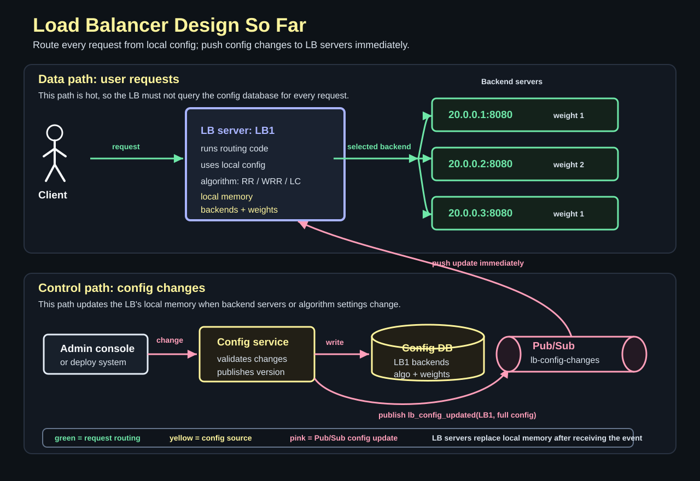
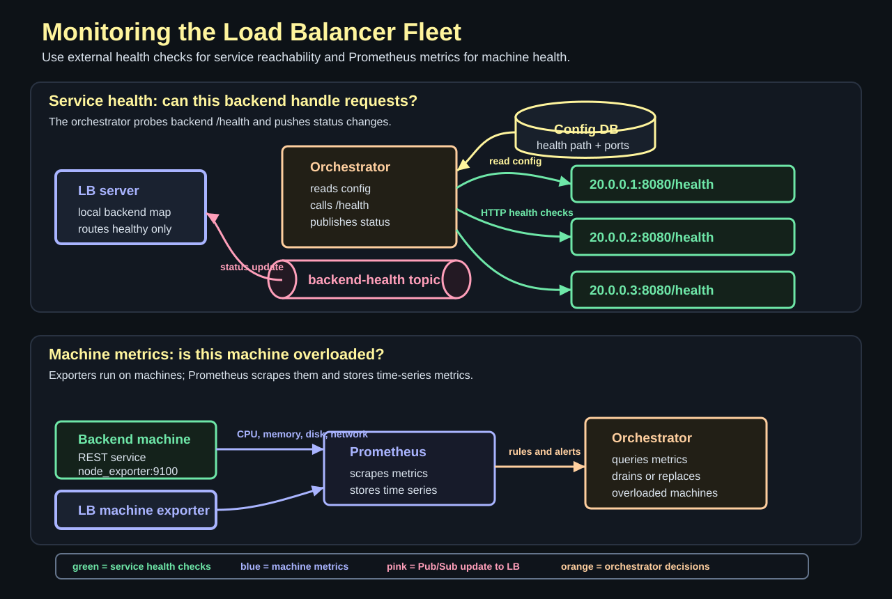
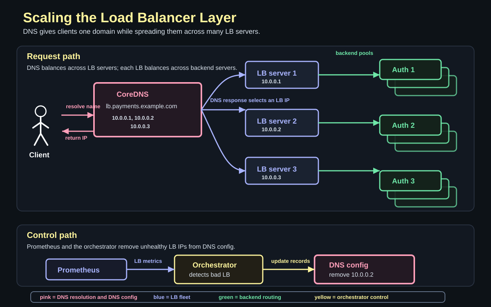
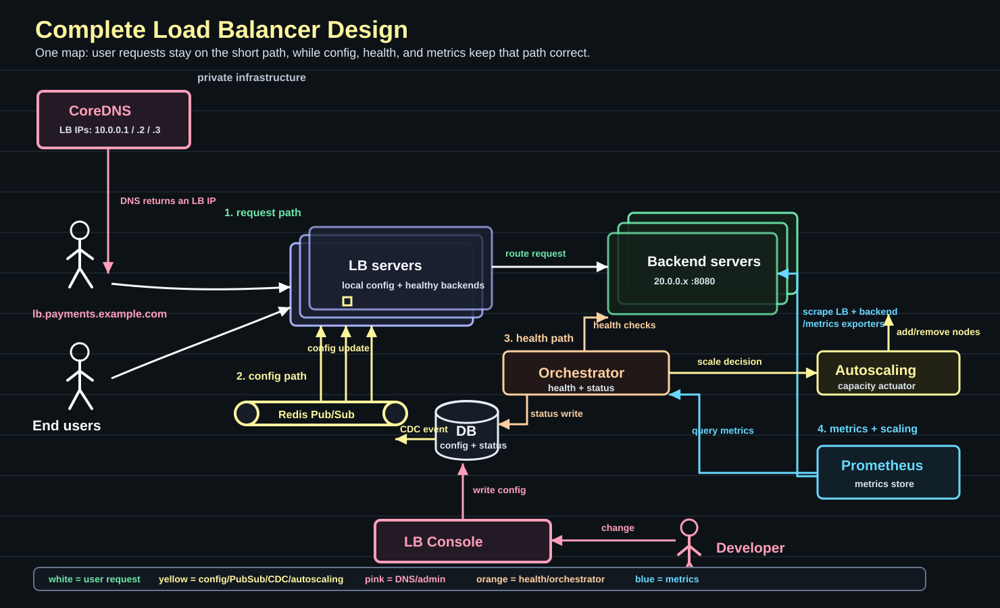

# Designing a Load Balancer

Question: why do we even need a load balancer?

Because once one machine is not enough, users should still see one coherent system.

A load balancer is not just a traffic splitter. It is the front door of a distributed system. It hides many backend machines behind one endpoint and decides where each request should go.

Before we design the load balancer, we need the distributed-systems mindset.

## Part 1: Distributed Systems

Question: what is a distributed system?

It is multiple components, often running on multiple machines, behaving like one system to solve a bigger problem.

| Part | Meaning |
| --- | --- |
| **Multiple components** | The system splits responsibility across services, workers, databases, caches, or queues. |
| **Multiple machines** | Those components often run on different machines, so network and machine failures become part of the design. |
| **Single coherent system** | Users should still experience one product, not a pile of disconnected servers. |
| **Solves a bigger problem** | The system can handle more traffic, larger data, or better availability than one machine can provide alone. |

That sounds powerful, but the painful part is this:

```text
anything that could go wrong would go wrong
```

One backend can die. One network link can slow down. One machine can receive too much traffic. One replica can lag. One dependency can be healthy from one machine and unreachable from another.

This is why distributed systems are not designed by drawing the final architecture first.

The better way is:

```text
start with a Day 0 architecture
put load on it
observe the bottleneck
fix that bottleneck
repeat
```

For a load balancer, that means we should not start with global load balancing, consistent hashing, retries, failover, connection draining, health checks, and autoscaling all at once.

Start with the smallest useful version:

```text
client -> load balancer -> one backend
```

Then ask the next question:

```text
what breaks when traffic grows?
```

If one backend is overloaded, add more backends.

```text
client -> load balancer -> backend A
                        -> backend B
                        -> backend C
```

Now the load balancer has a real job: choose a healthy backend and spread requests across them.

## Why Distributed Systems?

Question: what do we get by splitting work across machines?

We get scale. More machines can handle more traffic than one machine.

We get horizontal scalability. Instead of buying one huge machine, we can add more machines.

We get fault tolerance. If one backend fails, the system can route around it.

That is exactly why load balancers exist:

```text
more servers + routing decision = more capacity and better availability
```

## Why Not Distributed Systems?

Question: if distributed systems help so much, why not distribute everything from day one?

Because every extra machine adds coordination cost.

Observability becomes harder. A request may pass through many components, so debugging needs logs, metrics, traces, and clear request IDs.

Latency can increase. A local function call becomes a network call.

As a rough ballpark, every private network hop from one machine to another can add around **3 ms** of latency. The exact number depends on the network, region, protocol, and payload, but the design lesson is stable:

```text
more machine-to-machine calls = more latency
```

Operations become heavier. More machines mean more deployments, more health checks, more failure modes, and more things to manage.

So the design rule is:

```text
distribute only when the current component has a real bottleneck
```

For the load balancer series, we will follow that rule. We will start with one simple load balancer, then add features only when a concrete failure mode forces us to.

The memory hook:

```text
start Day 0
measure under load
scale one component
repeat
```

## Part 2: Load Balancers

Question: what does a load balancer actually balance?

It balances incoming requests across backend servers so no single server gets overwhelmed while other servers sit idle.

```text
clients -> load balancer -> backend A
                       -> backend B
                       -> backend C
```

We often take the load balancer for granted because it sits at the front of the system. But it is one of the most important components in a distributed architecture.

It gives the system two basic advantages.

| Advantage | Why it matters |
| --- | --- |
| **Fault tolerance** | If one backend fails, the load balancer can stop sending traffic to it and use the remaining healthy backends. |
| **Better utilization** | Traffic spreads across the fleet, so one backend does not become overloaded while others have spare capacity. |

The central question is:

```text
which backend server should receive this request?
```

The answer comes from a load balancing algorithm.

## Round Robin

Question: what is the smallest useful algorithm?

Send requests to each backend in order, then loop back to the beginning.

```text
request 1 -> backend A
request 2 -> backend B
request 3 -> backend C
request 4 -> backend A
request 5 -> backend B
request 6 -> backend C
```

This is round robin.

Round robin works well when the infrastructure is uniform and requests cost roughly the same amount of work.

For example, imagine three identical API servers handling short REST calls. Most endpoints respond in a tight range, such as **50 ms to 150 ms**. In that world, request count is a reasonable proxy for load.

The memory hook is:

```text
uniform servers + uniform request cost = round robin is enough
```

But round robin has a blind spot. It gives each server the same number of requests even if one server is smaller or one request takes much longer than another.

## Weighted Round Robin

Question: what if the backend servers are not equal?

Give each backend a weight.

A larger server gets more turns. A smaller server gets fewer turns.

```text
backend A: 16 GB memory -> weight 2
backend B:  8 GB memory -> weight 1
backend C:  8 GB memory -> weight 1
```

That produces a rough traffic ratio like this:

```text
A, B, A, C, A, B, A, C
```

Weighted round robin is useful when the fleet is heterogeneous.

For example, a system may run a stable pool of reserved instances because they are cheaper, then add on-demand instances during a traffic spike. If the added machines are not the same size as the existing machines, the fleet is no longer uniform.

The design change is simple:

```text
same algorithm
different number of turns per backend
```

The tradeoff is that weights are only an estimate. A 16 GB server may handle more work than an 8 GB server, but memory alone does not describe CPU, disk, network, cache warmth, or the actual request mix.

## Least Connections

Question: what if response time has a large variance?

Counting requests is no longer enough.

Imagine three machines running analytics queries. One SQL query may finish quickly. Another query may run for a few minutes. If the load balancer uses round robin, it may keep sending new requests to a backend that is already busy with long-running work.

Least connections uses a different signal:

```text
send the next request to the backend with the fewest active connections
```

The load balancer tracks how many active connections each backend has.

```text
backend A: 7 active connections
backend B: 2 active connections
backend C: 5 active connections

next request -> backend B
```

This works better when request duration varies a lot: analytics queries, slow reports, large uploads, or long-lived connections.

The memory hook is:

```text
similar request cost -> round robin
different server capacity -> weighted round robin
variable request duration -> least connections
```

Least connections is more adaptive, but it also needs more state. The load balancer has to know how busy each backend is, not just where it sent the previous request.

## Part 3: Design the Load Balancer

Question: if we had to build the load balancer ourselves, where should we start?

Start with the requirements.

| Requirement | Meaning |
| --- | --- |
| **Balance the load** | Spread requests so one backend does not get overwhelmed while others are idle. |
| **Tunable algorithm** | Let the operator choose round robin, weighted round robin, least connections, or another algorithm. |
| **Scale beyond one machine** | The load balancer should support multiple backend servers, and eventually multiple load balancer servers. |

Some terminology:

| Term | Meaning |
| --- | --- |
| **LB server** | The machine running our load balancer code. |
| **Backend server** | The application server that actually handles the request. |
| **LB algorithm** | The decision logic that chooses a backend server for the next request. |

There are more requirements we will need later: configuration, monitoring, availability, and extensibility.

For now, keep the first design small.

```text
input  -> request
output -> selected backend server
```

The load balancer sits in front of the backend fleet.

```text
client -> LB server -> backend 20.0.0.1:8080
                  -> backend 20.0.0.2:8080
                  -> backend 20.0.0.3:8080
```



That means the LB server needs a map of backend servers.

Question: who configures that map?

Usually an operator, deploy system, or control plane writes the load balancer configuration through an LB console or API.

The console is not on the request path. It is an admin surface for changing config:

```text
developer -> LB console API -> config DB
```

The configuration DB stores config per load balancer. One row or document can be keyed by `lb_id`.

The config might look like this:

```text
lb_id: LB1
version: 42

backends:
  - 20.0.0.1:8080
  - 20.0.0.2:8080
  - 20.0.0.3:8080

algorithm: weighted_round_robin

algorithm_config:
  weights: [1, 2, 1]
```

The backend list tells the LB where traffic can go.

The algorithm tells the LB how to choose.

The algorithm config gives the algorithm its tunable settings. For weighted round robin, that means the traffic ratio.

## Config on the Hot Path

Question: should the load balancer query the config database for every request?

No.

The config is small, and the request path is hot. If every request does this:

```text
request -> LB server -> config DB -> LB server -> backend
```

then every request pays an extra network hop before it can even reach the backend.

The better baseline is:

```text
request -> LB server local config -> selected backend
```

The LB server copies the config into memory and uses that local copy for request routing.

This creates two paths:

| Path | Job |
| --- | --- |
| **Data path** | Route every user request using local in-memory config. |
| **Control path** | Update the backend list, algorithm, and algorithm settings when config changes. |

The memory hook:

```text
route requests from memory
update memory when config changes
```

## Keeping Config Fresh

Question: if the LB server keeps config in memory, how does it learn about changes?

The general choices are polling and reactive updates.

Polling is not a good fit for this load balancer config path.

Imagine an operator changes the backend list in the console. Maybe they remove a bad backend or add a new backend during a traffic spike.

If the LB only checks the config database every 10 seconds, it can keep using stale config for up to 10 seconds.

```text
console changes config
LB has not polled yet
LB keeps routing with old config
```

That is too slow for this use case. When the console changes the load balancer config, the LB servers should learn about it immediately.

```text
load balancer config change -> push update to LB servers
```

So use a reactive Pub/Sub path.

When the config changes, publish an event. Every LB server subscribes to that event stream.

Because this config is small, the event can carry the new config directly.

```text
operator updates config in console
config service writes config DB at version 42
config service publishes lb_config_updated(LB1, version 42, full_config)
LB1 receives event immediately
LB1 replaces local config in memory
```

This is Pub/Sub.

The publisher does not call each load balancer directly. It publishes a message to a topic. The subscribed LB servers receive the event.

```text
config service -> topic: lb-config-changes -> LB server 1
                                      -> LB server 2
                                      -> LB server 3
```

Examples of Pub/Sub-style systems include Redis Pub/Sub, Kafka topics, NATS, and cloud messaging systems such as SNS.

With multiple load balancer servers, each one subscribes to the same topic and keeps its own local copy fresh.

```text
same config topic
many LB servers
each updates local memory
```

For this design, Redis Pub/Sub is not the source of truth. It is only the push channel.

If the Pub/Sub process restarts, the LB servers reconnect and reload the latest config from the config DB. That works because the durable state lives in the config DB, and the LB servers rebuild their local memory from that state.

```text
config DB = source of truth
Pub/Sub   = fast notification path
LB memory = local routing copy
```

There are two common implementation styles.

```text
config service writes DB, then publishes event
```

or:

```text
config service writes DB
CDC watches DB changes
CDC publishes event
```

CDC means change data capture. It is useful when the database is the strict source of truth and multiple writers or tools may update it. The event stream then follows committed database changes.

The tradeoff is complexity. Pub/Sub reacts faster than polling, but the system now needs message delivery, retry logic, version checks, and a safe startup path where each LB server loads the latest config before accepting traffic.

So the iterative design is:

```text
start with local config
load it from the config DB
avoid DB calls per request
subscribe to config updates
replace local config when Pub/Sub pushes a newer version
```

This is still not the complete load balancer design. We still need to discuss monitoring, health checks, availability, failover, and extensibility.

## Part 4: Monitoring and Health Checks

Question: what happens when a backend server goes down?

The load balancer should stop sending traffic to it.

But that creates the next question:

```text
who tells the load balancer that the backend is unhealthy?
```

The backend server should not be the only component responsible for sending that event.

Why?

Because a dead backend may not be able to say, "I am dead." The process may be stuck. The machine may be unreachable. The network path may be broken. The whole point is that the system needs an outside observer.

So we add an orchestrator.

The orchestrator is a control-plane service. It reads the load balancer config, checks backend health, and pushes health changes to the LB servers.

Keep its responsibility focused:

```text
watch backend health
watch LB server health
update backend status in the config DB
publish status changes to LB servers
trigger scaling actions when capacity is not enough
```



## Service Health Checks

Question: what should the orchestrator check?

It should check the actual service running on the backend, not only whether the machine exists.

For an HTTP backend, expose a health endpoint:

```text
GET http://20.0.0.1:8080/health
```

The backend server and the service process both need to be alive. That is why the health check should hit the application port.

If the machine is up but the REST service is down, `/health` fails.

If the service is up but a critical dependency is broken, `/health` can fail or return degraded.

Add the health check information to the config:

```text
lb_id: LB1

backends:
  - address: 20.0.0.1
    port: 8080
    health_path: /health
    protocol: http
  - address: 20.0.0.2
    port: 8080
    health_path: /health
    protocol: http
  - address: 20.0.0.3
    port: 8080
    health_path: /health
    protocol: http
```

Now the orchestrator has enough information to probe each backend.

```text
orchestrator reads config
orchestrator calls backend /health
orchestrator marks backend healthy or unhealthy
orchestrator writes status to config DB
orchestrator publishes backend_health_changed
LB server updates local backend map
```

The LB server still does not call the config database on the request path. It receives health updates through Pub/Sub and changes local memory.

```text
backend unhealthy -> Pub/Sub event -> LB removes backend from local routing
backend healthy   -> Pub/Sub event -> LB adds backend back
```

In practice, do not remove a backend after one failed check. Use a small threshold so a single packet loss or slow response does not cause flapping.

```text
3 failed checks -> unhealthy
2 successful checks -> healthy again
```

That is the smallest failure detector. More advanced systems can use adaptive algorithms such as phi-accrual failure detection, but do not start there unless the simple threshold causes real problems.

## Machine Metrics

Question: is `/health` enough?

No.

`/health` tells us whether the service can answer a health request. It does not fully explain the machine's condition.

For that, use observability metrics: CPU, memory, disk, network, process-level signals, and connection counts.

A common setup is:

```text
node_exporter runs on every machine
Prometheus scrapes node_exporter every few seconds
Prometheus stores the time-series metrics
orchestrator reads metrics or alerts
orchestrator replaces or drains bad machines
```

The important detail is that the full Prometheus server does not need to run on every backend. Each machine runs an exporter, such as `node_exporter`, and Prometheus scrapes those exporters.

For example:

```text
backend machine -> node_exporter on port 9100
Prometheus      -> scrape backend:9100/metrics
```

The same pattern applies to every machine in the load balancer system:

```text
LB servers
backend servers
orchestrator servers
config service servers
```

Each LB server also exposes its own metrics endpoint. That is how Prometheus sees request rate, active connections, routing errors, latency, and network throughput for the LB layer.

```text
LB server   -> exposes /metrics
Prometheus  -> scrapes LB /metrics
```

Prometheus collects the machine vitals. The orchestrator can query Prometheus when it needs machine-level signals, and an autoscaling controller can also query Prometheus when it needs capacity signals.

For example:

```text
if CPU > 99% for 5 minutes:
  mark machine overloaded
  drain traffic
  replace or scale out
```

For load balancer servers specifically, useful scaling signals include:

```text
CPU
memory
network throughput
active TCP connections
new connections per second
request rate
```

The orchestrator queries Prometheus for node health, degradation, and load-balancer fleet capacity signals. It can use those signals to decide that the LB layer needs more or fewer machines. The autoscaling component then performs the capacity change.

```text
Prometheus stores metrics
orchestrator queries Prometheus for health and capacity signals
orchestrator asks autoscaling to change capacity
autoscaler adds or removes machines
new machines pass health checks
config and DNS are updated
LB servers receive changes through Pub/Sub
```

Autoscaling is the component that turns rules into capacity changes.

For backend servers, the rule might be:

```text
if average CPU > 70% for 10 minutes:
  add 3 backend servers

if average CPU < 25% for 30 minutes:
  drain and remove 2 backend servers
```

After autoscaling adds a backend, the system should not send traffic immediately. The backend should first pass its `/health` check. Then the config DB is updated and the new backend list is published through Pub/Sub.

If there are multiple orchestrator replicas, only one should perform a given mutating action at a time, such as updating backend status or changing DNS records. Use leader election or a distributed lock for the action executor so two orchestrators do not write conflicting state.

Side note: leader election usually means all orchestrator replicas run the same code, but only the replica holding the current lease performs mutating actions.

```text
leader   -> updates config, changes DNS, writes health status
workers  -> stay warm, run read-only checks, or wait for leadership
```

If the leader dies, its lease expires and another replica becomes leader. This keeps the control path available without allowing two replicas to make conflicting config or DNS writes.

Autoscaling needs the same kind of protection. If multiple autoscaling replicas run, they should use a lease, idempotency key, or cloud-provider scaling group semantics so the same alert does not add capacity twice.

This gives us three different monitoring loops:

| Loop | What it answers |
| --- | --- |
| **Health check loop** | Can this backend service handle requests right now? |
| **Metrics loop** | Is this machine overloaded, degraded, or likely to fail soon? |
| **Scaling loop** | Do we need more or fewer LB/backend machines? |

The memory hook:

```text
/health checks the service
Prometheus stores machine and LB metrics
orchestrator queries Prometheus
orchestrator changes health status or requests capacity changes
autoscaling adds or removes machines
LB routes only to healthy backends
```

This gives us routing, config updates, and monitoring. But the load balancer is still only one server in the request path.

## Part 5: Scaling the Load Balancer Layer

Question: what happens when one LB server is not enough?

Run multiple LB servers.

```text
LB server 1
LB server 2
LB server 3
```

Each LB server runs the same routing code. Each LB server receives the same config updates and health updates. Each LB server keeps its own local in-memory backend map.

The new problem is:

```text
how does the client choose one LB server?
```

Use DNS as the shared front door.



## DNS as the Shared Entry Point

Question: what is the one component that is shared and scales well?

DNS.

DNS resolves a domain name to one or more IP addresses. The DNS protocol commonly uses port **53**. AWS Route 53 is named after that port, but Route 53 is a managed AWS DNS service. For an internal/private design, we can also run our own DNS server, such as CoreDNS.

The distinction is:

| DNS option | What it is useful for |
| --- | --- |
| **Route 53** | Managed AWS DNS. Good for public domains, AWS private hosted zones, and AWS-integrated operations. |
| **CoreDNS** | DNS server you run inside private infrastructure. Good when internal services need custom/private records and fast control by your own orchestrator. |

In this design, CoreDNS is the internal resolver for the private load balancer name.

CoreDNS should also run as a small replicated fleet, not as one machine. Each replica should serve the same records. The records can come from a shared config source, service discovery system, or orchestrator updates.

Some private service-discovery systems use gossip so nodes can discover each other and spread membership changes. CoreDNS itself usually serves records from config or plugins, but it can sit on top of a registry that uses gossip or another replication mechanism. The important idea for this design is:

```text
many DNS replicas
same LB server records
orchestrator removes unhealthy LB IPs
```

The record can look like this:

```text
lb.payments.example.com:
  - 10.0.0.1
  - 10.0.0.2
  - 10.0.0.3
```

Now the user sees one domain:

```text
lb.payments.example.com
```

But DNS can return one of the LB server IPs:

```text
10.0.0.1 -> LB server 1
10.0.0.2 -> LB server 2
10.0.0.3 -> LB server 3
```

The DNS server can use simple round robin or weighted DNS responses.

```text
equal LB capacity      -> round robin DNS
different LB capacity  -> weighted DNS
```

This creates two levels of balancing:

| Layer | Balances across |
| --- | --- |
| **DNS** | LB servers |
| **LB server** | backend servers |

So the full request path becomes:

```text
client resolves lb.payments.example.com
DNS returns 10.0.0.2
client connects to LB server 2
LB server 2 chooses a backend
backend handles the request
```

## Removing a Bad LB Server

Question: what if one LB server goes down?

The same monitoring loop can handle it.

Prometheus scrapes metrics from every LB server. The orchestrator checks whether the LB process and machine are healthy.

If `LB server 2` is unhealthy, the orchestrator removes `10.0.0.2` from the DNS config.

```text
LB server 2 unhealthy
orchestrator updates CoreDNS config
lb.payments.example.com stops returning 10.0.0.2
new clients land on LB server 1 or LB server 3
```

This is the same control-plane idea again:

```text
observe -> decide -> update config -> new traffic avoids bad target
```

DNS is not a perfect instant failover mechanism because DNS answers can be cached. The time-to-live, or TTL, controls how long resolvers and clients may keep an answer.

```text
lower TTL  -> faster DNS change propagation
higher TTL -> fewer DNS lookups, slower failover
```

That is the tradeoff.

The memory hook:

```text
DNS balances across LB servers
LB servers balance across backend servers
orchestrator removes unhealthy LB IPs from DNS
```

## Complete Design

Question: what does the full design look like now?

Read the final design as one system map.

The request path is still short:

```text
client -> DNS -> LB server -> backend server
```

Everything else exists to keep that path correct:

```text
LB console
config DB
Pub/Sub
orchestrator
Prometheus
autoscaling
CoreDNS config
```



The full design is:

| Component | Responsibility |
| --- | --- |
| **CoreDNS** | Resolves one internal domain to healthy LB server IPs. |
| **LB servers** | Accept user traffic and route each request to a healthy backend using local memory. |
| **Backend servers** | Run the application service and expose `/health`. |
| **LB console/API** | Lets developers or operators change backend lists, algorithms, weights, and health settings. |
| **Config DB** | Stores the source-of-truth config and status by load balancer id. |
| **Pub/Sub** | Pushes config and health changes to every LB server. |
| **Orchestrator** | Checks health, queries Prometheus, updates status, and keeps DNS/config pointed at healthy targets. |
| **Prometheus** | Stores metrics from LB servers, backend servers, and supporting machines. |
| **Autoscaling** | Adds or removes LB/backend capacity when the scaling controller decides capacity must change. |

How each component scales:

| Component | How it scales | State and coordination |
| --- | --- | --- |
| **CoreDNS** | Run multiple DNS replicas. Clients or resolvers can use any healthy replica. | Replicas serve the same records from shared config or service discovery. Some deployments use gossip-backed discovery, but the key is that unhealthy LB IPs stop being returned. |
| **LB servers** | Add more LB servers and register their IPs in DNS. | Mostly stateless on the request path. Each one keeps local memory and rebuilds it from config DB + Pub/Sub. |
| **Backend servers** | Autoscaling adds or drains backend servers based on Prometheus rules. | New backends must pass `/health` before they enter the active routing pool. Drained backends are removed from config before shutdown. |
| **LB console/API** | Run multiple stateless API instances behind an internal load balancer. | Writes go to the config DB with versions so stale updates do not overwrite newer config. |
| **Config DB** | Use a managed HA database, replication, backups, and read replicas if needed. | This is the source of truth for config and status. Do not put it on the hot request path. |
| **Redis Pub/Sub** | Run a highly available Redis setup, or use Kafka/NATS if stronger delivery is needed. | Treat Pub/Sub as a notification channel, not durable truth. If it restarts, LB servers reconnect and reload from the config DB. |
| **Orchestrator** | Run multiple replicas. | Use leader election or a lease for mutating actions. The leader can query Prometheus and trigger LB/backend scaling decisions; workers can stay warm or perform read-only checks. |
| **Prometheus** | Add exporters to every machine; scale Prometheus with sharding, federation, or remote storage when metrics volume grows. | Metrics are operational signals. They guide health and scaling decisions but are not request-path state. |
| **Autoscaling** | Run as a controller, actuator, or cloud scaling group. | It should apply each requested scaling change once using leases, idempotency, or scaling-group semantics so multiple replicas do not double-scale. |

The key separation is:

```text
request path: DNS, LB server, backend server
supporting path: DB, Pub/Sub, health checks, metrics, DNS updates
```

That separation is what keeps the load balancer fast. Requests do not wait for the config DB, Prometheus, or the orchestrator.

## Paper Note: Maglev

**Question: what does Google's Maglev paper add to this design?**

Maglev is a production version of the same idea at network-load-balancer scale. It is Google's software network load balancer, built as a distributed system running on commodity Linux servers instead of specialized hardware load-balancer boxes.

The request path in the paper looks like this:

```text
client -> DNS -> VIP -> router -> Maglev machine -> service endpoint
```

DNS sends the user to a nearby frontend location and returns a virtual IP, or VIP. Routers then use ECMP to spread packets for that VIP across many Maglev machines. Each Maglev machine matches the packet to a service and forwards it to a healthy service endpoint.

That maps directly to the design in this post:

| This post | Maglev paper |
| --- | --- |
| **DNS balances across LB servers** | DNS chooses a frontend location and returns a VIP. |
| **LB servers route to backend servers** | Maglev machines route packets to service endpoints. |
| **Health checks keep bad targets out** | Maglev forwards only to healthy backends and can withdraw VIPs when a Maglev machine is unhealthy. |
| **Add LB servers to scale capacity** | Add Maglev machines; routers spread packets across them with ECMP. |

The interesting difference is that Maglev works below the application request level. It is not choosing an HTTP handler after parsing a request. It is forwarding packets. That is why the paper spends so much time on fast packet processing, connection tracking, and consistent hashing.

Connection tracking keeps packets from the same connection going to the same backend when possible. Maglev hashing gives every Maglev machine a mostly consistent way to choose a backend, so backend or load-balancer changes disrupt as few connections as possible.

The design lesson is:

```text
the same architecture still applies
but packet-scale load balancing needs stricter performance and connection-stability machinery
```

For the production details, read Google's [Maglev paper](https://research.google/pubs/maglev-a-fast-and-reliable-software-network-load-balancer/).

The final memory hook:

```text
DNS finds an LB server
LB memory finds a backend
Pub/Sub keeps LB memory fresh
orchestrator keeps bad targets out
Prometheus is queried for health and scaling decisions
```
