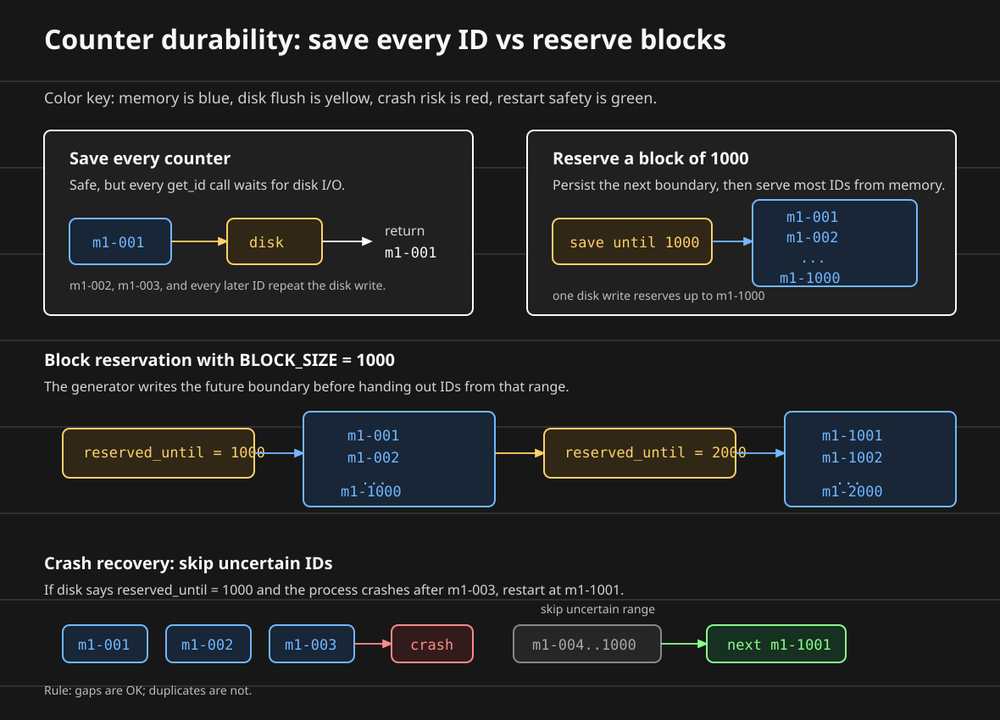
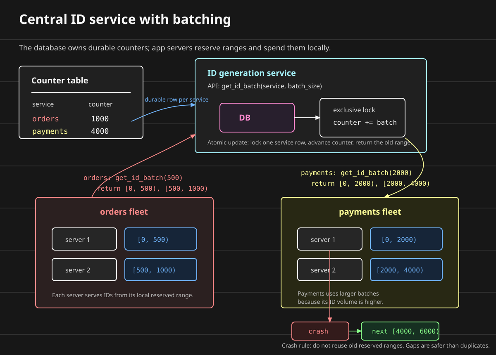
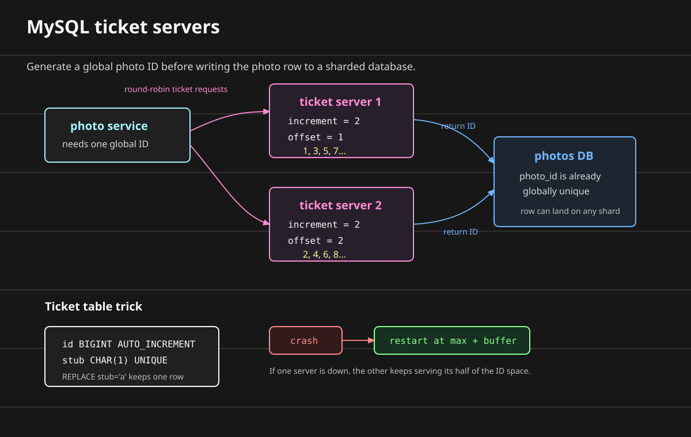
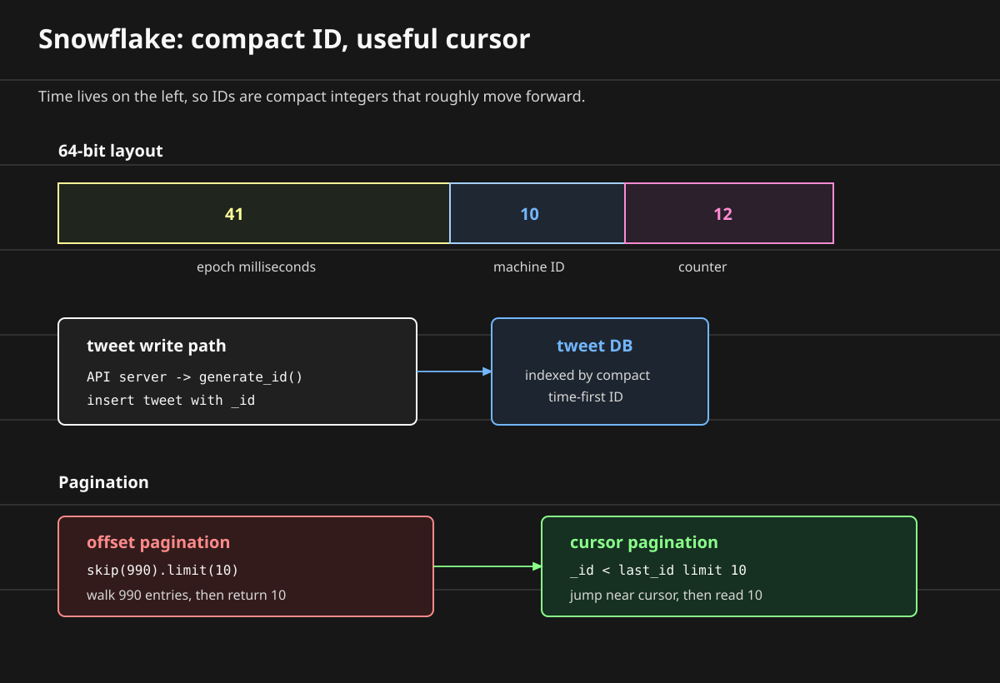
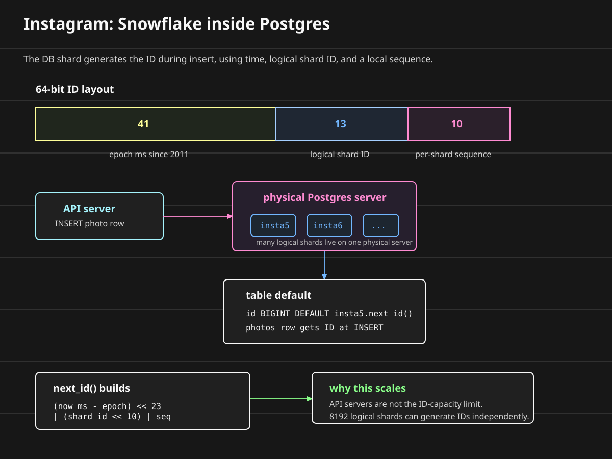

# Designing Distributed ID Generators

**Question: how do we assign a globally unique ID to anything?**

An ID gives uniqueness to an object, row, document, or event.

The problem statement is simple:

```text
write a function that returns something unique every time it is invoked
```

For now, assume the ID generation function is part of the application logic.

It is not a separate central service yet.

```text
application code -> get_id() -> unique ID
```

We will build the function incrementally.

## Start With Time

Time feels like a natural source of uniqueness because it usually moves forward.

```text
func get_id() {
  return get_epoch_ms()
}
```

If the function returns the current epoch millisecond, then every call made in a different millisecond gets a different value.

Example:

```text
call 1 at t=1729 -> 1729
call 2 at t=1730 -> 1730
call 3 at t=1731 -> 1731
```

This works when two assumptions hold:

```text
one machine
not more than one ID request in the same millisecond
```

Those assumptions are too weak for a real distributed system.

Even on one machine, two calls can happen in the same millisecond.

```text
call 1 at t=1729 -> 1729
call 2 at t=1729 -> 1729

collision
```

Time by itself is not enough.

## Add The Machine ID

**Question: what happens when there are multiple machines?**

Two machines can call the function at the same millisecond.

```text
machine 1 at t=1729 -> 1729
machine 2 at t=1729 -> 1729

collision
```

The smallest fix is to add the machine ID.

```text
func get_id() {
  return concat(machine_id, get_epoch_ms())
}
```

Now the same timestamp produces different IDs on different machines:

```text
machine 1 at t=1729 -> m1-1729
machine 2 at t=1729 -> m2-1729
```

The machine ID separates ID ranges across machines.

But this still has a local problem.

If the same machine generates two IDs in the same millisecond, both IDs are still the same:

```text
machine 1 call 1 at t=1729 -> m1-1729
machine 1 call 2 at t=1729 -> m1-1729

collision
```

## Add Local Differentiation

**Question: what if the program has multiple threads?**

Two threads can invoke the function at the same time.

One possible fix is to add the thread ID:

```text
func get_id() {
  return concat(machine_id, thread_id, get_epoch_ms())
}
```

That separates two threads on the same machine:

```text
thread 1 at t=1729 -> m1-t1-1729
thread 2 at t=1729 -> m1-t2-1729
```

But thread ID is not the cleanest source of uniqueness.

The same thread can still ask for two IDs in the same millisecond. Threads can also be reused by a runtime or worker pool.

A better local differentiator is a counter.

```text
int counter = 0

func get_id() {
  return concat(machine_id, get_epoch_ms(), counter++)
}
```

Now a single machine can generate multiple IDs in the same millisecond:

```text
m1-1729-01
m1-1729-02
m1-1729-03
```

At this point, the timestamp is not doing the uniqueness work by itself.

The pair is:

```text
machine_id + counter
```

If every machine has a unique machine ID, and each machine increments its own counter safely, the timestamp becomes optional for uniqueness.

So the local generator can be reduced to:

```text
int counter = 0

func get_id() {
  return concat(machine_id, counter++)
}
```

Example:

```text
machine 1 -> m1-01, m1-02, m1-03
machine 2 -> m2-01, m2-02, m2-03
```

The machine ID separates machines.

The counter separates calls on the same machine.

The counter increment must still be safe inside the process. If multiple threads call `get_id()` concurrently, `counter++` should be atomic or protected by a local lock.

## Volatile vs Non-Volatile State

**Question: what happens when the process restarts?**

The counter we just added lives in memory.

Memory is **volatile**.

Volatile state disappears when the process exits, the machine crashes, or the container restarts.

| State location | Volatile? | What happens on restart? |
| --- | --- | --- |
| **Memory** | Yes. | The counter is lost. |
| **Disk** | No, for normal process restarts. | The counter can be loaded again. |
| **Remote database** | No, if the database commits the value durably. | The counter can be loaded again over the network. |

If the counter starts from zero after every restart, the same machine can regenerate old IDs.

```text
before restart:
m1-01
m1-02
m1-03

process restarts
counter = 0

after restart:
m1-01
m1-02
m1-03

collision
```

So the counter needs durability.

The simplest durable version is:

```text
int counter = load_counter_from_disk()

func get_id() {
  counter++
  save_counter_to_disk(counter)
  return concat(machine_id, counter)
}
```

Read that as two paths inside every call:

```text
fast path:  memory counter increments
safe path:  disk remembers the latest counter
```

The safety comes from the disk write:

```text
call get_id()
  |
  v
counter++ in memory
  |
  v
save counter to disk
  |
  v
return machine_id + counter
```

If the process crashes and restarts, the next process can load the last saved counter instead of starting from zero.

Now the process can restart and continue from the last saved counter.

```text
disk counter = 103
process starts
counter = 103

next ID -> m1-104
```

This improves fault tolerance, but it creates a throughput problem.

Every ID now requires disk I/O.

```text
get_id()
  -> increment counter in memory
  -> write counter to disk
  -> return ID
```

That is the problem:

| Design | Disk writes | Crash safety | Hot-path cost |
| --- | --- | --- | --- |
| **Memory-only counter** | None | Unsafe after restart. | Fast. |
| **Save every counter** | One per ID. | Safe after restart. | Slow under high ID volume. |

The first version is fast but can duplicate IDs after restart.

The second version is safe but pays a disk write on every invocation.

Disk is non-volatile, but it is much slower than memory.

If the hot path performs a disk write for every ID, ID generation throughput drops.

## Why Not Store Every Counter In A Database?

A database would also give us durable state.

```text
application -> database counter row -> increment -> return ID
```

But now every ID generation call pays network I/O.

That is usually worse for a hot local function than writing to local disk because the call crosses the network and depends on another service.

The database version also starts to become a central ID service. That may be useful later, but it is not the simplest improvement to this local generator.

The design question is:

```text
can we keep the counter mostly in memory, but persist enough state to survive crashes?
```

## Reserve Counter Blocks

**Question: can we reduce disk I/O without losing uniqueness after restart?**

Yes.

Persist a future counter boundary instead of persisting every single counter value.

For example, reserve IDs in blocks of `1000`.

```text
BLOCK_SIZE = 1000

counter = load_reserved_counter_from_disk()
reserved_until = counter

func reserve_next_block() {
  reserved_until = counter + BLOCK_SIZE
  save_reserved_counter_to_disk(reserved_until)
}

func get_id() {
  if counter == reserved_until {
    reserve_next_block()
  }

  counter++
  return concat(machine_id, counter)
}
```

The important detail is that the generator writes the next reserved boundary to disk before it hands out IDs from that block.

If that disk write fails, the generator must not use the block. The block is safe only after the future boundary is durable.

The generator saves a future boundary before it uses that range:

```text
disk reserved_until = 0

need first ID
  -> save reserved_until = 1000
  -> emit m1-001
  -> emit m1-002
  -> emit m1-003
  ...
  -> emit m1-1000
```

Visually:

```text
save reserved_until = 1000
  -> m1-001
  -> m1-002
  -> m1-003
  -> ...
  -> m1-1000
```

The disk does not need to remember every emitted ID.

It only needs to remember the end of the range that has already been reserved.



Then the normal path is memory-only for most calls:

```text
first call in block -> reserve boundary on disk
next call           -> memory increment
...
most calls          -> memory increment
first call in next block -> reserve next boundary on disk
```

The modulo version has the same idea:

```text
func get_id() {
  if counter % BLOCK_SIZE == 0 {
    save_reserved_counter_to_disk(counter + BLOCK_SIZE)
  }

  counter++
  return concat(machine_id, counter)
}
```

The modulo check runs before the counter enters a new block, so the generator writes the future boundary before using that block.

The save happens once per block, not once per ID.

That is the huge throughput improvement.

```text
before: 1 disk write per ID
after:  1 disk write per 1000 IDs
```

The tradeoff is gaps.

Suppose the generator reserves up to `1000`, emits only a few IDs, and then crashes.

```text
disk says reserved_until = 1000

emitted:
m1-001
m1-002
m1-003

crash
```

On restart, the generator loads `1000` and starts after that reserved range.

```text
next safe ID -> m1-1001
```

It skips unused IDs from the previous block.

The safe rule is:

```text
after restart, start after the last durable reserved boundary
```

That may leave holes, but it avoids duplicates.

That is acceptable for most distributed ID generators.

The requirement is uniqueness, not gap-free numbering.

## Current Shape

The generator now has three pieces:

```text
machine_id       -> separates machines
local counter    -> separates calls on one machine
reserved boundary -> survives process restart without per-ID disk writes
```

The request path is still local:

```text
application thread -> get_id() -> memory counter -> ID
```

Only once per block does it touch disk:

```text
counter reaches block boundary -> save next reserved boundary to disk
```

This is the first practical version:

```text
unique across machines
safe across restarts
fast for the common path
allows gaps after crashes
```

The memory hook:

```text
machine id gives ownership
counter gives sequence
disk checkpoint gives restart safety
block reservation gives throughput
```

## What About Monotonic IDs?

**Question: why would we want IDs to increase over time?**

Monotonically increasing IDs are useful when the ID also acts like an ordering hint.

For example, imagine two updates arrive at a replicated system:

```text
update A -> id 1729-m1-001
update B -> id 1730-m2-001
```

If both updates touch the same object, the system may need a conflict-resolution rule:

```text
which update came first?
which update should win?
which event should appear first in the log?
```

This shows up in event logs, feeds, sync systems, message ordering, and last-write-wins style conflict resolution.

If the ID is:

```text
machine_id + counter
```

then it is unique, but it is not globally sorted by time:

```text
m2-232
m4-244
m7-237
m9-239
```

The machine ID comes first, so sorting IDs groups by machine before time.

If we want IDs that usually sort by creation time, put time first:

```text
time_ms + machine_id + counter
```

Now the most significant part of the ID is time:

```text
1729-m1-001
1729-m2-001
1730-m1-001
1730-m1-002
1731-m1-001
```

Time decides the broad order. The machine ID and counter break ties inside the same millisecond.

This is why many distributed ID formats are time-first. They are not just unique; they are also roughly sortable.

But there is an important limit.

Time-first IDs do **not** guarantee strict monotonicity across machines.

Different machines have different clocks. One machine can think the time is `23`, another can think the time is `24`, and another can drift backward after clock correction.

So concurrent calls can still produce IDs that are not strictly increasing in real-world order:

```text
machine 2 clock=23 -> 23-m2-232
machine 4 clock=24 -> 24-m4-244
machine 7 clock=23 -> 23-m7-237
machine 9 clock=23 -> 23-m9-239
```

Clock synchronization helps, but it does not make all machine clocks identical. Network delay, NTP correction, VM pauses, and hardware clock drift can still create skew.

To guarantee one strict global order, all ID requests need one ordering authority:

```text
clients -> single ID service -> strictly increasing IDs
```

That is simple, but the ID service becomes a single point of failure and a bottleneck.

One practical way to reduce the bottleneck is batching.

Instead of asking the central service for one ID at a time, an application server asks for a range:

```text
orders server 1   -> get_id_batch(500)  -> [0, 500)
orders server 2   -> get_id_batch(500)  -> [500, 1000)
payments server 1 -> get_id_batch(2000) -> [0, 2000)
payments server 2 -> get_id_batch(2000) -> [2000, 4000)
```

Use one durable counter per service:

| Service | Current counter |
| --- | ---: |
| `orders` | `1000` |
| `payments` | `4000` |

The central ID service reserves a batch with an atomic database update:

```text
begin transaction
  row = lock counter row for service = "orders"
  start = row.counter
  end = start + batch_size
  update row.counter = end
commit

return [start, end)
```

The exclusive lock matters.

If two `orders` servers ask for a batch at the same time, only one transaction can advance the `orders` row first. The second transaction sees the updated counter and receives the next range.



After a server receives a range, it serves IDs from memory until the range is exhausted.

That keeps the hot path local:

```text
request -> orders server -> next local ID from reserved range
```

The central service is only called when a server needs a new batch.

If `payments server 1` crashes after reserving `[0, 2000)`, that range is not reused. If the payments counter has already advanced to `4000`, the restarted server asks again and gets `[4000, 6000)`.

That creates gaps, but it avoids duplicate IDs.

This is the same tradeoff as local block reservation:

```text
reserve ahead -> fast local allocation
crash         -> skip unused IDs
goal          -> uniqueness, not gap-free numbering
```

If we add multiple ID servers, they must coordinate before handing out IDs:

```text
clients -> ID server 1
        -> ID server 2
        -> ID server 3

ID servers must agree on the next value
```

Gossip can help servers share state eventually, but strict monotonicity needs stronger agreement than eventual convergence. In practice, that means a single leader, a database sequence, or a consensus protocol.

That is much more coordination than most ID generators want on their hot path.

The practical rule:

```text
time first -> roughly sortable
machine + counter -> unique tie-breakers
strict global monotonicity -> central ordering or consensus
```

Most distributed ID generators choose uniqueness and rough sortability, not strict global monotonicity.

## Why Not UUIDs In Every System?

For many systems, a UUID is the right answer.

A random UUID is easy to generate independently on every machine:

```text
server 1 -> 8f2c...
server 2 -> a91b...
server 3 -> 21de...
```

No central service.

No coordination.

Very low collision probability.

Randomness is also useful when the ID is public. If a photo URL, order URL, or document URL contains a random ID, users cannot easily guess neighboring objects.

So why build anything else?

Because ID choice affects storage and indexing.

UUIDs are 128-bit values. A compact integer ID is often 32 or 64 bits.

That size difference shows up inside database indexes:

```text
4-byte int      -> smaller index entry
8-byte bigint   -> still compact
16-byte UUID    -> larger index entry
36-char UUID string -> much larger again
```

Larger index entries mean fewer keys fit on each B-tree page.

Random UUIDs also do not insert near the end of the index. They land all over the tree.

That creates two costs:

```text
more index memory
more random page writes
```

When the index no longer fits in memory, index lookup starts needing disk I/O.

That is where database performance takes a hit.

You can buy larger machines, but now the ID format has become a cost and performance decision.

The practical rule:

```text
UUID is good when independence and unguessability matter most.
Custom IDs are useful when locality, compactness, and ordering matter too.
```

Common examples where teams care about generated IDs:

| Use case | Why the ID matters |
| --- | --- |
| **Database primary key** | Needs uniqueness and efficient indexing. |
| **Photo or media ID** | Becomes part of URLs, metadata rows, and storage keys. |
| **Tweet or message ID** | Needs fast writes and time-based reads. |
| **Order or payment ID** | Needs uniqueness across many app servers. |
| **Event ID** | Often needs rough ordering for logs and replay. |
| **Shard key** | May decide where the row physically lives. |

## MongoDB ObjectId

MongoDB uses an ID format that sits between a random UUID and a central counter.

Its default [`ObjectId`](https://www.mongodb.com/docs/manual/reference/bson-types/#objectid) is 12 bytes:

```text
4 bytes timestamp | 5 bytes process-random | 3 bytes counter
```

Read it as:

```text
epoch_seconds + generator_identity + local_counter
```

The timestamp is at the front, so ObjectIds are roughly sortable by creation time.

The random/process portion separates generators.

The counter separates multiple IDs generated by the same process in the same second.

This gives MongoDB a useful default:

```text
smaller than a UUID string
generated by clients without a central ID service
roughly ordered by creation time
```

But it is not strictly monotonic.

MongoDB's own docs call this out: ObjectIds are only approximately ordered because the timestamp has one-second resolution and clients can have different clocks.

## Why Sharded Databases Need ID Generation

**Question: why do we need a separate ID generator if databases already have auto-increment?**

Auto-increment works well while one database owns the table.

```text
photos table on one MySQL database

insert photo -> id 1
insert photo -> id 2
insert photo -> id 3
```

Now split the data across shards:

```text
photos_db_1
photos_db_2
photos_db_3
...
photos_db_10
```

Each shard has its own auto-increment counter.

That means each shard can independently generate the same local ID:

```text
photos_db_1 -> photo id 74
photos_db_2 -> photo id 74
photos_db_3 -> photo id 74
```

Inside each database, the ID is unique.

Across the whole product, it is not unique.

You can make the identity composite:

```text
global photo identity = shard_id + local_id
```

But that leaks storage layout into the application.

Now URLs, APIs, logs, and foreign keys need to carry both values:

```text
/photos/shard-3/74
comments row -> photo_shard=3, photo_id=74
events row   -> photo_shard=3, photo_id=74
```

That is sometimes acceptable.

But many systems want one opaque ID:

```text
/photos/72157623227190423
```

The app can route or look up the row behind the scenes.

The user-facing identity stays one value.

That is when ID generation becomes its own design problem.

The ID must be unique before the row lands on a shard.

```text
request -> generate global photo_id -> choose shard -> insert photo row
```

## Flickr: Database Ticket Servers

One practical implementation is a database-backed ticket server.

Flickr described this pattern in their post on [distributed unique primary keys](https://code.flickr.net/2010/02/08/ticket-servers-distributed-unique-primary-keys-on-the-cheap/).

The shape is:

```text
photo service -> ticket server -> global ID
photo service -> photos DB     -> insert photo with that ID
```

The ticket server is a tiny database whose job is only to issue IDs.

For a MySQL ticket table:

```sql
CREATE TABLE Tickets64 (
  id BIGINT UNSIGNED NOT NULL AUTO_INCREMENT,
  stub CHAR(1) NOT NULL DEFAULT '',
  PRIMARY KEY (id),
  UNIQUE KEY (stub)
) ENGINE=InnoDB;
```

The `stub` column is a dummy value.

It exists only so every request touches the same logical row.

```text
id | stub
---+-----
74 | a
```

To get a new ID:

```sql
REPLACE INTO Tickets64 (stub) VALUES ('a');
SELECT LAST_INSERT_ID();
```

What happens on the first call?

```text
table is empty
REPLACE INTO Tickets64 (stub) VALUES ('a')

insert row:
id = 1, stub = 'a'

LAST_INSERT_ID() -> 1
```

What happens on the next call?

```text
row already exists:
id = 1, stub = 'a'

REPLACE tries to insert stub = 'a'
UNIQUE KEY (stub) conflicts
MySQL deletes the old row
MySQL inserts a new row
AUTO_INCREMENT assigns id = 2

LAST_INSERT_ID() -> 2
```

That is why this trick does not grow the table forever.

The table stays tiny.

Each call replaces the same dummy row and lets MySQL's auto-increment machinery mint the next ID.

Logically, this is an upsert:

```text
if stub does not exist -> insert
if stub already exists -> replace it with a new auto-incremented row
```

MySQL also has `INSERT ... ON DUPLICATE KEY UPDATE`.

That is the cleaner shape for normal application rows:

```text
try insert
if unique key already exists -> update existing row
```

`REPLACE` is different:

```text
try insert
if unique key already exists -> delete old row, then insert new row
```

For a real user row, that delete can be dangerous because it can affect foreign keys, triggers, and row history.

For this ticket table, the row is just a dummy `stub = 'a'` row. There is no business data in it. We only want MySQL to allocate the next auto-increment value.

The important property is atomicity.

Two clients can ask for a ticket at the same time, but the unique key and the database's write path serialize the update.

They do not both get the same `id`.

This solves uniqueness, but one ticket database is still a single point of failure.

Flickr handled that by running two ticket servers and splitting the ID space:

```text
ticket server 1 -> auto_increment_increment = 2, auto_increment_offset = 1
ticket server 2 -> auto_increment_increment = 2, auto_increment_offset = 2
```

So the two servers generate different series:

```text
ticket server 1 -> 1, 3, 5, 7, 9, ...
ticket server 2 -> 2, 4, 6, 8, 10, ...
```

Visually:



MySQL supports this pattern with [`auto_increment_increment` and `auto_increment_offset`](https://dev.mysql.com/doc/refman/9.1/en/replication-options-source.html).

The application can round-robin between the two ticket servers.

If one ticket server goes down, the other continues serving its half of the number space:

```text
server 1 down
server 2 still returns 200, 202, 204, ...
```

When the failed server comes back, it must not resume from a stale value.

The safe restart rule is:

```text
next value = max(existing IDs) + safety buffer
```

Then reset the server's auto-increment position to the next value in its own series.

Example:

```text
max photo id in the system = 239
buffer = 1

ticket server 1 uses odd IDs
next safe odd value -> 241

ticket server 2 uses even IDs
next safe even value -> 240
```

This is not perfectly monotonic across both servers.

The output can interleave:

```text
1, 2, 3, 4, 5, 6
```

But if one side pauses and later resumes, the streams can drift.

That is acceptable because the design is optimizing for:

```text
global uniqueness
small indexed integer IDs
high availability with simple failover
```

It is not trying to guarantee one strict global order.

## Twitter Snowflake

**Question: what if we want the ID generator to be just a fast function call?**

Twitter created [Snowflake](https://github.com/twitter-archive/snowflake) for tweet IDs.

The idea is to pack time, machine identity, and a local counter into one 64-bit integer.

The classic layout in the archived Snowflake code is:

```text
41 bits timestamp | 10 bits machine | 12 bits sequence
```

Twitter's archived Snowflake code splits the 10 machine bits into:

```text
5 bits datacenter | 5 bits worker
```

Read it as:

```text
epoch_ms + machine_id + per_millisecond_counter
```

The first 41 bits are the timestamp, so the largest part of the ID moves forward with time.

The right side is the tie-breaker:

```text
same millisecond -> use machine + sequence
```

In a Snowflake-style design, tweet creation can look like this:

```text
user writes tweet
  -> API server receives request
  -> API server calls generate_id()
  -> API server stores tweet with that ID
```

The database is not generating the ID.

The app server has enough information locally:

```text
current time
assigned machine ID
local sequence counter
```

That is why this scales well:

```text
no central ID service on the hot path
no extra database write just to get an ID
small 64-bit integer primary key
roughly time-sorted IDs
```



## Why Snowflake Helps Pagination

Twitter needs time-window reads all the time:

```text
tweets from the last 1 hour -> trends
tweets from the last 1 day  -> sentiment
newer tweets after this one -> timeline refresh
older tweets before this one -> infinite scroll
```

Pagination is just fetching a large result set in smaller pages.

The simple version is `limit` and `offset`:

```javascript
// page 1
db.tweets.find({ user: "vallari" }).limit(10)

// page 2
db.tweets.find({ user: "vallari" }).skip(10).limit(10)

// page 100
db.tweets.find({ user: "vallari" }).skip(990).limit(10)
```

This gets slower as the user goes deeper.

Every query is stateless. The database does not remember that the previous query already scanned the first 990 rows.

So for page 100, the database still has to walk past the first 990 matching index entries before returning 10 rows.

The deeper the page, the more work the database repeats.

Cursor pagination uses the last ID from the previous page:

```javascript
// page 1
db.tweets
  .find({ user: "vallari" })
  .sort({ _id: -1 })
  .limit(10)

// page 2
last_id = page1[9]._id

db.tweets
  .find({ user: "vallari", _id: { $lt: last_id } })
  .sort({ _id: -1 })
  .limit(10)
```

Now the database can jump into the index near `last_id` and read the next 10 entries.

The page number no longer controls the cost.

The cursor controls the starting point.

This is why Snowflake-style IDs are useful:

```text
_id contains time
_id is compact
_id is indexed
_id is comparable
```

For new tweets since a known cursor:

```javascript
db.tweets.find({
  user: "vallari",
  _id: { $gt: since_id }
}).sort({ _id: 1 }).limit(10)
```

For a time window:

```javascript
one_hour_ago_id = snowflake_from_time(now - 1 hour)

db.tweets.find({
  _id: { $gte: one_hour_ago_id }
}).limit(1000)
```

This is the same mental model Discord documents for Snowflake pagination: use `before`, `after`, and `limit`, because the ID is a number with a timestamp inside it.

## Discord And Sonyflake

Discord adopted [Snowflake-style IDs](https://docs.discord.com/developers/docs/reference#snowflakes) for its API objects.

Their documented layout is:

```text
42 bits timestamp | 5 bits worker | 5 bits process | 12 bits increment
```

Discord's epoch is the first second of 2015.

That means Discord IDs can also be used for pagination:

```text
messages before this ID
messages after this ID
objects created around this time
```

Sony open-sourced [Sonyflake](https://github.com/sony/sonyflake), a Go implementation inspired by Snowflake.

Its default layout is:

```text
39 bits time in 10 ms units | 8 bits sequence | 16 bits machine ID
```

That tradeoff gives Sonyflake more machine ID space and a longer lifetime, but fewer IDs per time unit on one machine.

The pattern across these systems is the same:

```text
time on the left -> rough sortability
machine bits     -> distributed generation
counter bits     -> multiple IDs in the same time tick
```

The important shift is this:

```text
central ticket server -> database coordinates IDs
Snowflake-style ID    -> app servers compute IDs locally
```

## Instagram: Snowflake Inside The Database

Instagram wanted the Snowflake properties, but with different constraints.

Their requirements were:

```text
IDs sortable by time -> pagination, filters, batch processing
64-bit IDs           -> small indexes
no new service       -> fewer moving parts
```

The key difference:

```text
Twitter Snowflake   -> ID generated by app/API server
Instagram approach  -> ID generated by database during INSERT
```

For a photo write, the shape is:

```text
API server receives upload
  -> INSERT INTO photos (...)
  -> database default calls insta5.next_id()
  -> row is stored with generated id
```

The application does not call a separate ID service.

The database also does not use plain auto-increment as the final ID.

Instead, each logical shard has a small function that builds a 64-bit ID.

Instagram described the layout in their engineering post on [Sharding & IDs](https://instagram-engineering.com/sharding-ids-at-instagram-1cf5a71e5a5c):

```text
41 bits timestamp | 13 bits logical shard ID | 10 bits sequence
```

Read it as:

```text
epoch_ms_since_2011 + shard_id + per_shard_sequence
```

The first 41 bits keep the ID roughly sortable by time.

The 13 shard bits support up to:

```text
2^13 = 8192 logical shards
```

The last 10 bits give:

```text
2^10 = 1024 sequence values per shard per millisecond
```

Visually:



## Logical Shards vs Physical Servers

**Question: what is a logical shard?**

A physical server is a real database machine or database instance.

Examples:

```text
postgres-server-01
postgres-server-02
postgres-server-03
```

A logical shard is a namespace or partition of data inside the database topology.

In Instagram's Postgres design, each logical shard was a Postgres schema.

In another database, the same idea could be represented by separate logical databases or namespaces on the same physical server.

Each logical shard has the same table structure:

```text
insta1.photos
insta1.likes
insta1.comments

insta2.photos
insta2.likes
insta2.comments

insta3.photos
insta3.likes
insta3.comments
```

The schemas have the same table definitions, but different data.

For example:

```text
user 101 -> shard 1 -> insta1.photos
user 202 -> shard 2 -> insta2.photos
user 303 -> shard 3 -> insta3.photos
```

Sharding by user or profile ID spreads users across logical shards, so one physical database is not responsible for every profile.

Many logical shards can live on one physical server:

```text
postgres-server-01 -> insta1, insta2, insta3, ...
postgres-server-02 -> insta400, insta401, insta402, ...
```

This matters operationally.

If one physical server becomes hot, Instagram can move some logical shards to another physical server.

The application mapping changes:

```text
logical shard 401 used to live on postgres-server-02
logical shard 401 now lives on postgres-server-07
```

The data model does not need to change.

The logical shard stays the same; only its physical home changes.

## How `next_id()` Works

Inside a logical shard, the table can define its primary key like this:

```sql
CREATE TABLE insta5.photos (
  id BIGINT NOT NULL DEFAULT insta5.next_id(),
  -- other photo columns
);
```

If the application inserts a row without providing `id`, Postgres calls the default expression:

```sql
INSERT INTO insta5.photos (...)
VALUES (...);
```

That invokes:

```text
insta5.next_id()
```

For shard `5`, the function knows:

```text
shard_id = 5
```

It also reads the next local sequence value for that table.

Conceptually:

```text
seq_id = next sequence value % 1024
now_ms = current time in milliseconds

id = (now_ms - instagram_epoch) << 23
id = id | (shard_id << 10)
id = id | seq_id
```

Why shift by `23`?

Because the right side has:

```text
13 shard bits + 10 sequence bits = 23 bits
```

So the timestamp moves to the left, leaving room for shard and sequence on the right.

Why shift `shard_id` by `10`?

Because the last 10 bits are reserved for the per-shard sequence number.

The final ID carries all three pieces:

```text
timestamp -> when roughly created
shard_id  -> which logical shard generated it
seq_id    -> tie-breaker within that shard and millisecond
```

This is a neat optimization.

Twitter's Snowflake puts machine identity in the ID. With 10 machine bits, that shape naturally has a 1024-node identity space.

Instagram puts logical shard identity in the ID. With 13 shard bits, it gets an 8192-logical-shard identity space.

That means API servers are not part of the ID capacity limit.

The API fleet can grow independently.

The database shard that owns the row generates the ID during insert.

The memory hook:

```text
Twitter:   app server knows machine_id, then writes row
Instagram: DB shard knows shard_id, then inserts row
```
