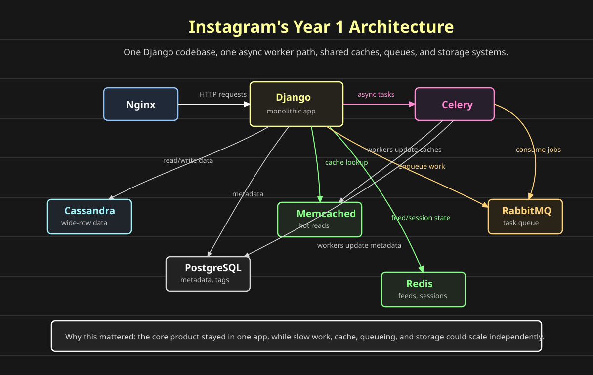
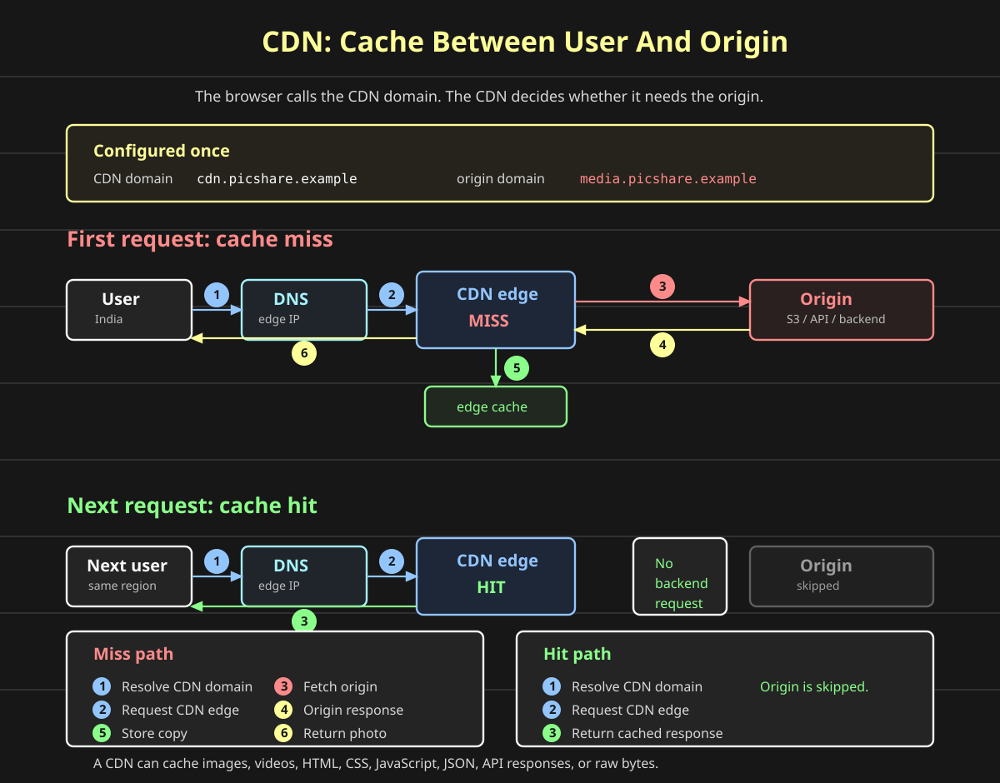

# Designing Instagram

**Question: how do we build a social network for photo sharing?**

This post will build Instagram incrementally, focusing on three core workflows:

```text
uploading photos
serving photos through a CDN
discovering photos through hashtags
```

We will start with the smallest useful design:

```text
user -> API server -> photo storage -> feed/read path
```

Then we will add the components only when the baseline has a clear bottleneck.

## Why Instagram Is A Good Case Study

Facebook made the classic web stack famous:

```text
PHP application code
MySQL database
Memcached cache
```

By 2006, that was the mental model many web applications copied.

Instagram made a different startup stack famous.

In a little over one year, Instagram reached roughly 14 million users with a very small engineering team. The interesting part was not that every component was exotic. The interesting part was that the architecture stayed simple while handling real social-network scale.

The early shape looked like this:

```text
client
  -> Nginx / load balancer
  -> Django application
  -> PostgreSQL for users, photo metadata, tags
  -> Cassandra for high-volume wide-row data paths
  -> Redis for feeds, activity, sessions
  -> Memcached for cache
  -> S3 + CDN for photo bytes
  -> task queue + workers for slow background work
```



Some implementation details evolved over time. Early Instagram used Gearman for task queues; later versions of this style are often shown with Celery and RabbitMQ. The mental model is the same:

```text
one monolithic application
one async processing path
one primary relational metadata store
one cache layer
one queue to share slow work between workers
```

That is the architecture we will build up from.

## What Is A CDN?

**Question: why should every photo request enter our backend?**

Suppose our origin service lives in the US:

```text
https://media.picshare.example/photos/42.jpg
```

The <span style="color:#ff8a8a"><strong>origin</strong></span> could be an API server, an S3 bucket, an object storage service, or any backend that returns a response.

When a user opens that URL, the browser resolves the domain to an IP address, connects to that IP address, and sends the HTTP request.

If the user is in India and the origin is in the US, the request may cross the ocean just to fetch an image that many other users have already fetched.

A <span style="color:#93c5fd"><strong>CDN</strong></span> fixes this by sitting transparently between the user and the <span style="color:#ff8a8a"><strong>origin</strong></span>.

```text
user -> CDN edge -> origin
```

The <span style="color:#93c5fd"><strong>CDN</strong></span> gives us a different public URL:

```text
https://cdn.picshare.example/photos/42.jpg
```

Inside the <span style="color:#ffff99"><strong>CDN configuration</strong></span>, we map that CDN domain back to the <span style="color:#ff8a8a"><strong>origin</strong></span>:

```text
cdn.picshare.example -> media.picshare.example
```

Now the frontend loads the CDN URL instead of the origin URL.

**Question: where does the CDN URL come from?**

The <span style="color:#93c5fd"><strong>CDN URL</strong></span> usually comes from the HTML, JSON, or API response returned by your <span style="color:#ff8a8a"><strong>origin application</strong></span>.

This does not mean every request must go through the CDN.

The HTML page can still come from the origin application:

```text
GET https://www.picshare.example/profile/ava
```

That request goes to the <span style="color:#ff8a8a"><strong>origin web server</strong></span> and returns HTML.

Inside that HTML, the image URL can point to the CDN:

```html

```

So the browser makes two different requests:

```text
HTML document -> www.picshare.example      -> origin app
photo bytes   -> cdn.picshare.example      -> CDN edge
```

That is the common pattern. The application returns the page, but static or <span style="color:#8aff8a"><strong>cacheable assets</strong></span> inside the page come from the <span style="color:#93c5fd"><strong>CDN</strong></span>.

In a CDN control panel, the configuration usually looks like this:

| CDN field | Example |
| --- | --- |
| **Name** | `picshare-photos` |
| **Origin** | `https://media.picshare.example` |
| **CDN domain** | `https://cdn.picshare.example` |
| **Tier / plan** | `standard` |

If the <span style="color:#93c5fd"><strong>CDN</strong></span> already has `/photos/42.jpg`, it returns the response immediately from the nearest edge location.

If the <span style="color:#93c5fd"><strong>CDN</strong></span> does not have it, it forwards the request to the <span style="color:#ff8a8a"><strong>origin</strong></span>, gets the response, stores it in the <span style="color:#8aff8a"><strong>edge cache</strong></span>, and returns it to the user.



The important idea is:

```text
first request  -> CDN miss -> origin -> cache response -> return response
second request -> CDN hit  -> return response without touching origin
```

A CDN can cache more than images.

It can cache:

```text
images
videos
HTML
CSS
JavaScript
JSON
API responses
raw bytes
```

For Instagram, the most obvious win is photo delivery. A photo may be uploaded once, but viewed thousands or millions of times. We do not want every view to enter Django, PostgreSQL, Redis, or object storage directly.

### Cache Invalidation

**Question: what if the origin response changes?**

The <span style="color:#93c5fd"><strong>CDN</strong></span> has an old cached copy until we tell it otherwise.

There are two common ways to invalidate cached data.

The first is <span style="color:#ffff99"><strong>TTL-based invalidation</strong></span>:

```text
cache /photos/42.jpg for 1 hour
after 1 hour, ask the origin again
```

This is simple and cheap, but stale data can stay visible until the TTL expires.

The second is <span style="color:#ff8bd2"><strong>explicit invalidation</strong></span>:

```text
POST /cdn/invalidate
path = /photos/42.jpg
```

The CDN removes that cached path, so the next request fetches a fresh copy from the origin.

Some CDNs also support wildcard invalidation:

```text
path = /profiles/ava/*
path = /*
```

Use wildcard invalidation carefully. Invalidating too much can create a burst of cache misses and send a sudden wave of traffic back to the origin.

## Planned Build Order

1. Upload a photo.
2. Store photo metadata separately from image bytes.
3. Serve photos through a CDN.
4. Generate feeds from followed users.
5. Add hashtag indexing.
6. Scale reads, writes, and search independently.
