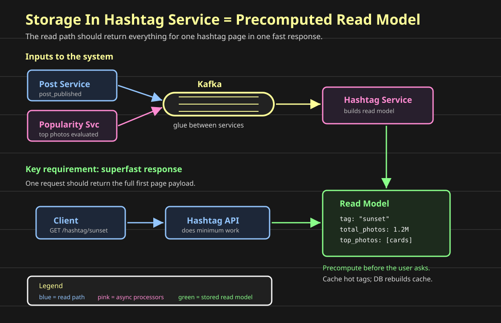
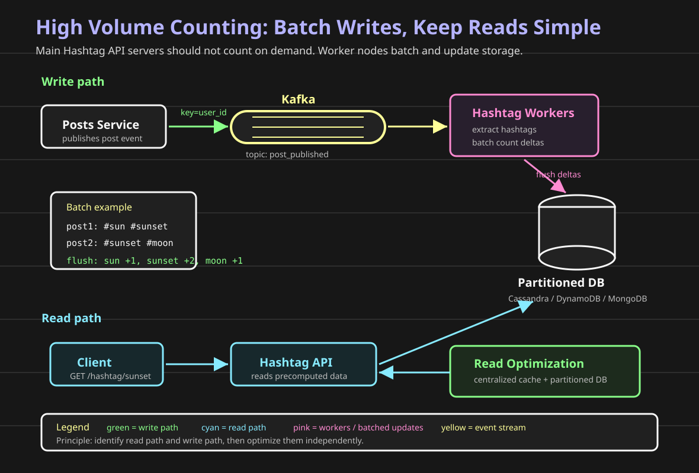
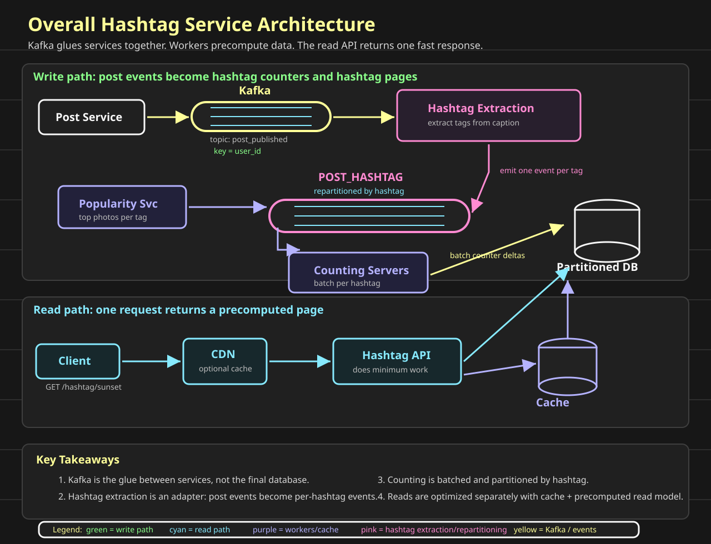

# Designing A Hashtag Service

**Question: how do we build hashtag search and trending for a social network?**

When a user opens a hashtag page, the product wants a fast response:

```text
#sunset
1.2M photos
top photos
recent photos
```

That looks simple, but the volume is large:

```text
millions of hashtags
millions of posts
many hashtags per post
many readers opening popular hashtag pages
```

The hashtag service should give the best user experience without making the post-creation path slow.

So the design questions are:

```text
Where do we store hashtag-to-post mappings?
How do we count posts per hashtag?
How does Posts Service tell Hashtag Service about new posts?
How do we update multiple hashtags without partial-update bugs?
How do we return top/recent photos quickly?
```

We will build those sections progressively:

```text
1. Kafka Recall
2. Sharding Recall
3. Hashtag Storage And Counting
4. Overall Flow And Key Takeaways
```

Before we design the storage and counting path, we need to recall one building block from the earlier posts:

```text
Kafka
```

Hashtags are not only a database query problem. When a user creates a post with `#coffee`, many things may need to happen:

```text
index the hashtag
update hashtag counters
update trending windows
notify interested systems
feed analytics and abuse detection
```

That shape is usually better as a stream than as one synchronous API call chain.

This post starts with the Kafka mental model. Then we will use it to build the hashtag service.

## Kafka Recall

### Queue Or Stream?

**Question: is this a job, or is this a fact that happened?**

That question decides whether we usually reach for a queue such as SQS/RabbitMQ or a stream such as Kafka/Kinesis.

A queue is good when one worker should do one task:

```text
resize this image
send this email
run this export
process this webhook
```

A stream is good when one event may be consumed by many independent systems:

```text
post_created
message_sent
blog_published
photo_uploaded
```

The same event can drive multiple workflows:

```text
post_created
  -> hashtag indexer
  -> feed fanout
  -> notification worker
  -> analytics worker
  -> abuse detector
```

If those systems are called directly from the Posts Service, post creation becomes slow and fragile.

If they consume from a stream, post creation can stay focused:

```text
write the post
emit the fact that the post was created
let other systems react
```

### RabbitMQ/SQS Mental Model

A queue is like a shared todo list.

```text
Producer -> Queue -> Worker fleet
```

Many worker servers can read from the same queue:

```text
Queue:
job-1 -> worker 1
job-2 -> worker 2
job-3 -> worker 3
job-4 -> worker 1
```

Each job is normally handled by one worker. After the worker succeeds, it acknowledges or deletes the message.

That is why queues fit background tasks:

```text
one uploaded image needs one thumbnail job
one welcome email needs one send-email job
one export request needs one export worker
```

The important intuition:

```text
queue = who should do this task?
```

### Kafka Mental Model

Kafka is an append-only event log split into partitions.

An event is a fact that already happened:

```text
PostCreated(post_id=9, author_user_id=42, hashtags=["coffee"])
MessageSent(channel_id=7, message_id=1001)
BlogPublished(blog_id=10, author_id=42)
```

Kafka stores these events in topics:

```text
topic: post_created
topic: message_sent
topic: blog_events
```

The important intuition:

```text
stream = what happened, and who wants to react?
```

Unlike a queue, Kafka does not delete an event just because one consumer reads it. The event stays for a retention window, such as 7 days or 30 days. Each consumer group remembers how far it has read.

That gives us replay:

```text
hashtag indexer broke at offset 500
fix the bug
restart from offset 500
rebuild the hashtag index from retained events
```

### High-Throughput Append

**Question: why is Kafka fast for message-like workloads?**

Because the producer is mostly appending records to the end of a partition log.

That means the write shape is:

```text
add next event
add next event
add next event
```

not:

```text
update row 20
delete row 4
insert row 91
update row 7
```

For workloads like chat messages, post events, click events, or hashtag updates, the system mostly receives an endless stream of new facts.

That is exactly the shape Kafka likes:

```text
append fast
batch writes
persist to disk
let consumers read later
```

In the Slack post, this is why the edge server can do:

```text
WebSocket edge -> Kafka -> message persistence worker
```

The edge does not synchronously write every message to the database. It appends the message event to Kafka, acks quickly after Kafka accepts it, and a worker persists it later.

### Partitions

**Question: how does Kafka scale one topic across many machines and consumers?**

Kafka splits one topic into partitions.

Think of a topic as a pipe. Kafka divides that pipe into smaller pipes:


Each partition is an ordered append-only log:

```text
partition 0: event 0 -> event 1 -> event 2
partition 1: event 0 -> event 1 -> event 2
partition 2: event 0 -> event 1 -> event 2
```

When a producer sends an event, Kafka uses the partition key:

```text
partition = hash(key) % partition_count
```

So if we publish:

```text
PostCreated(author_user_id=42, post_id=9)
key = author_user_id:42
```

Kafka will always route events for that same key to the same partition.

### Ordering

Kafka gives ordering inside one partition.

It does not give one global order across the whole topic.

For chat, if ordering matters per channel, use:

```text
key = channel_id
```

Then all messages for one channel go to the same partition:

```text
channel C1 -> partition 3

C1:m1 -> C1:m2 -> C1:m3 -> C1:m4
```

That matters because some events depend on earlier events:

```text
create thread
reply to thread
edit reply
delete reply
```

If those are processed out of order, the consumer may try to edit a reply before it exists.

For Instagram posts, if we care about one author's post stream, use:

```text
key = author_user_id
```

For image processing lifecycle events, use:

```text
key = image_id
```

For hashtag counters, the key might be:

```text
key = hashtag
```

That keeps all `#coffee` events ordered, but it can also create a hot partition if `#coffee` becomes extremely popular. We will revisit that when we design trending hashtags.

### Consumer Groups

A consumer group is a set of workers doing the same job.

```text
topic: post_created

hashtag-indexer group
  worker 1 owns partition 0
  worker 2 owns partition 1
  worker 3 owns partition 2

analytics group
  worker 1 owns partition 0
  worker 2 owns partition 1
  worker 3 owns partition 2
```

Each group has its own offsets.

That means analytics can lag without blocking hashtag indexing:

```text
hashtag indexer is caught up
analytics is 2 million events behind
post creation is still not blocked
```

That is the big stream advantage.

### Use Cases From Earlier Posts

#### Blogging Platform

Simple background jobs are queue-shaped:

```text
send welcome email
resize uploaded image
process export
```

Use SQS/RabbitMQ.

But `BlogPublished` is stream-shaped:

```text
BlogPublished
  -> search index
  -> analytics
  -> author counter
  -> notifications
```

Use Kafka/Kinesis when the same event needs many independent consumers.

#### Slack Realtime Messaging

The Slack post uses Kafka for this path:

```text
user -> WebSocket edge -> Kafka -> worker -> messages DB
```

Kafka fits because chat message ingestion needs:

```text
high-throughput append
replay after worker failure
ordering per channel_id
quick acknowledgement from edge
```

A queue can process jobs, but Kafka better matches a durable message stream.

#### Load Balancer Config

The load balancer post asks:

```text
How do all LB servers know which backend servers are healthy and available?
```

Imagine we have three load balancer servers:

```text
client -> DNS -> LB1 / LB2 / LB3 -> backend servers
```

Each load balancer server keeps a small routing table in memory:

```text
/api/users  -> user-service-1, user-service-2
/api/posts  -> post-service-1, post-service-2
```

But that config changes:

```text
new backend added
backend removed
backend unhealthy
weight changed
route changed
```

So we need to propagate config changes to every LB server.

The durable source of truth is the config DB:

```text
operator/API -> config service -> config DB
```

The Pub/Sub message is only a notification that the local in-memory copy is stale:

```text
config service updates DB
publish lb_config_updated(version=42)
LB servers reload config from DB
```

Kafka can do this, but it may be more than needed.

If one LB misses the notification, it can recover by reloading from the config DB on reconnect or restart.

So if the config DB is the source of truth, a lightweight Pub/Sub system can be enough:

```text
Redis Pub/Sub
SNS
NATS
```

Use Kafka only if config-change replay, durable history, or ordered config-event processing is important.

If Kafka is used, the key should match the thing that must not be applied out of order:

```text
key = lb_cluster_id
```

or:

```text
key = route_group_id
```

But still keep version checks:

```text
if incoming_version <= current_version:
  ignore
```

That protects the LB from applying stale config.

Read the full load balancer design here:

```text
https://github.com/vallari24/scalable-systems-handbook/blob/main/blog/06-distributed-load-balancer.md
```

#### Instagram Photo Flow

The Instagram post uses Kafka after post creation:

```text
Posts Service -> post_created event -> Kafka -> downstream systems
```

Downstream systems include:

```text
feed fanout
search
notifications
analytics
abuse detection
recommendations
```

The synchronous path creates the post. Kafka lets the rest of the product react asynchronously.

### When To Use What

Use SQS/RabbitMQ when:

```text
one task should be handled by one worker
the message can be deleted after success
replay is not the main requirement
worker routing is more important than retained history
```

Use Kafka/Kinesis when:

```text
the message is an event/fact
many systems need the same event
replay matters
ordering matters per key
high-throughput append matters
consumer groups should move independently
```

The shortest rule:

```text
task -> queue
fact -> stream
```

## Sharding Recall

**Question: why can't we just keep every hashtag in one SQL table?**

At small scale, we can.

```text
hashtag       post_id       created_at
sunset        post_100      2026-06-08
sunset        post_101      2026-06-08
coffee        post_200      2026-06-08
```

But hashtag traffic is not evenly distributed.

Some hashtags are tiny:

```text
#my-small-trip -> 20 posts
```

Some hashtags are huge:

```text
#sunset -> millions of posts
#love   -> millions of posts
#music  -> millions of posts
```

One database eventually becomes the bottleneck for both reads and writes:

```text
many writes: every new post adds hashtag entries
many reads: popular hashtag pages are opened repeatedly
large data: hashtag -> millions of post references
```

So we shard.

Sharding means splitting data across multiple machines by a key:

```text
shard = hash(key) % shard_count
```

For hashtags, the natural key is:

```text
key = hashtag
```

That gives this shape:

```text
#coffee  -> shard 1
#sunset  -> shard 4
#travel  -> shard 2
```

### SQL Sharding

With SQL, sharding usually means we manage the routing ourselves:

```text
Hashtag Service
  -> route #sunset to MySQL shard 4
  -> route #coffee to MySQL shard 1
```

That can work, but the application now owns a lot of hard problems:

```text
where is each hashtag stored?
how do we add a new shard?
how do we move data?
how do we query across shards?
how do we keep indexes small enough?
```

SQL gives joins and foreign keys, but this hashtag lookup does not really need them.

The hot path is a lookup:

```text
hashtag -> posts
```

### NoSQL Sharding

NoSQL databases are often chosen here because sharding is part of the normal data model.

Examples:

```text
Cassandra
DynamoDB
MongoDB
```

The important property is not "NoSQL is faster" as a slogan.

The important property is:

```text
the database is designed to distribute keys across machines
```

For this use case, that matters more than joins.

## Hashtag Storage And Counting

**Question: what should the hashtag page read?**

Storage and counting are not two separate designs.

They are the same design viewed from two sides:

```text
read path:  what does /hashtag/sunset return quickly?
write path: how do we keep that response precomputed and fresh?
```

For a fast user experience, the hashtag page should not compute everything at request time.

A simple read model is:

```text
key:   hashtag
value: counter + recent/top posts
```

Example:

```text
#sunset -> {
  count: 1_200_000,
  posts: [post_100, post_101, post_102, ...]
}
```

This is the high-level shape:



This is a lookup-heavy access pattern.

That is why an in-memory store like Redis is tempting:

```text
GET hashtag:#sunset
return count + first page immediately
```

Redis is fast because the hot data sits in memory. That gives excellent latency for popular hashtag pages.

But Redis alone should not be the only source of truth.

If the Redis server goes down, we need a way to rebuild it:

```text
Kafka retained events
durable hashtag DB
periodic snapshots
```

The clean mental model is:

```text
durable source of truth -> rebuildable fast read model
```

Redis can be the fast read model. Kafka and/or a durable NoSQL store should let us regenerate it.

### What Do We Store For Each Hashtag?

There are two common choices.

#### Option 1: Store Post IDs

The smallest value is just post IDs:

```text
#sunset -> {
  count: 1_200_000,
  posts: [post_100, post_101, post_102]
}
```

This is compact.

It also avoids duplicating post data across many hashtags.

But now the read path has another problem.

If the client opens the first page of `#sunset` and receives 100 post IDs, who fetches the post details?

Bad client shape:

```text
client -> Hashtag Service: give me #sunset
client <- [100 post_ids]

client -> Posts Service: post_1
client -> Posts Service: post_2
client -> Posts Service: post_3
...
client -> Posts Service: post_100
```

That creates too many requests from the browser or mobile app.

So the server may fetch the post details:

```text
client -> Hashtag Service
Hashtag Service -> Posts Service: batch get 100 posts
Hashtag Service -> client
```

That is better for the client, but now the Hashtag Service repeatedly calls Posts Service for popular hashtags.

For a hashtag like `#sunset`, the same first page may be requested again and again.

#### Option 2: Store Post Cards

For a faster read path, store a small post card directly inside the hashtag read model:

```text
#sunset -> {
  count: 1_200_000,
  posts: [
    {
      post_id: post_100,
      author_id: user_7,
      image_id: image_9,
      caption: "evening walk",
      created_at: 2026-06-08T10:00:00Z
    },
    ...
  ]
}
```

Now the read path is fast:

```text
client -> Hashtag Service
Hashtag Service -> Redis / NoSQL read model
client <- ready-to-render post cards
```

No 100 client requests.

No repeated internal batch call to Posts Service for the same popular page.

The tradeoff is staleness.

If a user edits the caption, the canonical post record changes in Posts Service:

```text
post_100.caption = "new caption"
```

But the hashtag read model may still contain:

```text
caption = "evening walk"
```

So storing post cards buys speed by duplicating data.

That means we also need an update path:

```text
PostEdited event -> update hashtag read model
PostDeleted event -> remove from hashtag read model
```

This is why Kafka becomes useful again. The hashtag read model can listen to post lifecycle events and repair its denormalized copy.

### List Or Something Else?

A plain list is easy to understand:

```text
#sunset -> [post_100, post_101, post_102]
```

But hashtag pages usually need order:

```text
recent posts
top posts
posts after cursor
```

So the physical structure is often closer to a sorted collection:

```text
key:   hashtag
score: created_at or ranking_score
value: post_id or compact post card
```

In Redis, this could be a sorted set:

```text
ZADD hashtag:#sunset:recent 1728330000 post_100
ZADD hashtag:#sunset:top    9812       post_100
```

In Cassandra or DynamoDB, this could be:

```text
partition key: hashtag
sort key: created_at desc
value: post_id or compact post card
```

The core design choice is:

```text
store IDs -> smaller, fresher, more lookups
store cards -> faster reads, more duplication, possible staleness
```

### Read Path Optimization

**Question: is the read path optimized?**

Not yet if every request still hits the partitioned database.

This is the read path:

```text
user -> Hashtag API -> cache / DB -> Hashtag API -> user
```

The user makes a network call:

```text
GET /hashtag/sunset
```

The Hashtag API reads the precomputed hashtag payload and returns it:

```text
{
  tag: "sunset",
  total_photos: 1_200_000,
  top_photos: [...],
  recent_photos: [...]
}
```

The read path is optimized when the Hashtag API does the bare minimum:

```text
parse tag
read one key
return response
```

It should not do this on every request:

```text
count photos
rank top photos
fetch 100 post IDs
call Posts Service for 100 post details
join data from multiple services
```

So the read path needs:

```text
centralized cache for hot hashtags
precomputed read model
database shaped for reads
```

The partitioned database helps the system scale, but it is not the whole optimization.

For popular hashtags, put the first page in a cache:

```text
cache key: hashtag:sunset:first-page
value: { tag, total_photos, top_photos, recent_photos }
```

Then the hot path becomes:

```text
user -> Hashtag API -> Redis/cache -> response
```

The DB still matters because it is the durable backing store and cache-rebuild source.

But the fastest user experience comes from separating the paths:

```text
write path -> heavy async work, batching, precomputation
read path  -> simple lookup, cached response, minimal API work
```

### Write Path: Counting And Indexing

**Question: how do we keep the hashtag counter updated?**

At a high level, counting is a write-path problem:



We already have a Posts Service and a Posts DB.

When a user publishes a post, the synchronous path should stay simple:

```text
user -> Posts Service -> Posts DB
```

After the post is written, Posts Service emits an event:

```text
topic: post_published

event:
{
  post_id: post_1,
  user_id: user_7,
  caption: "sunset walk by the moon",
  created_at: 2026-06-08T10:00:00Z
}
```

Now Hashtag Service can run a consumer group:

```text
post_published topic
  -> hashtag worker 1
  -> hashtag worker 2
  -> hashtag worker 3
```

Each worker does:

```text
read post event
extract hashtags from caption
increment counters
write hashtag read model
```

Example:

```text
post 1: #sun #sunset
post 2: #sunset #moon
```

The counter updates are:

```text
sun:    +1
sunset: +2
moon:   +1
```

### First Kafka Key: User ID

A natural first key for `post_published` is:

```text
key = user_id
```

Why?

Because one user's post stream often wants ordering:

```text
user_7 post_1 -> user_7 post_2 -> user_7 post_3
```

If the same user creates, edits, deletes, or republishes posts, keeping that user's events in one Kafka partition makes the lifecycle easier to reason about.

So the Posts Service can publish:

```text
topic: post_published
key: user_id
value: { post_id, user_id, caption, created_at }
```

That is good for user-level ordering.

But it is not perfect for hashtag counting.

**Question: why can't we use `hashtag` as the partition key for this first Kafka topic?**

Because the first event is a post event, not a hashtag event.

At publish time, the payload looks like:

```text
{
  post_id,
  user_id,
  caption
}
```

The hashtags are inside the caption. We still need a worker to extract them.

Also, one post can contain many hashtags:

```text
post_1: #sun #sunset #nature
```

Kafka needs one partition key per event.

If the event has three hashtags, which one should be the key?

```text
key = sun?
key = sunset?
key = nature?
```

There is no single correct hashtag key for the original post event.

Also, many other systems consume `post_published`:

```text
feed fanout
notifications
analytics
abuse detection
recommendations
```

Those systems care about the post and the author, not only one hashtag.

So the first Kafka topic stays general:

```text
topic: post_published
key: user_id
```

Then Hashtag Extraction adapts the post event into per-hashtag events:

```text
post_1 -> HashtagSeen(sun)
post_1 -> HashtagSeen(sunset)
post_1 -> HashtagSeen(nature)
```

Only after that do we use:

```text
topic: post_hashtag
key: hashtag
```

### The Write Amplification Problem

On average, a post can have many hashtags.

If one post has 8 hashtags:

```text
1 post -> 8 hashtag counter updates
```

If we ingest 1 million posts:

```text
1M posts -> 8M counter updates
```

If every worker writes every counter increment directly to Cassandra/DynamoDB, the write volume is high:

```text
worker reads post
extracts 8 hashtags
writes 8 count++ operations
```

We can batch inside one worker.

If the same worker sees these two posts:

```text
post 1: #sun #sunset
post 2: #sunset #moon
```

It can aggregate in memory:

```text
sun:    +1
sunset: +2
moon:   +1
```

Then it flushes three updates instead of four:

```text
UPDATE sun    count += 1
UPDATE sunset count += 2
UPDATE moon   count += 1
```

That helps.

But with `key = user_id`, posts from different users may go to different Kafka partitions and different consumers:

```text
post 1 by user_7  -> consumer 1
post 2 by user_9  -> consumer 2
```

Now both consumers may update `#sunset` separately:

```text
consumer 1: sunset +1
consumer 2: sunset +1
```

The database still receives multiple writes for the same hashtag.

### Repartition By Hashtag

**Question: how do we batch counter updates better?**

We need events for the same hashtag to meet in the same place.

So we add an adapter step:

```text
post_published topic, key = user_id
  -> hashtag extractor workers
  -> hashtag_events topic, key = hashtag
  -> hashtag counter workers
  -> hashtag DB
```

The first worker extracts hashtags:

```text
post_1 caption: "#sun #sunset"

emit HashtagSeen(hashtag=sun,    post_id=post_1)
emit HashtagSeen(hashtag=sunset, post_id=post_1)
```

The second topic is keyed by hashtag:

```text
topic: hashtag_events
key: hashtag
```

Now all `#sunset` events route to the same Kafka partition:

```text
#sunset -> partition 4 -> counter worker 4
```

That worker can aggregate more efficiently:

```text
sunset +1
sunset +1
sunset +1
flush: sunset +3
```

This is the reason partition key design matters.

The key should match the thing whose updates you want to group and order.

For the original post stream:

```text
key = user_id
```

For hashtag counting:

```text
key = hashtag
```

The tradeoff is that a very popular hashtag can become a hot partition.

We will handle that when we discuss large-volume counting and trending.

### Write Path Optimization Checklist

Now the write path has enough shape to optimize component by component:

```text
Posts Service -> Kafka -> Hashtag Extraction -> POST_HASHTAG -> Counting Servers -> storage
```

This path does not directly serve the user opening `/hashtag/sunset`.

Its job is to keep the precomputed read model fresh.

#### 1. Ingestion Into Kafka

Posts Service should not call Hashtag Service synchronously.

Bad shape:

```text
Posts Service -> Hashtag Service -> hashtag DB
```

If Hashtag Service is slow, post publishing becomes slow.

Better shape:

```text
Posts Service -> Kafka
```

Kafka gives us a buffer. Posts Service can publish the event and move on.

#### 2. Kafka Partitions

Kafka parallelism comes from partitions.

If a topic has one partition:

```text
one partition -> one consumer can actively process it
```

If a topic has many partitions:

```text
partition 0 -> consumer 1
partition 1 -> consumer 2
partition 2 -> consumer 3
partition 3 -> consumer 4
```

So partition count decides the maximum useful parallelism for one consumer group.

If we need more hashtag workers, the topic must have enough partitions for them to own.

#### 3. Consumer Pool

The consumer pool should match the partition shape.

If we have:

```text
12 partitions
```

then up to 12 consumers in the same group can process in parallel:

```text
consumer 1 -> partition 0
consumer 2 -> partition 1
...
consumer 12 -> partition 11
```

Adding 30 consumers to a 12-partition topic does not give 30-way processing for that consumer group.

Extra consumers sit idle.

#### 4. In-Memory Counting

Workers should not write every `count++` immediately.

Bad shape:

```text
event has 8 hashtags
worker sends 8 DB writes immediately
```

Better shape:

```text
worker keeps small in-memory counters
flushes count deltas every N events or every T seconds
```

Example:

```text
sunset +1
sunset +1
sunset +1

flush once:
sunset +3
```

That reduces database writes.

#### 5. Batch Write To The DB

The database write should also be batched.

Instead of:

```text
UPDATE sun    +1
UPDATE sunset +1
UPDATE moon   +1
```

send a compact batch:

```text
sun    +1
sunset +2
moon   +1
```

The exact syntax depends on the database, but the idea is the same:

```text
fewer network round trips
larger writes
less per-update overhead
```

#### 6. Storage Requirements

The storage layer has to support the write pattern.

For counters, we care about:

```text
key-based access
atomic increments or safe merge of deltas
partial-update handling
enough partitions/shards for write throughput
```

This is why the storage choice matters.

The write path wants fast keyed updates.

The read path wants fast keyed lookups.

The same storage system may serve both, but we still reason about them separately.

### Current Shape

At this point, the design is:

```text
write path:
Posts Service
  -> writes post to Posts DB
  -> publishes post_published event keyed by user_id

Hashtag extractor workers
  -> consume post_published
  -> extract hashtags from caption
  -> publish hashtag_events keyed by hashtag

Hashtag counter workers
  -> consume hashtag_events
  -> batch increments in memory
  -> flush count deltas to hashtag storage

read path:
Client
  -> Hashtag API
  -> cache / read model
  -> one response
```

## Overall Flow And Key Takeaways

Now we can put the pieces together:



Component by component:

```text
Post Service
  publishes post_published events after the post is stored

Kafka
  decouples post creation from hashtag processing

Hashtag Extraction
  reads post events and emits one event per hashtag

POST_HASHTAG topic
  repartitions by hashtag so the same hashtag lands on the same worker group path

Counting Servers
  aggregate in memory and flush batched counter deltas

Popularity Service
  can send already-evaluated top-photo updates for each hashtag

Partitioned DB
  stores durable hashtag counters and hashtag page data

Cache
  keeps hot hashtag pages close to the Hashtag API

Hashtag API
  does minimum work: read the precomputed payload and return it
```

Key takeaways:

```text
Kafka as glue
Adapter pattern from post events to hashtag events
Effective batching and counting
Read path and write path optimized independently
```

The next hard question is atomicity:

```text
what happens if one post has 8 hashtags and only 4 updates succeed?
```
