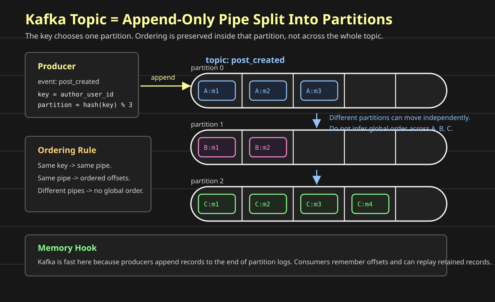

# Designing A Hashtag Service

**Question: how do we build hashtag search and trending for a social network?**

Before we design the hashtag service, we need to recall one building block from the earlier posts:

```text
Kafka
```

Hashtags are not only a database query problem. When a user creates a post with `#coffee`, many things may need to happen:

```text
index the hashtag
update hashtag counters
update trending windows
notify interested systems
feed analytics and abuse detection
```

That shape is usually better as a stream than as one synchronous API call chain.

This post starts with the Kafka mental model. Then we will use it to build the hashtag service.

## Queue Or Stream?

**Question: is this a job, or is this a fact that happened?**

That question decides whether we usually reach for a queue such as SQS/RabbitMQ or a stream such as Kafka/Kinesis.

A queue is good when one worker should do one task:

```text
resize this image
send this email
run this export
process this webhook
```

A stream is good when one event may be consumed by many independent systems:

```text
post_created
message_sent
blog_published
photo_uploaded
```

The same event can drive multiple workflows:

```text
post_created
  -> hashtag indexer
  -> feed fanout
  -> notification worker
  -> analytics worker
  -> abuse detector
```

If those systems are called directly from the Posts Service, post creation becomes slow and fragile.

If they consume from a stream, post creation can stay focused:

```text
write the post
emit the fact that the post was created
let other systems react
```

## RabbitMQ/SQS Mental Model

A queue is like a shared todo list.

```text
Producer -> Queue -> Worker fleet
```

Many worker servers can read from the same queue:

```text
Queue:
job-1 -> worker 1
job-2 -> worker 2
job-3 -> worker 3
job-4 -> worker 1
```

Each job is normally handled by one worker. After the worker succeeds, it acknowledges or deletes the message.

That is why queues fit background tasks:

```text
one uploaded image needs one thumbnail job
one welcome email needs one send-email job
one export request needs one export worker
```

The important intuition:

```text
queue = who should do this task?
```

## Kafka Mental Model

Kafka is an append-only event log split into partitions.

An event is a fact that already happened:

```text
PostCreated(post_id=9, author_user_id=42, hashtags=["coffee"])
MessageSent(channel_id=7, message_id=1001)
BlogPublished(blog_id=10, author_id=42)
```

Kafka stores these events in topics:

```text
topic: post_created
topic: message_sent
topic: blog_events
```

The important intuition:

```text
stream = what happened, and who wants to react?
```

Unlike a queue, Kafka does not delete an event just because one consumer reads it. The event stays for a retention window, such as 7 days or 30 days. Each consumer group remembers how far it has read.

That gives us replay:

```text
hashtag indexer broke at offset 500
fix the bug
restart from offset 500
rebuild the hashtag index from retained events
```

## High-Throughput Append

**Question: why is Kafka fast for message-like workloads?**

Because the producer is mostly appending records to the end of a partition log.

That means the write shape is:

```text
add next event
add next event
add next event
```

not:

```text
update row 20
delete row 4
insert row 91
update row 7
```

For workloads like chat messages, post events, click events, or hashtag updates, the system mostly receives an endless stream of new facts.

That is exactly the shape Kafka likes:

```text
append fast
batch writes
persist to disk
let consumers read later
```

In the Slack post, this is why the edge server can do:

```text
WebSocket edge -> Kafka -> message persistence worker
```

The edge does not synchronously write every message to the database. It appends the message event to Kafka, acks quickly after Kafka accepts it, and a worker persists it later.

## Partitions

**Question: how does Kafka scale one topic across many machines and consumers?**

Kafka splits one topic into partitions.

Think of a topic as a pipe. Kafka divides that pipe into smaller pipes:



Each partition is an ordered append-only log:

```text
partition 0: event 0 -> event 1 -> event 2
partition 1: event 0 -> event 1 -> event 2
partition 2: event 0 -> event 1 -> event 2
```

When a producer sends an event, Kafka uses the partition key:

```text
partition = hash(key) % partition_count
```

So if we publish:

```text
PostCreated(author_user_id=42, post_id=9)
key = author_user_id:42
```

Kafka will always route events for that same key to the same partition.

## Ordering

Kafka gives ordering inside one partition.

It does not give one global order across the whole topic.

For chat, if ordering matters per channel, use:

```text
key = channel_id
```

Then all messages for one channel go to the same partition:

```text
channel C1 -> partition 3

C1:m1 -> C1:m2 -> C1:m3 -> C1:m4
```

That matters because some events depend on earlier events:

```text
create thread
reply to thread
edit reply
delete reply
```

If those are processed out of order, the consumer may try to edit a reply before it exists.

For Instagram posts, if we care about one author's post stream, use:

```text
key = author_user_id
```

For image processing lifecycle events, use:

```text
key = image_id
```

For hashtag counters, the key might be:

```text
key = hashtag
```

That keeps all `#coffee` events ordered, but it can also create a hot partition if `#coffee` becomes extremely popular. We will revisit that when we design trending hashtags.

## Consumer Groups

A consumer group is a set of workers doing the same job.

```text
topic: post_created

hashtag-indexer group
  worker 1 owns partition 0
  worker 2 owns partition 1
  worker 3 owns partition 2

analytics group
  worker 1 owns partition 0
  worker 2 owns partition 1
  worker 3 owns partition 2
```

Each group has its own offsets.

That means analytics can lag without blocking hashtag indexing:

```text
hashtag indexer is caught up
analytics is 2 million events behind
post creation is still not blocked
```

That is the big stream advantage.

## Use Cases From Earlier Posts

### Blogging Platform

Simple background jobs are queue-shaped:

```text
send welcome email
resize uploaded image
process export
```

Use SQS/RabbitMQ.

But `BlogPublished` is stream-shaped:

```text
BlogPublished
  -> search index
  -> analytics
  -> author counter
  -> notifications
```

Use Kafka/Kinesis when the same event needs many independent consumers.

### Slack Realtime Messaging

The Slack post uses Kafka for this path:

```text
user -> WebSocket edge -> Kafka -> worker -> messages DB
```

Kafka fits because chat message ingestion needs:

```text
high-throughput append
replay after worker failure
ordering per channel_id
quick acknowledgement from edge
```

A queue can process jobs, but Kafka better matches a durable message stream.

### Load Balancer Config

The load balancer post asks:

```text
How do all LB servers know which backend servers are healthy and available?
```

Imagine we have three load balancer servers:

```text
client -> DNS -> LB1 / LB2 / LB3 -> backend servers
```

Each load balancer server keeps a small routing table in memory:

```text
/api/users  -> user-service-1, user-service-2
/api/posts  -> post-service-1, post-service-2
```

But that config changes:

```text
new backend added
backend removed
backend unhealthy
weight changed
route changed
```

So we need to propagate config changes to every LB server.

The durable source of truth is the config DB:

```text
operator/API -> config service -> config DB
```

The Pub/Sub message is only a notification that the local in-memory copy is stale:

```text
config service updates DB
publish lb_config_updated(version=42)
LB servers reload config from DB
```

Kafka can do this, but it may be more than needed.

If one LB misses the notification, it can recover by reloading from the config DB on reconnect or restart.

So if the config DB is the source of truth, a lightweight Pub/Sub system can be enough:

```text
Redis Pub/Sub
SNS
NATS
```

Use Kafka only if config-change replay, durable history, or ordered config-event processing is important.

If Kafka is used, the key should match the thing that must not be applied out of order:

```text
key = lb_cluster_id
```

or:

```text
key = route_group_id
```

But still keep version checks:

```text
if incoming_version <= current_version:
  ignore
```

That protects the LB from applying stale config.

Read the full load balancer design here:

```text
https://github.com/vallari24/scalable-systems-handbook/blob/main/blog/06-distributed-load-balancer.md
```

### Instagram Photo Flow

The Instagram post uses Kafka after post creation:

```text
Posts Service -> post_created event -> Kafka -> downstream systems
```

Downstream systems include:

```text
feed fanout
search
notifications
analytics
abuse detection
recommendations
```

The synchronous path creates the post. Kafka lets the rest of the product react asynchronously.

## When To Use What

Use SQS/RabbitMQ when:

```text
one task should be handled by one worker
the message can be deleted after success
replay is not the main requirement
worker routing is more important than retained history
```

Use Kafka/Kinesis when:

```text
the message is an event/fact
many systems need the same event
replay matters
ordering matters per key
high-throughput append matters
consumer groups should move independently
```

The shortest rule:

```text
task -> queue
fact -> stream
```

## Where This Leads For Hashtags

For the hashtag service, the interesting event is:

```text
PostCreated(post_id, author_user_id, hashtags, created_at)
```

The first version can consume that event and build:

```text
hashtag -> recent posts
hashtag -> post count
hashtag -> trending score
```

The next question is:

```text
what should the Kafka key be?
```

If we key by `author_user_id`, one author's post events stay ordered.

If we key by `hashtag`, all events for one hashtag stay ordered.

Both choices have tradeoffs. The hashtag service starts there.
