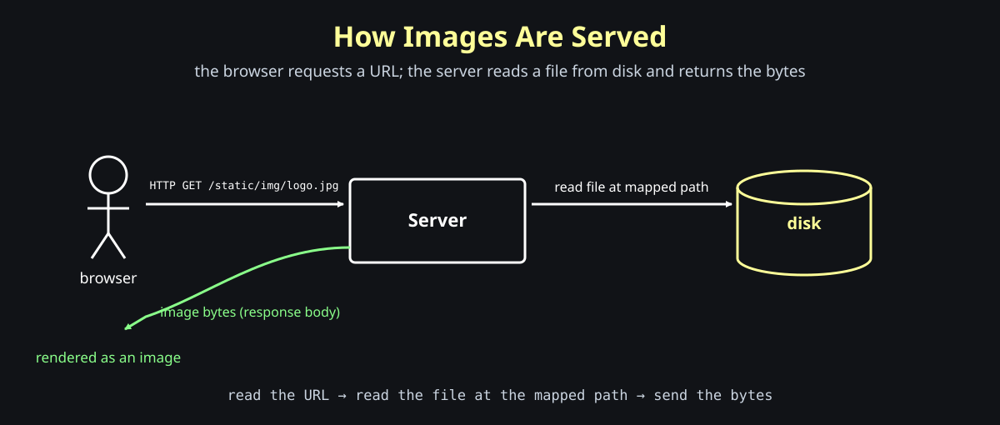
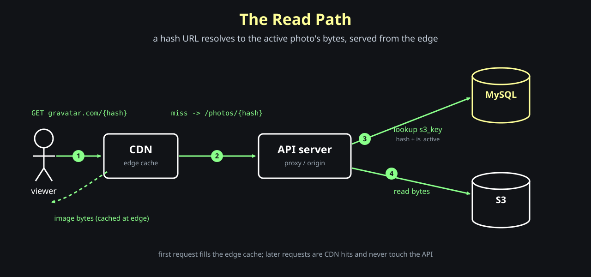
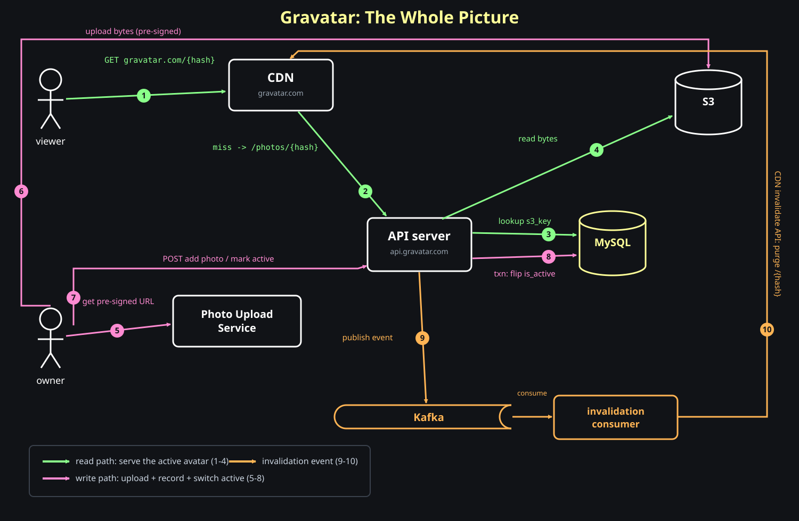

# Designing Gravatar Embeddable URLs

**Question: how do we build an embeddable avatar URL service like Gravatar?**

This post will build the design progressively.

```text
email / user identity -> stable avatar URL -> CDN -> image response
```

Before we design any of that, we need a clear picture of one small thing: what actually happens when a browser shows an image.

## How Images Are Served

**Question: when the browser sees an `` tag, how does the picture appear on the screen?**

Start with the tag itself:

```html

```

The browser does not have the picture yet. It only has a URL sitting in the `src` attribute.

When the browser parses that tag, it does one thing with `src`: it fires an HTTP GET on that URL.

```text
GET https://mysite.example/static/img/logo.jpg
```

Whatever response comes back, the browser interprets as image bytes and tries to render it.

```text
browser sees 
  -> HTTP GET on the src URL
  -> read the response body as bytes
  -> render the bytes as an image
```

The memory hook:

```text
src is just a URL
the browser GETs it and renders the bytes
```

So the image does not travel inside the HTML. The HTML only carries a URL. The actual picture is a second request that the browser makes on its own.

### What The Server Does

**Question: what happens once that GET request reaches the server?**

The server has to turn the URL path into actual bytes.

A common setup is to map a URL prefix to a directory on disk. For example, map everything under `/static` to a static directory on the server:

```text
/static/*  ->  site/static/*  (a folder on the server disk)
```

So the folder on disk might look like:

```text
site/
  static/
    img/
      vallarimehta.jpg
      logo.jpg
    js/
    css/
```

When this request arrives:

```text
GET /static/img/logo.jpg
```

the server does three small steps:



```text
read the URL
read the file at the mapped path on disk
send the file bytes as the response
```

That is the whole job of a static file server: open the file, read the bytes, write them to the HTTP response.

The browser receives those bytes and renders them as the image.

This is the baseline. An image is a file on a server's disk, and a URL maps to that file. Everything we add later — stable avatar URLs, hashing, a CDN — is about controlling what that URL is and how cheaply the bytes can be served.

## Where The Bytes Come From

**Question: does the image actually have to be a file on the server's disk?**

No. Remember what the browser did: it sent a GET and waited for bytes. It does not know or care where those bytes came from. That gives the server a lot of freedom.

### Serving From Object Storage

In the baseline, the file lived on the server's local disk. But the handler can read from anywhere. Point it at an object store like S3 instead:

```python
@app.route('/raw/<path>')
def raw_handler(path):
    raw_b = s3.read(path, BUCKET)
    return raw_b
```

Only one step changes:

```text
read the URL
read the file from S3        <- was: read the file from local disk
send the response
```

When the browser hits:

```text
http://localhost:5000/raw/users/vallarimehta.jpg
```

the part after `/raw/` is the request path:

```text
request path = users/vallarimehta.jpg
```

and the handler maps it to an object in the bucket:

```text
s3://private-images/users/vallarimehta.jpg
        |              |
      bucket        path of file
```

The browser still just sees an image. The memory hook:

```text
the API server is a proxy in front of S3
```

This is useful because the bucket can stay private. The browser never talks to S3 directly — it talks to our API, and the API holds the credentials and decides who is allowed to read what.

### Serving A Generated Image

If the server can return any bytes, the bytes do not have to be a stored file at all. The handler can generate the image at request time.

A familiar example is a social share card — the `og:image`.

When you paste a GitHub repo link into a chat app, you get a preview card with the repo name, description, and live counts:

```text
208 stars
66 forks
```

Those numbers change over time. There is no pre-saved JPG for every possible count. The image is drawn when it is requested:

```text
read the URL
render an image with the current data   <- draw text, numbers, logo
send the response
```

The page still just points at a URL:

```html
<meta property="og:image" content="https://example.com/card/dicedb.png">
```

That URL is not an S3 file. It is the API server. The browser, or the chat app's link unfurler, does a GET and renders whatever bytes come back. It cannot tell a stored file from a freshly drawn one.

The memory hook:

```text
the URL is a contract for bytes, not a pointer to a file
```

### Putting A CDN In Front

A generated image costs more than reading a file. We do not want to redraw it on every request.

So we put a CDN in front, the same way the Instagram post did for photos. The browser makes a single request — to the CDN URL — and the CDN handles the rest.

But there is one important difference:

```text
static photo:     CDN origin = object storage (S3)
generated image:  CDN origin = our API server
```

So the cache fill looks like this:

```text
first request  -> CDN miss -> API server generates the image -> CDN caches it
later requests -> CDN hit  -> served from the edge, API not touched
```

The API server only generates the image once per cache entry. After that, the CDN serves the bytes, and the origin is our backend, not S3.

The same indirection that let us swap disk for S3 now lets us put generated images behind a cache without the browser ever knowing anything changed.

> **Note:** A CDN is not always the right move. For privacy-sensitive use cases — think a DocuSign document, a private contract, a medical scan — you want every request to be authorized. There you deliberately keep the request going through the API server so it can check auth on each fetch, and you skip the CDN. A cached edge copy would serve the bytes without re-checking who is asking. The rule of thumb: cache public bytes, proxy private bytes.

## What Is Gravatar?

**Question: what if your profile picture had one URL that worked everywhere?**

That is the whole idea of Gravatar. It is your single embeddable URL for a profile picture. Any site that wants to show your avatar embeds that one URL, and it always renders your current picture.

The URL is built from your email:

```text
https://gravatar.com/{hash(email)}
```

Notice the email is not in the URL directly. It is hashed first. That matters for security and PII: the public URL should not leak a raw email address. The hash turns the email into an opaque token.

```text
hash("vallari@gmail.com") = 0eafd172
```

So the embeddable URL becomes:

```html

```

When a browser loads that tag, it does exactly what we saw earlier: it fires a GET and renders whatever bytes come back. Gravatar returns the user's current profile picture.

The powerful part is what happens when the user changes their photo. Every site embeds the same hash URL, so when the active picture changes, the new picture shows up everywhere that URL is used — without any of those sites doing anything.

The memory hook:

```text
one URL per identity
change the photo once, it updates everywhere
```

### Requirements

From the user's point of view, the service has to support a small set of behaviors:

- a user can upload multiple pictures
- a user can mark one of them as the active picture
- a request to the hash URL returns the active picture

That last point is the contract that makes the "updates everywhere" property work: the URL never changes, but the bytes it returns follow whichever picture is currently active.

With the concept and requirements clear, the next step is to design how we would actually store and serve this.

## Designing The Storage

**Question: where do the photos live, and how does a hash URL find the right one?**

We have two very different kinds of data: the image bytes, and the bookkeeping about which bytes belong to whom. Keep them apart.

```text
image bytes  ->  S3 (object storage)
bookkeeping  ->  a relational database
```

The database never stores bytes. It stores the S3 path that points at the bytes. (Same split we used in the Instagram post.)

### Two Tables

A user has many photos, and exactly one of them is active. That is a one-to-many relationship, which is precisely what a relational database is built for. Two tables:

```text
users
  id      PK
  email   UNIQUE
  hash    UNIQUE
```

```text
photos
  id         PK
  user_id    FK -> users.id
  s3_key     -> path of the bytes in S3
  is_active
```

The `hash` column is the interesting one. We could compute it from the email whenever we needed it — so why store it at all?

### The Hash Gotcha

**Question: the URL carries the `hash`, but our real identity is the email. Why not just hash the email inside the SQL query?**

The tempting query looks like this:

```sql
SELECT photos.s3_key
FROM photos JOIN users ON photos.user_id = users.id
WHERE md5(users.email) = ?       -- ? is the hash from the URL
```

This is one of the worst things you can do to a database.

`md5(users.email)` is a **function applied to a column**. An index on `email` stores the raw email, not its hash — so the database cannot use it. To find the matching row it has no choice but to:

```text
for every row in users:
    compute md5(email)
    compare it with the value from the URL
```

That is a **full table scan** — every single row, on every single request. Index or no index, it does not matter: the moment you wrap the column in a function, the index is dead.

Memory hook:

```text
a function on a column kills the index -> full table scan
```

The fix is to store the hash as its own column with a unique index on it:

```text
users.hash  ->  UNIQUE INDEX
```

Now the lookup is a raw-column comparison the index can serve directly:

```sql
WHERE users.hash = ?
```

An index seek instead of a full scan. We pay the hashing cost once, at write time, instead of on every read. That is the whole reason the `hash` column exists.

### The Read Path

**Question: a request hits `api.gravatar.com/photos/{hash}`. What does the handler do?**

The route function receives the hash as a variable and runs four small steps:

```python
@app.route('/photos/<hash>')
def render_active(hash):
    s3_key = db.query(...)      # find the active photo's S3 key
    raw_b  = s3.read(s3_key)    # read the bytes from S3
    return raw_b                # return the bytes
```

The query joins the two tables and filters on the indexed hash plus the active flag:

```sql
SELECT photos.s3_key
FROM photos JOIN users ON photos.user_id = users.id
WHERE users.hash = ? AND photos.is_active = TRUE
```

The flow:

```text
extract hash from the URL
query the DB  -> S3 key of the active photo
read the file from S3
return the image bytes
```

The critical detail is the same one from the start of this post: the handler returns the **image bytes**, not a link to S3. The browser fired one GET and is waiting for bytes to render. If we returned an S3 URL as text, the browser would try to render that text and show a broken image. The API server is a proxy — it fetches the bytes and hands them back.

Memory hook:

```text
the handler returns bytes, never a pointer to S3
```

### Add A CDN

Every read now runs `browser -> API -> DB -> S3 -> API -> browser`. The API server does real work on every avatar load, and avatars load on every page of every site that embeds them. That is a lot of load for bytes that almost never change.

So we put a CDN in front, exactly as before.



The first request fills the edge cache; the rest are served from the edge and never touch the API:

```text
first request  -> CDN miss -> API does the work -> CDN caches the bytes
later requests -> CDN hit  -> served from the edge
```

### The Write Path: Uploading A Photo

**Question: how does a new photo get in?**

In two steps — and the bytes never pass through our API server. We use a **pre-signed URL**, the same pattern as the Instagram post.

```text
1. owner asks the Photo Upload Service for a new upload
2. service generates a random photo id and a pre-signed S3 URL:
       s3://gravatar-images/{user_id}/{photo_id}
3. service returns the signed URL to the owner
4. owner uploads the bytes straight to S3
```

The bytes now live in the `gravatar-images` bucket, but the database does not know the photo exists yet. So the owner makes a POST to the API, which inserts a row:

```text
POST add photo  ->  API  ->  INSERT INTO photos
```

```text
photos
  id     user_id  s3_key                       is_active
  7abc   729      gravatar-images/729/7abc      TRUE
```

The first photo can go in as active. The bytes are in S3, and the database now knows the photo exists and where it lives.

### Marking A Photo Active

**Question: a user has four photos and wants to switch which one is active. What must be true after the switch?**

Exactly one row for that user has `is_active = TRUE`. Not zero, not two.

```text
photos for user 729
  id     user_id  is_active
  7abc   729      FALSE
  8ab    729      FALSE   <- make this the active one
  cdae   729      TRUE
  e7215  729      FALSE
```

Switching means two writes: turn the current active row off, turn the new one on.

```sql
UPDATE photos SET is_active = FALSE WHERE user_id = 729;     -- clear all
UPDATE photos SET is_active = TRUE  WHERE id = '8ab';        -- set the new one
```

If the process crashes between those two statements, you can end up with zero active photos (the URL returns nothing) or, with a sloppy query, two active photos (which one wins?). This is the classic case for a **transaction**: the two updates must be atomic — both happen, or neither does.

```sql
BEGIN;
  UPDATE photos SET is_active = FALSE WHERE user_id = 729;
  UPDATE photos SET is_active = TRUE  WHERE id = '8ab';
COMMIT;
```

Memory hook:

```text
"exactly one active" is an invariant -> protect it with a transaction
```

The handler flow:

```text
owner -> API: POST mark photo active
API   -> DB:  run the transaction
API   -> owner: success / error
```

### Possible Optimization: Drop The Join

**Question: the read query joins `photos` to `users` on every single request. Can we avoid the join?**

The join is cheap with the right indexes, but notice the read only ever needs one thing out of `photos`: the `s3_key` of the active row. So **denormalize** — store the active pointer directly on the user row:

```text
users
  id      PK
  email   UNIQUE
  hash    UNIQUE
  active_photo_id   -> id of the active photo
```

Better still for the read, cache the key itself as `active_s3_key`. Now the read is a single-row lookup by the indexed hash, no join and no second table:

```sql
SELECT active_s3_key FROM users WHERE hash = ?
```

Nothing is free. The active photo is now recorded in two places — the `is_active` flag on `photos` and the pointer on `users` — so the mark-active transaction has to update both, atomically:

```sql
BEGIN;
  UPDATE photos SET is_active = FALSE WHERE user_id = 729;
  UPDATE photos SET is_active = TRUE  WHERE id = '8ab' AND user_id = 729;
  UPDATE users  SET active_photo_id = '8ab', active_s3_key = '...' WHERE id = 729;
COMMIT;
```

Memory hook:

```text
denormalize to kill the join -> pay with a wider, more careful write
```

We trade a slightly heavier write for a cheaper read. For a read-heavy system like avatars — loaded on every page, changed once in a blue moon — that is almost always the right trade.

### The Clean URL

**Question: everything works at `api.gravatar.com/photos/{hash}`, but we promised users `gravatar.com/{hash}`. How do we get the short URL and the CDN at the same time?**

Point the friendly hostname at the CDN, and set the CDN's origin to the API server. One move gives us both: a short public URL and an edge cache that absorbs the read load.

```text
gravatar.com   (CDN)
   origin -> api.gravatar.com/photos

https://gravatar.com/{hash}
   -> https://api.gravatar.com/photos/{hash}
```

We get the speed and scale of a CDN, and a dead-simple URL for the user. The same indirection trick, one more time.

### Invalidation On Update

**Question: the photo is cached at the edge under `gravatar.com/{hash}`. The user just switched their active photo. What does the world see?**

The old photo — until the cache entry expires. The URL did not change, so the CDN happily keeps serving the stale bytes. That breaks the entire promise of "change it once, it updates everywhere."

The CDN gives us an **invalidate API**: hand it a path, and it drops that path's cached copy from every edge. The next request for `/{hash}` is a miss, so the edge **refetches fresh from the origin** — our API server — and caches the new active photo. This is the **explicit invalidation** from the Instagram post:

```text
POST /cdn/invalidate
{ "path": "/{hash}" }
```

The naive wiring is to have the API call that endpoint inline, right after the transaction. But that couples the write path to the CDN being up and fast: if the purge is slow or fails, the user's "set active" request is stuck waiting on it.

So decouple it with a queue. When the active photo changes, the API **publishes an event to Kafka** and returns immediately. A separate **invalidation consumer** reads the event and fires the CDN's invalidate API:

```text
owner    -> API:   mark photo active
API      -> DB:    transaction (flip is_active)      -- commit first
API      -> Kafka: publish "active changed: {hash}"  -- then return
consumer <- Kafka: read the event
consumer -> CDN:   invalidate /{hash}
next read -> CDN miss -> refetch from API -> new photo cached
```

The consumer can retry on failure without blocking the user, and the write path no longer depends on the CDN being reachable.

Sequencing still matters: **commit the database change before publishing the event.** If you publish first and the commit then fails, the consumer purges a cache that immediately refills with the old active photo, and you are stale again.

Memory hook:

```text
commit first, then publish; let the consumer do the purge
```

What it costs:

- purges are **not instant** — they propagate across edge locations, so there is a short window where some edges still serve the old photo
- many CDNs **charge per invalidation** or rate-limit them, which adds up when millions of users change avatars
- you now run a queue and a consumer — more moving parts to operate

The cheaper alternative is a short **TTL**: do not purge at all, and let each edge copy expire on its own. It is free and simple, but every change stays stale for up to the TTL. For avatars — rare changes, eventual correctness is fine — a short TTL alone is often enough; the Kafka-driven purge is the upgrade for when "updates everywhere" has to feel immediate.

### The Whole Picture

**Question: how do all of these pieces fit together?**

We built the system one problem at a time. Here is the complete map.



Read path — a site loads someone's avatar (green):

1. the browser requests `gravatar.com/{hash}` from the CDN
2. on a cache miss, the CDN asks the origin: `api.gravatar.com/photos/{hash}`
3. the API looks up the active photo's `s3_key` in MySQL (indexed hash; no join once denormalized)
4. the API reads the bytes from S3 and returns them; the CDN caches them at the edge

Write path — an owner adds a photo and switches active (pink):

5. the owner asks the Photo Upload Service for a pre-signed URL
6. the owner uploads the bytes straight to S3
7. the owner POSTs the API to record the photo and mark one active
8. the API writes MySQL inside a transaction (flip `is_active`)

Invalidation (orange):

9. on the active change, the API publishes an event to Kafka
10. the invalidation consumer reads it and calls the CDN's invalidate API for `/{hash}`; the next read misses and refills the edge with the new photo

One URL per identity, public bytes cached at the edge, and a transaction plus a purge keeping "exactly one active, everywhere" true.

### A Security Note: Whose Photo Are You Activating?

**Question: the mark-active handler takes a photo `id` from the request. What stops a user from passing someone else's photo id?**

Nothing — if the `UPDATE` filters on `id` alone:

```sql
UPDATE photos SET is_active = TRUE WHERE id = ?;   -- dangerous
```

A malicious caller could send a photo id that belongs to another account and flip state they do not own. The fix is to always scope the write to the authenticated user:

```sql
UPDATE photos SET is_active = TRUE WHERE id = ? AND user_id = ?;
```

Now a photo id that does not belong to the caller matches **zero rows**, and the update is a harmless no-op. The same rule holds for every write in the system: the object id may come from the request, but the owner id must come from the authenticated session — never from the client.

Memory hook:

```text
object id from the request, owner id from the session
```

