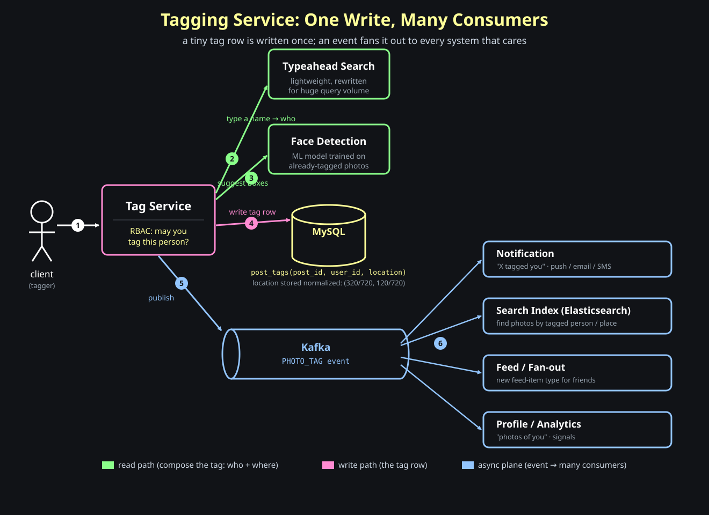

# Image Optimization And Photo Tagging

This post builds two features for a social network, smallest to largest:

- on-demand image optimization
- tagging photos

Along the way we develop a reusable lens for turning a vague prompt into requirements. The next post picks up the main event — a newly unread message indicator. We start with images.

## On-Demand Image Optimization

**Question: one stored image, but every surface wants a different size — how do we serve a 240px avatar in one place and a 720px one in another without storing every variant up front?**

The trick is to put the <span style="color:#8aff8a"><strong>transformation in the URL</strong></span>. The path picks the image; the query string says how to transform it.

```text
https://edge.gravatar.com/img/vallarimehta.jpg?w=240
```

`?w=240` is not part of the file name. It is an instruction: serve this image resized to 240px wide. A different surface just asks for a different number:

```text
profile grid:  /img/vallarimehta.jpg?w=240
feed card:     /img/vallarimehta.jpg?w=360
```

One original, many derivatives, none of them stored ahead of time. This is the <span style="color:#93c5fd"><strong>CDN feature</strong></span> we leaned on in the Instagram post — now let's open it up and see what the CDN is actually doing.

### What The CDN Does Internally

CDNs give this out of the box. Internally it is the same serve-from-the-edge flow we already know, with <span style="color:#8aff8a"><strong>one extra step</strong></span> in the middle:

```text
read the URL (path + transform params)
if the transformed file is already cached -> return it
otherwise:
    read the original from the origin
    transform per the params              <- the extra step
    cache the transformed file
    return the response
```

The only new thing versus plain file serving is the transform step. Everything else — read URL, check cache, fall back to origin, cache, return — is the CDN behavior from before.

The key insight is what the transform params do to caching:

```text
?w=240  and  ?w=360  are two different cache keys
```

Memory hook:

```text
a transform param is just a new cache key
```

So the first request for a given size pays the transform cost once; every later request for that same size is a plain <span style="color:#8aff8a"><strong>cache hit</strong></span>. Different sizes are simply different cached objects derived from one original.

### Building It Yourself: Gravatar's Origin

**Question: what if you cannot lean on the CDN — what does it take to do the transformation yourself, at Gravatar's own origin?**

This is where it gets hard, because of timing. The browser fired one GET and is <span style="color:#ff8a8a"><strong>blocking on the bytes</strong></span>. There is no queue, no worker, no "we'll resize it in a few seconds." The transform has to happen on the fly, synchronously, inside the request.

Contrast that with the thumbnail pipeline from the Instagram post:

```text
async (upload thumbnails): user uploads -> queue -> worker resizes later
on-demand optimization:    user requests -> transform NOW -> return bytes
```

Memory hook:

```text
on-demand transformation cannot be async — the caller is waiting
```

And transformation — resize, crop, the kind of filters Instagram applies — is <span style="color:#ff8a8a"><strong>extremely CPU intensive</strong></span>. You are crunching every pixel, in the request path, while the user waits.

### ImageMagick And A Fleet Of Beefy Machines

How do you actually transform the bytes? With a battle-tested image library like <span style="color:#8aff8a"><strong>ImageMagick</strong></span> — written in C++, and able to use every core on the machine to push pixels in parallel.

Because each transform is CPU-heavy and synchronous, a single server can only handle a handful of concurrent requests before its CPUs are saturated. That drives two decisions:

- the machines are **large** — as much CPU as you can give them
- you need **many** of them, with a <span style="color:#93c5fd"><strong>load balancer</strong></span> in front to spread the work


Both the **size** and the **number** of machines go up. Self-hosting image optimization is <span style="color:#ff8a8a"><strong>genuinely expensive</strong></span> — which is exactly why leaning on the CDN's built-in feature is the right day-one move, and you only build this when you have a reason to.

### Guarding The Transform With A Secret Key

**Question: the transform endpoint takes arbitrary params off the URL. What stops anyone from hammering it?**

Nothing, by default — and that is <span style="color:#ff8a8a"><strong>dangerous</strong></span>. Each unique param combination (`?w=237`, `?w=238`, `?w=239`, ...) is a fresh cache key, which means a fresh, uncached, CPU-heavy transform. An attacker can spray random sizes and force your fleet to burn CPU (and money) on derivatives no real user will ever request.

Here is the constraint that shapes the fix: <span style="color:#93c5fd"><strong>a CDN cannot read your database or your user session.</strong></span> It can only proxy the request to the origin. So the authorization cannot be a session lookup — it has to be something the request itself carries.

The answer is a <span style="color:#ffff99"><strong>secret key</strong></span> (or a signature over the params) baked into the URL. The business configures the key; the origin checks it is present and valid before doing any transform. No key, no transform.

```text
https://edge.gravatar.com/img/vallarimehta.jpg?w=240&key=<secret>
```

And the allowed params themselves — `w=240`, `w=360` — are the menu the CDN exposes for the business to pass in. Anything outside that contract is rejected, so the surface area an attacker can poke at stays small.

Memory hook:

```text
the CDN can't see your DB — so authorize the transform with a key in the URL, not a session
```

## A Lens For Requirements: What To Build Before How

Image optimization was small enough to dive straight into. The next feature — tagging — and the unread indicator in the following post are open-ended *design problems*, and with those the first mistake is jumping to a schema before you know what you're building. So before we design them, here is a reusable lens for turning a vague prompt into requirements that actually constrain the design.

**Question: given "design a tagging service" or "design an unread indicator," where do you even start?**

Not with tables. Start by treating the system as a black box and asking *what it does*, in this order:

```text
1. Actors        who touches this?            (tagger, tagged user, viewer, downstream jobs)
2. Entities      what nouns exist?            (photo, tag, user, location)
3. Actions       what verbs on those nouns?   (create tag, remove, approve, list)
4. Consumers     who READS the output, why?   (notifications, search, "photos of you")
5. Non-functional how well must it behave?    (scale, latency, consistency, privacy)
6. Scope cut     what are you NOT building?    (say it out loud)
```

The single most common failure is answering the wrong question well. <span style="color:#ff8a8a"><strong>A beautiful design for the feature they didn't ask for scores nothing.</strong></span> Steps 1–3 exist purely to pin down *what*, with zero technical thinking. Resist the schema.

### Functional vs Non-Functional

Two buckets, and they do different jobs:

```text
functional      what the system does        create a tag, fetch unread count, deliver a notification
non-functional  how well it does it         latency, throughput, availability, consistency, privacy, cost
```

Functional requirements come from the **actors and their actions** (steps 1–3). They define correctness — the feature list. Non-functional requirements come from **scale and constraints** (step 5). They define quality, and they are where the interesting engineering lives.

### The Step Everyone Skips: Who Consumes The Output

Step 4 is the highest-leverage question and the one people forget. A tag written once might be read in a notification, in search, on a "photos of you" page, and by a recommendation job — and **each consumer wants to query by a different key.** "Tags on *this photo*," "photos of *this person*," "everything at *this location*" are three different access patterns, and your data model and indexes are forced by them, not by the write. The write side stores a tag; the <span style="color:#8aff8a"><strong>read side decides how it must be indexed.</strong></span>

Memory hook:

```text
the writes tell you what to store; the reads tell you how to store it
```

### Which Requirements Actually Move The Design

Most requirements are noise. A handful flip a major decision. When gathering, hunt specifically for these, because each one forks the architecture:

| Requirement to probe | What it decides |
| --- | --- |
| <span style="color:#8aff8a"><strong>Read-heavy</strong></span> vs <span style="color:#ff8bd2"><strong>write-heavy</strong></span> | reads scale easily (cache, replicas, denormalize); writes need coordination — this picks your whole storage strategy |
| <span style="color:#ffff99"><strong>Strong vs eventual consistency</strong></span> | strong consistency costs latency and throughput; tolerating staleness buys 5–20× throughput — decide *per operation* |
| Latency target | a hard p99 rules out synchronous fan-out and pushes work to read-time caches or write-time precompute |
| Scale (QPS, data size, fan-out) | back-of-envelope numbers decide single DB vs sharding, sync vs <span style="color:#93c5fd"><strong>async queue</strong></span> |
| Privacy / consent | who may act, who must approve — this adds entire actions and authorization checks |

The discipline: for every requirement you collect, ask *"if this changed, would my design change?"* If no, it's flavor — note it and move on. If yes, it's a load-bearing requirement and you should nail the number.

### Scope Cuts Are A Feature

Finally, name what you are deliberately leaving out — "tagging non-users is phase 2," "we'll assume one data center." Explicitly marking things <span style="color:#93c5fd"><strong>out of scope</strong></span> is not a cop-out; it proves you saw the full problem space and chose your battles. An unbounded design is a red flag; a bounded one with stated cuts is a strong signal.

Memory hook:

```text
gather actions to find WHAT to build; hunt for the few requirements that change HOW
```

With that lens in hand, tagging becomes an exercise in asking the right questions first.

## Tagging Photos

"Let users tag people in photos" sounds like one feature and one table. Run it through the lens and it explodes into a set of questions — each answer pulls in a different team, a different access pattern, or a different load problem. We'll ask the questions first, then design the storage.

### Who Can You Tag? (entities, and a build-vs-point-to choice)

People, places, landmarks. The moment you say "places," you've crossed a team boundary: profile data is owned by one team, location data by another. So the very first design fork is a data one — <span style="color:#ffff99"><strong>do you copy the tagged entity's data, or just point to it?</strong></span>

```text
store a snapshot   tag row holds {name, thumbnail}   fast reads, but stale when the profile changes
store a reference  tag row holds just user_id         always fresh, but every render needs a join/fetch
```

There's no universal answer — it's the denormalize-vs-reference tradeoff from blog 11, now across team lines. Pointing to the canonical source keeps you correct; snapshotting buys read speed. Pick per how often the entity changes and how hot the read is.

So how does "point to it" actually work when the target can be a person *or* a place? You make the tag **polymorphic**: it stores *what kind* of thing it points at plus an id, and you resolve that id against whichever team owns it.

```text
tag row holds:  (target_type, target_id)        one row shape, many kinds of target

  target_type = "person"    -> target_id = user_id   -> Profile service   {name, avatar}
  target_type = "place"     -> target_id = place_id   -> Places service    {name, lat/lng}
  target_type = "landmark"  -> target_id = poi_id     -> Places service    {name}
```

The tag service stays thin — it owns the *link*, not the entity. At render time it asks the Profile or Places service to hydrate the details.

And the two kinds aren't symmetric — that asymmetry drives the rest of the design:

```text
person tag  -> a real account on the other end  -> can be notified, can review/consent
place  tag  -> a thing, not an account          -> nothing to notify, no consent step
```

That single difference is why the next two questions — *notify* and *who's allowed* — only exist for **people**.

### Notifying The Tagged Person

When someone tags you, you get a notification — but that one sentence hides three decisions:

- **Sync or async?** <span style="color:#93c5fd"><strong>Async.</strong></span> The tag write must not block on delivering a notification. Write the tag, fire an event, move on.
- **Build or integrate?** You do not build a notifier. You <span style="color:#93c5fd"><strong>talk to the existing notification service</strong></span> and register a *new notification type* ("tagged in a photo").
- **Which channel?** That service already knows the user's preference — push, email, or SMS. You hand it the event; it picks the channel.

So what actually happens, end to end? The Tag Service does its tiny write and fires one event; everything after that is the notification consumer's job:

```text
1. Tag Service           writes the tag row, publishes PHOTO_TAG
                         { photo_id, tagger_id, tagged_user_id }      <- then returns. done.
2. Kafka                 holds the event durably
3. Notification consumer reads the event
4.    look up tagged_user_id's channel preference   (push / email / SMS)
5.    build the message  "Alice tagged you in a photo" + thumbnail
6.    hand off to the channel    (APNs / SMTP / SMS gateway)
7. tagged user's device  the notification arrives
```

Two things to notice. First, the Tag Service <span style="color:#93c5fd"><strong>never waits</strong></span> for steps 3–7 — it returned at step 1. Second, if the notification service is down, the tag is still safely written and the event just <span style="color:#93c5fd"><strong>waits in Kafka</strong></span> until the consumer catches up. The "then what" — preference lookup, templating, delivery — all lives behind the event, owned by the team that already does notifications.

The lesson: a feature that *looks* like it belongs to you is often a request you send to a team that already solved the hard part.

### Who Is Allowed To Tag? (auth, privacy, review)

Can anyone tag you, or only friends? Followers? This is an authorization question — <span style="color:#ffff99"><strong>RBAC: is this actor allowed to tag this target?</strong></span> — and it usually comes with a *review workflow*: the tag may need the tagged person's approval before it shows up on their profile.

So how does this work on the request path? The tag submission goes to the **API server** (the Tag Service), and the server — not the client — makes every decision:

```text
client submits tag  ->  Tag Service (API server)
   1. authenticate    who is calling?     session -> tagger_id   (NOT from the request body)
   2. authorize (RBAC) may tagger_id tag tagged_id here?
                       - friends-only / followers? blocked?
                       - tagged user's "who can tag me" privacy setting
   3. denied   -> reject, write nothing
   4. allowed  -> write row as status = PENDING
   5. ask Notification to tell the tagged user: "review this tag"
   ... tagged user approves ...
   6. status = APPROVED  ->  now visible on their profile
```

```text
PENDING -> APPROVED (visible)  |  REJECTED (dropped)
```

Two load-bearing details. The `tagger_id` comes from the authenticated **session**, never from the request body — same lesson as the activate-a-photo security note in blog 11: the client states *what*, the server decides *who*. And the review step is a whole state machine, not a boolean — naming it early is the difference between "tagging" and "tagging that respects consent."

### The Downstream Consumers (the step everyone skips)

This is where the lens pays off. A tag is written once and *read* by many systems, each with its own access pattern:

- **Feed fan-out.** A friend's new tag should appear in feeds. That's not your job to build — you coordinate with the feeds team to add a new feed-item type. Watch for a side effect: a popular photo can put a <span style="color:#ff8a8a"><strong>surge of writes on one posts partition.</strong></span>
- **Search photos by tagged person/place.** For this to work, the tag has to be <span style="color:#93c5fd"><strong>ingested into the search index</strong></span> (think Elasticsearch). And "search by person" means indexing the person's name, bio, school — your index gets as complex as the queries you promise to answer. This is real information-retrieval design, not a checkbox.

Memory hook:

```text
every downstream consumer wants a different key — that's what shapes your indexes
```

### Two Hidden Heavy-Load Services

Two pieces of tagging are deceptively expensive:

- **Tag suggestions (face recognition).** When you start tagging, the UI suggests *who* is in the photo by hovering a box over each face. Behind it is an ML model trained on already-tagged photos. It's invoked constantly, on every tagging session — <span style="color:#ff8a8a"><strong>a lot of load</strong></span> for one small convenience.
- **The tag picker's typeahead search.** To tag someone you type their name, and the picker searches *millions* of users as you type. This is not your main search — the traffic is enormous and the requirement is narrow (fast prefix match on a name). It typically gets <span style="color:#8aff8a"><strong>its own lightweight, purpose-built search path</strong></span>, rewritten to be simple and fast rather than reusing the heavyweight general search.

Both are reminders that a "small" feature can hide the system's hottest path.

### What To Store, And How: Relative Coordinates

Now the design. A tag isn't just *who* — it's *where on the photo*. You store a position: a point, or a bounding box (`x, y, w, h`, or left-top-right-bottom). A box handles the obvious case where faces are different sizes — someone close to the camera versus a photo-bomber in the back.

But there's a trap. If you store **absolute pixels**, the tag breaks the instant the image is shown at a different size — and from the previous feature, we serve the *same* photo at many sizes on demand (`?w=240`, `?w=720`). A box at pixel `(320, 120)` in a 720px render points at the wrong face in a 240px one.

The fix is <span style="color:#ffff99"><strong>relative positioning</strong></span>: store coordinates normalized to the image dimensions, as fractions between 0 and 1.

```text
absolute:  (320, 120)            breaks when the render size changes
relative:  (320/720, 120/720)    survives every device and on-demand transform
```

Memory hook:

```text
store tag coordinates as fractions of the image, never raw pixels
```

That gives a small, clean schema — a join table between posts and the tagged user, carrying the location:

```text
post_tags
---------
post_id  | user_id | location
```

`location` holds the normalized box. The row itself is tiny; everything expensive about tagging lives in the *consumers*, not the storage.

### The Key To Extensibility: Publish An Event

Look back at the consumer list — notification, feed, search, analytics, profile — and notice the pattern: the tag write is trivial, but the list of things that must *react* to a tag is long and keeps growing. If the Tag Service called each of them directly, every new consumer would mean editing the write path.

So the linchpin is <span style="color:#93c5fd"><strong>Kafka</strong></span>. The Tag Service does two cheap things — write the row, then publish a <span style="color:#93c5fd"><strong>`PHOTO_TAG` event</strong></span> — and walks away. Every interested system subscribes as an independent consumer.

```text
write tag row  ->  publish PHOTO_TAG  ->  { notification, search, feed, analytics, profile, ... }
```

Adding a new behavior later ("tagged-photos digest") is a *new consumer*, with zero changes to the tag write path. That decoupling is the whole reason the architecture stays sane as the feature grows.

Memory hook:

```text
one small write + one event; the consumers — and there will be more — sort themselves out
```

### The Whole Picture



Following the numbers:

1. The **client** opens the tagger on a photo.
2. As the user types a name, the Tag Service hits the **typeahead search** to find *who* to tag (a read).
3. **Face detection** suggests boxes over each face — *where* to tag (a read).
4. On submit — after the **RBAC** check — the Tag Service **writes one small row** to `post_tags` with the normalized location (the write).
5. It then **publishes a `PHOTO_TAG` event** to Kafka and is done.
6. Kafka **fans the event out** to every consumer — notification, search index, feed, profile/analytics — each reacting on its own.

Read it in three colors: green is composing the tag (who + where), pink is the one tiny write, blue is the async plane that does all the real downstream work. The service you own is small; the lens told you everything around it is where the system actually lives.
