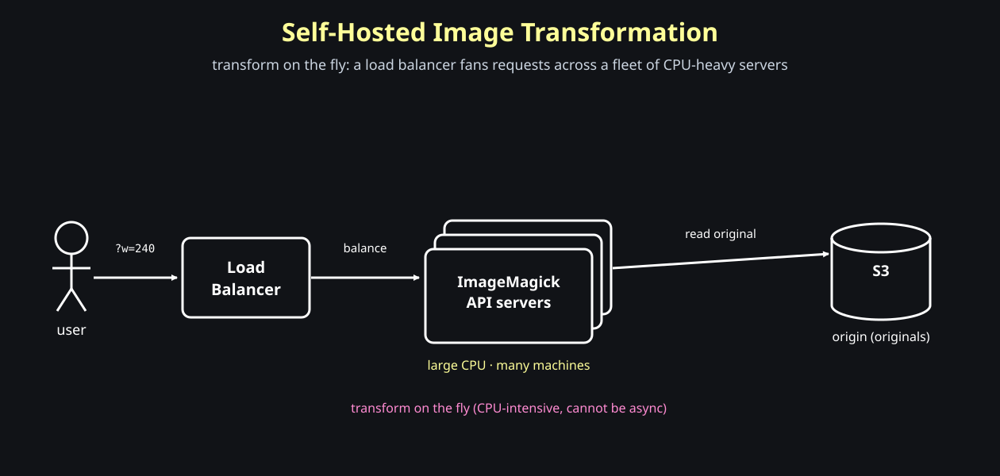

# Designing A Newly Unread Message Indicator

This post builds three features for a social network, smallest to largest:

- on-demand image optimization
- tagging photos
- the main event: a newly unread message indicator

We start with images.

## On-Demand Image Optimization

**Question: one stored image, but every surface wants a different size — how do we serve a 240px avatar in one place and a 720px one in another without storing every variant up front?**

The trick is to put the <span style="color:#8aff8a"><strong>transformation in the URL</strong></span>. The path picks the image; the query string says how to transform it.

```text
https://edge.gravatar.com/img/vallarimehta.jpg?w=240
```

`?w=240` is not part of the file name. It is an instruction: serve this image resized to 240px wide. A different surface just asks for a different number:

```text
profile grid:  /img/vallarimehta.jpg?w=240
feed card:     /img/vallarimehta.jpg?w=360
```

One original, many derivatives, none of them stored ahead of time. This is the <span style="color:#93c5fd"><strong>CDN feature</strong></span> we leaned on in the Instagram post — now let's open it up and see what the CDN is actually doing.

### What The CDN Does Internally

CDNs give this out of the box. Internally it is the same serve-from-the-edge flow we already know, with <span style="color:#8aff8a"><strong>one extra step</strong></span> in the middle:

```text
read the URL (path + transform params)
if the transformed file is already cached -> return it
otherwise:
    read the original from the origin
    transform per the params              <- the extra step
    cache the transformed file
    return the response
```

The only new thing versus plain file serving is the transform step. Everything else — read URL, check cache, fall back to origin, cache, return — is the CDN behavior from before.

The key insight is what the transform params do to caching:

```text
?w=240  and  ?w=360  are two different cache keys
```

Memory hook:

```text
a transform param is just a new cache key
```

So the first request for a given size pays the transform cost once; every later request for that same size is a plain <span style="color:#8aff8a"><strong>cache hit</strong></span>. Different sizes are simply different cached objects derived from one original.

### Building It Yourself: Gravatar's Origin

**Question: what if you cannot lean on the CDN — what does it take to do the transformation yourself, at Gravatar's own origin?**

This is where it gets hard, because of timing. The browser fired one GET and is <span style="color:#ff8a8a"><strong>blocking on the bytes</strong></span>. There is no queue, no worker, no "we'll resize it in a few seconds." The transform has to happen on the fly, synchronously, inside the request.

Contrast that with the thumbnail pipeline from the Instagram post:

```text
async (upload thumbnails): user uploads -> queue -> worker resizes later
on-demand optimization:    user requests -> transform NOW -> return bytes
```

Memory hook:

```text
on-demand transformation cannot be async — the caller is waiting
```

And transformation — resize, crop, the kind of filters Instagram applies — is <span style="color:#ff8a8a"><strong>extremely CPU intensive</strong></span>. You are crunching every pixel, in the request path, while the user waits.

### ImageMagick And A Fleet Of Beefy Machines

How do you actually transform the bytes? With a battle-tested image library like <span style="color:#8aff8a"><strong>ImageMagick</strong></span> — written in C++, and able to use every core on the machine to push pixels in parallel.

Because each transform is CPU-heavy and synchronous, a single server can only handle a handful of concurrent requests before its CPUs are saturated. That drives two decisions:

- the machines are **large** — as much CPU as you can give them
- you need **many** of them, with a <span style="color:#93c5fd"><strong>load balancer</strong></span> in front to spread the work



Both the **size** and the **number** of machines go up. Self-hosting image optimization is <span style="color:#ff8a8a"><strong>genuinely expensive</strong></span> — which is exactly why leaning on the CDN's built-in feature is the right day-one move, and you only build this when you have a reason to.

### Guarding The Transform With A Secret Key

**Question: the transform endpoint takes arbitrary params off the URL. What stops anyone from hammering it?**

Nothing, by default — and that is <span style="color:#ff8a8a"><strong>dangerous</strong></span>. Each unique param combination (`?w=237`, `?w=238`, `?w=239`, ...) is a fresh cache key, which means a fresh, uncached, CPU-heavy transform. An attacker can spray random sizes and force your fleet to burn CPU (and money) on derivatives no real user will ever request.

Here is the constraint that shapes the fix: <span style="color:#93c5fd"><strong>a CDN cannot read your database or your user session.</strong></span> It can only proxy the request to the origin. So the authorization cannot be a session lookup — it has to be something the request itself carries.

The answer is a <span style="color:#ffff99"><strong>secret key</strong></span> (or a signature over the params) baked into the URL. The business configures the key; the origin checks it is present and valid before doing any transform. No key, no transform.

```text
https://edge.gravatar.com/img/vallarimehta.jpg?w=240&key=<secret>
```

And the allowed params themselves — `w=240`, `w=360` — are the menu the CDN exposes for the business to pass in. Anything outside that contract is rejected, so the surface area an attacker can poke at stays small.

Memory hook:

```text
the CDN can't see your DB — so authorize the transform with a key in the URL, not a session
```
