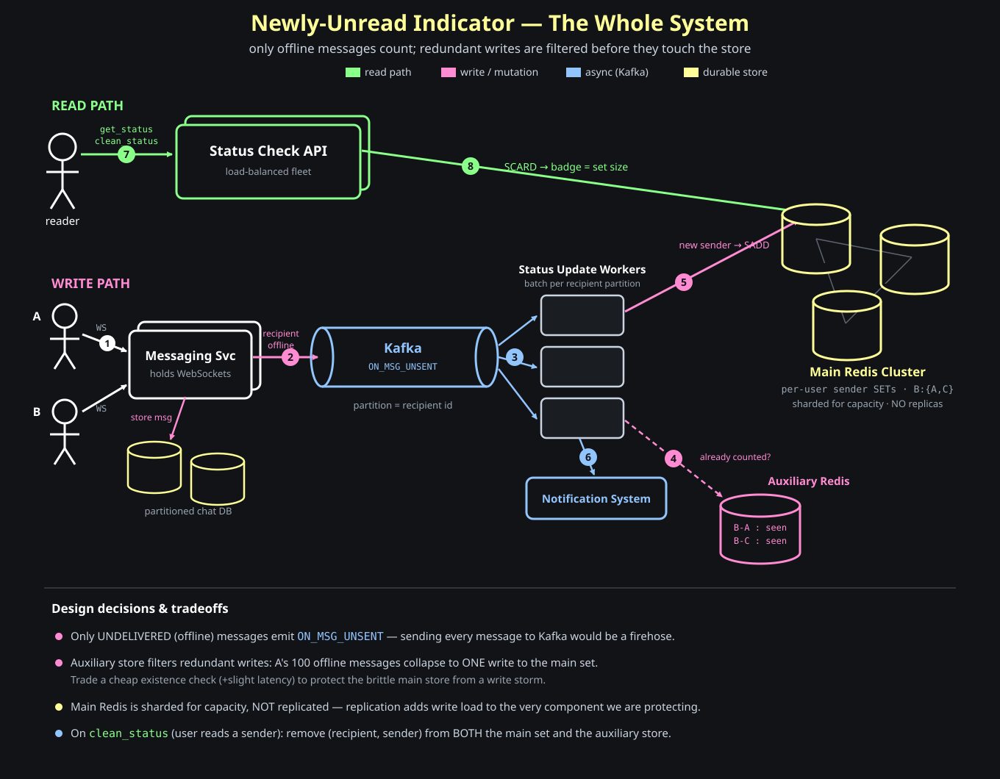

# Designing A Newly Unread Message Indicator

You close the app and go offline. While you're away, messages pile up. You come back online, and there it is — a little badge on the messages icon with a number in it.

```text
   ✉  ③
```

This post designs the system behind that number. As always, we resist jumping to a schema and start with the lens from the last post: figure out *what* we're building before *how*. And with this feature, the very first question is sneaky.

## What Does That Number Even Mean?

**Question: the badge says `3`. Three what?**

The obvious answer — "three unread messages" — is wrong, and getting it wrong is the whole trap of this feature. You can have *hundreds* of unread messages sitting in your inbox. The badge still says `3`.

The number is the count of <span style="color:#ffff99"><strong>distinct people who have newly messaged you and whom you haven't read yet</strong></span>. Three different senders, not three messages.

```text
inbox:  Alice  ✉✉✉✉✉   (5 unread)
        Bob    ✉        (1 unread)
        Carol  ✉✉       (2 unread)         8 unread messages total
                                            but the badge says 3
```

The hand-drawn note put it exactly:

```text
# newly-unread = # of different people from whom you received a message that is still unread
```

So this is not a message counter — it's the **cardinality of a set of senders**. That one distinction quietly decides the data model, because "count messages" is a running integer while "count distinct people" is a set you have to add to and remove from.

Memory hook:

```text
the badge counts people, not messages — it's a set's size, not a sum
```

We also want to be precise about *newly*: this is about the **presence of new messages**, not the backlog of everything ever unread or un-acked. It answers "who has reached out to me recently that I still need to look at?"

## Gathering The Requirements

Running it through the lens, the open questions are mostly **scope** questions — and each one is worth asking out loud rather than assuming:

- **Push notification too, or just the in-app badge?** A badge is a pull-on-open; a push is a proactive interrupt. They're different delivery surfaces — decide whether this feature owns one, both, or just the badge. *(We'll scope to the badge and treat push as a separate consumer.)*
- **Do group messages count?** A message in a 50-person group — does that bump your badge like a direct message does? This genuinely changes the counting rule, so it's a requirement, not a detail. *(Worth pinning down with the interviewer; the core design works either way once the rule is fixed.)*
- **People or messages?** Already answered above, and it's *the* defining decision: <span style="color:#ffff99"><strong>distinct people</strong></span>, not message volume.

Stripping those down, the actual requirements are small but pointed:

```text
1. the count = number of DISTINCT senders with at least one unread message
2. near-real-time      the badge reflects reality within seconds, not on next launch
3. updates on every new message received
```

The load-bearing non-functional requirement is <span style="color:#93c5fd"><strong>near-real-time</strong></span>. "Near" matters: we do *not* need a strongly-consistent, to-the-millisecond count — a badge that's a second or two stale is completely fine. That tolerance is a gift, and a good design should spend it. Conversely, <span style="color:#ff8a8a"><strong>recomputing the distinct-sender count by scanning the inbox on every read</strong></span> is exactly what we must avoid — at messaging scale that's a non-starter.

Memory hook:

```text
near-real-time, not real-time — a slightly stale badge is fine, and that buys us a lot
```

We now know precisely what we're building: a per-user, near-real-time count of distinct unread senders that goes **up** when a new person messages you and **down** when you read someone's messages. Time for the *how*.

## The Messaging System It Hangs Off

Our indicator doesn't live alone — it's a parasite on the messaging system. So picture that first. A user posts a message; it lands on a **Messaging Service**; the message is stored in a partitioned chat DB.

```text
A  --POST /message-->  Messaging Service  -->  partitioned chat DB
```

The one detail that matters for us: clients connect to the Messaging Service over a **WebSocket**, and a WebSocket is *stateful* — the server knows, at any instant, whether a given user is connected. Hold onto that; it's the hinge of the whole design.

## The Key Insight: Only Undelivered Messages Count

**Question: when a message arrives, should it bump the badge?**

Not always. If B is **online**, the message is delivered live over the open socket — B effectively *received* it, so it is not part of "what piled up while I was away." It's only when B is **offline** that the message goes undelivered and becomes a newly-unread thing waiting for them.

And we already know who's offline — the WebSocket layer just told us. So the rule is:

```text
recipient ONLINE   -> delivered live      -> does NOT feed the indicator
recipient OFFLINE  -> undelivered         -> THIS is what bumps the badge
```

This is the move that makes the whole thing affordable. We do **not** push every message into Kafka — that would be a <span style="color:#ff8a8a"><strong>firehose of every message on the platform</strong></span>. We only emit an event when a message can't be delivered.

Memory hook:

```text
the badge is fed by UNDELIVERED messages — and the WebSocket already knows who's offline
```

## The Event That Feeds Us: `ON_MSG_UNSENT`

When the Messaging Service can't deliver, it emits one event onto Kafka — and *this becomes the input to our system*:

```text
ON_MSG_UNSENT  { src: "A", dest: "B", msg: "..." }
```

Crucially, we partition the Kafka topic by **`dest` (the recipient)**. Every event headed for B lands on the same partition, which gives us two things: ordering per user, and the ability to **batch** all of B's events in one worker before touching storage.

## Storing It: A Set Per User

Recall the definition — distinct senders, not message count. When the thing you need is *uniqueness*, the data structure picks itself: a **set**. And conveniently, <span style="color:#ffff99"><strong>Redis gives you sets natively</strong></span> — uniqueness, add, remove, and size are all built in and O(1).

```text
key:    recipient_id              e.g.  B
value:  { sender_id, ... }        e.g.  { A, C }     <- distinct unread senders

SADD B A   add a sender      (badge may go up)
SREM B A   remove a sender   (badge goes down)
SCARD B    the badge number  (size of the set)
```

The set is self-cleaning: a sender sits in it only while they have something unread, so its size is *always* exactly the badge. No timestamps, no dedup logic of our own — the set *is* the dedup.

Memory hook:

```text
want unique? use a set. Redis hands you SADD / SREM / SCARD for free.
```

## The Read Path

The read side is deliberately boring — and that's the point. A simple REST endpoint:

```text
get_status(user)    -> SCARD  -> the badge number
clean_status(user, sender)  -> SREM  -> drop a sender after they're read
```

A load-balanced **Status Check API** fleet sits in front of the Redis cluster and answers <span style="color:#8aff8a"><strong>`get_status` with a single `SCARD`</strong></span>. This is a **read-heavy** system — every app open hits `get_status` — so the store needs distributed read capacity, which we get by **sharding** the Redis cluster across nodes.

## The Write Path, And The Problem Hiding In It

The write path is: Kafka → **status-update workers** → `SADD` into Redis → ping the notification system. Kafka itself we're not worried about — it's distributed and fault-tolerant by design. The concern is the **write load on Redis**, and here's the trap:

> A sends B **100 messages** while B is offline. That's 100 `ON_MSG_UNSENT` events, so 100 `SADD B A` calls. But `B:{A}` after one `SADD` is *identical* to `B:{A}` after a hundred. **Ninety-nine of those writes changed nothing.**

The set already guarantees correctness — re-adding `A` is harmless. But "harmless" isn't "free": each redundant `SADD` is still a round-trip that loads the Redis cluster. In a system that's already read-heavy, <span style="color:#ff8a8a"><strong>one meaningful write versus a hundred redundant ones hit the database exactly the same</strong></span>, and that wasted write load is what threatens the brittle component.

Memory hook:

```text
a set makes redundant writes CORRECT, not CHEAP — they still cost a round-trip
```

## The Fix: An Auxiliary Store To Absorb Redundant Writes

The conceptual idea is small and worth stating plainly:

> **Put a cheap, fast lookup in front of the expensive store whose only job is to answer "have we already counted this (recipient, sender) pair?" If yes, skip the real write entirely.**

Concretely, a second lightweight **auxiliary Redis** holds a flag per pair:

```text
B-A : seen        B-C : seen        ...
```

The worker's logic becomes:

```text
event (A -> B):
    seen B-A in auxiliary?
        NO   -> first message from A:  SADD B A on the MAIN store,
                                        set B-A = seen in auxiliary,
                                        ping notification        (the real, once-per-sender work)
        YES  -> redundant:             do nothing to the main store
```

So A's 100 messages now cause **exactly one** write to the main cluster; the other 99 are caught and dropped by the auxiliary. We've **offloaded the redundant-write filtering** onto a store built for exactly that, and protected the main set from the write storm.

The tradeoffs, named honestly:

- **More infrastructure** — another store to run.
- **A little more latency** — every event now does an auxiliary check before the (possibly skipped) main write. This is an easy trade: a few milliseconds of latency to shield the brittle, hard-to-scale component is exactly the kind of bargain *near*-real-time lets us take.
- **Deletes now hit both stores** — when `clean_status` removes a sender, we must `SREM` from the main set **and** clear the pair in the auxiliary, so the *next* message from that sender counts again.

And one deliberate non-choice: we **shard** the main Redis for capacity but do **not** add **read replicas**. Replication would copy every write to every replica — piling more write load onto the very component we just worked to protect. Sharding distributes load without amplifying writes; replicas would undo the win.

Memory hook:

```text
guard the brittle store with a cheap "already seen?" check — pay a little latency, save the write storm
```

### A Lighter Lever: Just Batch

Step back and notice *why* the auxiliary store works — and you'll find a cheaper way to get most of the benefit, already paid for by a decision we made earlier.

We partitioned the Kafka topic by **recipient id**. That means **all of B's events land on one partition, consumed by one worker.** So that worker can simply <span style="color:#93c5fd"><strong>buffer a short window of events and collapse duplicates in memory</strong></span> before touching Redis:

```text
window of events for B:   A, A, A, C, A, C, A     (7 events)
deduped in the worker:    { A, C }
writes to main cluster:   2     (not 7)
```

A's hundred messages in a burst become a single `SADD` — **no auxiliary store, no extra lookup, no dual-delete on reads.** The redundant-write problem is solved by the same partition key that was already giving us ordering. Both approaches chase the one goal — <span style="color:#ff8a8a"><strong>fewer writes to the cluster</strong></span> — so it's worth being explicit about the trade:

```text
batching          collapses duplicates within a time/size window, in memory
                  free (rides the partition key), but only dedups what's in the window
auxiliary store   catches duplicates across ALL time
                  more complete, but costs infra + a lookup per event + dual deletes
```

For a bursty pattern like "someone fires off 100 messages while you're offline," batching alone knocks the write load down hard. Reach for the auxiliary store only if duplicates spread far enough apart in time to slip past your batch window.

Memory hook:

```text
partition by recipient and you get ordering AND in-memory dedup — batching may be all you need
```

## The Whole Picture



Following the numbers:

1. A and B talk to the **Messaging Service** over **WebSockets** (the message is also stored in the chat DB).
2. Because the recipient is **offline**, the service publishes one **`ON_MSG_UNSENT`** event to Kafka, partitioned by recipient.
3. **Status-update workers** consume it (batching per recipient partition).
4. The worker asks the **auxiliary Redis**: have we already counted this `(recipient, sender)` pair?
5. Only if it's a **new sender** does it `SADD` into the **sharded main Redis cluster** (and record the pair in the auxiliary).
6. The same worker pings the **notification system**.
7. On the read side, a client calls **`get_status` / `clean_status`** against the load-balanced **Status Check API**.
8. `get_status` is a single **`SCARD`** on the main cluster — the badge number.

Three colors tell the story at a glance: green is the trivial read (`SCARD`), pink is the carefully-guarded write, blue is the async plane. The cleverness isn't in any one box — it's in emitting events *only for offline recipients* and *filtering redundant writes before they reach the store you can least afford to overload*.

## A Note On Doing This In SQL

Redis sets made this feel effortless — uniqueness and an O(1) count came for free. You *can* build the same thing on a relational DB, but the work the set was hiding now becomes your job: the indexes.

Model the set as a table — one row per `(recipient, sender)` pair, with a **composite primary key** on both columns:

```sql
CREATE TABLE unread_senders (
  recipient_id BIGINT,
  sender_id    BIGINT,
  PRIMARY KEY (recipient_id, sender_id)   -- the (recipient, sender) uniqueness, enforced
);
```

That one constraint buys back both Redis behaviors:

- **Uniqueness / idempotency.** `INSERT ... ON CONFLICT DO NOTHING` is the exact analog of `SADD` — re-inserting a pair that already exists is a silent no-op, so the table stays a true set. (It also reproduces the redundant-write win from the auxiliary store: a duplicate insert does no row work.)
- **A cheap count.** Because the pair is the <span style="color:#ffff99"><strong>composite index</strong></span>, the badge is `SELECT COUNT(*) FROM unread_senders WHERE recipient_id = ?` — an **index range scan** over one recipient's rows, not a table scan. We avoid `COUNT(DISTINCT sender_id)` on the raw messages table entirely, which is the expensive query you'd otherwise be stuck optimizing.

The thing to internalize: count queries *can* be fast in SQL, but only if the index is set up to make them fast. Get the index wrong — query an unindexed column, or reach for <span style="color:#ff8a8a"><strong>`COUNT(DISTINCT ...)` across millions of message rows</strong></span> — and you're back to a full scan, the same class of gotcha as the `md5(email)` trap from the Gravatar post. The index ordering matters too: with the key as `(recipient_id, sender_id)`, all of one recipient's pairs sit contiguously, so the count is a tight, sequential read.

Memory hook:

```sql
-- the set, in SQL: a composite key gives you both the dedup AND the fast COUNT(*)
PRIMARY KEY (recipient_id, sender_id)
```

Redis or SQL, the underlying model never changed — a set of senders per recipient. Redis ships that structure ready-made; SQL makes you *build* it out of a table plus the right index. Knowing which work the datastore is doing for you is the whole point.
