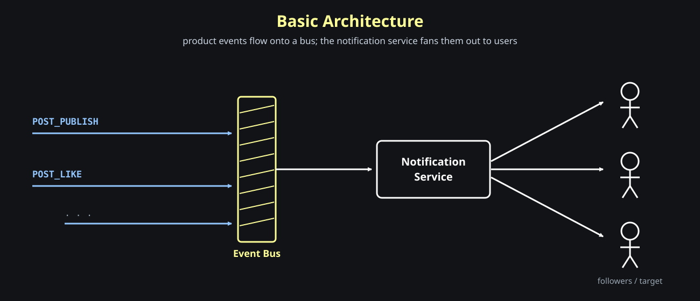
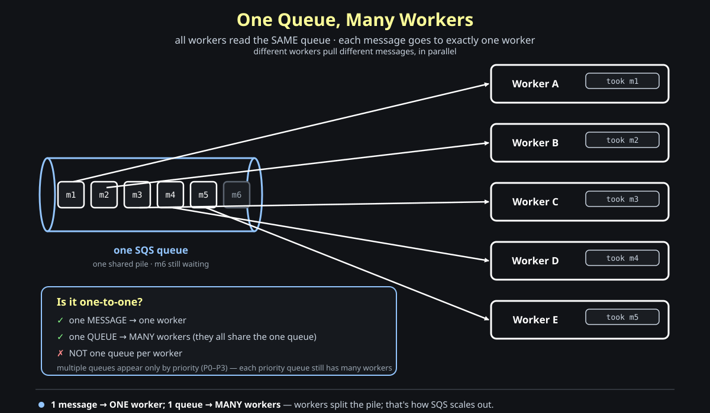
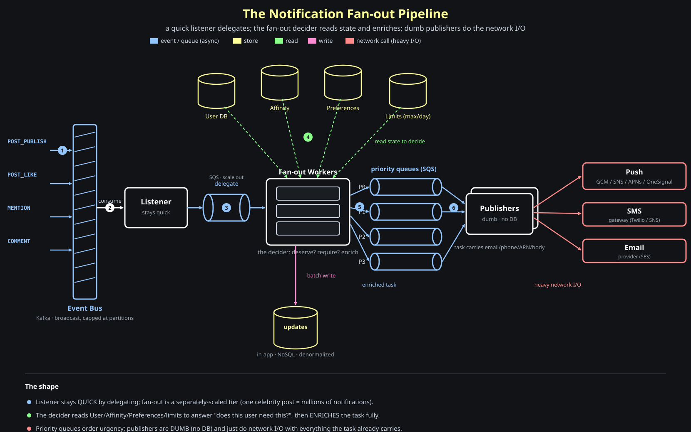

# Designing A Notifications Service

Every social app has one: the bell icon with a red dot, the push that lands on your lock screen, the "12 new notifications" badge. Behind all of it is a single service whose entire job is **fan-out** — turning one event into many notifications. This post designs it end to end.

## When Do We Even Send A Notification?

Start with the triggers. Two canonical ones:

```text
a user posts a photo   ->  notify ALL of its followers      (fan-out to many)
A likes B's photo       ->  notify just B                    (fan-out to one)
```

Both are *events*. The whole system is event-driven: something happens in the product, an event is emitted, and the notification service decides who hears about it.

## Basic Architecture

The skeleton is small. Product services emit events onto a <span style="color:#93c5fd"><strong>bus</strong></span> (`POST_PUBLISH`, `POST_LIKE`, …). The Notification Service consumes them and fans out to recipients.

```text
POST_PUBLISH ┐
POST_LIKE    ├──>  [ Event Bus ]  ──>  Notification Service  ──>  fan out to users
  ...        ┘
```



Everything interesting is in how that last arrow — "fan out to users" — actually works.

## The Features We're Building

Before the hard part, name the scope:

- **Push notifications** — `[App, SMS, Email]`
- **In-app notifications** — `[Persisted]` (the bell-icon list you scroll)
- **Aggregation** — "X and 5 others liked your photo"
- **Notification configuration** — per-user preferences (mute, frequency)
- **Notification decider** — should we send this at all?

## The Heart Of The Problem: Fan-out

The single hardest thing about a notification service is <span style="color:#ff8a8a"><strong>fan-out</strong></span>: one event can become **millions** of notifications. And each kind of notification is a different kind of work:

```text
push  ->  you do NOT send push yourself; you call GCM/FCM, APNs, SNS, OneSignal   = a NETWORK CALL
SMS   ->  call an SMS gateway (Twilio, SNS)                                        = a NETWORK CALL
email ->  call an email provider (SES, ...)                                        = a NETWORK CALL
in-app->  persist a row the user will see in their bell list                       = a DB WRITE
```

SMS and email are <span style="color:#ff8a8a"><strong>just like push — another network call</strong></span> to a third party. In-app is the odd one out: it's a <span style="color:#ffff99"><strong>DB write</strong></span>, and that means it needs proper data modeling. And because one event fans out to many in-app rows, you <span style="color:#ffff99"><strong>always batch the writes</strong></span>.

Memory hook:

```text
every notification is either a NETWORK CALL (push/sms/email) or a DB WRITE (in-app)
```

## Step Scaling: Not All Users Are Equal

Here's why you can't treat fan-out as one uniform job:

```text
U1  ->  100 followers
U2  ->  10k followers
U3  ->  500k followers
U4  ->  5m followers
```

One post by U4 is **5 million** notifications; one post by U1 is a hundred. The fan-out workload is wildly uneven, which is exactly why the fan-out tier has to be **decoupled and scaled on its own** — a celebrity post must not starve everyone else's notifications. (This unevenness is also why priorities show up later.)

## In-App Notifications: The Data Model

In-app notifications are persisted, so they need a table. First look at what one row has to render on screen:

```text
( ◯ photo )   Title text .........................................   2h ago
   badge      description line ..............................     (elapsed since created_at)
```

So the anatomy is: a **profile photo**, a **badge**, a **title**, a **description**, and an **elapsed-since** computed from `created_at`. That maps to a table:

```text
Table: updates
---------------------------------------------
PK   id           bigint
FK   user_id      bigint     ┐ index
     created_at   int        ┘ (user_id, created_at)
     title        varchar
     description  varchar
     metadata     varchar  ->  JSON   (profile photo, badge, action buttons, ...)
```

A few decisions worth calling out:

- The index on `(user_id, created_at)` is what makes "give me *my* notifications, newest first" cheap.
- **`metadata` is a JSON blob**, and that's deliberate — it's the escape hatch that holds profile photo, badges, and anything else a notification type needs without new columns.
- **On-click** is handled through that metadata too: store the deep-link / action in the JSON, and the client just follows it.

And the big storage call: since the in-app read **doesn't really need joins** (the row is <span style="color:#ffff99"><strong>denormalized</strong></span> — it already carries everything to render), you can store `updates` in a <span style="color:#ffff99"><strong>NoSQL store like DynamoDB</strong></span> instead of a relational DB.

## Key To A Good Design: A Generic Notification Structure

This is the principle that makes the whole thing maintainable:

> Keep the notification structure **generic and all-encompassing**. The backend sends the fully-formed data; the client renders it **without changing a single line**.

Want to add action buttons inside a notification? You do *not* ship a client release — you just add fields to the <span style="color:#ffff99"><strong>metadata JSON</strong></span>, and the generic renderer picks them up. The backend ships *data*, not *code*.

Memory hook:

```text
backend ships data, not code — a new notification type must never require a client update
```

The cost of this generality is volume: the <span style="color:#ff8a8a"><strong>notification table explodes</strong></span>. Two standard answers:

- **Delete older data post-archival** — notifications are ephemeral; age them out after archiving.
- **Store it in NoSQL, completely denormalized** — built for this write volume and this access pattern.

## Why Fan-out Must Be Fast (And How We Make It)

Fan-out *takes time* — potentially millions of recipients. So the component that reads the bus must **stay quick**; it cannot block while it does the fan-out itself. The fix is delegation:

```text
bus  ->  listener/consumer (QUICK: just delegates)  ->  delegate queue  ->  fan-out workers (the heavy lifting)
```

The listener's only job is to grab the event and hand it off. The <span style="color:#93c5fd"><strong>fan-out workers</strong></span> — a separately scaled tier — do the expensive expansion, and then publish per-recipient tasks onto *another* queue that feeds the senders.

Memory hook:

```text
the bus listener stays quick by delegating; the fan-out workers absorb the heavy expansion
```

## Two Queues, Two Jobs: Kafka vs SQS

If you've been squinting at the diagram wondering *why there are two different queues* — an event bus **and** a delegate queue — this section is the one to slow down on. They are two different technologies doing two different jobs.

**Question: a queue already sits in front of the workers. Why not let the event-bus consumers do the fan-out directly? Why hand off to a second queue at all?**

Because the event bus and the work queue are good at opposite things:

| | <span style="color:#93c5fd"><strong>Kafka</strong></span> — the event bus | <span style="color:#93c5fd"><strong>SQS</strong></span> — the work queue |
| --- | --- | --- |
| Who reads a message | **many** services (notifications, feed, analytics all read the same event) | **exactly one** consumer takes each message |
| Storage model | durable local log on disk; each consumer pulls at its own offset | managed queue; message is deleted once a consumer acks it |
| Parallelism limit | capped at the **number of partitions** — consumers in a group ≤ partitions | effectively unbounded — point **hundreds** of consumers at it |
| Best at | **broadcasting** one event to many independent systems | **scaling out** one slow workload across many workers |

The line that matters most is **parallelism**. Kafka's read throughput is bolted to its partition count: a topic with 12 partitions allows at most 12 consumers in a group reading in parallel — add a 13th and it just sits idle. That's perfect for *reading events quickly*, but it's fatal for *doing slow work*:

```text
one POST_PUBLISH by a celebrity  =  20,000,000 notifications to expand
```

If a Kafka consumer tries to expand those 20M recipients itself, it is busy for a long time — and while it's busy, it is <span style="color:#ff8a8a"><strong>not reading the next event off its partition</strong></span>. A few celebrity posts stall the entire topic, and you *can't* fix it by adding consumers, because you're capped at the partition count.

So the listener does the smallest possible job — read the event, drop it onto SQS — and is instantly free to read the next one. SQS has **no partition cap**, so the slow expansion scales out across as many fan-out workers as you need:

```text
Kafka  ──>  Listener (read + drop: FAST)  ──>  SQS  ──>  100s of fan-out workers (slow expansion)
            keeps the partition free                     scale out freely, no partition cap
```

Memory hook:

```text
Kafka broadcasts and is capped at partitions — never do slow work inside a Kafka consumer; hand off to SQS to scale out
```

### "One Consumer Per Message" ≠ "One Consumer Per Queue"

This is the part that sounds contradictory: SQS gives each message to *one* consumer, yet *hundreds* of workers read the queue. Both are true, because the rule is **per-message, not per-queue**.

A queue isn't one message — it's a <span style="color:#93c5fd"><strong>pile of many messages</strong></span>. Each worker calls `receiveMessage`, gets a *different* message, and SQS briefly hides that message from everyone else (the *visibility timeout*) so no one else grabs it. The worker finishes, calls `deleteMessage`, and takes the next. 100 workers means 100 *different* messages in flight — never a duplicate.



So the answer to "isn't it one-to-one?" is: the 1:1 is **message → worker**, *not* queue → worker. It is **not** one queue per worker — all the workers share the *one* queue. (Separate queues show up only by **priority**, `P0`–`P3`, and even then each priority queue still has many workers.)

Memory hook:

```text
SQS gives each MESSAGE to one worker — but one QUEUE feeds as many workers as you add
```

The same SQS-style queue shows up again later as the **priority queues** in front of the publishers — same reason: the actual sending is slow network I/O, so it lives on a queue you can drain with hundreds of workers.

## What The Boxes Actually Are: Code vs Server vs Service

One thing the diagram quietly assumes: that you know *what kind of thing* each box is. A fan-out worker and a publisher are not Kafka, not SQS, not a database — so what are they? The trick is to separate three layers that are easy to blur together:

```text
1. THE CODE      a program you write          (a Node.js / Java / Go app)
2. THE SERVER    compute it runs on           (EC2 instance, container, or Lambda)
3. THE SERVICES  managed infra it talks to     (Kafka, SQS, a SQL/NoSQL DB)
```

The **fan-out worker** and **publisher** are layer 1 — *programs you write* — running on layer 2, a <span style="color:#93c5fd"><strong>server like EC2</strong></span> (or a container / Lambda). Kafka, SQS, and the databases are layer 3: managed services your program **calls over the network**. The worker and publisher are the same *kind* of thing (a process on a server); they differ only in the code they run.

| Thing | What it physically is |
| --- | --- |
| Fan-out worker | your app code (a process) running on EC2 / a container / Lambda |
| Publisher | your app code (a process) running on EC2 / a container / Lambda |
| Kafka | a managed **message bus** your code connects to |
| SQS | a managed **queue** your code calls via an API |
| User DB / Preferences | a managed **database** (SQL or NoSQL) your code queries |

### "Publishing to SQS" Is Just an API Call

Here's the mechanical part that trips everyone up. SQS isn't something your code *is* — it's a managed service AWS runs. A worker "publishes to SQS" by making an **API call** to it with the AWS SDK. No special connection, just a function that does an HTTPS request under the hood:

```js
// Inside the fan-out worker (code running on EC2 / a container)
await sqs.sendMessage({
  QueueUrl: "https://sqs.us-east-1.amazonaws.com/123/notifications-P0",
  MessageBody: JSON.stringify({
    channel: "sms",
    phone:   "+1555...",        // task is already enriched
    body:    "Alice liked your photo",
  }),
});
```

That's all "publish to SQS" means: call `sendMessage` with a queue URL and a JSON body, and AWS stores it in the queue.

### Each Compute Tier Is a Poll Loop

The shape that ties it together: every compute tier is a **loop** that <span style="color:#8aff8a"><strong>reads</strong></span> from one service, does its work, and <span style="color:#ff8bd2"><strong>writes</strong></span> to the next. The queues never push — the worker *polls* them.

```text
Fan-out Worker (your code on a server):
   loop:
     msg   = sqs.receiveMessage(delegateQueue)      // 1. READ a task from SQS
     users = db.query("SELECT ... cursor/batches")  // 2. READ recipients from the DB
     for each recipient:
        task = enrich(recipient)                     // 3. build a self-contained task
        sqs.sendMessage(priorityQueue, task)         // 4. WRITE ("publish") to SQS
     sqs.deleteMessage(delegateQueue, msg)           // 5. ack: remove the handled msg

Publisher (your code on a server):
   loop:
     task = sqs.receiveMessage(priorityQueue)        // 1. READ a task from SQS
     twilio.send(task.phone, task.body)              // 2. the external network call
     sqs.deleteMessage(priorityQueue, task)          // 3. ack
```

The queues (Kafka/SQS) are passive pipes; the workers and publishers are the active loops calling `receiveMessage` / `sendMessage` / `query`.

Memory hook:

```text
workers & publishers are processes on servers; Kafka/SQS/DBs are services they call over the network
"publish to SQS" = an sqs.sendMessage() API call — nothing more
```

## Implementing The Fan-out: The Decider Brain

A fan-out worker does three things per event:

```text
1. find WHOM to send to              (the followers, or the single target)
2. check the end user's PREFERENCE   (did they mute this? rate-limited?)
3. create a task and DELEGATE it to a publisher
```

The reason it's called a "decider" is step 2 — it has a <span style="color:#93c5fd"><strong>brain that decides</strong></span> two questions for every candidate:

```text
does this EVENT deserve a notification?     (is it even notification-worthy?)
does this USER require this notification?    (preferences, affinity, rate limits)
```

To answer those, the fan-out tier reads from several stores:

```text
User DB      -> who follows whom / the recipient set
Affinity     -> how relevant is this sender to this user (rank, closeness)
Preferences  -> did the user mute this notification type?
DB (limits)  -> rate limits, e.g. max notifications per day
```

### The Decider Logic In Detail

For a given notification type / event:

```text
- find people to send to:   SELECT ... FROM ... ;
      keep the CURSOR OPEN and read in BATCHES      (5m followers — never load all at once)
- filter out users who should NOT get it, due to:
      * max notifications per day      (rate limit, from DB)
      * muted preferences
      * affinity too low
```

Keeping the cursor open and streaming in batches is the key to surviving a 5-million-follower fan-out without blowing up memory.

## Priority Queues + Dumb Publishers

After the decider builds tasks, they don't all go into one queue — they go into **priority queues** (think SQS), `P0` through `P3`:

```text
P0  (highest priority)  ┐
P1                      │  separate SQS queues, drained priority-first
P2                      │
P3  (lowest)            ┘
```

A 2FA code or a DM beats a "someone you may know" nudge. Priority queues let urgent notifications jump the line during a celebrity-post fan-out storm.

The consumers of these queues are the **publishers** — they make the actual external call. They are <span style="color:#ff8a8a"><strong>heavy on network I/O</strong></span> (every send is a call to GCM/SNS/Twilio/SES). And the crucial design rule:

> **Publishers are dumb.** They have **no DB access**. Everything needed to send must already be in the task — email, phone, subscription ARN, body, etc.

So the fan-out worker **enriches the task fully** before queueing it. The publisher just takes the self-contained task and fires the network call.

Memory hook:

```text
enrich at fan-out, send at publish — publishers are dumb & DB-less; the task carries everything
```

### Each Priority Queue Has An SLA

What makes a queue `P0` rather than `P3` isn't a label — it's a **time budget** from "notification created" to "notification delivered." That budget is the SLA, and it's the number you measure and scale on.

| Queue | Example contents | SLA (created → sent) |
| --- | --- | --- |
| **P0** | 2FA code, a DM, a bell-icon alert from a close contact | ~5 s |
| **P1** | a like or comment from someone you follow | ~10 min |
| **P2** | "people you may know", digest-style nudges | ~20 min |
| **P3** | low-value, best-effort | hours / best effort |

A `P0` queue draining slower than its 5-second budget needs more publishers **right now**; a `P3` queue can back up for an hour and no one notices. That difference is exactly why the queues are split.

### Autoscale On Queue Depth

Notification volume is *spiky* — a single celebrity post is 20M messages out of nowhere — so a fixed worker pool is either wasteful at rest or too small at peak. Both the fan-out workers and the publishers therefore **autoscale on queue depth**:

```text
queue filling up faster than its SLA   ->  add workers
queue drained                          ->  scale back down
```

Static (a pinned pool) is simpler but can't absorb the spikes; dynamic (scale on depth) is the norm precisely because the load is bursty and uneven.

### Pick The Right Box For The Job

The fan-out workers and publishers are <span style="color:#ff8a8a"><strong>heavy on network I/O</strong></span> — they spend their lives *waiting* on calls to GCM/Twilio/SES, not burning CPU. Two practical consequences:

- choose instance types optimized for **network I/O**, not compute
- use a runtime built for high-concurrency I/O — **Node.js**'s async model lets one worker hold thousands of in-flight network calls without a thread per call

Memory hook:

```text
each queue has an SLA; autoscale on queue depth; the boxes are I/O-bound, so size for network not CPU
```

## The Whole Picture

Before the map, here is the **cast of components** — each box, what it actually *is*, and what it reads and writes. This is the table to come back to whenever the diagram blurs together:

| Component | What it is | Reads from | Writes to |
| --- | --- | --- | --- |
| **Event Bus** | a **Kafka** topic of product events | — | (product services publish here) |
| **Listener** | a Kafka consumer; stays quick | Kafka | the SQS delegate queue |
| **Delegate queue** | an **SQS** work queue | (the listener) | (the fan-out workers) |
| **Fan-out worker** | the "decider"; expands one event into many recipients | SQS delegate queue **+** User / Affinity / Preferences / Limits stores | in-app `updates` (NoSQL) **+** the SQS priority queues |
| **Priority queues P0–P3** | **SQS** queues, one per priority | (the fan-out workers) | (the publishers) |
| **Publisher** | a dumb sender — **no DB** | one SQS priority queue | external channels: Push / SMS / Email |

Read it as one sentence: **Kafka carries the events, the listener moves each event onto SQS, the fan-out worker turns one event into many enriched tasks, those tasks queue by priority on SQS, and the dumb publisher drains a queue and makes the network call.**



Following the numbers:

1. Product services emit events (`POST_PUBLISH`, `POST_LIKE`, `MENTION`, `COMMENT`, …) onto the **event bus**.
2. A **listener** consumes each event and — staying quick — immediately **delegates** it onto a queue.
3. **Fan-out workers** (the decider) pick it up and read **User / Affinity / Preferences / rate-limit** stores to answer *who* should get it and *whether* they should.
4. For **in-app**, the worker **batch-writes** rows into the denormalized `updates` store (NoSQL).
5. For push/SMS/email, the worker builds a **fully-enriched task** and drops it into a **priority queue** (`P0`–`P3`).
6. **Dumb publishers** drain the queues and make the **external network call** to GCM/SNS/Twilio/SES — no DB lookups, everything they need is in the task.

The shape to remember: a **quick listener** that delegates, a **fan-out decider** that reads all the state and enriches, **priority queues** in the middle, and **dumb publishers** at the edge doing nothing but network I/O.

## Aggregation (Left As An Exercise)

One feature we scoped but didn't design: **aggregation** — "X and 5 others liked your photo." There are several implementations. The LinkedIn approach is **one notification per object that keeps updating in place** — rather than N separate rows, you keep a single notification and mutate its count/text as more events arrive. Worth working through how you'd model that on top of the `updates` table.
