# Designing a Distributed Cache

**Question: before we make a cache distributed, could a single machine do the job?** Start there. A cache on one node is just a fast key-value map in memory. Once we understand what *that* takes, "distributed" becomes the answer to a specific bottleneck — not the starting point.

## Requirements

| Requirement | What it means |
| --- | --- |
| **High throughput, low latency** | Millions of ops/sec, sub-millisecond reads. The cache sits on the hot path, so it must be fast or it is pointless. |
| **GET, PUT, DEL, TTL** | The whole API. Read a key, write a key, delete a key, and let entries expire on their own. |
| **Scale is the default** | We assume one machine is not enough — for memory or for traffic. The design must spread across nodes from the start. |

## Two Parts

We build this in two passes, smallest correct version first.

1. **Single-node cache** — one machine, one in-memory map. What does it take to serve `GET`/`PUT`/`DEL`/`TTL` correctly and fast? This forces us to answer storage, eviction, expiry, and concurrency *before* the network is in the picture.
2. **Distributed cache** — one machine runs out of room or traffic. Now we shard keys across many nodes and make clients find the right one. Distribution is the fix for a *named* limit, not the first move.

## Brainstorm

Before any architecture, list the hard parts. Each one becomes a section later.

| Topic | The question it raises |
| --- | --- |
| **Storage** | What in-memory structure holds the entries? |
| **Cache full** | Memory is finite — what happens when it fills up? |
| **Eviction** | When full, *which* key do we drop to make room? |
| **TTL** | How do entries expire, and who actually removes them? |
| **Concurrency** | Many requests hit the same keys at once — how do we stay correct? |
| **Communication** | Across nodes: how does a client reach the node that owns a key? |

The first four (**storage, cache full, eviction, TTL, concurrency**) are *single-node* problems. The last one (**communication**) is what makes it *distributed*. That split is the spine of the whole post.

> **Memory hook:** *storage, eviction, expiry, and concurrency are single-node problems; distribution only adds "which node owns this key."*

---

## Section 1 — Storage

**Question: where do the entries actually live, and in what shape?**

In <span style="color:#8aff8a"><strong>memory</strong></span>, as a <span style="color:#8aff8a"><strong>hashmap</strong></span>. The key is a string; the value is an object that can be one of several datatypes — an int, a string, a list, a nested hashmap, a set, a priority queue, even a bloom filter. The hashmap gives us O(1) `GET`/`PUT`/`DEL`, which is exactly what "low latency" demands.

But a value being "any type" raises two problems: how does it travel over the network, and how does the server know what it's holding?

### The client and cache must speak the same protocol

The client and the cache run on different machines. So the request has to be <span style="color:#93c5fd"><strong>serialized</strong></span> into bytes, sent over the wire, and <span style="color:#93c5fd"><strong>deserialized</strong></span> on the other side. Both sides must agree on the exact byte format — that agreement *is* the <span style="color:#93c5fd"><strong>application-layer protocol</strong></span>.

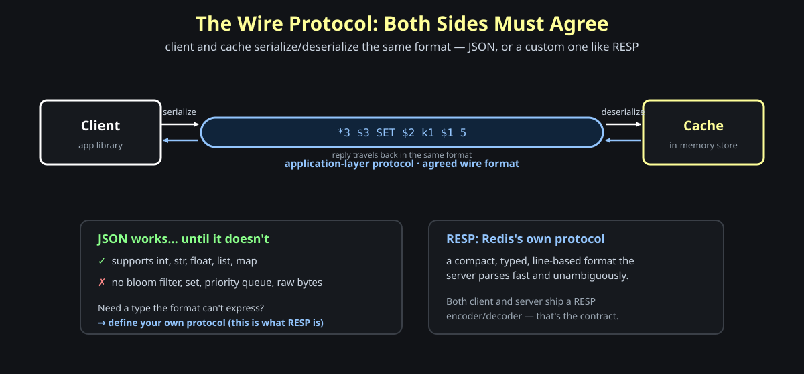

You could use JSON — it handles int, str, float, list, and map. But the moment you want a type JSON can't express (a bloom filter, a set, raw bytes), JSON is no longer enough and you have to <span style="color:#93c5fd"><strong>define your own protocol</strong></span>. That's precisely what Redis does: it ships <span style="color:#93c5fd"><strong>RESP</strong></span> (its own serialization protocol), and both client and server understand it.

### Store the type alongside the data

When a `PUSH k1 x1` arrives, the server has to know that `k1` is a list before it can push. So the value isn't stored as bare data — it's stored as a `{ type, data }` pair.

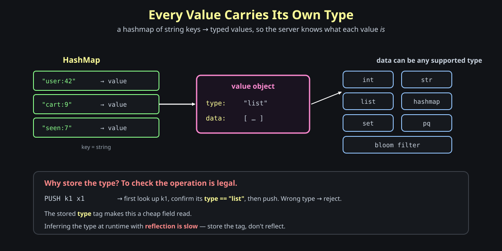

With the <span style="color:#ffff99"><strong>type</strong></span> stored explicitly, validating an operation is a cheap field read: look up `k1`, confirm `type == "list"`, then push — or reject if it's the wrong type. The tempting alternative is to inspect the object's type at runtime with <span style="color:#ff8a8a"><strong>reflection</strong></span>, but reflection is slow on the hot path. Store the tag; don't reflect.

> **Memory hook:** *a value is `{type, data}` — store the type so checking an operation is a field read, not a reflection call.*

---

## Section 2 — Cache Full: Staying Under The Memory Limit

**Question: RAM is finite. What happens the moment you try to store one byte past it?**

Every object lives in the <span style="color:#8aff8a"><strong>heap</strong></span>. Keep allocating and eventually the heap fills, and the *next* allocation past physical RAM doesn't return an error you can shrug off — you get an <span style="color:#ff8a8a"><strong>OOM error</strong></span>, a segfault, a crashed process. The whole cache dies and every key is lost. You can never let this happen.

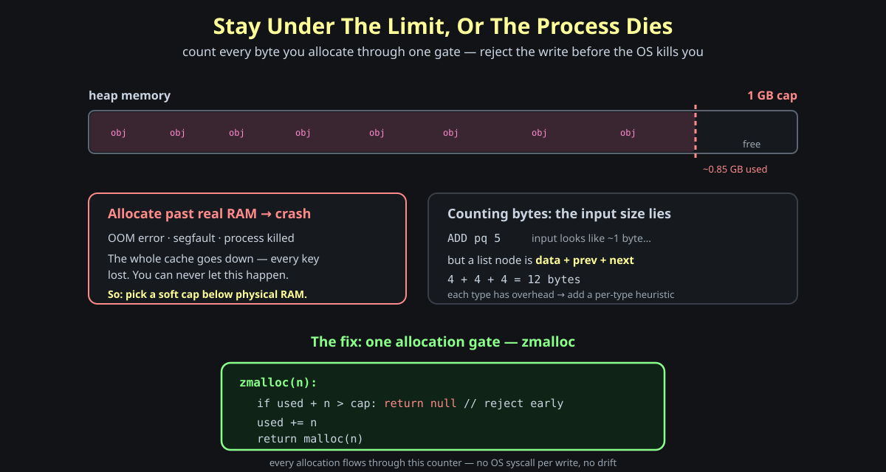

So you set a <span style="color:#ffff99"><strong>soft cap</strong></span> below physical RAM — "use at most 1 GB" even on a 1.2 GB machine — and you must *never* cross it. The question becomes: how do you know your current usage without crossing?

### Maintain your own byte counter

You could ask the OS on every write via a syscall, but that's far too slow for the hot path. Instead, keep <span style="color:#ffff99"><strong>your own counter</strong></span> and update it as you write bytes.

The catch: `len(input)` lies. A value like `5` looks like one byte, but stored inside a linked-list node it carries overhead — `data + prev + next` pointers, e.g. `4 + 4 + 4 = 12 bytes`. Every datatype has its own overhead, so you add a <span style="color:#ffff99"><strong>per-type heuristic</strong></span> on top of the raw payload.

### Can we do better? Gate every allocation through `zmalloc`

The heap allocates with `malloc(n)` and releases with `free(obj)`. Rather than count bytes scattered across the code, wrap `malloc` in one gate — call it <span style="color:#8aff8a"><strong>zmalloc</strong></span>:

```c
zmalloc(n):
    if used + n > cap:   return null   // reject before we crash
    used += n
    return malloc(n)
```

Now accounting happens at the one place bytes are actually allocated. No allocation can sneak past the counter, no OS syscall per write, and "am I full?" is answered exactly where it matters.

> **Memory hook:** *count bytes at the allocator, not the input — one `zmalloc` gate keeps the cache under its cap and the process alive.*

---

## Section 3 — Eviction: Which Key Do We Drop?

**Question: the cache is full and a new write arrives. Which existing key gets evicted?**

The honest answer is *it depends on how your keys are read*. There's no universally best policy — each one matches a different access pattern, and each costs a different amount of bookkeeping.

The clearest way to see this is to plot **access rate over time** for two real workloads:

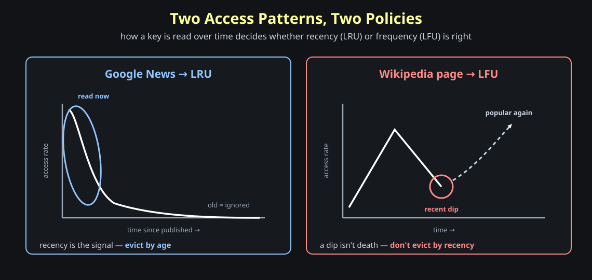

A **Google News** story spikes when published and decays fast — once it's old, it's ignored, so recency is the whole story. A **Wikipedia page** behaves differently: it can peak, drop into a quiet dip, and climb back up — so a recent dip is *not* a reason to evict it. Those two curves are exactly why we need two different policies below.


### LRU — when recency wins

<span style="color:#93c5fd"><strong>LRU</strong></span> (least recently used) evicts whatever hasn't been touched for the longest time. It fits a *recency* pattern: **Google News** — today's stories are read constantly, a 100-day-old story almost never. Old news is dead news, so evicting by age is safe.

The cost: exact LRU needs a <span style="color:#ff8a8a"><strong>doubly linked list</strong></span> (move a key to the head on every access, evict from the tail). That bookkeeping itself takes memory — the cache's own metadata competes with the data it's caching. So in practice you use <span style="color:#93c5fd"><strong>approximate LRU</strong></span>: give up a little exactness to save a lot of memory.

### LFU — when frequency wins

A recent *dip* in access shouldn't doom a key. Think of a **Wikipedia** page or a **stock** that was popular before and will be popular again — popular-in-the-past predicts popular-in-the-future. <span style="color:#ff8a8a"><strong>LFU</strong></span> (least frequently used) evicts by *count*, not recency, so a temporarily quiet but historically hot key survives. Like LRU, you use an <span style="color:#ff8a8a"><strong>approximate</strong></span> version to keep the counters cheap.

### LFU with decay — frequency that ages

Raw frequency has a flaw: a key that was hammered a year ago keeps a huge count forever. So you let frequency <span style="color:#ffff99"><strong>decay over time</strong></span> — e.g. halve every score each day: `1,000,000 → 500,000 → 250,000` (<span style="color:#ffff99"><strong>exponential decay</strong></span>). A once-hot key fades unless it keeps earning fresh hits. The decay rate is a knob you tune to your traffic.

### Random — when nothing is worth tracking

If every key is <span style="color:#8aff8a"><strong>uniformly accessed</strong></span>, recency and frequency carry no signal — so tracking them is wasted memory and CPU. <span style="color:#8aff8a"><strong>Random</strong></span> eviction just drops any key, with *zero bookkeeping*. Cheapest possible policy, and for uniform access it's no worse than the fancy ones.

> **Memory hook:** *match the policy to the access pattern — recency → LRU, frequency → LFU (decay it over time), uniform → Random; and approximate to save the memory exact tracking would eat.*

---

## Section 4 — Communication: How Does The Client Reach The Cache?

**Question: the client and cache are on different machines. What do they speak over the wire?**

Everything runs on <span style="color:#93c5fd"><strong>TCP</strong></span> underneath. The real choice is the layer on top of it, and there are three:

| Transport | Connection | Serialization | Reach for it when |
| --- | --- | --- | --- |
| **HTTP/1.1 REST** | new connection per request (unless keep-alive) | JSON / text | the cache is exposed over the **internet** — browsers, proxies, firewalls, TLS all speak HTTP |
| **gRPC** | one persistent connection (HTTP/2) | <span style="color:#93c5fd"><strong>protobuf</strong></span> (compact binary) | **high-volume internal** service-to-service traffic |
| **Raw TCP** | one persistent connection | your own format (RESP) | you control **both ends internally** and want the simplest, fastest path |

### Don't pick one — abstract the protocol away

You don't have to commit. The transport is just the *front door*; the cache logic behind it is identical. So make the protocol pluggable: a <span style="color:#93c5fd"><strong>TCP</strong></span>, <span style="color:#93c5fd"><strong>HTTP</strong></span>, and <span style="color:#93c5fd"><strong>gRPC</strong></span> adapter can all parse their wire format and hand the same command to one router, which touches the one <span style="color:#ffff99"><strong>hashtable</strong></span>.

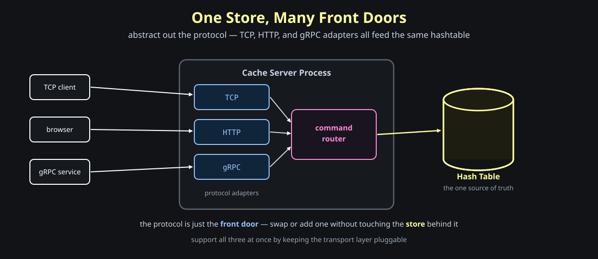

### Why persistent transports (gRPC / raw TCP) win on throughput

Open a TCP connection and you pay a <span style="color:#ff8a8a"><strong>3-way handshake</strong></span> (SYN, SYN-ACK, ACK) up front and a teardown at the end. With plain HTTP/1.1, *every request* can pay that tax. A persistent connection pays it **once** and then streams thousands of requests over the same pipe.

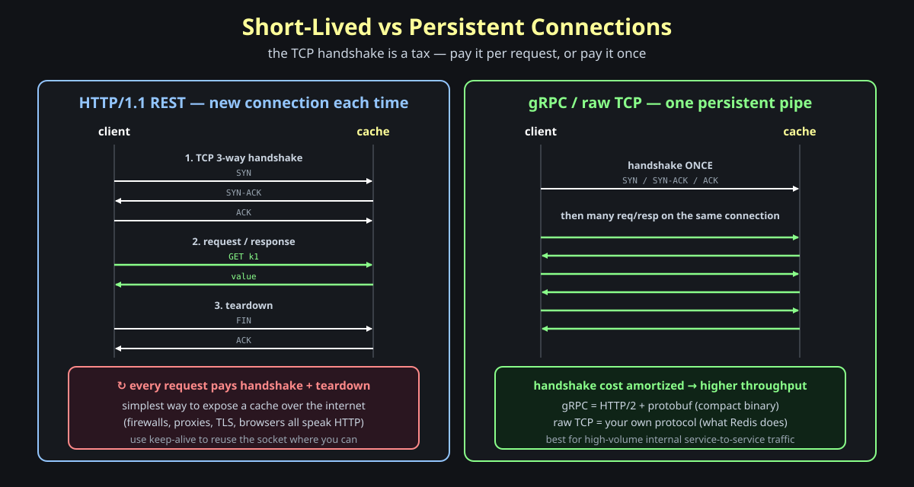

So the reasons to choose gRPC or custom raw TCP come down to three:

- **Connection pooling** — keep warm connections open and reuse them.
- **Skip the per-request handshake** — amortize the 3-way handshake over many calls.
- **Performant serialization/deserialization** — protobuf (or a custom binary format) is smaller and faster to parse than text JSON. (For tiny payloads the compression isn't worth it — raw TCP with your own simple format is fine.)

> **Memory hook:** *protocol is the front door, not the store — keep it pluggable; reach for persistent transports to skip the per-request handshake.*

---

## Section 5 — TTL: How Do Expired Keys Get Removed?

**Question: a key is set with `ex=100`. When and how does it actually leave memory?**

First, store the expiry *on the key*. Each value carries an `exp` field holding an <span style="color:#93c5fd"><strong>absolute</strong></span> wall-clock time — not a countdown — so checking "is this expired?" is just `exp < now`. Now, *who* removes it?

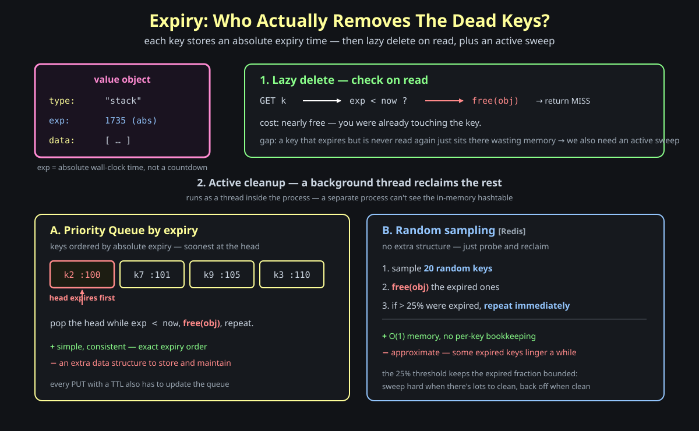

### Lazy delete — check on the way past

The cheapest removal is to piggyback on reads: on `GET k`, if `exp < now`, <span style="color:#ff8a8a"><strong>free(obj)</strong></span> and return a miss. It costs almost nothing because you were already touching the key. The freed memory is reclaimed (the garbage collector picks it up in a GC language).

The gap: a key that expires but is **never read again** just sits there wasting memory. Lazy delete alone leaks. So we also need an active sweep.

### Active cleanup — a background thread

A cleanup task runs in the background to reclaim the rest. Note it must be a <span style="color:#93c5fd"><strong>thread</strong></span> inside the cache process, not a separate process — a separate process has its own address space and can't see the in-memory hashtable (processes share *disk*, not heap). Two ways to find what to delete:

**A. Priority queue ordered by expiry.** Keep keys in a min-heap on absolute expiry time, soonest at the head (`k2:100, k7:101, k9:105, k3:110`). Pop the head while `exp < now`, free it, repeat.
- ✅ simple and **consistent** — exact expiry order.
- ❌ an **extra data structure** to store and maintain; every TTL'd `PUT` also updates the queue.

**B. Random sampling (the Redis approach).** No extra structure: sample ~20 random keys, free the expired ones, and if more than **25%** of the sample was expired, repeat immediately.
- ✅ O(1) memory, no per-key bookkeeping.
- ❌ **approximate** — some expired keys linger briefly. The 25% threshold is self-tuning: sweep hard when there's a lot of garbage, back off when the cache is clean.

> **Memory hook:** *expiry = lazy delete on read + an active sweep (exact priority queue, or Redis-style sampling); the sweep is a thread, because a separate process can't see the heap.*

---

## Section 6 — Concurrency: Two Writes To One Key

Before scaling out, note that scaling a single node is **vertical** — add more RAM, CPU, and network. But a faster machine running many threads exposes a correctness problem.

**Question: two requests do `a++` on the same key at the same instant. What's the final value?**

You'd expect `12` from two increments of `10`. But `a++` isn't one step — it's <span style="color:#ff8a8a"><strong>read-modify-write</strong></span> (read 10, add 1, write 11). If both threads read `10` before either writes, both write `11`, and one increment vanishes. This is the <span style="color:#ff8a8a"><strong>lost update</strong></span>.

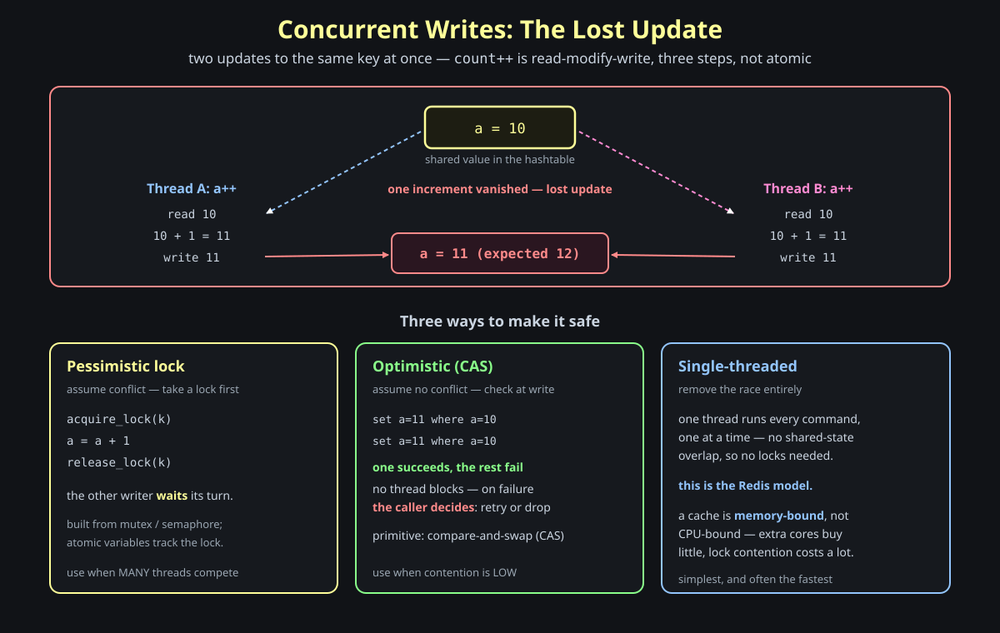

The first consequence: a plain hashmap isn't thread-safe, so a multi-threaded server needs a <span style="color:#ffff99"><strong>concurrent hashmap</strong></span>. Beyond the map itself, there are three classic ways to serialize conflicting writes:

- **Pessimistic locking** — assume a conflict *will* happen, so grab a lock first: `acquire_lock(k)` → mutate → `release_lock(k)`. The other writer **blocks and waits** its turn. Built from a mutex/semaphore, with atomic variables tracking the lock. Correct, but every contender stalls on the lock.
- **Optimistic locking** — don't block anyone. Make the write **conditional** instead: `set a=11 where a=10`. If several try at once, **one succeeds and the rest fail** — no thread ever waited. The primitive is <span style="color:#8aff8a"><strong>compare-and-swap (CAS)</strong></span>.
- **Single-threaded** — remove the race entirely. One thread runs every command, one at a time, so there's no shared-state overlap and no locks at all. This is the <span style="color:#93c5fd"><strong>Redis model</strong></span>.

The real difference between the first two is what happens on a clash. Pessimistic *prevents* the clash by serializing access. Optimistic *lets it happen* and pushes resolution back to the caller: when a conditional write fails, **the developer decides** what to do — retry with the fresh value, or simply move on, because for many operations a lost attempt has no real impact (custom logic the app owns).

So the choice is about how crowded the key is:

| Use **optimistic** when… | Use **pessimistic** when… |
| --- | --- |
| resource contention is **low** — clashes are rare | **many threads** compete for the same key |
| a failed write is cheap to retry or safe to drop | a blocked wait is cheaper than constant retries |
| you never want a thread to block | a clash must be strictly prevented, not just detected |

The third option, **single-threaded**, sounds like throwing away performance — until you look at what a cache actually spends its time doing.

### CPU-bound vs memory-bound

What is the bottleneck — the *processor*, or *getting bytes in and out of memory*?

| | **CPU-bound** | **Memory-bound** |
| --- | --- | --- |
| The slow part | the processor doing math/logic | RAM access + network I/O |
| The CPU is mostly… | **busy computing** | **idle, waiting** for memory/network |
| Example workloads | video encoding, password hashing, model training, image resize | a **cache**, key-value lookups, in-memory DBs |
| More cores help? | **yes** — there's real computation to spread | **barely** — the slow part doesn't parallelize |

A cache barely computes. `GET k` is: hash the key, jump to a slot, read the value from RAM, ship it over the network. The CPU isn't crunching — it's <span style="color:#93c5fd"><strong>waiting on memory and the network</strong></span>. That's textbook memory-bound.

### Why single-threaded is counterintuitive… then obvious

Your instinct says *"more threads = more cores working = faster."* That instinct is right — **for CPU-bound work**. For a cache it's a trap:

- **Extra cores have little to do.** The bottleneck is memory/network bandwidth, not computation. Ten threads still wait on the same RAM and the same network card — the slow part doesn't get faster.
- **Threads sharing the hashmap must lock.** The moment they touch the same keys you need the pessimistic/optimistic machinery above, and threads **block each other** — overhead you only created by going multi-threaded.

So multi-threading buys almost nothing (the slow part won't parallelize) and costs a lot (locking + contention). Flip to **one thread** and the whole picture simplifies: commands run one at a time, so there's <span style="color:#8aff8a"><strong>no shared-state race and no locks at all</strong></span> — Section 6's lost update can't even happen. And a single thread already saturates the memory/network bandwidth that was the real limit. That's why Redis is single-threaded: simpler *and* often faster, precisely **because** the cache is memory-bound. (Worth chewing on: with the right locking you could even bolt cache semantics onto a SQL database — the throughput is the interesting part.)

> **Memory hook:** *more cores only help when the CPU is the slow part; a cache is memory-bound, so one thread with zero locking beats many threads fighting over locks.*

> **Memory hook:** *low contention → optimistic (conditional CAS, caller handles the failure); high contention → pessimistic (block and wait); memory-bound cache → single-threaded often wins.*

---

# Part 2 — Distributed Cache

Part 1 made one node correct and fast. But one node has a ceiling: a fixed amount of RAM, one network card, one set of cores. A **distributed cache** is just *multiple single-node caches working together as one coherent cache* — the client shouldn't be able to tell. Everything new in Part 2 exists to answer one question the single node never had to ask: **which node owns this key?**

---

## Section 7 — Why Distribute, and the One Rule

**Question: a single node already works — what actually forces us onto many?**

One of three walls. You hit **too much data** (the working set no longer fits in one box's RAM), **too much load** (more ops/sec than one NIC and CPU can serve), or **too much compute** (heavier work than one machine keeps up with). Each is a *named* limit — distribution is the fix for one of these, never the opening move.

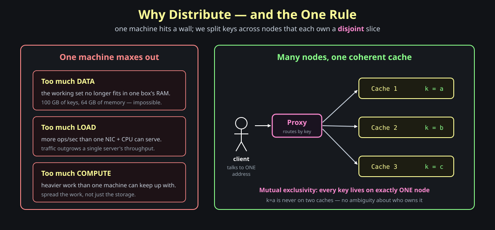

When you split, one rule governs everything: **mutual exclusivity** — every key lives on *exactly one* node. `k=a` is never on two caches at once. The moment a key could live in two places you'd have to keep them in sync and decide who's authoritative; the single-owner rule sidesteps all of that.

And the client should never have to know there are many nodes. It talks to **one address** — a <span style="color:#ff8bd2"><strong>proxy</strong></span> layer — and the proxy figures out which node owns the key and forwards the request. To the caller, the whole fleet looks like one cache.

> **Memory hook:** *distribution answers a named wall (data / load / compute); every key has exactly one owner; the client sees one door (the proxy), never the fleet.*

---

## Section 8 — Routing: Which Node Owns the Key?

**Question: a request arrives for key `k`. How do we find the node that owns it?**

This is **routing**, and its whole job is to answer *who owns this data?* There are two broad styles. The crude one is to **broadcast**: ask every node, and whoever has the key responds (and on a write, hand it to all of them). It works, but it doesn't scale — every node pays for every request. The useful style is **targeted**: *compute* the owner from the key itself (hash-based, range-based) and talk only to that node.

But there's a second axis — *where does the routing decision live?* Four answers, each with a familiar real-world shape:

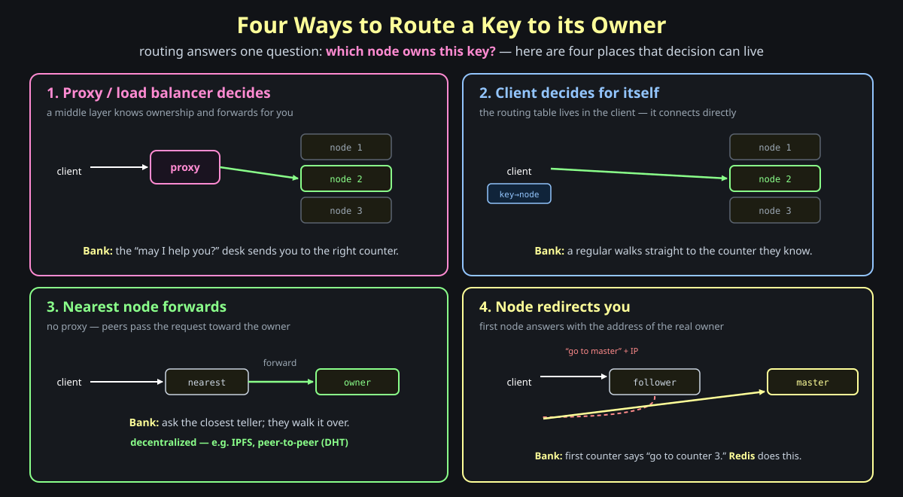

1. **Proxy / load balancer decides.** A middle layer knows ownership and forwards for you — the *"may I help you?"* desk at a bank that points you to the right counter.
2. **Client decides for itself.** The routing table lives *in the client*; it computes the owner and connects directly — a regular who walks straight to the counter they already know.
3. **Nearest node forwards.** No proxy at all: you hit whatever node is closest and peers pass the request toward the owner — ask the nearest teller and they walk it over. This is the **decentralized** model (IPFS, peer-to-peer).
4. **Node redirects you.** You hit one node and it answers with the *address* of the real owner — the first counter says *"go to counter 3."* This is what **Redis** does: hit a follower (a read replica) and it hands back the master's IP so you can go straight there.

> **Memory hook:** *routing answers "who owns this key?" — broadcast (ask everyone) doesn't scale; compute the owner and put that decision in the proxy, the client, a forwarding peer, or a redirect.*

---

## Section 9 — Why Naive Routing Breaks When You Scale

**Question: hash-based and range-based both route fine today. What goes wrong the moment the cluster changes size?**

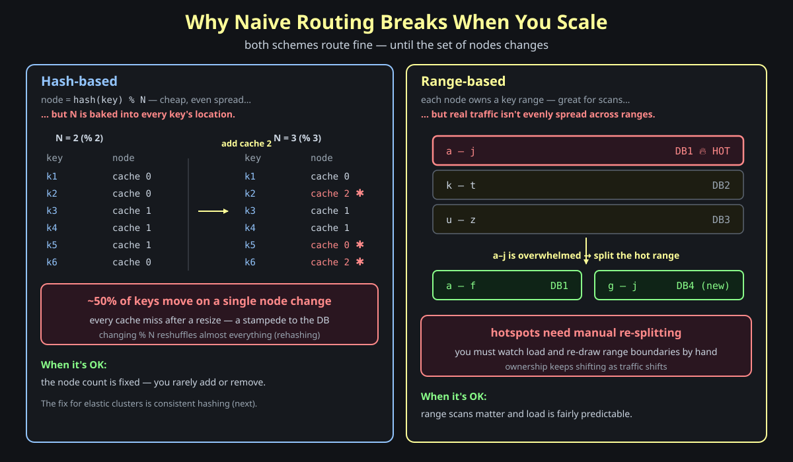

**Hash-based** picks the owner with `node = hash(key) % N`. Cheap, and it spreads keys evenly — but `N` is baked into *every* key's location. Add one node and `N` goes from 2 to 3; recompute every key and roughly **half of them now map somewhere else**. That's not a tweak, it's a near-total <span style="color:#ff8a8a"><strong>rehash</strong></span> — and every moved key is a cache miss, so a resize triggers a stampede to the database. Hash-based is fine *only* when the node count rarely changes.

**Range-based** gives each node a key range (`a–j → DB1`, `k–t → DB2`, `u–z → DB3`) — great for range scans. But real traffic isn't evenly spread across ranges. If `a–j` gets hammered, `DB1` becomes a <span style="color:#ff8a8a"><strong>hotspot</strong></span> and you must re-split by hand (`a–f → DB1`, `g–j → DB4`). Ownership keeps shifting as traffic shifts, and a human keeps re-drawing the boundaries.

Both failures are really the *same* failure: when the set of nodes changes, ownership moves far more than it should. That's the problem consistent hashing is built to solve.

> **Memory hook:** *hash % N rehashes ~50% of keys on any node change; range-based grows hotspots you re-split by hand — both move too much ownership when the cluster resizes.*

---

## Section 10 — Consistent Hashing

**Question: can we add or remove a node and move only a *tiny* fraction of keys, not half of them?**

Yes — **consistent hashing**, the technique that answers *data ownership* with minimal disruption. The trick: hash *both* keys and nodes onto the **same ring**.

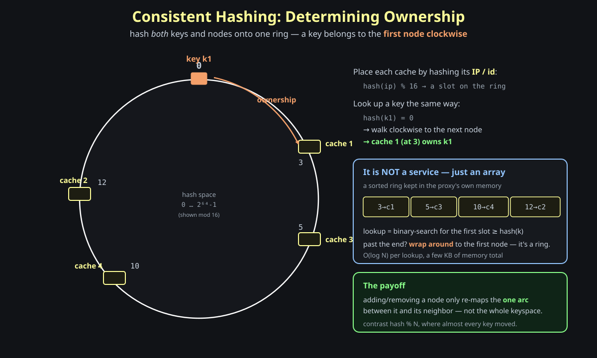

Picture a ring of hash values `0 … 2⁶⁴−1` (shown here mod 16 to keep it small). Place each cache on the ring by hashing its identifier — `hash(ip) % 16` → a slot. So cache 1 lands at 3, cache 3 at 5, cache 4 at 10, cache 2 at 12. Now hash a key the same way: `hash(k1) = 0`. Who owns it? **Walk clockwise to the first node you hit** — that's cache 1 at slot 3. If you walk off the end, you **wrap around** to the first node; it's a ring.

The thing to internalize: **consistent hashing is not a service.** It's a <span style="color:#93c5fd"><strong>simple sorted array in the proxy's own memory</strong></span> (`3→c1, 5→c3, 10→c4, 12→c2`). A lookup is a binary search for the first slot `≥ hash(k)` — `O(log N)` and a few KB of memory, no network call.

Why this beats `hash % N`: adding or removing a node only re-maps the **one arc** between that node and its neighbor. The rest of the ring doesn't move. The 50%-reshuffle from Section 9 becomes a small, local handoff — which is exactly what the next section shows.

> **Memory hook:** *put keys and nodes on one ring; a key is owned by the first node clockwise (wrap at the end); the ring is a sorted array in the proxy, so resizing moves only one arc.*

---

## Section 11 — Scaling the Ring: Adding and Removing Nodes

**Question: a node joins or leaves the ring. Exactly which keys move, and how do we move them without a flood of misses?**

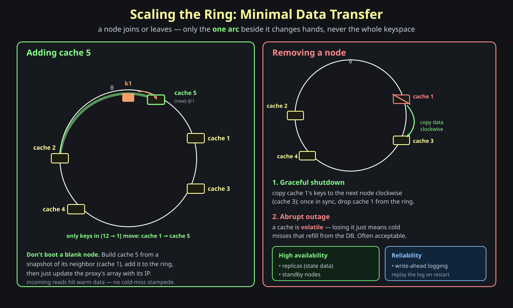

**Adding a node.** Drop cache 5 onto the ring at slot 1. Only keys in the arc *just before* it change hands — the keys that used to belong to cache 1 now belong to cache 5. Everything else stays put. Two practical moves make this clean:

- **Don't boot a blank node.** Build cache 5 from a <span style="color:#8aff8a"><strong>snapshot of its neighbor</strong></span> (cache 1) so it comes up already warm — incoming reads hit data, not a cold-miss stampede.
- **Then just update the proxy's array** with cache 5's slot and IP. The ring is in memory, so "joining" is a tiny edit.

**Removing a node.** Two cases:

1. **Graceful shutdown** — copy the leaving node's keys to the next node clockwise (cache 1 → cache 3), and once they're in sync, drop it from the ring. A controlled handoff, minimal transfer.
2. **Abrupt outage** — it just dies. For a *cache* this is usually tolerable: a cache is <span style="color:#ff8a8a"><strong>volatile</strong></span> by nature, so losing a node means cold misses that refill from the database, not lost source-of-truth data. If you *can't* tolerate that (other use cases, or stateful data), add **high availability** — replicas holding the state and standby nodes — and **reliability** — write-ahead logging you replay on restart.

(One caveat from the notes: **virtual nodes** — placing each physical node at many ring positions to smooth load — are a *bad* fit for stateful caches, because scaling then forces reads from many different nodes. Minimal, contiguous handoffs are what keep the cache cheap to resize.)

> **Memory hook:** *adding/removing a node touches only the neighboring arc; clone from the neighbor's snapshot so the new node is warm; abrupt loss is OK for a volatile cache, else add replicas + WAL.*

---

## Section 12 — Distributed Hash Tables

**Question: zoom out — what *is* this thing we've built?**

A **Distributed Hash Table (DHT)**: a hash table whose buckets live on different machines, mapping values to keys spread across nodes, and tuned for *minimal data movement* when nodes join or leave (the ring trick from Section 10). A distributed cache *is* a DHT under the covers.

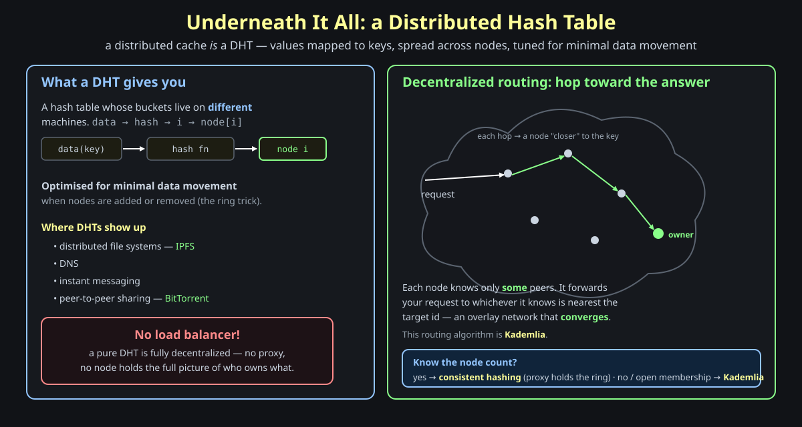

DHTs are everywhere: distributed file systems (**IPFS**), DNS, instant messaging, peer-to-peer sharing (**BitTorrent**). And in the fully decentralized form there's a striking property — **no load balancer at all**. No proxy, and no single node holds the full map of who owns what. Each node knows only *some* peers, so a request **hops** from node to node, each hop landing on a peer "closer" to the target id, until it **converges** on the owner. That overlay-routing algorithm is **Kademlia**.

So which do you reach for?

- **You know the node count** (a cluster you operate) → **consistent hashing**, with the ring held in your proxy. Simple, fast, central.
- **Open / unknown membership** (peers come and go freely, no central authority) → **Kademlia**, where routing is emergent and decentralized.

> **Memory hook:** *a distributed cache is a DHT; known node count → consistent hashing (proxy holds the ring); open membership → Kademlia (peers hop toward the owner, no load balancer).*

---

## Section 13 — Operating the Cluster

**Question: nodes fail and the cluster resizes. Who keeps the ring honest, and how does the client stay fast?**

The proxy *routes*, but it can't be the only moving part. A small **control plane** watches the fleet and keeps the map current.

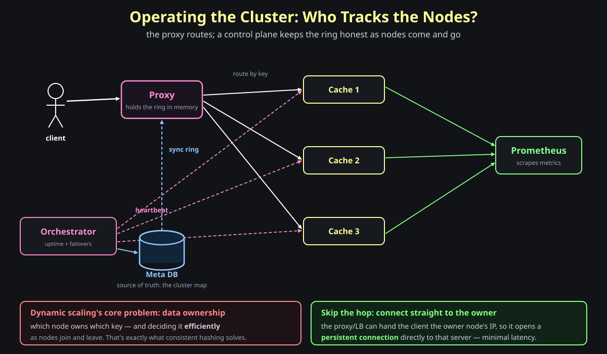

The pieces:

- **Orchestrator** — heartbeats every cache to monitor uptime and drive **failovers**. When a node dies or a new one joins, it writes the updated **cluster map** to the…
- **Meta DB** — the source of truth for *which nodes exist and where they sit on the ring*. The <span style="color:#ff8bd2"><strong>proxy syncs the ring from the Meta DB</strong></span>, so its in-memory array always reflects reality.
- **Prometheus** — scrapes metrics from the caches so the whole fleet is observable.

This is what makes **dynamic scaling up and down** possible, and it surfaces the core problem one more time: <span style="color:#ff8a8a"><strong>data ownership</strong></span> — *which node owns which key*, decided **efficiently** as nodes join and leave. That single question is the spine of the entire distributed design, and consistent hashing is the answer.

One last latency win: the proxy is a hop. For the hot path you can skip it — a load balancer (or the proxy itself) hands the client the **owner node's IP**, and the client opens a <span style="color:#8aff8a"><strong>persistent connection straight to that server</strong></span> (recall Section 4: handshake once, then stream). Direct, warm, minimal latency.

> **Memory hook:** *orchestrator heartbeats + Meta DB hold the cluster map; the proxy syncs the ring from it; the recurring question is always "who owns this key?"; hand the client the owner's IP for a direct persistent connection.*

---

## Where this leaves us

Two passes, one spine. **Part 1** made a single node correct and fast — store as `{type, data}` behind an agreed protocol, stay under a memory cap at the allocator, evict by the access pattern, expire with lazy delete plus an active sweep, and pick a concurrency model knowing a cache is memory-bound. **Part 2** took that node and asked the one new question distribution forces — *which node owns this key?* — and answered it: a proxy fronts the fleet, consistent hashing places keys and nodes on a ring so resizing moves only one arc, and a control plane (orchestrator + Meta DB + metrics) keeps the ring honest while the client connects straight to the owner.

> **Memory hook:** *a single-node cache is storage + memory cap + eviction + expiry + concurrency; making it distributed adds exactly one idea — own each key on exactly one node, and find that node with a consistent-hashing ring.*
