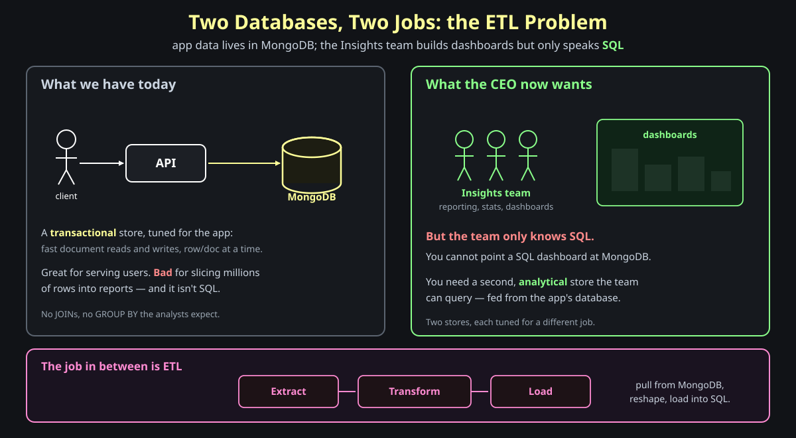
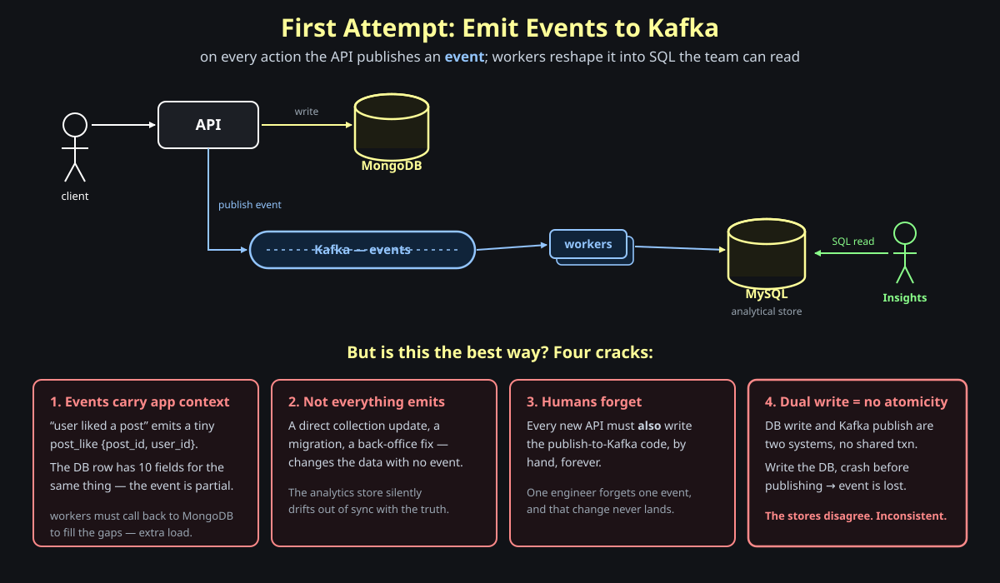
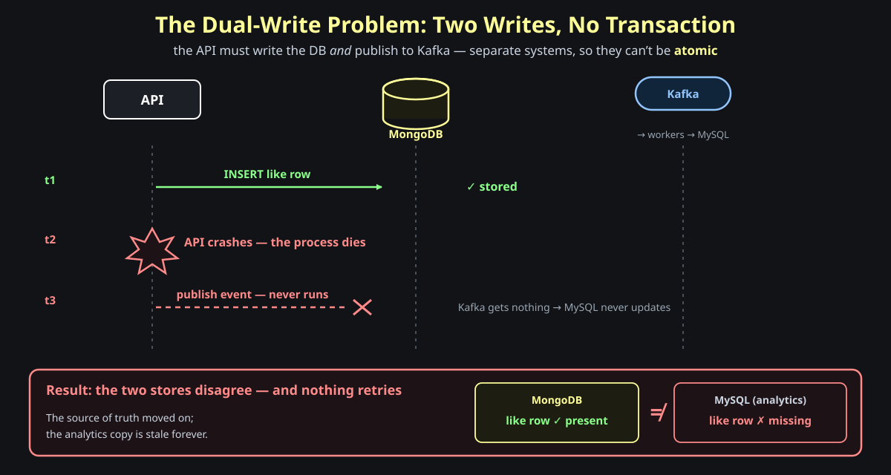
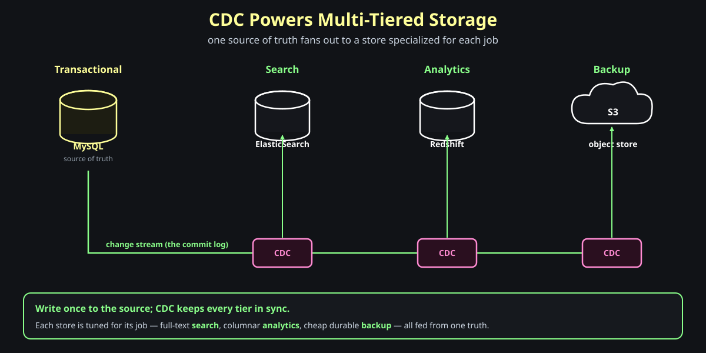

# ETL and Change Data Capture

**Question: your app stores everything in MongoDB, and the CEO just asked for dashboards. The Insights team you hired to build them only knows SQL. How do they query a database that isn't SQL?** Start there. The honest answer forces a second database — and *keeping that second database in sync with the first* is the whole story of this post.

## The setup

You're building a multi-user blogging app. Every action — a new post, an edit, a like — is written to a <strong>transactional database</strong> like MongoDB. It's tuned for the app: fast document reads and writes, one row or document at a time. That's exactly what serving users needs.

Then the app grows. The CEO wants reporting, stats, and dashboards, and you stand up a dedicated <strong>Insights team</strong> to build them. But analysts live in SQL — JOINs, `GROUP BY`, window functions — and you can't point a SQL dashboard at MongoDB. The transactional store is also the wrong *shape* for analytics: great at "fetch this one document," bad at "scan ten million rows and aggregate."

So you need a *second* store, an <strong>analytical</strong> one, fed from the app's database. Two databases, each tuned for a different job.

The work of moving data from one store to the other has a name: <strong>ETL</strong> — **Extract** it from the source, **Transform** it into the shape the destination wants, **Load** it into the analytical store. The rest of this post is really one question: *what should drive that ETL?*

> **Memory hook:** *one database can't be both the app's transactional store and the analysts' SQL warehouse — you need two, and something to keep the second in sync.*

---

## Section 1 — First Attempt: Emit Events to Kafka

**Question: the app already knows when something interesting happens. Why not just announce it?**

The intuitive design: on every action, the API publishes an <strong>event</strong> to Kafka — "user liked a post," "post created." A pool of <strong>workers</strong> consumes those events, reshapes them, and writes rows into MySQL. The Insights team queries MySQL. The app keeps writing to MongoDB exactly as before; the event stream is a second tap off the same actions.

This works, and plenty of systems ship it. But lean on it and four cracks appear.

**1. Events carry only the app's context.** When a user likes a post, the event is a tiny `post_like { post_id, user_id }` — the minimum the app needed to pass around. But the *row* for that like in the database has ten fields: timestamps, source, device, denormalized counters. The event is a partial picture, so the worker has to <strong>call back to MongoDB</strong> to fill in the rest — extra load on the very database you were trying to offload.

**2. Not everything emits an event.** Some changes never go through an API handler that publishes: a direct collection update, a data migration, a back-office fix, a script. Those mutate the data with no event, so the analytical store silently <strong>drifts out of sync</strong> with the truth — a class of bug that simply can't exist if you read the database itself.

**3. Humans forget.** Every new API endpoint must *also* contain the publish-to-Kafka code, written by hand, forever. One engineer ships one endpoint without the event, and that change type never reaches analytics. The coupling is permanent and easy to break.

**4. Dual write has no atomicity.** This is the deep one. The API now writes to *two* systems — the database and Kafka — and they can't share a transaction.

> **Memory hook:** *emitting events means hand-writing a second source of truth — it's partial, incomplete, easy to forget, and impossible to keep atomic.*

---

## Section 2 — The Dual-Write Problem

**Question: the API wrote the row to the database, then crashed before it could publish to Kafka. What is the state of the world now?**

Sit with that for a second. Two separate systems, no shared transaction, so there is a window between the two writes. If the process dies in that window, one write happened and the other didn't.

The database has the like. Kafka never got the event, so MySQL never will. The <strong>source of truth</strong> moved on while the analytics copy stayed behind — and nothing retries, because as far as the crashed process knew, the event was *about* to be sent. The two stores <strong>disagree forever</strong>.

This is the **dual-write problem**: any time you must write to two systems "atomically" without a shared transaction, a failure between the writes leaves them inconsistent. You can patch around it — a transactional outbox, retries with idempotency keys — but each patch adds machinery and more code every engineer must remember to wire up. The cracks all trace back to one root cause: **you made the application responsible for telling everyone what changed.**

> **Memory hook:** *write to the DB and the queue separately, and a crash in between splits them — the dual-write problem has no clean fix while events are hand-emitted.*

---

## Section 3 — Change Data Capture: Tap the Source of Truth

**Question: instead of trusting the application to announce its changes, what if we read the changes straight from the one thing that can't be wrong — the database itself?**

That's <strong>Change Data Capture</strong>. The database already writes every committed change to its own log — the <strong>commit-log / bin-log</strong> (MySQL's binlog, Postgres's WAL, MongoDB's oplog) — because it needs that log for crash recovery and replication anyway. CDC just *tails that log* and turns each committed change into an event. No application code, no second write, no chance to forget.

The shape is simple. CDC pulls the changes from the log and provides a way to <strong>optionally transform</strong> the data and load it into a <strong>sink</strong> database. You get **one event for every change that happened in the database** — every `INSERT`, `UPDATE`, and `DELETE`, at the granularity of a single row or document. Insert, update, or delete something in the `Blogs` table and exactly one CDC event comes out the other side.

Two ways to run it:

- **Off-the-shelf** — tools like <strong>Airbyte</strong> and <strong>Debezium</strong> connect a source to a sink with configuration, not code.
- **Do it yourself** — pick whatever sink fits (<strong>Kafka</strong>, <strong>SQS</strong>, a broker) and build your own complex transformations on the change stream.

Notice what CDC quietly fixes. The event is no longer partial — it carries the full row from the log. There is no change that "doesn't emit," because *every* commit is in the log. Engineers can't forget, because they write no event code at all. And there is no dual write: the application makes exactly **one** write — to the database — and CDC derives everything downstream from that single committed fact.

> **Memory hook:** *don't rely on events, rely on the database — CDC tails the commit log, so one DB write is the only write, and every change is captured.*

---

## Section 4 — Why CDC Closes Every Crack

**Question: line the events approach up against CDC — does reading the log actually answer all four problems?**

It does, and the reason is always the same: the source of truth is the log, not the app code.

| The crack in the events approach | Why CDC closes it |
| --- | --- |
| **Events are partial** — only the app's minimal context | The log holds the <strong>full committed row</strong>; no call-back to the source DB |
| **Not everything emits** — direct updates, migrations slip through | <strong>Every commit is in the log</strong>, no matter how the change was made |
| **Humans forget** the publish code | There is <strong>no publish code</strong> — engineers write none |
| **Dual write** splits DB and queue on a crash | <strong>One write</strong> to the DB; CDC reads it *after* commit, so nothing can desync |

The trade you accept is that CDC is *eventually* consistent — the sink lags the source by however long it takes to read and apply the log. For analytics, search, and backups, that lag is fine. What you bought for it is a pipeline that can't silently lose a change.

> **Memory hook:** *every crack came from trusting the app to report changes; CDC closes all four by reading the committed truth instead.*

---

## Section 5 — CDC Powers Multi-Tiered Storage

**Question: if CDC can feed one analytical store from the source of truth, why stop at one?**

You don't. The real payoff is **multi-tiered storage**: one source of truth fanned out to many stores, each specialized for a different job. The app keeps writing to its transactional database; CDC streams every change to wherever it's useful.

One write to <strong>MySQL</strong>, and CDC keeps each downstream tier current:

- <strong>Search</strong> → ElasticSearch, for full-text queries the transactional DB can't serve.
- <strong>Analytics</strong> → Redshift, a columnar warehouse built for big aggregations.
- <strong>Backup</strong> → S3, cheap durable object storage.

Each store is the right tool for its job, and none of them needs the application to know it exists. Add a new tier later and you add a CDC pipeline, not a new write path through every API handler. This is why CDC shows up constantly in system design — it's the backbone that lets one source of truth quietly feed an entire fleet of specialized stores.

> **Memory hook:** *write once to the source of truth; let CDC fan it out — search, analytics, backup — each tier tuned for its job.*

---

## Section 6 — Implementing CDC with Airbyte

**Question: concretely, what does standing up a CDC pipeline look like — without getting lost in the details?**

You rarely build CDC from scratch. A tool like <strong>Airbyte</strong> turns it into configuration: a **source connector** reads the database's log, a **destination connector** writes the sink, and Airbyte moves the changes between them.

The shape, in four steps:

1. **Connect the source** — point Airbyte at your database and grant it read access to the replication log.
2. **Pick a destination** — the sink: a warehouse for analytics, ElasticSearch for search, S3 for backup, Kafka for downstream streams.
3. **Choose a sync mode** — <strong>full refresh</strong> re-copies every row each run; <strong>incremental / CDC</strong> reads only the new changes from the log. CDC mode is the one that tails inserts, updates, and deletes.
4. **Schedule it** — run continuously or on a cadence. Airbyte handles the extraction, remembers its position in the log, and retries on failure — no app code to maintain.

That's the whole gesture. If you've never run a CDC pipeline, wiring up Airbyte once makes the rest of this concept concrete — and it shows up again and again in later system designs.

> **Memory hook:** *CDC is mostly configuration: connect a source, pick a sink, choose incremental/CDC mode, schedule it — the tool tails the log for you.*

---

## Where this leaves us

The question we started with — *how does a SQL-only team build dashboards on a MongoDB app?* — turned out to be a question about **keeping two databases in sync**. The tempting answer, emitting events from the API, makes the application responsible for reporting its own changes, and that responsibility cracks four ways: events are partial, some changes never emit, engineers forget, and the dual write splits on a crash.

<strong>Change Data Capture</strong> moves that responsibility off the application and onto the one component that already records every change correctly — the database's own commit log. Read the log, not the app. From that single idea you get partial-free events, nothing missed, no publish code to forget, no dual write — and, almost for free, the ability to fan one source of truth out into search, analytics, and backup tiers.

> **Memory hook:** *the app's job is to write the database; CDC's job is to read its log and feed everything else — stop trusting events, rely on the source of truth.*
