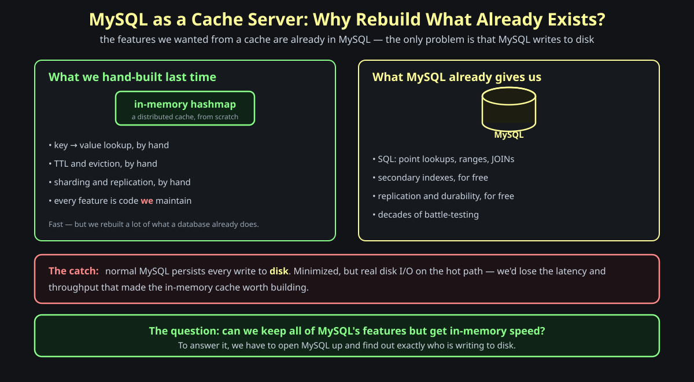
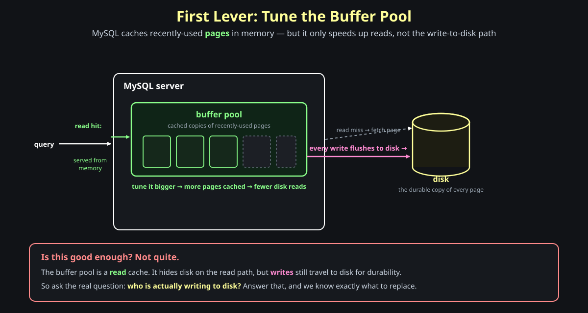

# MySQL as a Cache Server

**Question: in the last post we built a distributed cache as an in-memory hashmap — by hand. But every feature we wanted from it (fast lookups, TTL, indexes) already exists in MySQL. So why write the hashmap at all? Why not just use MySQL?** The honest answer pulls us all the way down into how a database is built — and once we're there, turning MySQL into a cache is a one-line change.

## The setup

You want a cache. The previous design hand-built one: an <span style="color:#8aff8a"><strong>in-memory hashmap</strong></span>, with key→value lookup, eviction, and sharding all written from scratch. It's fast, but you rebuilt a lot of machinery that a database already ships.

Look at what MySQL gives you for free: SQL lookups and range scans, secondary <span style="color:#ffff99"><strong>indexes</strong></span>, replication, durability, decades of battle-testing. If you could use MySQL *as* the cache, you'd inherit all of it instead of reimplementing it.

So why not? Because normal MySQL persists every write to <span style="color:#ffff99"><strong>disk</strong></span>. The disk I/O is minimized, but it's real, and it sits on the hot path — exactly the latency and throughput cost the in-memory cache existed to avoid.



That's the whole tension: **we want MySQL's features without MySQL's disk.** This post answers it by opening MySQL up, layer by layer, until we find the exact part responsible for the disk — and replace just that part.

> **Memory hook:** *the cache features you want are already in MySQL; the only thing in the way is that it writes to disk — so find what writes to disk, and swap it.*

---

## Section 1 — First Lever: Tune the Buffer Pool

**Question: MySQL already keeps recently-used data in memory. Can we just make that memory bigger and call it a cache?**

MySQL reads and writes data in fixed-size <span style="color:#8aff8a"><strong>pages</strong></span>, and it keeps copies of recently-used pages in an in-memory <span style="color:#8aff8a"><strong>buffer pool</strong></span>. Tune the buffer pool larger and more of your working set stays cached, so reads that hit the pool never touch disk. That's the first lever, and it's a real one.



But is it good enough? Not quite — and the reason is the key to the whole post. The buffer pool is a <span style="color:#8aff8a"><strong>read</strong></span> cache. It hides disk latency when you're *reading* a page you've touched before. But every <span style="color:#ff8bd2"><strong>write</strong></span> still travels to disk, because that's how MySQL keeps your data durable across a crash.

So tuning the buffer pool gets us part way and then stops. To go further we have to ask the question it raises: **who is actually writing to disk?** Whoever that is, *that's* the component we need to replace.

> **Memory hook:** *the buffer pool caches reads, not writes — to make MySQL a cache you have to change the thing that writes to disk, not just grow the read cache.*

---

## Section 2 — How a Database Actually Works: Four Pluggable Layers

**Question: when you send `SELECT * FROM users` to MySQL, what actually happens to that string between "you hit enter" and "rows come back"?**

This is the most important idea in the post, and it's true of essentially every database, not just MySQL. A query falls through four layers, and **each one is a swappable contract**, not a welded-in block of code.


Walk the four layers top to bottom:

1. **Protocol.** You talk to the database in a language it understands. For a relational database that language is <span style="color:#93c5fd"><strong>SQL</strong></span>. The protocol layer receives the raw query text.
2. **Query parser.** The parser reads that SQL and turns it into an <span style="color:#93c5fd"><strong>abstract syntax tree</strong></span> (AST) — a structured representation the rest of the engine can reason about.
3. **Query optimizer.** It takes the AST and produces an <span style="color:#93c5fd"><strong>evaluation plan</strong></span>: the concrete sequence of steps to run, chosen to do the least work.
4. **Storage engine.** The plan eventually calls down to the storage engine through a fixed *read page / write page* API. This layer decides <span style="color:#ffff99"><strong>where the bytes physically live</strong></span> — disk, memory, or somewhere else.

Now the part that makes all of this useful: **none of these layers is fused to the others.** Each is a contract you can replace. Want a different SQL dialect? Write your own parser in C, pluck out the default, and drop yours in. You compile it into a <span style="color:#93c5fd"><strong>shared object</strong></span> — a `lib/my.so` file — and the database loads it *dynamically* at runtime, calling into your code instead of the built-in layer. No fork of the database, no recompiling MySQL itself.

That pluggability is the lever. We don't want to touch the protocol, parser, or optimizer — our SQL is fine. We want to change exactly one layer: **the storage engine**, because that's the layer that decides whether a write lands on disk or in memory.

> **Memory hook:** *protocol → parser → optimizer → storage engine; every layer is a swappable `.so`, and the one that owns the disk is the storage engine.*

---

## Section 3 — The Query Optimizer, Up Close

**Question: a query joins three tables. Does the order MySQL joins them in matter — and who decides it?**

It matters enormously, and the <span style="color:#93c5fd"><strong>optimizer</strong></span> decides it. This is worth one detour because it's the clearest example of a layer "doing the least work," and it too is swappable.


Join three tables and there are `3! = 6` possible orders to combine them. Each order touches a wildly different number of rows. Suppose table **B** has 5 rows, **A** has 1,000, and **C** has 1,000,000. If you start the join by scanning <span style="color:#ff8a8a"><strong>C first</strong></span>, you drag a million rows through the rest of the plan — enormous intermediate results, enormous disk I/O. If you start with <span style="color:#8aff8a"><strong>B first</strong></span> — the smallest, most selective "driving table" — and use indexes to join A and C, the intermediate results stay tiny.

That sequence of steps — *scan B, join A on its index, join C on its index* — is what an **evaluation plan** looks like. The optimizer is <span style="color:#ffff99"><strong>cost-based</strong></span>: it estimates the cost of each candidate order from <span style="color:#ffff99"><strong>cardinality</strong></span> (the row counts) and index statistics, then picks the cheapest. And like every layer here, it's not sacred — you can <span style="color:#93c5fd"><strong>turn it off</strong></span> to force a join order, or pluck it out entirely and supply your own evaluation plan.

> **Memory hook:** *N tables means N! join orders; the optimizer reads cardinality and drives with the smallest table — and you can override its plan whenever you know better.*

---

## Section 4 — The Storage Engine: One API, Many Implementations

**Question: we found the layer that owns the disk. What exactly is the contract it implements — and what happens if we swap a different implementation underneath it?**

This is where MySQL becomes a cache. The evaluator doesn't write to disk itself; it calls the storage engine through a <span style="color:#ffffff"><strong>fixed API</strong></span> — open a table, `write_row`, `rnd_next` (read the next row), `delete_row`, read and write pages. The API defines *how* rows and pages move in and out. It says nothing about *where* they live. That's the implementation's choice.


Because it's just an API, anyone can implement it, and MySQL ships several implementations you can choose between:

- <span style="color:#ffff99"><strong>InnoDB</strong></span> — the default. It stores rows in a B+ tree and <span style="color:#ffff99"><strong>writes to disk</strong></span>. Durable, ACID, crash-safe. This is the engine doing all that disk I/O we traced in Section 1.
- <span style="color:#8aff8a"><strong>MEMORY engine</strong></span> — stores rows in an <span style="color:#8aff8a"><strong>in-memory dictionary</strong></span> and writes to RAM. Blazing fast, but <span style="color:#ff8a8a"><strong>volatile</strong></span>: when the server restarts, the table is gone. Plug this in and the same SQL now lives entirely in memory.
- <span style="color:#93c5fd"><strong>CSV engine</strong></span> — stores each table as one plain `.csv` file on disk, one file per table.

The point is what *doesn't* change. The protocol, the parser, the optimizer, your SQL — all identical. You **pluck out InnoDB and plug in the MEMORY engine**, and the table's bytes move from disk to RAM. Nothing above the storage engine notices. That is MySQL as a cache: not a new system, just a different bottom layer.

The CSV engine looks like a toy until you see its use. Because each table *is* literally a CSV file, the data you see in a viewer is the file on disk — and a non-technical teammate who lives in Excel can open `users.csv`, edit a few rows, save, and those edits are now in the database. The storage engine is the seam where "a table" and "a file my colleague can edit" become the same thing.

> **Memory hook:** *the storage engine is a fixed read/write API; swap InnoDB for MEMORY and the same SQL runs in RAM — MySQL becomes a cache with no code above it changing.*

---

## Section 5 — Where to Switch: Per-Table Engine, a Real 3× Win

**Question: do you have to turn your whole database into a volatile in-memory store to get this benefit? What if only a few tables are the problem?**

You don't, and they usually are. The storage engine is configurable **per table**, so you can keep most of your database safely on InnoDB and move only the tables that hurt.


Here's the real case. One table — call it `config` — was small and <span style="color:#ffff99"><strong>near-static</strong></span>, but it was <span style="color:#ff8a8a"><strong>joined into almost every query</strong></span>. On InnoDB, every one of those joins re-read its pages, generating a steady stream of disk I/O for data that barely ever changed. So the question almost asks itself: <span style="color:#8aff8a"><strong>why not keep it in memory forever?</strong></span>

The change is one statement:

```sql
ALTER TABLE config ENGINE = MEMORY;
```

`users`, `posts`, and `orders` stay on disk; only `config` moves to RAM. No application code changes — the SQL is identical. The joins now hit memory instead of disk, and the queries ran roughly <span style="color:#8aff8a"><strong>3× faster</strong></span>.

The one trade you accept is volatility: because the MEMORY engine holds the table in RAM, a restart leaves it <span style="color:#ff8a8a"><strong>empty</strong></span>. You cover that with a <span style="color:#93c5fd"><strong>background job</strong></span> that reloads the table from the source of truth on startup. That's the entire cost of this kind of caching — and notice what you *didn't* build: no separate cache server, no key→value mapping by hand, no cache-invalidation logic. Just MySQL keeping the right tables in memory.

> **Memory hook:** *set the engine per table — move the small, near-static, heavily-joined tables to MEMORY, cover the volatility with a reload job, and pay one `ALTER TABLE` for a 3× win.*

---

## Where this leaves us

We started wanting a cache and asking why we'd hand-build a hashmap when MySQL already has every feature we wanted. The block was a single fact: MySQL writes to <span style="color:#ffff99"><strong>disk</strong></span>. Tuning the <span style="color:#8aff8a"><strong>buffer pool</strong></span> only cached reads, which told us the disk write itself was owned by a deeper layer.

Opening the database revealed four <span style="color:#93c5fd"><strong>pluggable layers</strong></span> — protocol, parser, optimizer, storage engine — and that the last one, the <span style="color:#ffff99"><strong>storage engine</strong></span>, is a fixed read/write API with interchangeable implementations. Swap <span style="color:#ffff99"><strong>InnoDB</strong></span> for the <span style="color:#8aff8a"><strong>MEMORY engine</strong></span> and the same SQL runs in RAM. Do it <span style="color:#8aff8a"><strong>per table</strong></span>, only where a hot, near-static table is causing needless disk I/O, and you buy a large speedup for one `ALTER TABLE` and a reload job — no new system to operate.

> **Memory hook:** *MySQL as a cache isn't a new database — it's the same database with its bottom layer swapped: keep the SQL, move the hot tables into the MEMORY engine, and let a reload job cover the volatility.*
