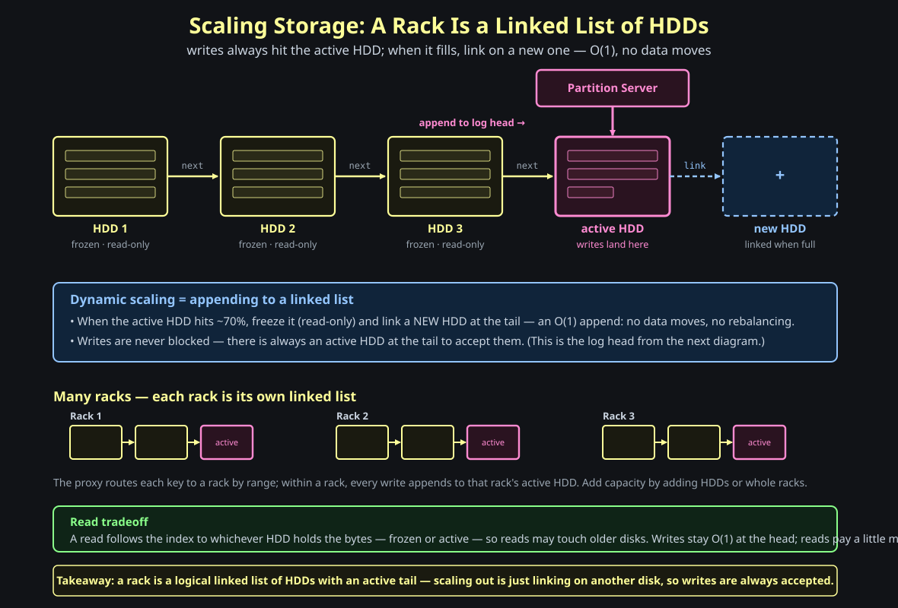

# Designing S3: A File Store That Scales Forever

This post builds Amazon S3 from first principles: a flat key-value store where the key is an object path and the value is a blob. Starting from one hard disk on one machine, it grows each component only when a named bottleneck appears: stateless API servers for request load, range partitions for routing and hot-key isolation, a partition control plane for logical ownership and failover, log-structured HDD storage for cheap capacity, and replication plus checksums for durability and integrity.

**Question: you have to store an unbounded number of files for millions of strangers, on the cheapest hardware you can buy, and you may *never* lose a file or return a wrong one. No "just use a database." You own the routing, the partitioning, the disks, and the crash recovery. What is the smallest design that is correct on day zero — and what is the *next* thing that breaks every time you 10× it?** The honest path runs straight through one HDD, a load balancer, three different ways to route a request, a control plane that owns partitions, and a log-structured storage tier — and by the end you've hand-built [Amazon S3](https://www.allthingsdistributed.com/2023/07/building-and-operating-a-pretty-big-storage-system.html), the service that stores hundreds of trillions of objects at [eleven nines of durability](https://docs.aws.amazon.com/AmazonS3/latest/userguide/DataDurability.html).

This is the third post in a small arc. We built a [word dictionary on S3](18-storage-engine-word-dictionary.md) and leaned on it as cheap, cold, embedded storage; we built a [Bitcask-style key-value engine](19-storage-engine-fast-kv-db.md) and learned why high-write systems go log-structured. S3 is where both ideas come home: it is, underneath all the distribution, **just a key-value store** — and its disks are **just a log**.

> **Memory hook:** *S3 is a key-value store where the key is a path and the value is a blob — everything hard about it comes from making that one idea cheap, infinite, and indestructible.*

---

## The brief

**Question: before drawing a single box — what is S3, in one sentence, stripped of all the marketing?**

S3's public API is almost insultingly small: <strong>`PUT(path, blob)`</strong>, <strong>`GET(path)`</strong>, <strong>`DELETE(path)`</strong>. You hand it a path and a pile of bytes; later you hand it the same path and get the bytes back. That is a <strong>key-value store</strong> where the key is a string and the value is a blob. Every operation touches exactly one key — no ranges, no scans, no joins — which is the same gift the [Bitcask post](19-storage-engine-fast-kv-db.md) leaned on, now at planetary scale.

The requirements are three words: **blob storage**, **network file system**, **scalable and cheap**. "Blob" means the value is opaque — S3 never looks inside your file. "Network file system" means it is reachable by URL from anywhere, behaving like one infinite shared disk. "Cheap" is not a nice-to-have; it is a hard design constraint that will force us onto <strong>commodity spinning disks</strong> and shape the entire storage layer.

Three things are genuinely hard, and the rest of the post is just attacking them in order: <strong>storage</strong> (infinite space from finite disks), <strong>access / routing</strong> (which of thousands of disks holds this one key?), and <strong>hot partitions</strong> (one popular bucket must not melt one node).

And one insight reframes everything — the most important design decision in the whole system. **A directory is a logical, virtual entity.** There is no folder tree on disk. The slashes in `images/logo.jpg` are just characters in a flat key. A "bucket" is a naming convention, not a place. Once you accept that everything is <strong>path-based</strong> and flat, routing becomes a question about strings, not about a filesystem.

So how do you *browse* a folder, if folders don't exist? You don't open a directory — there's nothing to open. You ask the API to **list every key that starts with a prefix**:

- <strong>`LIST(prefix = "photos/2024/")`</strong> returns every object key in that slice of the keyspace.
- The trailing `/` is just a **delimiter convention** that lets the API roll keys up into one "folder level."
- The folder tree you see in the console is **reconstructed from key prefixes on the fly** — it was never stored as a tree.

This is why keeping keys **sorted** will matter so much later: a prefix is a *contiguous slice* of a sorted keyspace, so "browse this directory" becomes a cheap <strong>prefix scan</strong> instead of a fan-out across every disk.

> **Memory hook:** *the API is PUT/GET/DELETE on one path; browsing a "folder" is a prefix scan, not a tree walk; the three hard problems are storage, routing, and hot partitions; and the unlock is that directories are fake — it's all one flat keyspace of paths.*

### Buckets and "folders": both are naming conventions, not places

We just said directories are fake. The same truth holds one level up, at the <strong>bucket</strong> — the **top-level namespace** for your keys, the first segment of every path. When you store:

`s3://my-photos/2024/summer/cat.jpg`

the real key S3 keeps is the flat string `2024/summer/cat.jpg`, and `my-photos` is the **bucket** that scopes it. There is no `my-photos` folder, and no `2024/` or `summer/` folder, anywhere on disk — it's one flat key, and the bucket is just the prefix that says "this key belongs to this namespace." What the bucket actually buys you:

- **Uniqueness scope** — keys must be unique *within* a bucket, so your `cat.jpg` never collides with mine. (Bucket names themselves are globally unique, which is what makes the URL routable.)
- **A unit of config** — permissions, region, billing, versioning, and lifecycle rules all attach at the bucket level.
- **A cheap prefix scan** — "list my bucket" is just `LIST(prefix="…")` over a contiguous slice of the sorted keyspace, reconstructed on the fly — never a folder you open.

So **a directory is a logical, virtual entity — and a bucket is too.** Both are labels that *group and scope* keys, not places that *hold* them.

### How a real filesystem does it: inodes

If folders are fake in S3, how does a *real* filesystem (ext4 and friends) find your file? Through an <strong>inode</strong> — a small record holding everything about a file **except its name**: size, permissions, timestamps, and crucially the **pointers to the disk blocks** that hold the actual bytes. A **directory** is then just a tiny table mapping **names → inode numbers**.

So "open `cat.jpg`" really means: look up `cat.jpg` in the directory to get an inode number → read that inode to find the data blocks → read the blocks. The name and the data are **decoupled**, which is why you can rename a file, or hard-link two names to one inode, without moving a single byte. S3's design rhymes with this: the [PMT plus the partition server's index](#section-8--who-knows-where-things-live-the-partition-map-table-and-partition-manager) play the inode's role — mapping a key to *where the bytes physically live* — while the path is just a name. S3 took the filesystem's "names are separate from locations" trick and stretched it across a planet.

### The vocabulary, in one place

- <strong>Object</strong> — one file: the *value*. Opaque bytes S3 never looks inside.
- <strong>Key</strong> — the full path string that *names* an object (`bucket/images/logo.jpg`). The thing you hash or range-partition on.
- <strong>Bucket</strong> — the top-level namespace/prefix that scopes keys (above).
- <strong>Partition</strong> — a contiguous *range* of the sorted keyspace (`[a,e]`), owned by one partition server. Emphasis on **how the data is divided**.
- <strong>Shard</strong> — the same slice seen as the **unit you place and move** between machines. *Partition = how it's split; shard = what you move — same thing, two angles.*
- <strong>Node</strong> — one **physical machine** (a box of disks + CPU) in the fleet. Partitions/shards are the *logical* slices; nodes are the *physical* hardware they sit on. The PMT maps a partition to the node currently holding it (`[a,b] → Node 1`), and "move a shard" / "a node died" are about this physical layer. *Logical (partition) vs. physical (node) is the split that makes failover a table edit.*
- <strong>Replica</strong> — a *copy* of a partition/shard for durability, **not** a different slice. Sharding spreads load; replication survives failure.
- <strong>Tenant</strong> — one customer of a shared (multi-tenant) service. S3 serves millions of tenants off the same fleet.
- <strong>Tenant isolation</strong> — keeping one tenant's workload from hurting another's. A noisy tenant's traffic spike should not degrade everyone sharing the hardware. The measure of it is <strong>blast radius</strong>: when one tenant misbehaves, how many others feel it? This is *the* requirement that kills hash routing (which scatters every tenant across all disks, so one spike hits everyone) and picks **range partitioning** (a tenant's keys share a prefix → fall in one contiguous range → can be put on their own partition, so the blast radius is just that one tenant). It's also why hot partitions get **split** and abusive accounts get **throttled** ([Sections 5–6](#section-5--attempt-3-range-based-partitioning-the-one-s3-uses)).
- <strong>Hot partition</strong> — one partition taking far more traffic than it can serve, while its neighbors idle: a celebrity bucket the whole internet pulls from, or a single hammered key. The skew, not the average, is the problem — load is uneven across the keyspace, so one node melts while the fleet sits cool. The structural cure is to **split** the hot range into two disjoint ranges on two nodes (trivial because ranges are contiguous). See [Section 6](#section-6--hot-partitions-split-and-throttle).
- <strong>Throttle</strong> — capping a tenant's request rate and rejecting the excess with a "slow down" signal (`503 SlowDown`) instead of letting it take a node down. It's the *immediate* shield while a split is still in flight — the bandage, not the cure. It lives on the **partition server**, not the API fleet: only the range's owner sees all of one tenant's traffic, so only it can count per-tenant and rate-limit precisely. See [Section 6](#section-6--hot-partitions-split-and-throttle).

### How it all nests: tenant → buckets → partitions

These three terms trip people up because they sit on *different axes*. One concrete example untangles them. Say **Lyft** has one S3 account — that's one <strong>tenant</strong>. Under it, Lyft creates many <strong>buckets</strong>, one per dataset: `driver-photo/`, `rider-photo/`, `driver-pay/`, `rider-pay/`, `ride-history/`, `ml-model/`. And each bucket, as it fills up or gets hot, is sliced into many <strong>partitions</strong> — contiguous key ranges served on different machines.

The four rules that actually matter:

- **One tenant → many buckets.** Lyft owns all six.
- **One bucket → exactly one owner.** `ride-history/` belongs to Lyft and only Lyft; a bucket is *never* shared across tenants.
- **One bucket → many partitions.** `ride-history/` might be `partition 1 [a–h]`, `partition 2 [i–p]`, `partition 3 [q–z]` — and it splits into more as it grows or heats.
- **One partition → never two buckets.** A partition is a range *inside one bucket*; the bucket boundary is always a split point, so `driver-pay/` and `rider-pay/` can never share a partition. That's exactly what keeps one dataset's load from leaking into another's.

> **Memory hook:** *tenant owns many buckets; a bucket has one owner and splits into many partitions; a partition lives inside exactly one bucket. Tenant = who, bucket = the named dataset, partition = a key-range slice of it.*

---

## Section 1 — Day Zero: S3 on One Laptop

**Question: forget distribution. What is the absolute smallest thing that already *is* S3 — something you could build this afternoon on one machine?**

Strip away every "distributed" word and S3 is a <strong>static file server</strong>. Take one computer, plug in a hard disk over USB, and run a small program that exposes four operations — create, read, write, delete — over HTTP. That's it. That program is the entire system.

A request like `GET s3://bucket.s3.aws.com/images/logo.jpg` does exactly what your intuition says: it arrives at the <strong>API server</strong>, which walks to <strong>storage</strong>, finds the file at the location the path names, and returns the bytes. A `PUT` writes a file; a `DELETE` removes it. There is no magic here, and that is the point: **the data model never gets more complicated than this.** Everything we add from now on exists only to keep this simple behavior working as the numbers explode.

So let's explode the first number. One disk fills up, or one disk dies. **What's the next stage of evolution?** The dumbest possible answer is the right one: <strong>plug in a second HDD</strong>. Now we have two disks and one immediate new problem — when a file comes in, which disk does it go on, and when a read comes in, which disk do we look at? Hold that question; it becomes *the* question.

> **Memory hook:** *S3 on day zero is a static file server: an HTTP API in front of one disk. Adding the second disk is what creates every interesting problem that follows.*

---

## Section 2 — Splitting the Two Jobs: API Scales, Storage Scales, Separately

**Question: one computer can't serve all the requests *and* hold all the files forever. When you add machines, what is the one structural mistake that will haunt you if you get it wrong on day one?**

The instinct is "add more computers, each with its own disks." That's the trap. If every machine owns both the serving *and* the storing, then the file you want is stuck on whichever machine happens to hold it, and a burst of traffic to that one file melts that one machine while the others sit idle. The two jobs scale for **completely different reasons** — serving scales with *request rate*, storage scales with *bytes* — so they must scale independently.

The fix is to **split the system into two planes** that grow on their own axes:

- A <strong>stateless API tier</strong>: a fleet of identical S3 API servers behind a <strong>load balancer</strong>. They hold no files. Any server can handle any request, so you scale request throughput by simply adding more of them. (This is exactly the [load balancer](06-distributed-load-balancer.md) story from earlier in the handbook.)
- A <strong>shared storage tier</strong>: central, network-attached, holding the actual bytes. You scale capacity by adding disks.

This split is the spine of S3. The API servers are cattle — interchangeable, disposable, horizontally scaled. The storage is the precious thing they all read from and write to. Now the obvious next question stares at us: that "central storage" is one box in the drawing, but it can't be one box in reality. **How do we turn a pile of finite disks into one infinite store — and how does an API server know which disk holds a given key?** That second half is the routing problem, and it's deep enough to deserve three sections.

> **Memory hook:** *split serving from storing. Stateless API servers behind a load balancer scale with traffic; shared storage scales with bytes. Never let one machine own both for the same data.*

---

## Section 3 — The Routing Problem, Attempt 1: Hash-Based Routing

**Question: storage is now a rack of disks — say twenty HDDs, 10 TB each. A `PUT` arrives for `bucket/images/logo.jpg`. Which disk does it go on, and how will a later `GET` find that exact same disk without asking all twenty?**

This is the heart of the system. Remember the unlock: there are no real directories, just a flat key (the path). So routing is a pure function: given a string, pick a disk. The first idea everyone reaches for is to <strong>hash the path</strong>.

The scheme is dead simple: compute `hash(path) % N` where `N` is the number of disks, and that's your disk — for both writes and reads. Because the function is deterministic, a `GET` recomputes the same number and lands on the same disk a `PUT` chose. No broadcast, no lookup table.

The <strong>advantages</strong> are real: near-random, near-uniform spread across all disks, and **zero configuration** — the formula decides everything. For many systems this is enough. But for S3 it has three <strong>fatal flaws</strong>:

- **Rebalancing storms.** The moment `N` changes — a disk is added, or one dies — `% N` becomes `% (N±1)` and the answer changes for *almost every key*. Nearly all data has to physically move. At exabyte scale this is a non-starter.
- **No locality.** Files in the same bucket scatter across every disk. A customer listing their bucket touches the whole fleet.
- **No tenant isolation.** This is the killer. Files from many customers share each disk, so <strong>one customer's traffic spike degrades everyone</strong> on that disk. In a multi-tenant service, that's unacceptable.

Hashing buys uniformity by *surrendering control*. We want the opposite: control over where data lives. But before we fix that, there's a well-known patch for just the first flaw.

> **Memory hook:** *hash(path) % N picks a disk with zero config and perfect spread — but changing N reshuffles everything, and it can neither keep one tenant together nor keep tenants apart.*

---

## Section 4 — Attempt 2: Consistent Hashing

**Question: the rebalancing storm came from `% N` — every key's home depends on the *total count* of disks. Can we hash in a way where adding or removing one disk only moves the keys near *that* disk, and leaves everyone else alone?**

Yes — that's exactly what <strong>consistent hashing</strong> was invented for, and it's the same ring we used in the [distributed KV store](04-database-distributed-kv-store-on-relational-database.md). Map both the disks *and* the keys onto one circular hash space. A key is owned by the first disk you meet walking clockwise from where the key lands.

The win is precise. When a disk joins or leaves, only the keys in the <strong>one arc</strong> next to it move; everyone else stays put. The rebalancing storm is gone, and the distribution is still near-uniform. This is why consistent hashing shows up in Dynamo, Cassandra, and countless caches.

But notice what it *didn't* fix. It's still a hash, so it still <strong>scatters a tenant's files</strong> around the ring (`a/b.png` on HDD1, `a/c.png` on HDD2), and it still gives <strong>no tenant isolation</strong> — a hot key still hammers whichever node owns it, and that node's neighbors feel it. We solved elasticity but not control. For S3, control is the requirement we keep circling back to. So we abandon hashing entirely.

> **Memory hook:** *consistent hashing = keys and nodes on a ring, clockwise node owns the key. Adding/removing a node moves only one arc — elasticity solved — but it still scatters tenants and still can't isolate load.*

---

## Section 5 — Attempt 3: Range-Based Partitioning (the one S3 uses)

**Question: both hashing schemes destroy locality on purpose — that's *why* they spread evenly. But S3 needs the opposite: a tenant's data kept together, and one tenant kept away from another. What if we just... didn't hash, and assigned *contiguous ranges* of the keyspace to nodes instead?**

That's <strong>range-based partitioning</strong>, and it's the decision real S3 makes. Keep the keys in their natural <strong>sorted (lexicographic) order</strong> and chop that ordered space into contiguous ranges — `[a,e]`, `[f,h]`, `[i,k]`, and so on. Each range is a <strong>partition</strong>, and each partition lives on a node.

Now the properties flip in our favor:

- <strong>Locality.</strong> Keys that sort together live together. `amzn/images/a.jpg` and `amzn/images/b.jpg` are neighbors on the same partition, so listing a bucket or scanning a prefix is cheap and local.
- <strong>Tenant isolation.</strong> Because a tenant's keys share a prefix, they fall in a contiguous range — so you can deliberately put a noisy tenant on its own partition and stop it from hurting anyone else.
- <strong>Control.</strong> You decide where ranges go, instead of surrendering that to a hash function.

This is also exactly how real S3 behaves: object keys are stored in [lexicographic (UTF-8) order](https://docs.aws.amazon.com/AmazonS3/latest/userguide/optimizing-performance.html) and the index is partitioned by key range. It's why the old advice was to add a random prefix to your keys — and why that advice is now obsolete: S3 auto-partitions hot ranges for you. We trade automatic uniformity for deliberate control, and for a multi-tenant store, control wins. But control has a cost: ranges can become uneven. One range can get *hot*.

**The clean way to hold all three strategies in your head — match the strategy to what you're routing:**

- <strong>Hash is for stateless work.</strong> Load balancers and API servers hash to spread requests *uniformly* across interchangeable machines — there you *want* to give up control and just smear load evenly.
- <strong>Range is for stateful placement.</strong> When you must dictate *where data physically lives* — drop a new HDD exactly where you want it, keep a tenant together, split a range cleanly — a hash function simply can't give you that control. Ranges can.

And the tenant-isolation win is really about <strong>blast radius</strong>: with hashing, a hot bucket shares disks with many other tenants, so one company's spike hurts all of them; with ranges, a hot bucket sits in its own range, so the blast radius is just that one tenant.

> **Memory hook:** *range partitioning keeps keys sorted and gives contiguous ranges to nodes — buying locality, tenant isolation, and control, at the price of ranges that can grow lopsided and hot. Hash for stateless load-spreading; range for stateful placement you need to control.*

---

## Section 6 — Hot Partitions: Split, and Throttle

**Question: a celebrity uploads to one bucket and the whole internet pulls from it. That bucket's range is now a furnace while its neighbors idle. With contiguous ranges, what's the natural move to cool it down — and what do you do while the cooling happens?**

Here range partitioning pays off beautifully, because the fix is almost trivial: **when a partition gets hot, split it in two.** Take the hot range `[l,r]` and cut it into two <strong>mutually exclusive</strong> halves, `[l,m]` and `[n,r]`, and move one half to a fresh node. Two nodes now share what one was drowning in. Because ranges are contiguous and ordered, the split is a clean cut with no key left ambiguous — something that's painful with a hash.

The structural fix is the <strong>split</strong>; it permanently spreads the load. But a split takes time, so we need an immediate shield: <strong>throttling</strong>. Cap requests per account, and when a tenant exceeds its limit, reject the excess with a "slow down" signal rather than letting it take the node down with it.

And the throttle belongs on the <strong>partition server</strong>, not the API server — this is the whole payoff of range partitioning showing up again. The stateless API fleet is the wrong place to rate-limit: any client's requests can land on any API server, so no single one sees a tenant's full request rate — the traffic for one hot bucket is smeared across the whole fleet, and no node has the local count needed to decide "this account is over its limit." The partition server is the opposite: it's the single owner of a contiguous range, so *every* request for that bucket's prefix funnels through it. It already knows exactly which partition and account each request belongs to, which means it's the one place that can keep an accurate per-tenant counter and throttle precisely the tenant that's hot — without touching anyone else. Ownership of a range is also ownership of that range's rate limit.

This is precisely how production S3 works. Each partitioned prefix sustains about [3,500 writes and 5,500 reads per second](https://docs.aws.amazon.com/AmazonS3/latest/userguide/optimizing-performance.html), there's no limit on the number of prefixes, and S3 <strong>auto-splits hot partitions</strong> behind the scenes — a process that takes 30–60 minutes, during which you may see `503 SlowDown` while the new partitioning settles. Splitting is the permanent cure; throttling is the bandage that holds until the cure takes effect.

> **Memory hook:** *hot range? split it into two disjoint ranges on two nodes — trivial because ranges are contiguous — and throttle per account (503 SlowDown) while the split is in flight. Throttle on the partition server, not the API fleet: only the range's owner sees all of a tenant's traffic, so only it can count per-tenant and rate-limit precisely.*

---

## Section 7 — A Quick Detour: Many Logical Shards on Few Machines

**Question: splitting a live partition means physically moving data while traffic flows over it — fiddly and slow. Is there a way to make rebalancing almost free, so moving load between machines doesn't mean re-cutting ranges at all?**

There's a classic trick worth a short detour, because it shapes the design that follows. Instead of a few big partitions that you split under pressure, create a **large number of small logical shards up front** and pack many of them onto each physical machine.

Now the <strong>unit of movement is a whole shard</strong>, not a key and not a range you have to re-cut. To cool a hot machine, you pick up one of its logical shards and drop it on a quieter machine. That's it. Moving a <strong>self-contained, mutually-exclusive subset</strong> of data is dramatically simpler than splitting a live range.

This isn't theoretical: <strong>Elasticsearch</strong> works exactly this way (its shards, visible through the HEAD plugin), and <strong>Instagram</strong> famously pre-sharded their main posts table into thousands of logical shards over a handful of Postgres machines. The lesson to carry forward: **make the logical partition the unit of ownership and movement.** That idea is about to become the backbone of S3's control plane.

### The key idea: two maps, not one

Why doesn't moving a shard force you to rewrite every key inside it? Because routing is split into **two levels of indirection**, and only one of them ever changes:

- <strong>key → shard</strong> is a **fixed** function — `shard_id = hash(key) % N` with `N` large and **frozen forever** (you pick thousands of shards up front). This map *never* changes.
- <strong>shard → node</strong> is a **small lookup table** — "which machine hosts shard 4,217 right now?" This is the *only* thing rebalancing touches.

So a key's shard is computed the same way before and after a move; you relocate the *container* and edit one row of the second map. (Contrast plain `hash(key) % num_machines`, where the divisor changes and every key's home moves — the disaster this avoids.)

### End-to-end: a live shard move (data-on-node model, e.g. Elasticsearch)

The hard case is when the shard's bytes physically live on the node you're moving them *off* of, while traffic keeps flowing. The move is a careful copy-then-cutover:

1. **Decide.** The coordinator notices a hot node and picks shard `S` to move from node `A` to a quieter node `B`.
2. **Copy in background.** `B` pulls a snapshot of `S` from `A` — and `A` <strong>keeps serving reads and writes</strong> the whole time.
3. **Log the delta.** Writes that land on `S` during the copy are recorded in a <strong>changelog</strong>, because `B`'s snapshot is now stale.
4. **Catch up.** `B` replays the delta until it's nearly current with `A`.
5. **Cutover.** `A` briefly <strong>freezes `S`</strong> (queues writes), ships the final delta, and hands off ownership — a millisecond-to-second window, the only blocking moment.
6. **Flip the map.** The coordinator updates <strong>`S → B`</strong> and `A` drops its copy. **No key was ever rewritten.**

### How does a request find out the shard isn't there anymore?

Routing tables are <strong>caches</strong>, so right after a move a router can still hold a stale `S → A` and send a request to the wrong node. The system doesn't push an update to every router synchronously — it lets stale routes **self-correct**:

- The old owner replies <strong>"I no longer own this shard"</strong> (HBase's `RegionMovedException`, MongoDB's *stale shard version*).
- The router <strong>refreshes its map</strong> from the control plane (the source of truth) and **retries** against the new owner.

So nobody coordinates a fleet-wide cache invalidation; routers discover moves *lazily*, on the next miss.

In S3 this whole dance collapses. Because storage is **shared and network-attached**, steps 2–4 vanish — there are no bytes to copy. "Moving a shard" becomes just the cutover and the map flip: the [Partition Manager](#section-10--the-whole-control-plane-and-what-happens-when-a-server-dies) edits one PMT row and the new owner reads the *same* bytes off the *same* disks. That's the payoff the next sections are built to earn.

> **Memory hook:** *pre-create many small logical shards on few machines; rebalance by moving a whole shard, never by re-cutting ranges or moving keys one at a time. Two maps: key→shard is fixed, shard→node moves. Live move = copy in background, log+replay the delta, freeze-and-cutover, flip the map. Stale routers self-correct via a "moved" redirect. (Elasticsearch, Instagram.)*

---

## Section 8 — Who Knows Where Things Live? The Partition Map Table and Partition Manager

**Question: we now have logical partitions, and they move between machines for splits and rebalancing. So when a request arrives for key `images/a.png`, *something* has to answer "which node holds that range right now?" — and *something* has to decide when and where partitions move. What are those two somethings?**

A logical partition is just a range on paper — `[a,b]`. For it to be real, two new components must exist, and naming them is half the design.

- The <strong>Partition Map Table (PMT)</strong> is the lookup. It records, for every partition, its key range and which node currently holds it: `partition 1 [a,b] → Node 1`, `partition 2 [c,f] → Node 7`, and so on. An API server resolves a key by finding the range it falls into and reading off the node. The PMT is the <strong>source of truth</strong> for "where does this key live right now?"
- The <strong>Partition Manager</strong> is the brain. It decides when a partition is too hot and must split, where new partitions go, and how to rebalance — and it writes every such decision back into the PMT.

This is the classic <strong>control plane</strong> / <strong>data plane</strong> split. The PMT and Partition Manager are cold-path coordination; the API servers and disks are the hot path serving bytes. But the diagram still hides a gap: a partition is *logical*. Some actual process has to **own** a partition — accept its writes, serve its reads, run its maintenance. That process is the partition server.

> **Memory hook:** *the Partition Map Table answers "which node holds this key's range?"; the Partition Manager decides when partitions split and move. Lookup vs. brain — the two halves of the control plane.*

---

## Section 9 — Partition Servers: Logical Ownership and Compute Isolation

**Question: the PMT says a range lives on "Node 8." But a node is just a box of disks — it doesn't *do* anything. Who actually accepts a write for that range, serves its reads, and runs its compaction? And why separate that owner from the disk underneath?**

Enter the <strong>partition server</strong>: the process that holds <strong>logical ownership</strong> of one or more partitions. When a request for `images/a.png` resolves to a partition, it's routed to the partition server that *owns* that partition, and that server does the work — read, write, merge, compact.

Two design rules make this clean and powerful:

- **One partition is owned by exactly one partition server** — so there is a <strong>single writer</strong> per partition, and no write conflicts to resolve. **But one partition server can own many partitions.** This is the logical-shard idea from Section 7, now load-bearing: ownership is a lightweight assignment in the PMT, not a data move.
- **Compute is separated from storage.** The partition server is *compute* (CPU to handle requests); the node/disk is *bytes*. A busy partition burns its owner's CPU, not the disk's — so <strong>compute load is isolated</strong> per partition. The PMT now records the full chain: `Partition Server 1 → [a,b] → Node 1 → disk/rack`, and the disk layer can be abstracted away.

One last gap, and it's a scary one: the Partition Manager is starting to look like a <strong>single point of failure</strong>. If the brain dies, no splits, no failovers, no rebalancing. So we don't run one — we run a **replicated set** that elects a leader via <strong>Raft or Paxos</strong> (the same [leader-election machinery](07-distributed-lock-manager.md) from the lock-manager post). If the leader falls over, a follower takes the crown and the control plane keeps thinking.

> **Memory hook:** *a partition server is the single logical owner of a partition (one owner per partition, many partitions per owner) — it isolates compute from the dumb disk below. Replicate the Partition Manager + leader-elect so the brain is never a SPOF.*

---

## Section 10 — The Whole Control Plane, and What Happens When a Server Dies

**Question: let's assemble the front of the system and then break it on purpose. A partition server crashes at 3 a.m. The partitions it owned are now orphaned. How does S3 keep serving those keys without a human waking up?**

Here is the full request-and-control picture, and it contains the single most important design decision in the system.

Trace a request end to end. A user hits the load balancer, which lands on any <strong>stateless API server</strong>. That server reads the <strong>PMT</strong> to resolve the key's range to its owning <strong>partition server</strong>, and forwards the request there. The partition server reads or writes the bytes on <strong>shared storage</strong>. Meanwhile, off the request path, the replicated <strong>Partition Manager</strong> health-checks every partition server and rebalances partitions as load shifts.

Now break it. A partition server dies. Because ownership is <strong>logical</strong> and the bytes live on <strong>shared storage</strong> that the dead server didn't *contain*, recovery is almost embarrassingly cheap: the Partition Manager notices the missed health check and <strong>reassigns</strong> the dead server's partitions to healthy partition servers. **No data moves.** The new owner just starts reading the same bytes from the same disks, and the PMT entry is updated to point at it. <strong>Seamless transition.</strong>

**This is the payoff of separating logical ownership from physical bytes.** It's why we fought so hard for it across the last three sections: failover becomes a one-line edit to a table, not a frantic data migration. The control plane is done. Now we finally descend into the disks themselves.

> **Memory hook:** *API server → PMT lookup → owning partition server → shared storage. When a partition server dies, the manager just reassigns its (logical) partitions to live servers — no data moves, because the bytes were never inside the server.*

---

## Section 11 — The Storage Layer: Infinite, Cheap, and Log-Structured

**Question: under every partition server is the real thing — the disks. What kind of storage makes S3 both *cheap* and *infinite*, and how does a single disk stay fast when the whole premise is "use the slowest, cheapest hardware"?**

Walk down the [storage hierarchy](19-storage-engine-fast-kv-db.md) — cache, RAM, SSD, disk, tape — and "cheap and huge" points straight at the <strong>spinning HDD</strong>. So the storage tier is racks of commodity machines, each holding 10–20 TB across many disks, and "infinite" is just **add more racks**. Capacity scales horizontally and forever.

But a raw HDD is slow in exactly one way: the <strong>seek</strong>. The fix is the central lesson of the [Bitcask post](19-storage-engine-fast-kv-db.md): go <strong>log-structured</strong>. Never overwrite in place; only ever append to the end of a file. Sequential writes turn the HDD's weakness into its strength, and even cheap spinning rust writes at full speed. (Real S3's storage backend, [ShardStore](https://www.amazon.science/publications/using-lightweight-formal-methods-to-validate-a-key-value-storage-node-in-amazon-s3), is exactly this — a log-structured merge tree, sequential writes on HDD.)

**Now the scalability question: one HDD fills up — how do you add another *without moving data*?** Model a storage rack as a <strong>linked list of HDDs</strong>.

 HDD 2 -> HDD 3 -> active HDD — connected by 'next' pointers; HDD 1 to 3 are frozen and read-only (yellow), and the active HDD is the tail (pink) where writes land. A dashed blue 'new HDD' node with a dashed 'link' pointer shows a fresh disk being appended onto the tail. A callout, 'Dynamic scaling = appending to a linked list': when the active HDD hits about 70 percent, freeze it (read-only) and link a new HDD at the tail, then advance the active pointer — an O(1) append with no data moves and no rebalancing; writes are never blocked because there is always an active HDD at the tail (the log head). A 'Many racks' strip shows three racks, each its own little linked list ending in its own active (pink) HDD, with the note that the proxy routes each key to a rack by range and within a rack every write appends to that rack's active HDD, so you add capacity by adding HDDs or whole racks. A 'Read tradeoff' panel: a read follows the index to whichever HDD holds the bytes (frozen or active), so reads may touch older disks; writes stay O(1) at the head while reads pay a little more. Takeaway: a rack is a logical linked list of HDDs with an active tail, so scaling out is just linking on another disk and writes are always accepted." width="1000">

- The <strong>active HDD</strong> is the tail of the list — every write appends there (it's the log head).
- When it fills to ~70%, **freeze it** (read-only) and **link a new HDD onto the tail**, then advance the active pointer. That's an `O(1)` append — <strong>no data moves, no rebalancing</strong>.
- So <strong>writes are always accepted</strong>: there is always an active HDD at the tail. Scaling capacity is literally "link on another disk" — or another whole rack, with the proxy routing each key to a rack by range.

This also explains why **reads are the slower path**. Log-structured storage is *write-optimized*: a key's latest value can live on any HDD in the list, and stale versions linger until compaction, so a read must consult the index and may touch an older disk. That's a deliberate trade — S3's workload is <strong>write-heavy and infrequently read</strong> (huge volumes ingested, much of it rarely accessed), so spending a little on reads to keep writes and ingestion cheap is exactly the right bet.

Zoom into one node and the write mechanics are exactly that linked-list rule: the partition server always appends to the <strong>active HDD (the HEAD)</strong>, a <strong>storage monitor</strong> freezes it at ~70% and advances the HEAD, and background <strong>merge and compaction</strong> defragment the frozen disks, reclaiming the space left by overwrites and deletes — the same compaction we built in the KV engine.

A small but real detail: partition servers reach the disks through a <strong>FUSE mount</strong> (filesystem in userspace), so remote storage-node files look like ordinary local files — `open`, `read`, `write`, `seek`, `close`, `stat`. A <strong>storage monitor</strong> on each node watches capacity, triggers HEAD rotation, and runs compaction. Writes roll forward across disks; reads follow the index to whichever frozen or active disk holds the bytes.

> **Memory hook:** *cheap HDDs in racks = infinite capacity; log-structured append = fast on cheap disks; always write to the active HEAD, freeze at ~70% and roll forward; reach the bytes over a FUSE mount, and let a storage monitor compact behind you.*

---

## Section 12 — Durability: Never Lose a Byte

**Question: cheap disks fail constantly — at S3's scale, several die every hour. Yet S3 promises it will lose roughly one object in ten thousand once every ten million years. With hardware that *breaks*, how do you get [eleven nines](https://docs.aws.amazon.com/AmazonS3/latest/userguide/DataDurability.html)?**

There is exactly one way to survive losing a disk: have the data somewhere else too. <strong>Durability is redundancy.</strong> S3 layers it at every distance.

- <strong>Synchronous, in-rack.</strong> Before a write is acknowledged, a second copy is made on a nearby node. The write isn't "done" until at least one redundant copy is safe — durability you can promise on the write path.
- <strong>Asynchronous, across data centers and geographies.</strong> Copies fan out to other availability zones and distant regions in the background, so an object survives a whole DC — or a whole region — going dark. (Real S3 spreads every object across [at least three availability zones](https://docs.aws.amazon.com/AmazonS3/latest/userguide/DataDurability.html).)
- <strong>Within a single node:</strong> RAID, and in real S3 <strong>erasure coding</strong> (Reed-Solomon) — split each object into data shards plus parity shards so it can be rebuilt even if several shards die, at a fraction of the space cost of full copies.

The whole game is: replicate near for a fast durable ack, replicate far to survive disasters, and shard within a node so no single disk failure even registers. Redundancy at every distance is what buys the eleven nines.

> **Memory hook:** *durability = duplication. Sync copy in-rack for the ack, async copies across DCs and geographies for disaster survival, RAID/erasure-coding within a node. ≥3 AZs per object.*

---

## Section 13 — Data Integrity: Never *Return* a Wrong Byte

**Question: durability keeps the bytes *present*. But what if a byte silently flips on disk — bit rot — or gets mangled crossing the network? You'd faithfully store and serve corruption. How do you guarantee the bytes that come out are the exact bytes that went in?**

Losing data is loud and obvious; <strong>silent corruption</strong> is worse, because nothing alarms. The rule is absolute: **never store and never return corrupted data.** The tool is the same one from the [KV engine](19-storage-engine-fast-kv-db.md) — the <strong>checksum</strong> — but applied <strong>end to end</strong>, at every hop.

The discipline is to <strong>validate the checksum at every component</strong>, both directions. On the way in, the client computes a checksum; the API server, the partition server, and the storage node each recompute and compare before passing the bytes along, and the checksum is stored beside the object. On the way out, every hop re-verifies against the stored checksum, so a bit that rotted on disk or got mangled on the wire is <strong>caught before it reaches the client</strong>. A single flipped bit can turn `bat` into `cat` with no error at all — only a checksum notices.

Two refinements complete it. For <strong>multi-part objects</strong>, each chunk carries its own checksum and the combined object gets a <strong>rolled-up checksum</strong> over the whole (this is what S3's multipart ETags are). And storage nodes <strong>scrub continuously</strong> in the background — re-reading objects and comparing against stored checksums to find and repair bit rot *before* anyone asks for the data.

> **Memory hook:** *checksum at every hop, both directions, plus a combined checksum across chunks and continuous background scrubbing — so corruption is always detected and never served. Durability keeps bytes present; integrity keeps them correct.*

---

## Section 14 — A Request, End to End: A Rider's Photo

**Question: enough boxes — let's trace one real request all the way through. A rider opens the Lyft app and their profile photo needs to appear. Follow that one read from the phone in their hand to the exact byte on a spinning disk: who reads the key, where the bucket comes from, which database answers "which server?", and how we land on the right rack, the right HDD, the right file, at the right offset.**

The object we're fetching has the key `rider-photo/r-99281/profile.jpg`. Watch what each layer does to that string. *(The component names below are the ones we built; where real S3 uses a different name, it's noted in parentheses — the architecture is the same. Mapping drawn from Andy Warfield's [S3 talk](https://www.allthingsdistributed.com/2023/07/building-and-operating-a-pretty-big-storage-system.html) and the [ShardStore paper](https://www.amazon.science/publications/using-lightweight-formal-methods-to-validate-a-key-value-storage-node-in-amazon-s3).)*

### Stage 1 — Outside AWS: the app turns "a rider" into a key

The phone has no idea where the photo physically lives, and it shouldn't. All it knows is "show me rider `r-99281`." Turning that into actual bytes is **Lyft's** job, not S3's.

So the app calls **Lyft's own backend**, which looks the rider up in **Lyft's own database** (a Postgres or DynamoDB table — nothing to do with S3). That database row stores the photo's **S3 key**: `r-99281 → rider-photo/r-99281/profile.jpg`. This is the moment a friendly internal id becomes the flat string S3 actually understands.

Lyft *could* now download the photo and forward it, but that would funnel every image through Lyft's own servers. Instead it hands the phone a **presigned URL** — an ordinary S3 link with a temporary signature attached that says, in effect, *"whoever holds this may read this one object for the next few minutes."* The phone fetches it directly, and Lyft never has to expose its AWS credentials. That URL almost always points at a **CDN (CloudFront)** — a worldwide network of edge caches sitting close to users. If a nearby edge already has the photo, it's returned instantly and **S3 is never touched at all**. Everything below is the harder case: a **cache miss**, where the edge has to go fetch the object from S3.

### Stage 2 — The S3 front door: find a server, prove who you are

The very first thing that happens at S3 is pure addressing, and **the bucket is the address**. The URL's hostname is `rider-photo.s3.amazonaws.com`, and **DNS** (Amazon's Route 53) translates that name into a real IP like `52.219.40.12` — exactly the way `google.com` becomes an IP. Bucket names are globally unique precisely so this translation is never ambiguous. That IP belongs to a **load balancer**, whose only job is to forward the request to *any* one of thousands of interchangeable **front-end API servers**. Those servers are **stateless** — they hold no data themselves — so it genuinely doesn't matter which one you land on.

The server's first real task is **authentication**: proving the request is from someone allowed to make it. The request arrived carrying a **signature** (AWS's scheme is called SigV4) — a code computed from the request contents plus the caller's secret key. The server recomputes that code and checks it matches, which proves two things at once: the caller holds valid credentials, and nothing was tampered with in transit. It then checks the **permissions** attached to the bucket — *is this caller actually allowed to read from `rider-photo`?* No valid signature, or no permission, and the request dies here with a `403` — no data is ever touched.

Only after that does the server do the cheapest but most pivotal step in the whole system: it **reads the key and slices off the bucket** — everything before the first `/`, here `rider-photo`. There's no lookup and no database involved; the bucket name is sitting right at the front of the key string.

**So what is the bucket's role in this whole flow?** It does exactly three jobs, all of them *identity*, none of them *location*:

- **The address (Stage 2).** The bucket *is* the hostname — `rider-photo.s3.amazonaws.com` — so DNS resolves it to an IP and gets the request to the right service and region.
- **The auth boundary (Stage 2).** Permissions and ownership are looked up *by bucket name*: "is this caller allowed to read from `rider-photo`?" Wrong bucket or no permission → `403`, before any data lookup.
- **The keyspace scope (Stage 3).** The PMT really sorts on `(bucket, key)`, so the bucket is the **high-order prefix** of the sort order — the range lookup happens *inside* `rider-photo`'s slice, and the bucket boundary is a hard wall (which is why a partition never spans two buckets).

And what the bucket does **not** do: it never points at a server, a rack, an HDD, or a file. It narrows *which keyspace*; the **rest of the key** does the actual locating. To S3 the name `rider-photo` is opaque — it means "rider photos" only to Lyft's app, never to S3.

### Stage 3 — Inside S3: which server owns this key?

Now the front-end has to answer one question: *which machine is responsible for this key right now?* It answers by reading the **Partition Map Table (PMT)** — a small, replicated lookup database that every front-end shares. (This confirms the intuition from the control-plane diagram: yes, the S3 API server talks directly to the PMT. Real S3 calls this the *index subsystem*.)

The PMT does **not** keep a row per object — there are hundreds of trillions of objects, so that would be hopeless. Instead it stores **ranges**: "every key from *here* to *there* lives on that server." Because keys are kept in **sorted order**, finding the right range is fast: the server does a **binary search** — jump to the middle of the list, decide whether the key is above or below, throw away half, repeat. Even across millions of ranges that's a couple dozen comparisons, never a scan. Our key `rider-photo/r-99281/...` lands in the range `[r-90000, r-100000]`, which the PMT says is owned by **Partition Server 7**.

Two points are worth being precise about:

- The front-end only ever **reads** the PMT. The one component allowed to **write** it is the **Partition Manager** — the control-plane brain that decides when to split a hot range or reassign one after a crash. *Many readers, a single writer* is what keeps the map consistent.
- **Partition Server 7 owns the range but holds none of the actual photo bytes.** It's a process — just CPU and memory — that has been *assigned* responsibility for `[r-90000, r-100000]` by that PMT row. The bytes live on separate storage machines. This is exactly why a crash is cheap: if Server 7 dies, the Partition Manager simply writes a new PMT row handing its ranges to another server, which starts serving at once — nothing has to be copied, because nothing was ever stored *inside* Server 7.

The front-end forwards the request to Partition Server 7, and now a **second, finer lookup** happens — this time *inside* that server.

### Stage 4 — From the key to the exact bytes

Partition Server 7 must turn the full key into a precise physical location, and it does this with **its own index**. It's worth being concrete about what that index *is*: an **in-memory map living in the partition server's RAM**, pairing each key the server owns with *where that object's bytes sit on disk*. It is **not** another database call across the network — it's a local memory lookup, which is what makes this step fast. (It's the same trick as the [Bitcask key-value engine](19-storage-engine-fast-kv-db.md): hold a map of `key → file + position` in memory, keep the data itself in files on disk, and rebuild the map from disk when the server restarts.)

For our key, the index hands back something like: *node 12, file `0007.log`, offset 4,182,016, length 51,204.* Decoding that:

- **Why a file called `0007.log`?** Remember the storage is **log-structured** (Section 11): the server never overwrites data in place, it only ever **appends** to the end. To keep that orderly, writes are poured into big sequential files called **segments** — `0001.log`, `0002.log`, and so on. The server keeps appending to the *current* segment until it fills up, then opens the next one. Our object simply happened to be written into segment `0007.log`. (A "segment file" is just one of those append-only chunks of the log.)
- **Offset and length** then make the read trivial: the object's bytes begin at **byte number 4,182,016** inside that file and run for **51,204 bytes**. Reading is "jump to that position, read that many bytes" — one **seek**, one read, no searching. Note nothing *chose* this disk by a routing rule: the write went to whatever segment was open at the time, and the in-memory index **remembered** the spot. Reads follow that memory; writes always go to the current open segment.

The partition server reaches that storage machine as if its files were local, through a **FUSE mount** — a Linux feature that makes a remote disk look like an ordinary local folder, so the server can just `open`, `seek`, and `read`.

But there's one thing we glossed over: the photo **isn't stored as a single whole file on a single disk.** Keeping three full copies would be safe but wasteful, so S3 uses a cheaper scheme called **erasure coding**. The plain-language version: the object is split into some number of **data pieces**, and from those the system computes a few **extra "parity" pieces** (think of the parity as math-generated backup fragments, the same idea behind RAID). All the pieces — data and parity — are written to **different machines in different datacenters**; S3 spreads them across at least **three Availability Zones** (an Availability Zone is an independent datacenter in the same region, with its own power and network). The useful property: the *whole* object can be rebuilt from **any sufficient subset** of the pieces. So several disks — even an entire datacenter — can fail and the photo still reconstructs, at a fraction of the storage cost of full copies.

Reading, then, really means: fetch enough pieces from those storage nodes and **reassemble** the object. And before any of it is returned, each piece's **checksum** is verified. A checksum is a short fingerprint computed from the bytes; S3 stored it when the object was written, recomputes it on read, and compares. If a single bit silently flipped on disk over the years ("bit rot"), the fingerprints won't match — and S3 rebuilds that piece from the others rather than ever handing back a corrupted photo.

### Stage 5 — The return trip

The reassembled, verified bytes travel **back up the same chain** they came down: storage node → Partition Server 7 → the front-end API server → out to **CloudFront**, which now **caches** the photo at the edge (so the next rider in that region skips this entire journey) → and finally the phone, which paints the image. The rider saw none of this — just a face appearing on screen in a few hundred milliseconds.

### Who is hit, and what each one's job is

| Hop | Component | Its one job |
| --- | --- | --- |
| 1 | **Lyft API + Lyft DB** | Turn "rider r-99281" into an S3 key + a presigned URL |
| 2 | **CloudFront CDN** | Serve from edge cache; only forward to S3 on a miss |
| 3 | **Route 53 + ELB** | Resolve endpoint, spread to a free front-end |
| 4 | **Front-end API server** | Authenticate (SigV4/IAM); parse the **bucket** off the key |
| 5 | **PMT** *(index subsystem)* | Range-lookup: key → owning **partition server** |
| 6 | **Partition server** | Owns the key-range; its in-memory index turns the key → node·file·offset |
| 7 | **Storage node** | Seek to the offset in the right segment file, read the bytes |
| 8 | **Erasure coding + checksum** | Rebuild the object from its pieces across 3 datacenters; verify the fingerprints |

The shape to remember: **the key is read once at the door (→ bucket), routed by *range* through the PMT to the owning partition server, then resolved by that server's *own in-memory index* to the exact file and offset.** A range lookup to find the *server*; a direct index lookup to find the *bytes*.

> **Memory hook:** *phone → Lyft (gets the key from Lyft's own DB) → CDN → S3 front-end (check the signature, slice off the bucket) → PMT range-lookup (which server owns this key?) → partition server (owns the range, holds no bytes) → its in-memory index → segment file + offset → rebuild the object from its pieces spread across 3 datacenters, check the fingerprint → back up through the CDN to the phone.*

---

## Where this leaves us: the complete S3

We started with a hard disk plugged into a laptop and grew it, one named bottleneck at a time, into a planetary object store. Every component earned its place by solving a specific problem the previous step created. Here is the whole machine in one map.

The four machines, and the one idea each is built around:

| Plane | What it is | The one idea |
| --- | --- | --- |
| <strong>API tier</strong> | Stateless servers behind a load balancer | Serving scales with traffic, independently of storage |
| <strong>Control plane</strong> | Partition Manager (replicated, leader-elected) + Partition Map Table | Own partitions *logically* so failover is a table edit, not a data move |
| <strong>Partition servers</strong> | Single logical owner per range partition | One writer per partition; compute isolated from bytes |
| <strong>Storage layer</strong> | Racks of log-structured HDDs, replicated + checksummed | Cheap and infinite, made fast by appending and safe by redundancy |

Read the colors top to bottom and they narrate the design: a <strong>green serve path</strong> over a stateless tier, a <strong>blue control plane</strong> that thinks about partitions, <strong>pink ownership</strong> with a single writer, and a <strong>yellow storage floor</strong> that is cheap, infinite, and indestructible. That is S3.

> **Memory hook:** *S3 = flat keyspace of paths→blobs, made cheap by log-structured HDDs, infinite by range partitions over racks, indestructible by replication + checksums, and self-healing by a control plane that owns partitions logically so failover is just editing a table.*

---

## Further reading

The design here is derived from first principles, but every piece has deep prior art. To go further:

- **[Windows Azure Storage: A Highly Available Cloud Storage Service with Strong Consistency](https://www.sigops.org/s/conferences/sosp/2011/current/2011-Cascais/11-calder-online.pdf)** — the canonical paper on a production object store's partition layer, partition manager, and stream layer. The closest published mirror of the architecture we built.
- **[Building a Database on S3](https://disco.ethz.ch/courses/hs08/seminar/papers/donald-kossman1.pdf)** — what it means to treat S3 itself as the storage substrate for a database.
- **[Scuba (Facebook)](https://research.facebook.com/publications/scuba-diving-into-data-at-facebook/)** — in-memory, sharded, log-structured analytics at scale; good for the partitioning and ingestion mindset.
- **[Using Lightweight Formal Methods to Validate a Key-Value Storage Node in Amazon S3 (ShardStore)](https://www.amazon.science/publications/using-lightweight-formal-methods-to-validate-a-key-value-storage-node-in-amazon-s3)** — S3's real log-structured storage node, and how it's verified.
- **[Building and operating a pretty big storage system (S3), by Andy Warfield](https://www.allthingsdistributed.com/2023/07/building-and-operating-a-pretty-big-storage-system.html)** — the best public narrative on how S3 actually runs.
- **Database Internals by Alex Petrov** — the book to read for the storage-engine and distributed-systems fundamentals underneath all of this.
