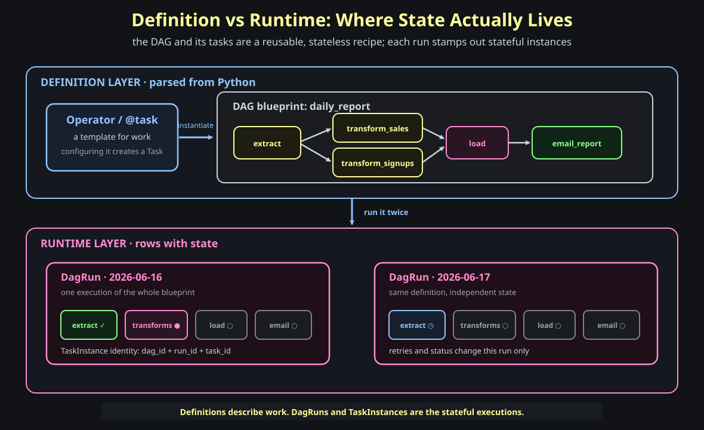
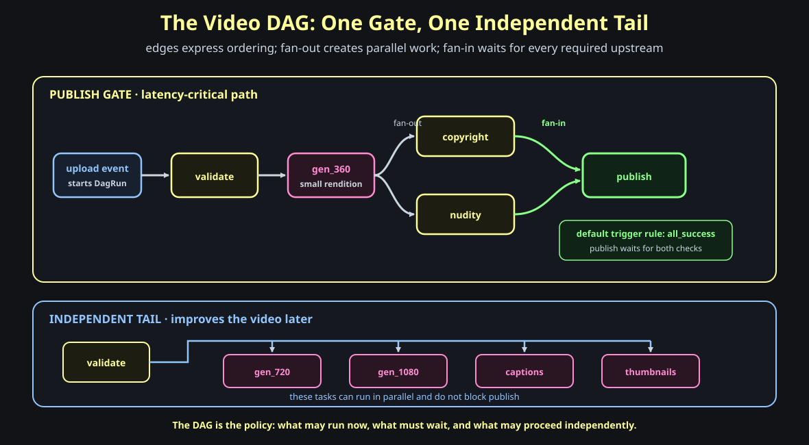
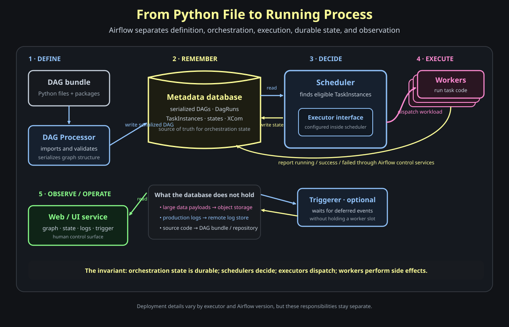
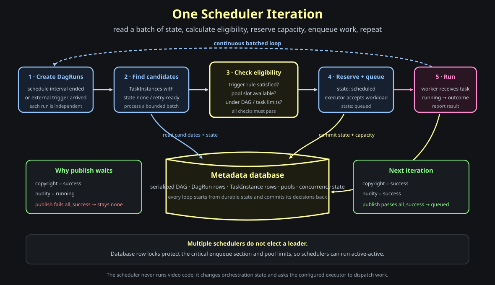
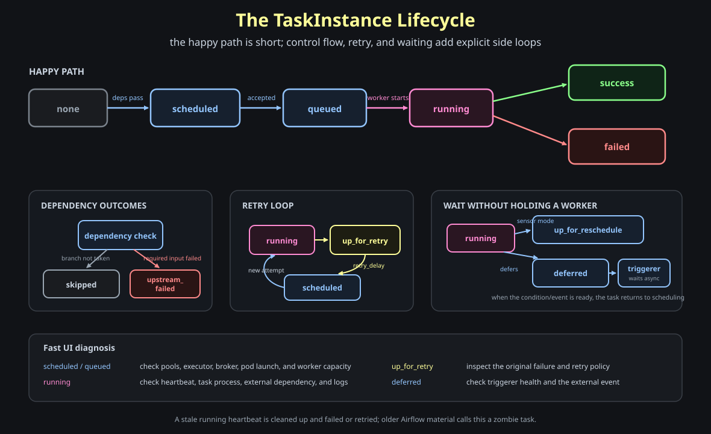
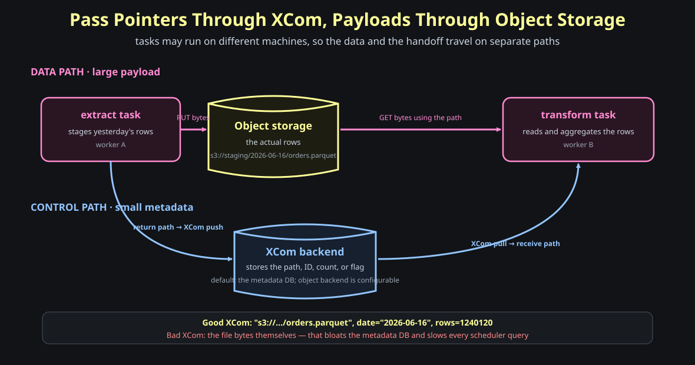
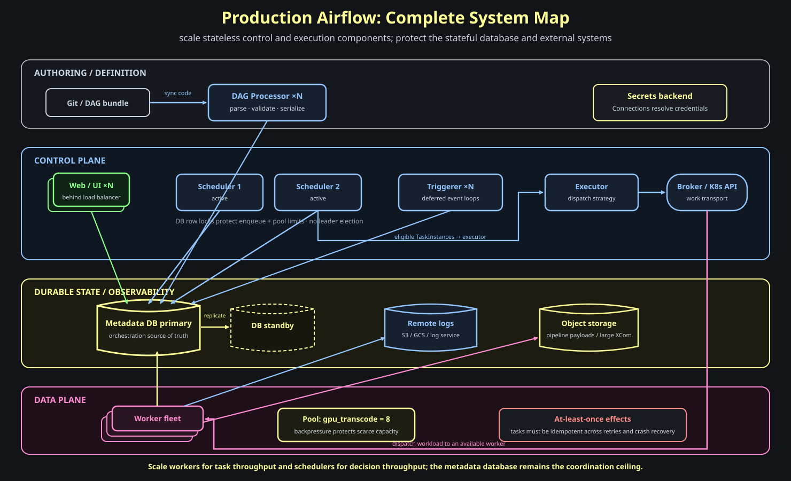

# Inside Apache Airflow: From Python DAG to Distributed Execution

In the [YouTube pipeline post](23-high-throughput-youtube-pipeline.md), Kafka could move events between services, but it could not naturally express this rule:

```text
publish only after copyright AND nudity both succeed
```

That is not a transport problem. It is an **orchestration problem**.

**Question: when you hand Airflow a Python file, how does that file become processes running on real machines—in the correct order, with retries, data passing, a live UI, and recovery after crashes?**

The shortest correct answer is:

> **Airflow stores orchestration state durably, lets schedulers decide what is eligible, and lets executors dispatch eligible TaskInstances to workers.**

The important qualifier is *orchestration state*. Video bytes belong in object storage, logs usually belong in remote log storage, and source code belongs in a DAG bundle or repository. The metadata database remembers the graph and every run's state; it is not the data lake.

> **Version note:** examples and terminology target Airflow 3.2.x. Older tutorials may use `schedule_interval` instead of `schedule`, `execution_date` instead of `logical_date`, and may omit the DAG Processor or triggerer. The core model remains the same.

---

## 1 — First separate definitions from executions

**Question: what is the difference between an operator, a task, a DAG, a DagRun, and a TaskInstance?**

This vocabulary is where Airflow usually becomes confusing.

| Concept | What it means | Does it have runtime state? |
| --- | --- | --- |
| **Operator / `@task`** | A template describing one kind of work | No |
| **Task** | A configured use of that template inside a DAG | No |
| **DAG** | A reusable graph of tasks and dependency edges | No |
| **DagRun** | One execution of the entire DAG | Yes |
| **TaskInstance** | One task inside one specific DagRun | Yes |

An operator is like a class. A task is like an object configured from that class. A DAG is the blueprint connecting those tasks.

When the DAG is triggered, Airflow creates a **DagRun**. Every task in that run becomes a **TaskInstance** with state such as `scheduled`, `running`, or `success`.



Suppose `video_processing` handles two uploads concurrently:

```text
DAG definition
  └── task: copyright

DagRun upload_vid123
  └── TaskInstance: copyright = running

DagRun upload_vid456
  └── TaskInstance: copyright = scheduled
```

There is one `copyright` task definition, but two TaskInstances with independent state.

Dynamic task mapping adds one more identity field. A mapped TaskInstance is effectively identified by:

```text
dag_id + run_id + task_id + map_index
```

> **Memory hook:** *DAGs and tasks are definitions. DagRuns and TaskInstances are executions. State belongs to the execution.*

---

## 2 — Build the smallest useful DAG

**Question: how do dependency edges express the publish gate?**

Here is the video pipeline using Airflow's TaskFlow API:

```python
import pendulum
from airflow.sdk import dag, task


@dag(
    dag_id="video_processing",
    start_date=pendulum.datetime(2026, 1, 1, tz="UTC"),
    schedule=None,
    catchup=False,
)
def video_processing():

    @task
    def validate(upload_uri: str) -> str:
        validate_upload(upload_uri)
        return upload_uri

    @task
    def transcode(src: str, resolution: str) -> str:
        return encode(src, resolution)

    @task
    def copyright_check(path: str) -> bool:
        return run_content_id(path)

    @task
    def nudity_check(path: str) -> bool:
        return run_safety_model(path)

    @task
    def publish(copyright_ok: bool, nudity_ok: bool) -> None:
        if copyright_ok and nudity_ok:
            go_live()

    src = validate("s3://raw/vid123.mp4")
    rendition_360 = transcode(src, "360p")

    publish(
        copyright_check(rendition_360),
        nudity_check(rendition_360),
    )

    # Independent tail: these do not block publish.
    transcode(src, "720p")
    transcode(src, "1080p")


video_processing()
```

Calling one decorated task with another task's output does two things:

1. It creates a dependency edge.
2. It passes the upstream result through XCom.

The resulting graph is easier to understand than the code:



The graph contains two important shapes:

- **Fan-out:** after `gen_360`, copyright and nudity checks may run in parallel.
- **Fan-in:** `publish` waits until both checks satisfy its trigger rule.

By default, Airflow uses `trigger_rule="all_success"`. That default implements the gate.

### Trigger rules change the meaning of fan-in

| Trigger rule | Downstream task runs when… | Typical use |
| --- | --- | --- |
| `all_success` | every upstream succeeded | publish gate |
| `all_done` | every upstream reached a terminal state | cleanup |
| `one_success` | at least one upstream succeeded | choose any successful source |
| `one_failed` | at least one upstream failed | alert or quarantine |
| `none_failed_min_one_success` | nothing failed and at least one branch succeeded | join after branching |

An alert task can depend on the same safety checks with `one_failed`, while `publish` keeps the default `all_success`.

### Operators and dependency syntax

TaskFlow is convenient, but operators express the same model:

```python
validate >> gen_360 >> [copyright, nudity] >> publish
```

The explicit form is equivalent:

```python
validate.set_downstream(gen_360)
gen_360.set_downstream([copyright, nudity])
```

Prefer `>>` for graph structure because readers can scan it quickly.

> **Memory hook:** *The DAG is policy. Its edges say what may run now, what must wait, and what may proceed independently.*

---

## 3 — Follow one DAG file through the system

**Question: which component parses the Python, which component decides, and which component runs the task code?**

The responsibilities are deliberately separate:



### DAG Processor: Python becomes a serialized graph

The **DAG Processor** imports DAG files, validates them, and writes a serialized representation of each graph to the metadata database.

This separation matters because importing arbitrary DAG code is real code execution. A dedicated processor keeps parsing work and author-provided code away from the scheduler's critical loop.

### Metadata database: durable orchestration state

The database stores:

- serialized DAG structure
- DagRuns
- TaskInstances and their states
- scheduling and concurrency metadata
- pools, variables, and connection metadata
- XCom values when using the default backend

If the scheduler crashes, a replacement does not reconstruct state from worker memory. It reads the database and continues.

### Scheduler: eligibility, not business logic

The scheduler:

- creates DagRuns
- finds candidate TaskInstances
- evaluates dependencies and trigger rules
- enforces pools and concurrency limits
- asks the configured executor to dispatch eligible work

The scheduler does **not** transcode videos or call the copyright service.

### Executor: dispatch strategy

The executor is a configured strategy used by the scheduler, not the video-processing code itself.

Examples include:

| Executor style | How work runs | Good fit |
| --- | --- | --- |
| Local | subprocesses on one host | development or smaller installations |
| Celery | long-running workers consume broker messages | distributed worker fleet |
| Kubernetes | a pod is created for each task attempt | isolation and elastic capacity |

The DAG does not need to change when the deployment changes executor.

### Workers: perform side effects

Workers run task attempts. They read and write the real pipeline data, call external APIs, emit logs, and report the attempt's result back through Airflow's control services.

The metadata database persists the result so the scheduler can unblock downstream tasks.

### Web/UI service: observe and operate

The UI renders the graph, run history, task states, and logs. It also lets an operator trigger, retry, clear, or inspect work according to permissions.

The UI is not the source of truth. It is a view over persisted control-plane state.

> **Memory hook:** *Processor defines. Database remembers. Scheduler decides. Executor dispatches. Worker executes. UI explains.*

---

## 4 — Inside one scheduler iteration

**Question: what exactly causes `publish` to become runnable?**

The scheduler acts as a state-machine driver:



For the publish gate, consider two iterations.

First iteration:

```text
copyright = success
nudity    = running

publish trigger rule = all_success
result               = not eligible
```

Later iteration:

```text
copyright = success
nudity    = success

publish trigger rule = all_success
result               = eligible → scheduled → queued
```

No worker sends a special “both checks are complete” event. Each worker reports its own outcome. The scheduler re-evaluates the graph against durable state.

### Capacity is part of eligibility

Satisfied dependencies are necessary but not sufficient. A TaskInstance may also need:

- a free global parallelism slot
- a free DAG concurrency slot
- a free pool slot
- permission from `max_active_runs`
- permission from per-task concurrency limits
- the correct relationship to previous runs when `depends_on_past=True`

This is how Airflow applies backpressure before work reaches an overloaded service.

### Multiple schedulers without leader election

Airflow can run multiple schedulers concurrently for availability and throughput.

They coordinate through the metadata database. Row-level locks protect the critical section where scheduled TaskInstances are enqueued while pool and concurrency limits are enforced.

There is no separate scheduler leader or consensus cluster.

> **Memory hook:** *Every scheduling loop asks two questions: are the dependencies satisfied, and is capacity available?*

---

## 5 — Read the TaskInstance lifecycle

**Question: when the UI says `queued`, `up_for_retry`, or `deferred`, what is actually happening?**



The happy path is:

```text
none → scheduled → queued → running → success
```

| State | Meaning | Where to investigate if it stays there |
| --- | --- | --- |
| `none` | dependencies or timing conditions are not satisfied | upstream states, trigger rule, schedule |
| `scheduled` | eligible, but not yet accepted for execution | pool and executor capacity |
| `queued` | executor accepted it; waiting for a worker | broker, Kubernetes API, worker capacity |
| `running` | a worker owns the attempt | heartbeat, worker process, task logs |
| `up_for_retry` | attempt failed; retry delay has not elapsed | original exception and retry policy |
| `up_for_reschedule` | a sensor in `reschedule` mode yielded its slot | sensor condition and timeout |
| `deferred` | a deferrable operator yielded to the triggerer | triggerer health and external event |
| `skipped` | a branch or control rule intentionally omitted it | branch decision |
| `upstream_failed` | a required upstream failed | upstream root cause |

### Worker crash and stale heartbeats

A worker can die after setting a task to `running` but before reporting an outcome.

TaskInstances heartbeat while active. Airflow detects a stale heartbeat, cleans up the abandoned attempt, and marks it failed or retries it if attempts remain. Older Airflow material calls this a **zombie task**.

### Why retries require idempotency

Airflow provides at-least-once task execution, not exactly-once external effects.

This sequence is possible:

```text
worker publishes video
worker crashes before Airflow records success
Airflow retries publish
```

Therefore:

```python
def go_live(video_id: str) -> None:
    # Safe if called more than once.
    videos.update_one(
        {"video_id": video_id},
        {"$set": {"status": "live"}},
        upsert=True,
    )
```

Use deterministic object paths, upserts, idempotency keys, or “already complete” checks. Retry safety is part of task design, not a feature Airflow can infer.

> **Memory hook:** *Airflow can retry an attempt; only your task can make the external effect safe to repeat.*

---

## 6 — Pass data between tasks without turning Airflow into storage

**Question: how does `transcode_360` hand its output to `copyright_check` if they run on different machines?**

Use two paths:



- The **data path** stores the MP4 in S3 or another object store.
- The **control path** passes the object's URI through XCom.

TaskFlow hides the explicit XCom call:

```python
path = transcode_360(src)
copyright_check(path)
```

The classic API makes it visible:

```python
def transcode_360(**context):
    path = encode_to_s3("360p")
    return path  # auto-pushed under the return-value key


def copyright_check(**context):
    path = context["ti"].xcom_pull(task_ids="gen_360")
    return run_content_id(path)
```

The method is `xcom_pull`, not `xcoms_pull`.

Good XCom values:

```text
"s3://renditions/vid123/360.mp4"
video_id = "vid123"
copyright_passed = true
row_count = 18_402
```

Bad XCom value:

```text
the 800 MB video itself
```

Large XCom payloads increase database or object-backend cost and make orchestration slower. Pass references to data, not the data itself.

### Sensors: wait for an external condition

An S3 sensor can wait until the raw upload exists:

```text
S3 object missing → wait
S3 object appears → sensor succeeds → validate becomes eligible
```

There are three different waiting models:

| Mode | Worker slot while waiting? | Runtime state |
| --- | --- | --- |
| Regular sensor/poke | Yes | `running` |
| Sensor with `mode="reschedule"` | No between checks | `up_for_reschedule` |
| Deferrable operator | No; triggerer watches event | `deferred` |

For long waits, deferrable operators are usually the efficient choice.

> **Memory hook:** *XCom passes small coordination values. Object storage carries payloads. The triggerer carries long waits.*

---

## 7 — Scheduling means data intervals, not “run at this wall-clock label”

**Question: why can an `@daily` run dated June 17 start just after midnight on June 18?**

Airflow schedules work around **data intervals**.

For a daily DAG:

```text
data interval:  [June 17 00:00 ───────── June 18 00:00)
logical date:    June 17 00:00
run starts:                              after the interval closes
```

The logical date identifies the interval's beginning. It is not necessarily the moment the process starts.

Older tutorials call this value `execution_date`. Modern Airflow calls it `logical_date`.

### Common schedule values

| `schedule` | Meaning |
| --- | --- |
| `None` | no automatic schedule; trigger externally |
| `"@once"` | create one scheduled run |
| `"@hourly"` | one interval per hour |
| `"@daily"` | one interval per day |
| `"@weekly"` | one interval per week |
| `"@monthly"` | one interval per month |
| `"0 2 * * *"` | cron: daily at 02:00 |

The video pipeline uses `schedule=None` because each upload triggers its own DagRun.

### Catchup and backfill

Suppose a daily DAG starts on June 1 but is enabled on June 10.

With `catchup=True`, Airflow may create the missing interval runs:

```text
June 1, June 2, June 3, ... June 9
```

This is useful for historical data processing. It is dangerous if tasks read “whatever exists now” instead of the assigned interval.

Per-upload DAGs normally use:

```python
schedule=None
catchup=False
```

Scheduled ETL DAGs should read and write deterministic partitions based on their data interval.

> **Memory hook:** *A schedule creates data intervals. A DagRun processes one interval. Catchup creates the intervals you missed.*

---

## 8 — Configuration, Connections, and secrets

**Question: where should the S3 credentials or copyright API token live?**

Not in the DAG file.

Use a named **Connection**:

```text
DAG uses conn_id="video_store"
        ↓
Airflow resolves Connection metadata
        ↓
Secrets backend supplies the credential
        ↓
provider hook connects to S3
```

Connections describe how Airflow reaches an external system. A connection may include:

- connection type
- host and port
- login
- password or token
- schema
- provider-specific extras

In production, use a secrets backend such as Vault or a cloud secrets manager so the database and UI do not need to hold plaintext credentials.

Do not confuse these concepts:

| Feature | Use |
| --- | --- |
| **Connection** | credentials and endpoint for an external system |
| **Variable** | installation-wide runtime configuration |
| **Param** | input supplied to a DAG or DagRun |
| **XCom** | small value produced by one TaskInstance for another |
| **Pool** | concurrency budget for a shared resource |

### Default task configuration

`default_args` removes repeated retry and timeout settings:

```python
from datetime import timedelta

default_args = {
    "owner": "video-platform",
    "retries": 3,
    "retry_delay": timedelta(minutes=2),
    "retry_exponential_backoff": True,
    "execution_timeout": timedelta(minutes=30),
}
```

Each task inherits these values and can override them.

> **Memory hook:** *Connections say where and how to connect. Pools say how many may connect at once.*

---

## 9 — Dynamic graphs without copy-paste

Static DAGs are not limited to a fixed number of runtime TaskInstances.

### Dynamic task mapping

Generate one transcode TaskInstance per resolution:

```python
@task
def transcode(resolution: str, src: str) -> str:
    return encode(src, resolution)


transcode.partial(src="s3://raw/vid123.mp4").expand(
    resolution=["360p", "720p", "1080p", "4k"],
)
```

The scheduler expands the mapped task at runtime. Each mapped instance gets a different `map_index`.

This is **data-driven fan-out**.

### Branching

A branch task selects the downstream task IDs to follow:

```python
@task.branch
def choose_thumbnail(has_custom: bool) -> str:
    return "use_custom" if has_custom else "auto_extract"
```

The path not selected becomes `skipped`. A later join commonly uses `none_failed_min_one_success`.

### TaskGroups

TaskGroups organize a large graph in the UI:

```python
with TaskGroup("transcoding"):
    ...
```

They change presentation and task IDs, not execution isolation. A TaskGroup is not a worker, queue, or deployment unit.

---

## 10 — Scale the complete system

**Question: which components scale horizontally, and which component remains the hard bottleneck?**

<div class="diagram-scroll">
  
</div>

### Scale workers for execution throughput

If tasks wait in `queued`, add worker capacity or increase pod-launch capacity—after confirming the downstream systems can absorb it.

Workers are the data plane. Scaling them increases simultaneous task attempts.

### Scale schedulers for decision throughput

If large numbers of TaskInstances wait before reaching `queued`, scheduler CPU, DAG complexity, database latency, or scheduler configuration may be limiting decision throughput.

Multiple schedulers run active-active using database locking.

### Scale DAG processing separately

Large DAG files, expensive imports, or thousands of DAGs can overload parsing before they overload scheduling.

Keep DAG top-level code cheap and scale DAG processors independently where supported by the deployment.

### Protect the metadata database

The metadata database handles:

- scheduling reads
- state transitions
- heartbeats
- pool coordination
- serialized DAG reads and writes
- UI queries
- default XCom storage

It is both the source of truth and the coordination ceiling.

Use a production database, backups, high availability, connection pooling, and appropriate retention. Do not put large task payloads into it.

### Backpressure is a correctness tool

Useful limits include:

- `max_active_runs`
- DAG and task concurrency limits
- Airflow-wide parallelism
- pools
- executor or worker capacity

A `gpu_transcode` pool with eight slots prevents the scheduler from starting a ninth GPU job even if thousands of videos are waiting.

Without backpressure, adding workers can move the outage downstream to S3, the database, the copyright API, or the GPU cluster.

---

## Where this leaves us

Airflow is easier to understand when each layer answers one question:

| Question | Airflow concept |
| --- | --- |
| What work exists and in what order? | DAG and tasks |
| Which execution are we discussing? | DagRun and TaskInstance |
| Is this task allowed to run now? | scheduler, dependencies, trigger rules, pools |
| How does work reach a machine? | executor and its transport |
| Who performs the side effect? | worker |
| Where is orchestration state remembered? | metadata database |
| How do tasks exchange small results? | XCom |
| How do tasks wait efficiently? | reschedule mode or triggerer |
| Where do credentials live? | Connections plus a secrets backend |
| How do operators understand failures? | UI, states, logs, and heartbeats |

The central design is not “Airflow runs Python.”

It is:

> **Airflow turns a graph definition into durable, stateful TaskInstances; schedulers repeatedly evaluate what is eligible; executors dispatch it; workers perform it; and every transition remains observable and recoverable.**

That is why:

```text
run publish only after copyright AND nudity succeed
```

is a dependency edge instead of a custom distributed coordination protocol.

## Official references

- [Architecture overview](https://airflow.apache.org/docs/apache-airflow/stable/core-concepts/overview.html)
- [Tasks and TaskInstance states](https://airflow.apache.org/docs/apache-airflow/stable/core-concepts/tasks.html)
- [DagRuns, data intervals, and catchup](https://airflow.apache.org/docs/apache-airflow/stable/core-concepts/dag-run.html)
- [Scheduler and multiple-scheduler operation](https://airflow.apache.org/docs/apache-airflow/stable/administration-and-deployment/scheduler.html)
- [XComs](https://airflow.apache.org/docs/apache-airflow/stable/core-concepts/xcoms.html)
