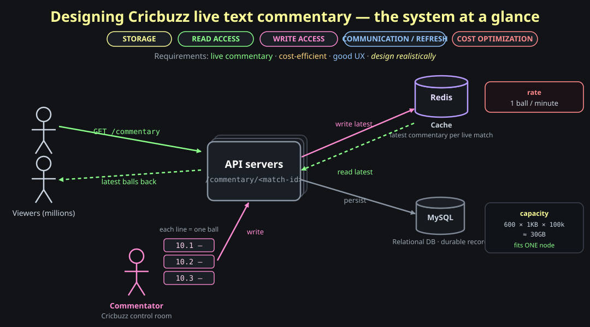

# Designing Cricbuzz's Live Text Commentary: Picking the Right Component for Each Job

This post builds **Cricbuzz's live ball-by-ball text commentary** from first principles, and it is really a post about *judgment*. At every layer — storage, read access, write access, and how a viewer's screen stays fresh — there is an obvious, impressive-sounding component the internet will tell you to reach for: a high-write time-series store, a wall of read replicas, a distributed transaction, a WebSocket. For *this* workload, almost every one of those is the wrong tool, and the interesting work is saying exactly *why*. So we'll do it the honest way: fit the flashy component first, find the place it hurts, and only then reach for the boring thing that actually fits. By the end you'll have built a system that serves live cricket to millions of phones on a single relational database, a cache, and short polling — and, more valuable than the design itself, you'll own the *reasoning* that gets you there, so you can run it again on any system and land on the right component every time.

**Question: a billion people follow a World Cup final. Every ball, a commentator in a control room types one line — "10.3 — Bumrah to Root, edged and gone!" — and within a second or two it must appear on millions of phones refreshing the same match page. It feels like the most real-time system imaginable. So which of the heavyweight tools — a sharded write-optimized datastore, WebSockets pushing to every viewer, a two-phase commit keeping cache and database in lockstep — do you actually need? The honest answer is *none of them*, and knowing why is the whole point.** A ball is bowled about **once a minute**. That single number — the *rate* of new information — quietly demolishes the case for almost every heavyweight component, because each of them earns its complexity only when events are frequent, or writes are huge, or atomicity is non-negotiable. Here, none of those hold. The design that wins is the one that matches the *actual* shape of the workload — modest data, a near-static read set, a trickle of writes, and a loose latency budget — and the rest of this post is the brainstorm that gets us there, one rejected component at a time.

This post leans on a small arc of earlier ones. We built a [recent-searches feed](25-information-retrieval-recent-searches.md) and learned the write-through cache pattern that keeps a hot list warm; we built a [MySQL read-cache](17-storage-engine-mysql-cache.md) and a [distributed cache](15-storage-engine-distributed-cache.md) and learned when a cache is the right answer and how it goes stale; we built [Slack's realtime layer](05-database-slack-realtime-communication-non-relational-databases.md) and learned when WebSockets genuinely earn their keep; and we built a [multi-tiered datastore](21-high-throughput-multi-tiered-db.md) and learned how cold data ages into cheap storage. This post is where those lessons get *applied as judgment* — the same components, but now the skill is choosing *not* to use most of them.

> **Memory hook:** *live text commentary feels real-time, but new information arrives only ~once a minute. That low event-rate is the fact that disqualifies the heavyweight components (sharded write store, WebSockets, distributed transactions) and points at the simple ones (one relational DB, a cache, short polling). Match the component to the workload's actual shape, not its vibe.*

---

## The brief: design *realistically*

**Question: before fitting any component — what are we actually optimizing for, and what does the system look like at its simplest?**

Three requirements, and the third is the one most designs forget:

- <span style="color:#8aff8a"><strong>Users see live text commentary.</strong></span> Open a live match, watch ball-by-ball lines appear without manually hunting for them.
- <span style="color:#ffd27f"><strong>Cost-efficient architecture.</strong></span> Millions of concurrent viewers on a final, but the *information* behind them is tiny and slow-moving. Every dollar spent on infrastructure that the workload doesn't justify is waste.
- <span style="color:#93c5fd"><strong>Good user experience.</strong></span> Fresh commentary, fast page loads, no spinning.

And one standing instruction over all three: <span style="color:#ff8bd2"><strong>design realistically.</strong></span> Don't design the version that sounds impressive in an interview; design the version that a sane team would actually run for a workload this shape. The realistic answer is almost always *smaller* than the instinctive one.

'. On the left, viewer stick figures send read requests to the API and receive commentary back. On the lower-left, a Commentator stick figure (the Cricbuzz control room) sends writes — typed lines like '10.1', '10.2', '10.3', each a ball — into the API. On the right, two stores the API talks to: a Redis Cache cylinder (top) holding the latest commentary per live match, and a MySQL Relational DB cylinder (bottom) as the durable record. A capacity note beside MySQL: 600 balls per match × ~1KB × 100,000 matches ≈ 30GB — fits one node. A rate note: 1 ball per minute. Across the top, the four axes this post brainstorms in order: STORAGE, READ ACCESS, WRITE ACCESS, COMMUNICATION/REFRESH, plus COST OPTIMIZATION. Requirements banner: live commentary, cost-efficient, good UX, 'design realistically'." width="1080">

We'll brainstorm in four passes — <span style="color:#ffff99"><strong>storage</strong></span>, <span style="color:#8aff8a"><strong>read access</strong></span>, <span style="color:#ff8bd2"><strong>write access</strong></span>, and <span style="color:#93c5fd"><strong>communication / refresh</strong></span> — then a cost-optimization pass — and in each one we'll try the tempting component first.

> **Memory hook:** *three requirements — live commentary, cost-efficient, good UX — under one rule: design realistically (the version a sane team runs, which is almost always smaller than the impressive one). Brainstorm in four passes: storage, read, write, communication.*

---

## Pass 1 — Storage: what is a "ball of commentary," and where does it live?

**Question: the unit of data is one line of text per ball. The tempting move is to reach for a write-optimized, infinitely-scalable time-series / key-value store, because "millions of viewers, live, global" *sounds* like big data. Is it?**

Let's fit that component first and see if it earns its place.

### The tempting fit: a time-keyed write-optimized KV store

The instinct: model commentary as a giant key-value or time-series table — <span style="color:#ffd27f"><strong>key = timestamp, value = the commentary line</strong></span> — for *all* matches, *all* teams, *all* countries, in one massive write-optimized store ([LSM-tree-backed](22-high-throughput-lsm-trees.md), sharded, built for a firehose). You'd pick this if you had **very high write throughput** and needed to spread writes across many nodes.

So ask the two questions that actually justify that component:

- **Do you have very high write throughput?** A ball is bowled roughly <span style="color:#ff8a8a"><strong>once a minute</strong></span> per match. Even with, say, 20 matches live at once worldwide, that's ~20 writes a minute — a number a laptop handles. There is no write firehose. The premise the write-optimized store exists to serve simply isn't here.
- **Do you need to shard across nodes to hold the data?** Let's compute the data, because guessing is how over-engineering starts.

### Size the data before choosing the store

One ball is one short line — generously, **~1 KB** of text. A long match (an ODI, both innings) is about **600 balls**. Take an aggressive **100,000 matches** of history across every format and competition:

```
1 KB/ball  ×  600 balls/match  ×  100,000 matches
   ≈ 60 GB total
```

(Cricbuzz's real figure is smaller; even our padded estimate lands at tens of gigabytes.) **All of the commentary that has ever existed fits comfortably on a single database node** — it fits in one box's *disk* with room to spare, and the *hot* slice (matches live right now) fits in RAM. There is no storage pressure forcing you to shard. Sharding solves "the data doesn't fit / the writes don't fit on one node"; neither is true here.

### The right fit: a single relational database

Drop the time-keyed KV store. The data is small, structured, and naturally relational — so model it as relations:

```
team(team_id, name, country)
match(match_id, team_a, team_b, format, start_time, status)
innings(innings_id, match_id, batting_team, number)
ball(ball_id, match_id, innings_id, over, ball_in_over, text, created_at)
```

A <span style="color:#ffff99"><strong>relational database</strong></span> (say <span style="color:#8aff8a"><strong>MySQL</strong></span>) is the honest fit: the entities have clean relationships (a match has innings, an innings has balls), queries are simple range reads ("give me the latest balls of match X"), and the whole dataset lives on **one node**. No sharding, no distributed write path, no time-series engine — none of it is justified by the workload.


### A note on scale: partition *later*, not now

Won't this break someday? If Cricbuzz grows 100× and the table genuinely outgrows a node, the clean partition key is **`match_id`** (a match's balls are read together and written by one source, so they co-locate perfectly — no cross-shard reads). But that's a *future* refactor triggered by a *measured* limit, not a day-one decision. Designing the shard now would be paying the operational tax of a [distributed datastore](04-database-distributed-kv-store-on-relational-database.md) for a 60 GB table. **Build the single node; keep `match_id` in your back pocket.**

> **Memory hook:** *storage — reject the write-optimized/time-series KV store: there's no write firehose (~1 ball/min) and no size pressure (≈60GB total fits one node). Model it relationally (team→match→innings→ball) on one MySQL. Partition by match_id only later, if a measured limit forces it.*

---

## Pass 2 — Read access: from one node, to replicas, to the cache that actually fits

**Question: API servers read commentary and serve it to viewers. On a final, millions of them hammer one match. The single MySQL node becomes the bottleneck. The textbook reflex is "add read replicas." Do replicas actually fix *this* read pattern — or is there a component that fits it far better?**

Start with the naive path and follow the load.

### The reflex: read replicas

Reads pile onto the single node. The standard first move (and a real one) is the [primary/replica pattern](04-database-distributed-kv-store-on-relational-database.md): one primary takes writes, several <span style="color:#93c5fd"><strong>read replicas</strong></span> serve reads, the API fans reads across them. This genuinely multiplies read capacity, and we'll keep replicas around as a backstop.

But before scaling replicas to the moon, look at *what* is being read, because the access pattern is unusually extreme:

### The killer observation: ~99% of reads want the *same few rows*

Everyone watching a live match is fetching the **same thing**: the latest handful of balls of that one match. The commentary API is essentially "give me the **last ~15 balls** of match X." There's no per-user state — you don't store a user-wise scroll offset, you just **show the latest**. So a billion read requests on a final collapse to a billion reads of an *identical, tiny, slowly-changing* answer that changes only once a minute.

That is the **textbook case for a cache.** Throwing replicas at it would work, but it's leaving the biggest, cheapest win on the table: replicas still each execute the query against disk/buffer-pool per request, whereas a cache serves the one hot answer straight from memory to everyone. Replicas scale the *expensive* path; a cache *removes* it.

### The right fit: cache the latest commentary in Redis

So front the database with <span style="color:#ff8a8a"><strong>Redis</strong></span>. For each live match, keep the **latest commentary** (the last ~15 balls) as a hot entry in Redis. The read path becomes:

1. `GET /commentary/<match-id>` hits an API server.
2. The API reads the latest balls **from Redis** — an in-memory hit, no database touch.
3. Return them. The database never sees the read.

This is the same shape as the [recent-searches feed](25-information-retrieval-recent-searches.md): a bounded hot list in Redis (think `LPUSH` the new ball + `LTRIM` to the last N), serving a near-static read set to a massive audience from memory. The relational database is still the durable record of every ball ever; the **replicas stay as a fallback** for cold reads (someone paginating back through an old over, an analytics job). But the live read path — the one with all the volume — is **answered entirely by the cache.**


This immediately raises the question every cache raises and the next pass answers: **how does the cache get populated, and stay correct, when a new ball is written?**

> **Memory hook:** *read access — replicas help but only scale the expensive query path. The real insight: ~99% of reads want the identical 'last ~15 balls of the live match' (no per-user offset), so cache that hot list in Redis (LPUSH+LTRIM, like recent-searches) and serve millions from memory. DB + replicas stay only for cold pagination.*

---

## Pass 3 — Write access: two writes, one trap, and the distributed transaction you *don't* need

**Question: a commentator types a ball. It must land in the durable database *and* refresh the cache so viewers see it. That's a write to two systems. The scary, impressive answer is a distributed transaction to keep them atomic. Do we need it — and if not, how do we keep them consistent without it?**

This is the pass where most designs over-engineer. Let's walk into the trap deliberately, then climb out.

### The two-write problem

When the <span style="color:#ff8bd2"><strong>commentator</strong></span> (the Cricbuzz control room — a *single writer* per match) submits a ball, two things must happen: the ball must be **persisted in the database** (durability — the official record), and the **cache must reflect it** (freshness — the millions of pollers read the cache, so a ball that's only in the DB is invisible). Two writes, two systems. Now the questions cascade:

- **Which do you write first — cache or database?**
- **What if the first succeeds and the second fails?** Say you persist to the DB, then the cache write fails. Now the durable record has the ball but every viewer is reading a stale cache.
- **Does the API retry?** How many times? With what backoff?
- **How does the commentator even *know* it half-failed?** Do you surface an error to the control room on every flake?

### Tempting fix A: a queue both stores consume from

One clean-sounding idea: the API writes the ball to a <span style="color:#ffd27f"><strong>durable queue</strong></span>, and both the database and the cache **consume** from it asynchronously ([the CDC/queue pattern](16-storage-engine-etl-cdc.md)). The write becomes one append; the fan-out to two stores is the queue's problem.

It's a legitimate pattern — but here it buys little and costs latency. It adds a whole piece of infrastructure and an *asynchronous lag* between "commentator hit save" and "viewers see it," to solve a fan-out of **two writes a minute**. For a high-throughput pipeline the queue is gold; for this trickle, it's machinery in search of a problem. Hold it as a "later, if needed."

### Tempting fix B: a distributed transaction

The impressive answer: wrap both writes in a <span style="color:#ff8a8a"><strong>distributed transaction</strong></span> so they're **atomic** — either the ball lands in *both* the database and the cache, or in *neither*. No half-states, ever.

It's worth knowing exactly what that means, and exactly why it's wrong here.

#### What a distributed transaction actually is (and when to use one)

A distributed transaction makes a single logical operation **atomic across multiple independent systems**. The classic mechanism is <span style="color:#ffff99"><strong>two-phase commit (2PC)</strong></span>, run by a **coordinator**:

1. **Prepare phase.** The coordinator asks every participant (the DB, the cache) "can you commit this?" Each does the work tentatively and replies *yes* (and now holds locks/resources, promising it *can* commit) or *no*.
2. **Commit phase.** If *all* said yes, the coordinator tells everyone "commit." If *any* said no (or timed out), it tells everyone "abort." Either way, all-or-nothing.

You reach for this when a **partial write is genuinely unacceptable** — money moving between two banks, inventory decremented *and* an order created, a seat booked in exactly one place. The cost is steep: the coordinator is a failure point, participants **hold locks across the network** while waiting (killing throughput), and the whole thing blocks if the coordinator dies mid-commit. Atomicity across systems is *expensive*; you pay it only when correctness truly demands it.

#### Why we *don't* need it here

Ask the only question that matters: **is a partial write actually catastrophic?** It isn't. If the database has ball 10.3 but the cache is a half-second behind, viewers see the new ball a moment late — and the next poll fixes it. Nobody loses money. There's no invariant spanning the two stores that a brief skew violates. Paying 2PC's coordinator, cross-network locks, and blocking — for **two writes a minute** whose worst-case failure is *a one-second delay* — is the textbook over-engineer. **We keep it simple.**

### The right fit: cache-first write + idempotent upsert + retry-until-both

Here's the design that fits, and it leans on three cheap properties instead of one expensive transaction:

1. <span style="color:#ff8bd2"><strong>Write to the cache directly, and to the DB.</strong></span> When a ball comes in, the text-commentary service updates **Redis directly** with the new ball *and* writes it to the database. We update the cache directly (not "invalidate and let it refill") because **we cannot wait for a cache miss to repopulate the latest commentary** — the whole point is that the hot answer is always instantly fresh. (Same instinct as the [recent-searches write-through](25-information-retrieval-recent-searches.md): the write that *would* stale the cache instead *refreshes* it.)
2. <span style="color:#8aff8a"><strong>Idempotent upserts, keyed by ball.</strong></span> Each ball has a stable id (e.g. `match_id + innings + over.ball`). Writing it is an **upsert**: "create this ball, or overwrite it if it exists." This is the property that makes everything else safe — **a ball entry is always updated if it exists**, never duplicated. So you can retry freely; re-applying the same ball is a no-op.
3. <span style="color:#ffd27f"><strong>Retry until *both* succeed.</strong></span> Because the writer is a single control room and the writes are idempotent, durability is just **retry**: the service keeps trying until the ball is in *both* the cache and the database. If one side flakes, retry — and because upserts are idempotent, retrying can't corrupt anything. The commentator's save isn't "done" until both confirm; a stuck save surfaces to the control room to save again. Two writes a minute means there's all the time in the world to retry.


The win: **idempotency + retry replaces atomicity.** A distributed transaction buys all-or-nothing through expensive coordination; idempotent upserts plus retry buy *eventual* all-or-nothing through cheap repetition — and for a single-writer, two-writes-a-minute, no-shared-invariant workload, eventual is exactly enough.

> **Memory hook:** *write access — reject the distributed transaction (2PC): it's for catastrophic-if-partial writes (money, inventory); here a half-second cache skew is harmless, so its coordinator+locks+blocking are pure overkill. Instead write cache-first (update Redis directly, don't wait for a miss to refill) + the DB, both as idempotent upserts keyed by ball-id, and retry until both confirm. Idempotency + retry replaces atomicity.*

---

## Pass 4 — Communication: how a viewer's screen stays fresh (the WebSocket trap)

**Question: this is the heart of it. The commentator wrote a new ball; millions of phones must show it without the user doing anything. The reflexive, impressive answer to "live updates" is WebSockets. We'll fit WebSockets, then Server-Sent Events, then long polling, then short polling — and the *order* of rejection teaches the whole lesson: which push/pull mechanism fits which workload, and why.**

There are four ways to keep a client current. Let's try each against our one defining fact — **new data arrives ~once a minute** — and watch most of them fall.

### Option A — WebSockets (the trap)

A <span style="color:#ff8a8a"><strong>WebSocket</strong></span> is a **persistent, full-duplex TCP connection** between client and server: once opened, either side can push bytes to the other at any instant, with no per-message HTTP overhead. It is *the* right tool when two parties exchange a steady stream both ways — chat, multiplayer games, collaborative editing — which is exactly why [Slack uses it](05-database-slack-realtime-communication-non-relational-databases.md).

Now fit it here. You'd hold an **open TCP connection for every one of millions of viewers**. And what flows through it? **One ball a minute.** For the other **59 seconds**, every single connection sits *idle* — doing nothing, exchanging nothing — while consuming a real TCP socket, kernel buffers, and **server RAM per connection**. You're holding millions of persistent connections to deliver one short line per minute down each. That is a staggering waste of exactly the resources that are scarce at scale.

The deeper point: **this looks like a real-time use case, but it isn't one.** Real-time means events stream continuously and latency is measured in milliseconds (a cursor moving, a game tick). Here events arrive once a minute and a one- or two-second delay is completely invisible to a cricket fan. WebSockets are built to make a *busy* bidirectional channel cheap per-message; for a near-idle, one-directional, once-a-minute trickle, that persistent channel is **pure overhead.** It's overkill.

### Option B — Server-Sent Events (lighter, same flaw)

<span style="color:#ffd27f"><strong>Server-Sent Events (SSE)</strong></span> are the obvious "but lighter" retort: a one-way, server→client stream over a single long-lived HTTP connection. No bidirectional machinery, simpler than WebSockets, genuinely nice for server-push feeds.

But it has the **same core flaw** for this workload: it still holds a **persistent connection open per viewer**, mostly idle, just to push one event a minute. You've shed the full-duplex weight but kept the expensive part — millions of held-open connections and the server memory and push infrastructure to feed them. Lighter than a WebSocket, still unjustified by a once-a-minute update.

### Option C — Long polling (push latency down, cost back up)

<span style="color:#93c5fd"><strong>Long polling</strong></span>: the client sends a request and the server **holds it open** until new data exists, then responds; the client immediately re-requests. Latency is great — the viewer gets the ball the instant it's written.

But look at the cost. Each waiting viewer **ties up a server request slot (a thread/connection) for up to a minute**, doing nothing but waiting — effectively *every connection is a loop checking "is there a new ball yet?"* Multiply by millions and you're holding millions of open requests, and if those checks hit the database you're **burning CPU and database connections** to ask "anything new?" over and over. You've traded the persistent-connection problem for a held-request problem — same scaling wall, different shape. The next ball isn't worth that.

### Option D — Short polling (the right fit)

<span style="color:#8aff8a"><strong>Short polling</strong></span>: the client just **asks every N seconds** — "any commentary newer than ball X?" — over an ordinary, *stateless* HTTP request, and the server answers immediately from the **cache** and closes the connection. (The page's JavaScript does this on a timer; a manual refresh button is the same idea by hand.)

Count what it costs and you see why it wins:

- **No held connections.** Nothing is kept open between polls — no per-viewer socket, no per-viewer thread, no server RAM held idle. The server only does work in the brief moment it answers a poll.
- **It hits the cache, not the database.** Every poll is a cheap Redis read of the hot "latest 15 balls" entry — and because the answer is identical for everyone and changes once a minute, it's trivially **CDN/edge-cacheable for a few seconds** too. The expensive store is never touched.
- **It rides existing infrastructure.** It's plain HTTP — your load balancers, CDN, autoscaling, and caching layers already handle it. Nothing exotic to operate.
- **The latency is more than good enough.** Poll every ~10–30 seconds and the worst case is a ball shows up a few seconds late — invisible for cricket. The update rate (1/min) means you don't need to poll fast, so the cost stays tiny.


The lesson isn't "short polling is good." It's that **the event rate and direction pick the mechanism.** A busy bidirectional stream wants WebSockets. A frequent one-way push wants SSE or long polling. A slow, one-way, read-by-millions trickle wants **short polling against a cache** — because the cost of *keeping a connection ready* dwarfs the cost of *occasionally asking*, when events are rare.

> **Memory hook:** *communication — reject WebSockets (millions of idle persistent TCP connections + RAM for a 1-ball/min one-way trickle; looks real-time, isn't) and SSE (same held-connection flaw, lighter) and long polling (held requests loop-checking the DB, CPU + connections burned). Choose short polling: stateless 'anything newer than ball X?' every ~10–30s, served from the Redis cache, on existing infra. Event rate + direction pick the mechanism.*

---

## Pass 5 — Cost optimization: archival and the cheapest refresh

**Question: we've chosen the components. What's left to make it genuinely cost-efficient — not just correct?**

Two levers, both of which fall out of decisions we already made:

- <span style="color:#8aff8a"><strong>Short polling against the cache *is* the cost optimization for reads.</strong></span> We didn't pick it only for simplicity — it's the cheapest possible read path: no idle connections, no per-viewer memory, cache (and CDN) hits instead of database queries. The millions-of-viewers cost is mostly absorbed by an edge that serves an identical, seconds-fresh answer.
- <span style="color:#ffd27f"><strong>Archival: cool finished matches out of the hot path.</strong></span> A match is "live" for a few hours, then it's history that almost nobody reads ball-by-ball again. So once a match ends, **evict its hot entry from Redis** (free the memory for live matches) and, over time, **age its rows out of the primary database into cheap cold storage** — exactly the [hot → warm → cold tiering](21-high-throughput-multi-tiered-db.md) from the multi-tiered post. The hot store keeps only *live* matches small and fast; years of finished commentary sit cheaply in object storage, queryable on the rare occasion someone wants an old scorecard.

The shape is the same as everywhere else in this post: spend resources in proportion to how the data is *actually* used. Live matches get RAM and a cache; finished matches get cheap disk; ancient matches get archival storage.

> **Memory hook:** *cost optimization — short polling against the cache is already the cheapest read path (no held connections, CDN-absorbed). Add archival: evict finished matches from Redis and age their rows into cold storage (hot→warm→cold), keeping only live matches in the fast, expensive tier.*

---

## The full architecture

**Question: assemble the whole thing. Trace a single ball from the commentator's keyboard to a million refreshing phones, and a viewer's poll back to the cache.**


Read it as two flows that meet at the cache:

- **Write (pink).** The <span style="color:#ff8bd2"><strong>commentator</strong></span> in the control room types a ball and hits save. The <span style="color:#ff8bd2"><strong>text-commentary service</strong></span> upserts it **directly into Redis** (so the latest answer is instantly fresh for live matches) **and** into <span style="color:#ffff99"><strong>MySQL</strong></span> (durable record), both idempotent by ball-id, **retrying until both confirm**. No queue, no distributed transaction.
- **Read (green).** A <span style="color:#8aff8a"><strong>viewer</strong></span>'s page **short-polls** `get_latest_commentary` every ~10–30s; the API serves the **last ~15 balls straight from Redis** and closes the connection. A *separate*, rarer `get_commentary (paginated)` call — for someone scrolling back through earlier overs — goes to the **database / replicas**, since that cold, varied read doesn't belong in the hot cache.
- **Consistency & durability.** Redis is always updated by the text-commentary service the moment the commentator writes, and the ball entry is **always upserted if it exists** — so the cache can't drift from the truth for more than a retry, and nothing is ever duplicated. Durability is just retry-until-both. Good UX is direct Redis updates on write and Redis reads on the hot path.

Every component is the *small* one, chosen because the workload's actual shape — tiny data, near-static reads, a write trickle, a loose latency budget — never justified the large one.

> **Memory hook:** *full system — write path: control room → text-commentary service → idempotent upsert into Redis (instant freshness) AND MySQL (durable), retry until both. Read path: viewers short-poll get_latest from Redis (last ~15 balls); paginated history goes to DB/replicas. Cache stays correct because the service updates it on every write; durability is retry. Two flows meeting at the cache.*

---

## The two myths this design busts

**Question: if you remember one thing from this post, what is it? Two reflexes, both wrong here, both wrong for the same reason.**

- <span style="color:#ff8a8a"><strong>Myth 1: "Live updates need WebSockets."</strong></span> No. WebSockets earn their cost when a channel is *busy and bidirectional*. Live commentary *looks* real-time but delivers **one one-way event a minute** to a massive read-only audience — so a persistent connection per viewer is millions of idle sockets burning RAM. **Short polling against a cache wins**, because when events are rare, *asking occasionally* is far cheaper than *staying connected*.
- <span style="color:#ff8a8a"><strong>Myth 2: "Writing to two stores needs a distributed transaction."</strong></span> No. Two-phase commit earns its cost when a partial write is *catastrophic* (money, inventory). Here a half-second cache-vs-DB skew is harmless, the writer is a single control room, and writes are **idempotent**. So **idempotent upsert + retry-until-both** replaces atomicity — eventual consistency is exactly enough.

Both myths share one root error: **judging a component by how the problem *feels* (real-time! two stores!) instead of how the workload actually *behaves* (one event a minute, no shared invariant).** The skill this whole post is really teaching is to compute the rate, size the data, name the failure that actually matters — and *then* pick the component. Do that, and you'll reject the impressive wrong answer and reach the boring right one, every time.

> **Memory hook:** *two myths — (1) live ≠ WebSockets: a once-a-minute one-way trickle to millions wants short polling on a cache, because asking occasionally beats staying connected when events are rare; (2) two writes ≠ distributed transaction: single writer + idempotent upserts + retry beats 2PC when a partial write isn't catastrophic. Root lesson: pick components by how the workload behaves, not how the problem feels.*
