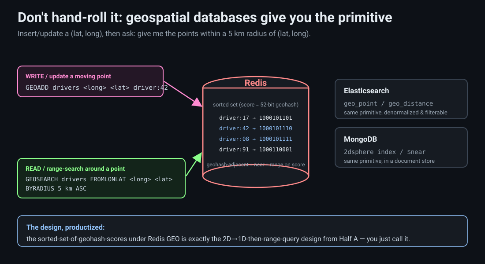
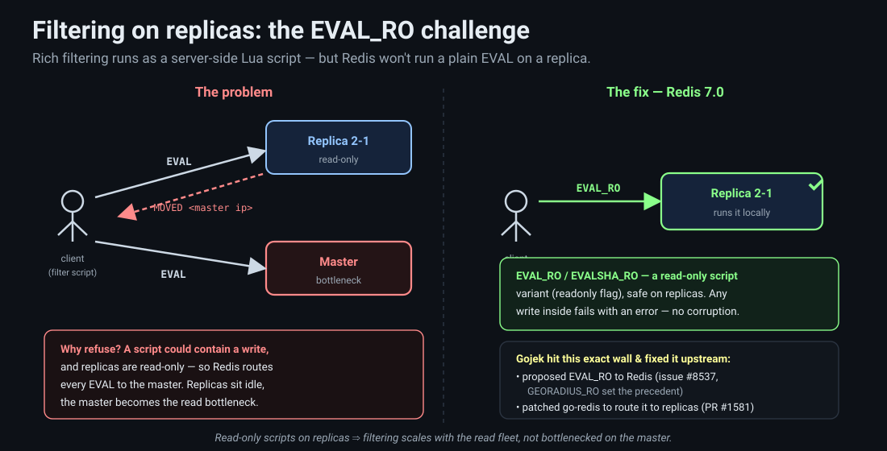

# Designing a Geo-Proximity Service: Geohashes, Space-Filling Curves, and a Sharded Redis Fleet

This post builds the system that answers one question, over and over, for every ride-hailing and food-delivery app on your phone: **who is near me right now?** Open Uber and it needs the drivers within a couple of miles of your pin. Open DoorDash and the dispatcher needs the Dashers close to the restaurant. The naive answer — measure the distance from you to every driver and keep the close ones — is correct and completely unscalable: it's O(N) work on every request, and there are hundreds of thousands of moving drivers. The whole post is about the one idea that turns that linear scan into an index lookup: **collapse two dimensions (latitude, longitude) down to one, so "nearby in the world" becomes "adjacent on a number line" — and then use everything we already know about 1D range queries.** That idea is the **geohash**, and by the end you'll have built it from first principles and wired it into a real proximity service — the sharded, replicated Redis fleet that Uber, Lyft, DoorDash, and Gojek actually run.

**Question: a rider stands at some `(lat, long)`. Two hundred thousand drivers are scattered across the city, each streaming a new location every few seconds. You must return the handful within 5 km — in well under a second, hundreds of thousands of times a minute. Computing the distance to all 200,000 drivers on every request is the obvious answer and the wrong one. How do you find "nearby" *without* measuring the distance to everyone?** The honest path runs through a detour: we'll solve the easy 1D version of the problem first (find the points on a line inside a range — a solved problem), then find a way to *turn the hard 2D problem into that easy 1D one*. The bridge is a function that maps a 2D point to a single number such that points close on the map get numbers close on the line. Build that function and the rest is a prefix match.

This post leans on machinery we've built before. We use [Redis as a fast shared store](15-storage-engine-distributed-cache.md) the way we did for the distributed cache and the [rate limiter](34-rate-limiter.md); we [shed load and return partial results under pressure](31-flash-sale.md) the way the flash-sale admission control did; we put a stateless fleet behind a [load balancer](06-distributed-load-balancer.md); and the ingestion path is the same [streaming pipeline](23-high-throughput-youtube-pipeline.md) shape — producers into a log, consumers into a store — we used for the YouTube view pipeline. The genuinely new idea is the spatial index.

> **Memory hook:** *finding "who's near me" in 2D is O(N) if you measure distance to everyone. The trick is **dimensionality reduction**: a geohash maps `(lat, long)` → one number so that points near each other on the map share a **prefix** on the line. Then "nearby" is a prefix scan / range query — an index lookup, not a full scan. The whole system is that index, made distributed: streamed locations into a sharded, replicated, geo-aware Redis fleet, queried by a read-heavy matching service that favors availability and low latency over consistency.*

We start with the naive answer, break it on purpose, and add exactly one idea at each rung.

---

## The brief: return the points inside a radius

**Question: before optimizing anything — what, precisely, is the service asked to do?**

Two operations, at very different rates. **Writes:** every client device (a driver's phone) continuously reports its `(lat, long)` — a new point every few seconds — and the service updates that user's stored location. **Reads:** given a query point and a radius, return the ids of all users within it. That's it: *update a moving point*, and *range-search around a point*.


Four properties shape every later decision:

- **Write-heavy.** A driver reports location every few seconds whether or not anyone is searching for them. There are far more location updates than proximity queries, so the store must absorb a firehose of small writes.
- **Low latency.** The proximity query is on the critical path of matching a rider to a driver. If it takes 500 ms, the whole app feels slow. Budget: well under a second, ideally tens of milliseconds.
- **Horizontally scalable.** A single busy city has hundreds of thousands of active drivers and riders. No single machine holds or serves them all.
- **Approximate is acceptable.** This is the quiet superpower of the domain. A location is already stale by the time it arrives — the driver moved while the packet was in flight. So a query that returns a driver who is *actually* 5.1 km away, or misses one at 4.9 km, has cost you nothing real. We will spend this slack repeatedly to buy speed.

> **Memory hook:** *the service does two things — update a continuously-moving point (write-heavy) and range-search around a point (latency-critical). It must scale horizontally, and — crucially — it may be approximate, because locations are already stale by seconds. That tolerance for a little error is the budget every optimization spends.*

---

## Section 1 — The naive answer: measure the distance to everyone

**Question: what's the smallest thing that answers "who's within 5 km?" at all?**

Draw a circle of radius `k` around the query point and keep every point inside it. To decide whether a point is inside, you measure the distance from the center to that point and check `distance < k`. Do that for one point and you know if it's in your circle.


The trouble isn't the distance formula — it's *how many times you must evaluate it*. Nothing about the raw list of points tells you which ones are close, so you have no choice but to compute the distance from the center to **every** point and test each against `k`. For `N` points that's `N` distance computations on every query — <span style="color:#ff8a8a"><strong>O(N) per query</strong></span>. With hundreds of thousands of drivers in a city and hundreds of thousands of queries a minute, you're doing tens of billions of distance calculations a minute to answer "who's nearby." There is no clever distance formula that saves you here; the cost is the *scan*, not the arithmetic.

This is the wall. Everything that follows exists to avoid measuring the distance to everyone — to *rule out* the vast majority of points without ever computing their distance.

> **Memory hook:** *the naive check is `distance(center, point) < k`, evaluated for every point — O(N) per query. The distance formula is cheap; the killer is that you must run it against the entire fleet because nothing pre-groups points by location. The rest of the post is about pruning the scan, not speeding up the arithmetic.*

---

## Section 2 — Warm-up in one dimension: the range query

**Question: strip the problem down to a single axis. If all our points sat on a *number line*, could we find the ones near a given point without scanning them all?**

Yes — and this is a thoroughly solved problem, which is exactly why we detour through it. On a line, "near `p`" means "inside the interval `[p − k, p + k]`," and finding the points in an interval is a <span style="color:#93c5fd"><strong>range query</strong></span>. In SQL it's the everyday `BETWEEN`:

```sql
SELECT * FROM people WHERE coordinate > 15 AND coordinate < 25;
```


Two standard structures answer this without a scan. The simplest is a **sorted array**: keep the points sorted by coordinate, binary-search for the two endpoints `15` and `25`, and return everything between them — `O(log N)` to find the boundaries, then time proportional only to the *number of results*, not to `N`. The more powerful is a <span style="color:#ffff99"><strong>segment tree</strong></span> (or a balanced BST / interval tree), which indexes the line so that "how many / which points lie in `[a, b]`?" is answered in `O(log N + result)` and supports fast updates as points move. The details of segment trees are a topic of their own; the only thing that matters here is the headline: **in 1D, range queries are cheap and well-understood.** We can find who's near you on a line in logarithmic time, touching only the points that are actually near.

So if we could somehow *reduce our 2D map to a 1D line*, we'd be done — we'd inherit all of this machinery for free. Hold that thought; it's the whole plan.

> **Memory hook:** *in one dimension, "near" is "inside an interval," and an interval query is cheap — sorted array + binary search, or a segment tree, gives O(log N + result) with no full scan. 1D proximity is a solved problem. The entire strategy becomes: turn the 2D problem into this 1D one.*

---

## Section 3 — The 2D wall: you can't index distance

**Question: we can index one axis. Why not just index both — latitude *and* longitude — and intersect?**

Because "near in 2D" is not "near in latitude AND near in longitude" in any way a single index can exploit — and more fundamentally, **you cannot build a 1D index over 2D distance.** An index imposes a *linear order*; it sorts things along one axis. Distance in the plane isn't a single axis — a point can be close to you by being north, south, east, west, or any diagonal, and there's no way to sort all of 2D space onto one line such that "close in distance" always means "close in sort order." Sort by latitude and two points on the same parallel a thousand miles apart sit next to each other in the index while your actual neighbor to the south is far away in it.


You could try to index latitude and longitude separately and intersect the two range results, and this half-works — but the intersection is a *rectangle*, not a disk, and worse, it doesn't degrade gracefully: the two 1D ranges each return huge candidate sets that you must then intersect and re-filter by true distance. You're back to scanning.

So indexing distance directly is out. But Section 2 left us a lifeline: we are very good at 1D range queries. That reframes the entire problem into a single, precise question:

> **Can we transform each 2D point into one number `z = f(lat, long)`, such that points close together on the map get numbers close together on the line?**

If a function `f` like that exists, then a 2D proximity search becomes: map the query point to its number, and do a 1D range query around it. Everything in Section 2 comes for free. The rest of Half A is building that `f`.

> **Memory hook:** *you can't index 2D distance directly — an index is a linear order, and no linear order preserves planar distance (sort by latitude and far-apart points collide while true neighbors scatter). But we're great at 1D range queries, so the problem reduces to: find `f(lat, long) → z` that keeps map-neighbors close on the line. That function is the geohash.*

---

## Section 4 — Geohash as dimensionality reduction: the property that must hold

**Question: many functions map two numbers to one. What makes a *good* one for proximity — what property must `f` obey to be useful at all?**

A <span style="color:#ff8bd2"><strong>geohash</strong></span> is exactly this function: it takes a two-dimensional `(lat, long)` and produces a single value `z`, giving you the ability to quickly check "nearby." That's <span style="color:#ffff99"><strong>dimensionality reduction</strong></span> — squashing 2D down to 1D. But not any squashing will do. The map has to preserve the one thing we care about:

> **If two points are close in 2D, their values must be close in 1D.** Relative distance in the plane must be reflected as relative distance on the line.


Make it concrete. Points `A` and `B` are near each other on the map; `C` is farther from `A`. Then whatever numbers `f` assigns, we need `|z_B − z_A| < |z_C − z_A|` — the on-line gap to the near point smaller than the gap to the far point. If instead `f` assigned `A = 10`, `B = 15`, `C = 9`, it would be **wrong**: it puts `C` (value 9) right next to `A` (value 10) on the line, claiming they're the closest pair — but on the map `C` was the far one. A range query around `A = 10` would sweep up `C` and miss `B`. The reduction has to respect *relative distance*, or the 1D query it enables returns garbage.

This is a strong requirement, and strictly speaking no map from 2D to 1D can satisfy it *perfectly* (we'll meet the unavoidable exceptions in Section 8). But we can get remarkably close with a beautiful, simple idea: a **space-filling curve.**

> **Memory hook:** *a geohash is a dimensionality reduction `f(lat, long) → z`, and the one property it must honor is distance-preserving: points close on the map must get values close on the line (`|z_B − z_A| < |z_C − z_A|` whenever B is nearer A than C is). Get this wrong — assign a far point an adjacent value — and every 1D range query returns the wrong neighbors. No 2D→1D map is perfect, but space-filling curves get close.*

---

## Section 5 — The core idea: a space-filling curve by divide-and-conquer

**Question: how do you thread a single line through 2D space so that points the line visits close together are also close on the map?**

You <span style="color:#ffff99"><strong>fill the space</strong></span> with one continuous, ever-folding curve, and you assign each point the value "how far along the curve it is." A <span style="color:#8aff8a"><strong>space-filling curve</strong></span> starts at one corner and snakes through every region of the plane, and because it's continuous, two points the curve reaches at nearly the same time are physically near each other. The number you hand a point is just its position along that curve — its 1D coordinate.


How do you actually *build* such a curve and assign the numbers? With <span style="color:#ff8bd2"><strong>divide and conquer</strong></span>, and it's astonishingly simple. Imagine you live in a rectangular world. **Split it in half vertically.** Is your point in the left half or the right half? Left is `0`, right is `1` — that's your first bit. Now take the half your point is in and **split it in half horizontally.** Top or bottom? Top is `0`, bottom is `1` — your second bit. Now split *that* quarter vertically again, `0`/`1`; then horizontally; and so on.


Every split appends one bit, and the growing bit string — say `10011` — names an ever-shrinking rectangle that your point lives in. This *is* the geohash. Two beautiful properties fall out immediately:

- **Precision is a knob.** Each bit halves the cell. Stop at 10 bits and your cell is a coarse neighborhood; go to 32 or 64 bits and it's down to a few square meters. <span style="color:#8aff8a"><strong>Zoom in = more bits on the right</strong></span>; <span style="color:#ffd27f"><strong>zoom out = drop bits from the right.</strong></span>
- **Shared prefix = shared region.** Two points that agree on the first `k` bits fell on the same side of the first `k` splits — so they're in the same rectangle at that zoom level. **The longer the shared prefix, the closer they are.** That's the distance-preserving property, delivered by construction.

That second point is the entire game. Proximity has become *prefix length*.

> **Memory hook:** *a geohash is built by divide-and-conquer: repeatedly halve the world (vertical split → bit for left/right, horizontal split → bit for top/bottom, alternating), and the sequence of bits names a shrinking cell. More bits = finer cell (zoom in); dropping bits = coarser cell (zoom out). The magic: two points sharing the first k bits are in the same cell at that level, so **longer shared prefix ⇒ closer together.** Proximity is now prefix length.*

---

## Section 6 — Base32, bit interleaving, and prefix matching

**Question: the geohash is a long string of bits. How do we make it compact, and how do we actually compute it without literally splitting the world in a loop?**

Two refinements turn the raw bit string into the geohash you'll recognize in production.

**First, base-32 encoding.** Halving five times carves the world into 32 blocks, so we group the bits five at a time and encode each group as one character from a <span style="color:#ffff99"><strong>base-32 alphabet</strong></span> (`0123456789bcdefghjkmnpqrstuvwxyz` — no `a`, `i`, `l`, `o` to avoid ambiguity). Now a location is a short human-ish string like `9q8yy`. **All geolocations can be represented by a base-32 string, and the closer the points, the closer (longer-shared-prefix) the geohash.**


Now "are these two points close?" is a **string prefix** question. `qrzkst` and `qrzksx` share the prefix `qrzks` and differ only in the last character — so they sit in the same small cell and are neighbors. This is why geohashes are so pleasant to work with: proximity reduces to prefix matching, and we have great tools for that — a <span style="color:#8aff8a"><strong>trie</strong></span> (prefix tree), plus edit-distance and BK-tree methods, are all built to find strings sharing a prefix. Even a plain SQL `LIKE` does it:

```sql
-- everyone in the same neighborhood as geohash '9q8yy'
SELECT * FROM people WHERE geohash LIKE '9q8yy%';
```

The address-encoding world runs on this same trick. **what3words** gives every 3 m × 3 m square on Earth a memorable three-word code; **Google Plus Codes** (Open Location Code) give each spot a short human-readable string derived from its lat/long — both are cousins of the geohash: a location compressed to a short string whose structure encodes *where*.

**Second, bit interleaving — computing the geohash without a loop.** You don't actually iterate the split-the-world procedure. Take the latitude and longitude, each as a fixed-point binary number (say 32 bits each), and **interleave their bits**: one bit of longitude, one bit of latitude, one bit of longitude, one bit of latitude, and so on, into a single 64-bit number. That interleaving *is* the alternating vertical/horizontal split — longitude bits pick left/right, latitude bits pick top/bottom — done in one pass with no loop.


Thirty-two bits per axis interleaved gives a 64-bit geohash whose finest cell is about a **square centimeter** — absurdly precise, and precisely the point: you have a huge range of zoom levels to pick from by choosing how many bits to keep. Load every point into a **trie keyed by its geohash**, and the people near `9q8yy` are exactly the ones hanging under that prefix node — walk to the `9q8yy` node and every descendant is a neighbor.

> **Memory hook:** *two refinements finish the geohash. (1) Group bits five at a time and base-32 encode → a short string like `9q8yy`; proximity becomes a string-prefix match (`qrzkst` vs `qrzksx` share `qrzks`), solvable with a trie / `LIKE '9q8yy%'`. what3words and Plus Codes are the same idea for addresses. (2) Don't loop the splits — **interleave** longitude and latitude bits (long picks left/right, lat picks top/bottom) into one 64-bit number in a single pass; 32+32 bits ≈ 1 cm² finest cell.*

---

## Section 7 — Querying: prefix search, then zoom out to expand

**Question: the trie is loaded. Given my location, how do I actually pull the nearby drivers — and what happens when there aren't enough of them right next to me?**

Compute your own geohash, then look up the drivers under your prefix. Say your geohash is `9q8yy`. **Index everyone on their geohash** — a trie, or a database column with a prefix index — and the drivers sharing `9q8yy` are in your ~150 m cell. Return them.


But what if your cell only has two drivers and you need ten? You <span style="color:#ffd27f"><strong>zoom out</strong></span>: **drop the last character** of your geohash. `9q8yy` becomes `9q8y` — a cell 32× larger (one base-32 char = 5 bits) that contains your original cell *plus its neighbors* `9q8yb`, `9q8yc`, and so on. In the trie, that's simply moving **one level up** and taking the whole subtree. Still not enough? Drop another character, `9q8y` → `9q8`, and zoom out again. You keep widening the prefix until you have enough candidates, then compute the true distance on just that small set to rank and trim. This is the exact behavior you feel when you zoom out on a map app and more pins appear.

Notice what we've achieved: the expensive O(N) distance computation from Section 1 still happens — but only over the *dozens* of candidates a prefix scan returned, never the *hundreds of thousands* in the city. The prefix did the pruning; distance does the final ranking.

> **Memory hook:** *to query, compute your geohash and pull everyone under that prefix (index everyone by geohash — trie or prefix-indexed column). Too few results? **Zoom out** by dropping the last character — one level up the trie, a 32× bigger cell that includes neighboring cells — and re-query until you have enough. Then run true-distance ranking on just those few candidates. Prefix scan prunes; distance ranks. That's the map-app "zoom out and more pins appear" behavior.*

---

## Section 8 — Precision, boundary edge cases, and the quad-tree cousin

**Question: this seems too clean. Where does the 2D→1D reduction actually leak, and how much should we care?**

It leaks at **boundaries**, and the leak is the price of squashing 2D onto 1D. Two points can be physically almost touching yet fall on opposite sides of a major split — one ends its geohash with the world's left-half `0` lineage, the other with the right-half `1` lineage — so they share a *short* prefix despite being neighbors. A prefix search around one won't find the other.


The honest answer is that **at scale this barely matters, and when it does, you have cheap fixes.** With millions of dense points, a query almost always finds plenty of candidates in its own cell and neighbors; the occasional boundary miss changes a result set of hundreds by one or two, on a query whose locations were already stale by seconds. If you *do* care (sparse data, or exactness required), you compute the geohashes of the **eight neighboring cells** directly and union them into the query — Redis's geo commands do exactly this internally. And you were going to **zoom out** anyway when a cell was sparse, which merges across many of these boundaries for free. It's a deliberate **speed-vs-accuracy trade**: geohash granularity goes down to a square centimeter, and you dial coarser (drop bits) to widen the net. Removing bits grows the cell — roughly `1 cm² → 1 m² → 1 km²` as you shorten the hash, each base-32 character changing the area by 32×.

**How does this differ from a quad tree?** A <span style="color:#93c5fd"><strong>quad tree</strong></span> splits each cell into **four** children at once (both axes together), where the geohash trie splits into **two** (one axis at a time). They're deeply related: two levels of the geohash trie — one vertical split then one horizontal — equal one level of a quad tree. So "zoom out one level" in a quad tree is a **4× area** change, equivalent to dropping *two* bits (two trie levels) from the geohash. Same divide-and-conquer skeleton, different branching factor; the geohash's bit-string form is just friendlier to store, index, and prefix-match in a database.

> **Memory hook:** *the reduction leaks at split boundaries — two near points on opposite sides of a division share a short prefix and miss each other. At scale this is rare and cheap; fix it by also querying the 8 neighbor cells, or by the zoom-out you'd do anyway. It's a speed-vs-accuracy dial: shorter hash = bigger cell (each base-32 char = 32× area). Vs a **quad tree**: quad splits 4-ways (both axes) per level, geohash splits 2-ways (one axis); one quad level = two geohash bits = 4× zoom.*

---

## Section 9 — You don't build this from scratch: geospatial databases

**Question: that was a lot of algorithm. Do I actually implement bit-interleaving and tries in production?**

Almost never. The geohash is worth understanding deeply because it's what's happening *underneath* — but **geospatial databases solve this for you.** <span style="color:#8aff8a"><strong>Redis</strong></span> (via `GEOADD` / `GEOSEARCH`), <span style="color:#8aff8a"><strong>Elasticsearch</strong></span> (`geo_point` and `geo_distance` queries), and <span style="color:#8aff8a"><strong>MongoDB</strong></span> (`2dsphere` indexes) all expose the two operations we care about directly. Under the hood Redis stores each member's 52-bit geohash as the score in a sorted set — the exact "geohash as a 1D number in a range-queryable structure" design we just built by hand.

 <lat> driver:42 — insert or update a member's location; internally Redis interleaves lat/long into a 52-bit geohash and stores it as the member's score in a sorted set (shown as a sorted set with geohash scores). Read: GEOSEARCH drivers FROMLONLAT <long> <lat> BYRADIUS 5 km ASC — 'give me the members within 5 km of this point, nearest first', returning driver ids with distances. Left caption: 'you insert/update a lat,long and ask: give me points in a 5 km radius from (lat, long).' Right: two more engines offering the same primitive — Elasticsearch (geo_point / geo_distance) and MongoDB (2dsphere index / $near). Bottom note: 'the sorted-set-of-geohash-scores under Redis GEO is exactly the 2D→1D-then-range-query design from Half A.'" width="1000">

You insert or update a `(lat, long)` and later say "give me the points within a 5 km radius of this `(lat, long)`," and the database does the interleaving, the prefix/range scan, and the neighbor-cell union for you. (Alex Xu's *System Design Interview* has a well-known walkthrough of a proximity service on exactly this foundation.) So the rest of Half B isn't about the index anymore — it's about wrapping a geo-aware store in a system that can take a firehose of updates and answer a flood of queries, fast and always-on.

> **Memory hook:** *don't hand-roll geohash in production — Redis (`GEOADD`/`GEOSEARCH`), Elasticsearch, and MongoDB give you "insert a lat/long" and "find within radius R" as primitives. Redis literally stores a 52-bit geohash as a sorted-set score — the Half A design, productized. The system problem is now everything *around* the store: ingesting updates and serving queries at scale.*

---

## Section 10 — The write path: ingesting a firehose of locations

**Question: hundreds of thousands of phones each send a location every few seconds. If every update writes straight to the database, what breaks?**

The database. A driver's phone streams `(lat, long)` continuously — a new point every few seconds, whether or not anyone's looking — so the update rate is enormous and unrelenting. Pointing that firehose directly at your store couples the client's send rate to the database's write capacity; a traffic spike (rush hour, a citywide event) overwhelms it and now *both* writes and the reads that share the store fall over.


So you put a buffer between them. Ingestion becomes a stateless <span style="color:#ff8bd2"><strong>Location Ingestion Service</strong></span> behind a load balancer that does one thing: accept a location report and **produce it into <span style="color:#ffff99"><strong>Kafka</strong></span>** — the same log-buffered ingestion shape from the [YouTube view pipeline](23-high-throughput-youtube-pipeline.md). Kafka absorbs the spikes; a pool of **consumers** drains it at a steady pace and writes each location into the store. The write into the store is itself tiny: **key = user id, value = current location.** Each new report just *overwrites* the previous value for that user — you keep no history, because nobody cares where a driver was thirty seconds ago, only where they are now.

That last point is worth naming: this is an <span style="color:#8aff8a"><strong>update-heavy, near-stateless</strong></span> system. The state for a user is a single mutable point, replaced continuously. You're not accumulating an ever-growing dataset (unlike the [multi-tiered orders store](21-high-throughput-multi-tiered-db.md)); you're maintaining a live snapshot of where everyone is *right now*. That makes the store's job much easier — bounded size, no compaction of old data — and it makes Redis, an in-memory store, a perfect fit: the whole live map of a city fits in RAM.

> **Memory hook:** *don't point the location firehose straight at the DB — buffer it. A stateless ingestion fleet produces reports into **Kafka**; consumers drain it at a steady rate into the store. The write is `key = user id, value = current location`, each report **overwriting** the last — update-heavy and near-stateless (no history), so the dataset is bounded and fits in RAM. Kafka decouples client send-rate from DB write-rate and eats the spikes.*

---

## Section 11 — The read path and the CAP choice: availability over consistency

**Question: the matching side reads far less often than the write side writes, but every read is urgent. How is it served, and what do we give up to make it fast and always-on?**

Reads are served by a separate, read-heavy <span style="color:#ff8bd2"><strong>Matching Service</strong></span> that queries **read replicas**, not the write master. The master takes the stream of location writes; it <span style="color:#93c5fd"><strong>asynchronously replicates</strong></span> to a set of followers; and the matching service fans its `GEOSEARCH` queries across those followers. This is the standard [primary/replica split](21-high-throughput-multi-tiered-db.md) — writes to one place, reads scaled out across many — and it's a natural fit here because the read and write workloads are so different in shape.

The store is <span style="color:#8aff8a"><strong>sharded by region</strong></span> — per city, or finer. There's no reason a query in New York should touch data in Chicago, so each city's live map lives on its own master-plus-replicas group, and the fleet scales by adding groups.

Now the important decision, and it's a **CAP** decision. Async replication means a replica can be a beat behind the master — a driver's freshest position might not have propagated yet. That's a **consistency** compromise, and here it is absolutely the right one:

> **For a proximity service, availability and low latency matter more than strict consistency.** A query must *always* return quickly; it's fine if the location it returns is a second or two stale.

Why is stale acceptable? Because **a location doesn't change drastically in a second, and the whole task is soft.** You're finding *candidate* drivers to match; if one is 20 meters from where the replica thinks, the match is unaffected — you were going to re-rank by live ETA anyway. A five-minute food delivery does not hinge on centimeter-accurate, strongly-consistent positions. What would genuinely hurt is the query *stalling* or *erroring* while it waits for a consistent read. So you choose **AP**: always answer, answer fast, tolerate slightly stale points.

> **Memory hook:** *reads go to a read-heavy Matching Service hitting **async read replicas**, not the write master; the store is **sharded by region** (per city). The CAP call is **availability + low latency over consistency**: async replication means slightly stale locations, which is fine because a position barely changes in a second and matching is soft (you re-rank by ETA anyway). A stalled or errored query hurts; a two-second-old point doesn't. Choose AP.*

---

## Section 12 — Reading from replicas: the EVAL_RO challenge

**Question: matching isn't a plain radius search — you also filter (only available drivers, right vehicle type, not already on a trip). That filtering runs as a server-side script. Why does *that* break the read-replica plan?**

Because of a subtle Redis rule. Rich filtering — "find nearby drivers *and* keep only the available ones of the requested type" — is done with a server-side <span style="color:#ffff99"><strong>Lua script</strong></span> via Redis's `EVAL` command, so the whole geo-search-plus-filter runs in one round trip next to the data. But **Redis refuses to run `EVAL` on a replica.** A script *could* contain a write, and replicas are read-only, so Redis conservatively routes every `EVAL` to the master — a replica that receives one replies `MOVED <master>`, bouncing you to the primary.

, refusing, because EVAL might contain a write and replicas are read-only — so the client is forced back to the Master, drawn as a second arrow to a Master box. Label: 'EVAL always routes to master → replicas sit idle, master becomes the read bottleneck, availability suffers.' Right: the fix. Redis 7.0 added EVAL_RO (and EVALSHA_RO) — a read-only script variant carrying a readonly flag, so it is safe to run on replicas; any write command inside fails with an error rather than corrupting a replica. An arrow shows EVAL_RO going to Replica 2-1 and succeeding (green check). A note credits Gojek: they hit this exact wall building their geo-search service, proposed EVAL_RO to the Redis team (redis issue #8537, GEORADIUS_RO precedent) and updated the go-redis client to route the read-only script to replicas (PR #1581). Caption: 'read-only scripts on replicas = filtering scales with the read fleet, not bottlenecked on the master.'" width="1000">

That defeats the whole read-replica design: your filtered geo-searches all pile back onto the single master, and the replicas you provisioned to scale reads sit idle. This is a real, documented war story — **Gojek** hit exactly this wall scaling their geo-search service. Their fix became everyone's fix:

1. They raised it with the Redis maintainers and **proposed `EVAL_RO`** — a read-only variant of `EVAL` that carries a `readonly` flag, so it's *safe* to run on replicas; any write command inside it fails with an error instead of corrupting a replica. (`GEORADIUS_RO` already set the precedent.) It shipped in **Redis 7.0** as `EVAL_RO` / `EVALSHA_RO`.
2. They **patched the `go-redis` client** to actually route these read-only scripts to replicas rather than the master.

With `EVAL_RO`, filtered geo-search runs *on the replicas*, and read throughput scales with the size of your replica fleet — exactly what you provisioned it for.

> **Memory hook:** *matching = radius search **plus** filtering (availability, vehicle type), done in a server-side **Lua script** (`EVAL`). But Redis won't run `EVAL` on a replica — a script might write, so it `MOVED`s you to the master, collapsing all filtered reads onto one node. Fix: **`EVAL_RO`** (read-only script, safe on replicas), added in **Redis 7.0** — a change **Gojek** proposed after hitting this exact wall (plus a `go-redis` patch to route it to replicas). Now filtering scales with the read fleet.*

---

## Section 13 — Low latency at the tail: scatter-gather with partial results

**Question: even reading from replicas, a single big radius query on one node can be slow — and one slow node shouldn't stall the whole match. How do you keep the tail latency down?**

You **split one big query into several smaller ones and fire them in parallel** across multiple nodes, then gather the results — a classic <span style="color:#ffff99"><strong>scatter-gather</strong></span>. Instead of asking one replica for "everyone within 5 km" (a single query whose latency you're hostage to), you decompose the area — into sub-regions or neighboring geohash cells — and fan those sub-queries across nodes at once.


Three wins fall out, and they're the same instincts as the [flash-sale load-shedding](31-flash-sale.md) post:

- **Availability:** if one node is slow or down, the others still answer. The query survives a bad node.
- **Latency:** parallel sub-queries finish faster than one large serial scan.
- **Graceful degradation:** if the latency SLA is about to be breached, return a **partial response** from whoever answered in time rather than blocking on the straggler. For a soft, approximate task, "here are 18 of the 20 nearby drivers, right now" beats "the perfect 20, 300 ms late."

That last move — *shed the straggler, ship what you have* — is only acceptable because we already decided the task tolerates approximation. The AP choice from Section 11 is what licenses the partial response here.

> **Memory hook:** *cut tail latency with **scatter-gather**: split one big radius query into smaller parallel sub-queries across nodes, then merge. Wins: a slow/down node doesn't stall you (availability), parallel beats serial (latency), and if the SLA deadline hits you return a **partial result** from whoever answered instead of waiting on the straggler (graceful degradation). Partial results are only OK because the task is approximate — the AP choice pays off again.*

---

## Section 14 — The hot-shard problem: shard by business context, not by geography alone

**Question: we sharded by region. But regions aren't equal — downtown at rush hour is a thousand times busier than a suburb at 3 a.m. What goes wrong, and how do you fix it?**

You get a <span style="color:#ff8a8a"><strong>hot shard</strong></span>. If each shard holds one contiguous region, the shard that owns a dense, peak-time area (Manhattan at 6 p.m.) is slammed while the shard owning a quiet rural region sits nearly idle. Splitting queries into smaller parallel pieces (Section 13) spreads a *single* query's load, but it doesn't fix the underlying imbalance: the *data* for the hot region still lives on one overloaded shard.


The fix is to stop sharding on geography alone and start sharding on **load**. You place regions onto shards so that every shard carries a **mix of peak-load and low-traffic regions** — pair a downtown cell with a suburb, another downtown cell with a rural area — so no single shard is everyone's hotspot at the same hour. Crucially, this can't be left to native <span style="color:#93c5fd"><strong>Redis Cluster</strong></span> sharding, which hashes keys blindly: it has **no business context** — it doesn't know that this cell is Manhattan-at-rush-hour and that one is a sleepy exurb. So a dedicated **allocation service** assigns regions to shards with that knowledge, manually or by load-aware policy. (This is the same lesson as picking a good [shard key](21-high-throughput-multi-tiered-db.md): shard on how the data is *used*, not on a convenient attribute.)

Do this and the system lands where you want it: Gojek reported their geo-search service sustaining roughly <span style="color:#8aff8a"><strong>600,000 writes per minute and 200,000 reads per minute</strong></span>, highly available and low-latency — and **truly horizontally scalable**: to handle more load, add more nodes.

> **Memory hook:** *sharding by contiguous region creates a **hot shard** — the busy downtown shard melts while the rural shard idles. Fix: shard by **load, not geography** — put a mix of peak and off-peak regions on each shard so no shard is everyone's hotspot at once. Native Redis Cluster can't do this (it hashes keys with **no business context**), so a dedicated **allocation service** places regions deliberately. Payoff (Gojek): ~600k writes/min, ~200k reads/min, HA, and scale-by-adding-nodes.*

---

## How the big platforms actually do it

We built one coherent design; the real companies each made different bets on the same problem. Here's how three of them index geography and match supply to demand — and where they diverge from the Redis-geohash system above.

### Lyft — geohash on Redis, matching as bipartite optimization

Lyft's proximity layer is the closest to what we just built. In Daniel Hochman's RedisConf talk, *[Geospatial Indexing at Scale](https://www.slideshare.net/DanielHochman/geospatial-indexing-at-scale-the-15-million-qps-redis-architecture-powering-lyft)*, the location store is **Redis with geohashing**: a sorted set holds where a driver might be (geohash-encoded), a string key holds the source-of-truth location, and a nearby-search reads the query cell **plus its neighboring geohash cells** for the requested radius — exactly the neighbor-cell union from Section 8. It runs at enormous scale (≈15M QPS across ~750 Redis instances in 2017, growing past 25M), with sub-second "how many drivers are nearby" as the stated SLA. To blunt the hot-shard problem in dense cities, Lyft also layers in **Google's S2** hierarchical cells (e.g. their `MapAttributes` service keys map data in DynamoDB by S2 index).

The interesting divergence is on the *matching* side. Finding candidates is a geo query; **choosing** the assignment is an optimization problem. Lyft models dispatch as **weighted bipartite matching** between waiting riders and available drivers, solved in short **batches**: collect open requests and nearby drivers over a brief window, then compute the optimal assignment (LP relaxation on the bipartite graph, Hungarian/ILP solvers) — see *[Solving Dispatch in a Ridesharing Problem Space](https://eng.lyft.com/solving-dispatch-in-a-ridesharing-problem-space-821d9606c3ff)*. The batch interval is a direct **latency-vs-match-quality** dial: wait longer for better matches, at the cost of rider wait time. The ingestion stack is the familiar **Kafka + Flink** streaming pipeline feeding a near-real-time warehouse.

### Uber — H3 hexagons and geographic sharding by cell id

Uber went a different way on the *index itself*. Rather than square geohash cells, they built and open-sourced **[H3](https://www.uber.com/us/en/blog/h3/)**, a **hexagonal** hierarchical grid. Why hexagons? A square cell has two kinds of neighbor at two different distances (edge-adjacent vs corner-adjacent), while a hexagon has a **single class of neighbor** — all six share an edge and are equidistant from the center. That makes hexagons approximate a circle (a radius query) far better, which is exactly what "drivers near me" and supply/demand smoothing need. H3 has 16 resolutions; each finer level is ~1/7 the area of its parent (**aperture 7**). The one honest tradeoff: hexagons **don't nest exactly** — a parent hexagon isn't cleanly seven child hexagons — so parent/child containment is *approximate*, unlike the geohash/quad-tree exact nesting we relied on in Section 8.

On the system side, Uber's real-time market platform (Matt Ranney's *[How Uber Scales](https://highscalability.com/how-uber-scales-their-real-time-market-platform/)*) shards location data by **spatial cell id as the shard key** (the talk describes Google **S2** cells at this layer), and the **DISCO** dispatcher, to find supply, computes the covering set of cell ids for a circle around the rider and **fans out only to those shards** — the scatter-gather of Section 13, keyed on geometry. Membership and request routing across the sharded fleet run on **[Ringpop](https://www.uber.com/us/en/blog/ringpop-open-source-nodejs-library/)** (consistent hashing + SWIM gossip + automatic forwarding). The index is built for ~1M writes/sec, and Uber explicitly chooses **availability and freshness over strict consistency** — their surge pipeline even *drops* late messages rather than miss a latency deadline, the same AP bet we made in Section 11. *(Note: the primary DISCO talk describes S2 in the dispatch path; H3 is documented for pricing and marketplace analytics. Whether H3 has since replaced S2 in live dispatch isn't confirmed by a primary source.)*

### DoorDash — H3 + Elasticsearch, and matching as mixed-integer optimization

DoorDash also indexes on **Uber's H3 hexagons**, and their write-up *[Taming Content Discovery with Hexagons and Elasticsearch](https://careersatdoordash.com/blog/taming-content-discovery-scaling-challenges-with-hexagons-and-elasticsearch/)* has a lovely twist on Section 9's "store the point" idea: they store data **by hexagon rather than per-store**, cutting cardinality, and index it in **Elasticsearch** (filterable by cell, date, time-of-day) — which lets them prune ~50% of candidates at retrieval. They found **resolution 9** the sweet spot between cost and accuracy. For proximity that feeds dispatch, they **precompute cell-to-cell travel times** with OSRM — roughly *6 billion* estimates across three resolution tiers — because a *live* routing call blows their ~100 ms budget; the cache trades freshness for a ~10× latency win, the same precompute-and-cache instinct throughout this handbook.

Matching is again an optimization layer on top of the geo layer. DoorDash's **[DeepRed](https://careersatdoordash.com/blog/using-ml-and-optimization-to-solve-doordashs-dispatch-problem/)** feeds ML per-order estimates into a **mixed-integer optimization** that makes system-wide decisions about which Dashers to offer which orders, solved with **Gurobi** (they benchmark it ~10× faster than the Hungarian algorithm), **sharded across regional boundaries** and run several times a minute. The scoring function balances Dasher efficiency against delivery speed and penalizes the variance batching introduces — the same "shard by region, optimize in batches" shape as Lyft, with a heavier optimization engine. *(DoorDash publicly documents H3/Elasticsearch and the optimizer; the exact live Dasher-GPS ingestion store isn't detailed in their public posts, so treat any "they use Redis Geo" claim as unconfirmed.)*

> **Memory hook:** *same problem, three bets. **Lyft**: geohash-on-Redis (neighbor-cell union, 15M+ QPS) + S2 for hot shards; dispatch = batched **bipartite matching**. **Uber**: **H3 hexagons** (single neighbor class, better circle approximation, but only approximate nesting) + S2-cell-id sharding + Ringpop; DISCO fans out to covering cells; availability over consistency. **DoorDash**: **H3 + Elasticsearch**, store-by-hexagon, OSRM travel-time precompute; dispatch = **MIP (DeepRed/Gurobi)**, sharded by region. Everyone splits it into a fast geo-retrieval layer + a heavier matching/optimization layer.*

---

## Questions that complete the mental model

**Why not just use latitude/longitude with a two-column database index?** A composite `(lat, long)` B-tree index sorts by latitude first, so a radius query becomes "a latitude band" and then a full scan within it for longitude — the band holds every point at your latitude across the entire globe. You've indexed one axis and scan the other. The geohash's whole value is that it **interleaves** the axes into a single ordering, so one index prunes *both* dimensions at once.

**What's a good geohash length / cell size to query at?** Match it to your search radius. A 5-character geohash is a ~5 km × 5 km cell — right for a "drivers in this part of the city" query; 6 characters is ~1 km; 7 is ~150 m. Pick the length whose cell is a bit smaller than your radius, query that cell **plus its 8 neighbors**, then filter by true distance. Too coarse and you scan too many candidates; too fine and you must union too many cells.

**How do you handle a driver who never sends another update (crashed app, dead battery)?** Expire them. Store each location with a **TTL** and refresh it on every report, or keep a "last seen" timestamp and evict points older than, say, 30 seconds during the query. A proximity store should reflect who's *live now*; stale ghosts should age out on their own — cheap, since the data is already meant to be overwritten continuously.

**Is the geohash the only space-filling curve?** No — it's built on the **Z-order (Morton) curve**, which is what bit-interleaving produces. The **Hilbert curve** is a fancier space-filling curve with better locality (it never makes the long "jumps" the Z-order does at some boundaries), so it has fewer of the Section 8 boundary surprises — at the cost of more complex encode/decode. Geohash/Z-order won in practice because interleaving is trivial and prefix-matching is free; Hilbert is the choice when boundary locality really matters.

**This divide-and-conquer-by-halving shows up elsewhere, right?** It does — and it's worth noticing the shape. The **Isolation Forest** anomaly-detection algorithm works by *randomly splitting the feature space in half, over and over*, exactly like building a geohash: a point that gets **isolated in very few splits** sits in a sparse region and is likely an anomaly, while a normal point takes many splits to isolate (it's crowded in by neighbors). The geohash's "shared prefix ⇒ close together" is the same intuition read backwards: "isolated quickly ⇒ far from everything." Recursive spatial partitioning is a surprisingly deep hammer. *(A companion post on Isolation Forest builds this out.)*

> **Memory hook:** *the geo-proximity problem is one move — **reduce 2D to 1D with a distance-preserving map (geohash / Z-order bit-interleave) so "nearby" becomes a prefix/range query** — wrapped in a system: Kafka-buffered writes overwriting a per-user point, a region-sharded geo-store (Redis/Elasticsearch), read replicas queried by a matching service, `EVAL_RO` to filter on replicas, scatter-gather with partial results for tail latency, and load-aware sharding to kill hot shards. Choose availability and low latency over consistency, because locations are stale by seconds anyway. The big platforms all split it into a fast geo-retrieval layer plus a heavier batched matching/optimization layer — and the same recursive-halving idea powers Isolation Forest.*
