# Designing a Multi-User Blogging Platform

A multi-user blogging platform is a good system design exercise because even a simple product touches many foundational ideas. Users create accounts, write posts, edit drafts, publish content, and read material created by others. As more users and features are added, the design naturally starts depending on a few recurring system design factors.

This draft keeps those factors brief for now:

## The Six Factors

- Database
- Caching
- Scaling
- Delegation
- Concurrency
- Communication

Almost every design decision will affect one or more of these areas.

## Database

For a Medium-like multi-user blogging platform, a simple starting point is one user writing many blogs:

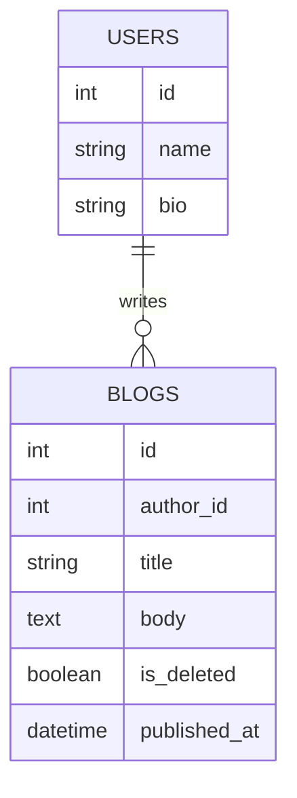

The database defines how users, drafts, published posts, comments, and metadata are stored. It also shapes how easily the system can answer common product questions such as:

- what posts belong to a user
- which posts are published
- how content is ordered

### Soft Delete

`is_deleted` is useful because user-generated content often should not be hard deleted immediately.

The row moves through a lifecycle:

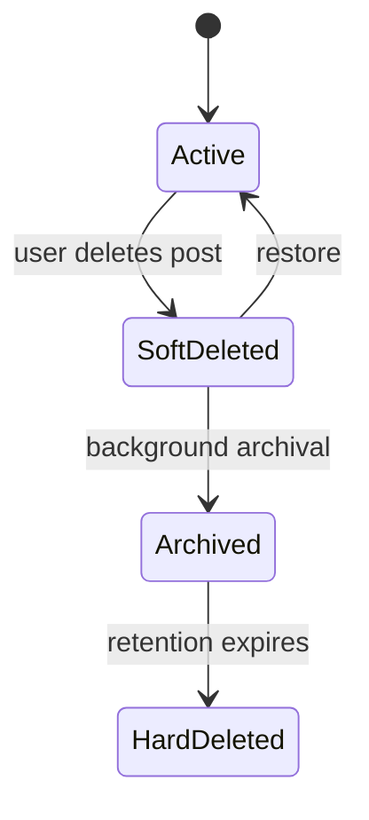

The read path still fetches only active rows:

```sql
SELECT *
FROM blogs
WHERE author_id IN (1, 2, 3)
  AND is_deleted = false;
```

Why keep the row?

- recoverability if the user asks to restore the post
- archival, for example moving deleted content to S3 asynchronously
- audit and compliance reasons
- easier behavior for the storage engine than frequent hard deletes

Hard delete can still happen later during low-load windows, after the data has been archived or is no longer needed.

### Bio vs Body

`bio` and `body` should not be treated the same way.

- `bio` is short text
- `body` can be very large

Large text is often not stored inline with the rest of the row. Databases may keep a pointer in the row and store the large value elsewhere on disk. Short text is much more likely to live directly with the row.

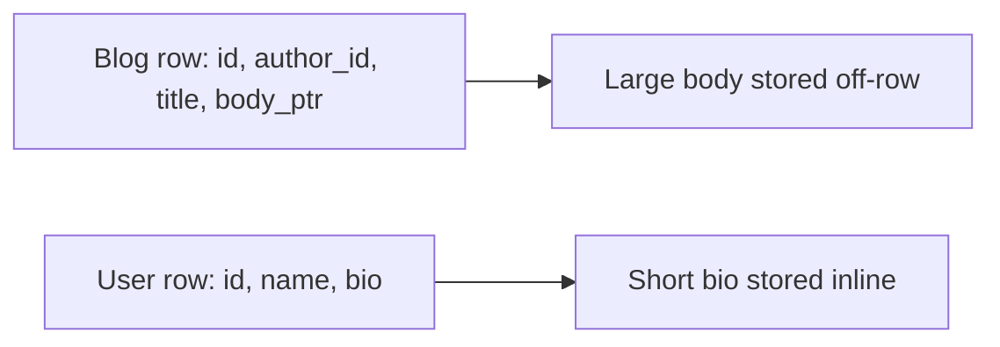

This can improve performance because common queries can read a smaller row first, and fetch the large body only when needed, such as when a user opens the full post page.

### Datetime Representation

Time columns also matter.

A natural design is to use a proper datetime column such as `published_at`. That is usually the right default, and modern databases are much better at handling datetime values than older systems were.

But representation can still matter at scale:

- string-like serialized timestamps are larger
- comparisons over integers are cheap
- if a feature only needs day-level granularity, a compact integer such as `YYYYMMDD` can sometimes work well

For example:

- datetime value: `2022-04-02T09:01:36Z`
- epoch integer: `1648890096`
- day-level integer: `20220402`

Some systems move from general datetime handling to integer-based representations for specific hot paths and see meaningful gains. The rule is not "always use epoch." The rule is: store time in the form that best matches the queries you actually run.

## Caching

Caching helps when the system keeps doing the same expensive work again and again. That expense may be network I/O, disk I/O, a database query, or a heavy computation. If a read is not repetitive, or if the source of truth is already fast enough, adding a cache may just add one more moving part.

The most important caching question is not "should we add Redis?" It is: where is the repeated work happening, and what is the cheapest safe place to remember the answer?

For a blogging platform, caching can exist at many levels:

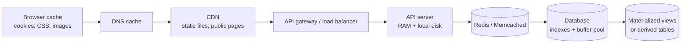

The left side of the diagram is closer to the user. If something can be cached safely near the user, the experience is usually better because the request avoids long network paths and backend work. The right side is closer to the source of truth. Those caches are still useful, but every step to the right usually means more latency and more shared infrastructure.

### Browser Cache

The browser is the closest cache to the user.

For a blogging platform, the browser can cache:

- CSS files
- JavaScript bundles
- logos and images
- fonts
- static HTML for public pages, if the product allows it

Versioned asset names make this safe:

```text
/assets/app.v104.css
/assets/logo.v12.png
```

If the content changes, the filename changes. That lets the browser keep old files for a long time without asking the server again. This saves network I/O, reduces page-load latency, and reduces work on the CDN or origin server.

Cookies are slightly different. A cookie is not a cache of page data. It is a small piece of state the browser sends back with requests, often a session id or auth token. It helps maintain the session so the user does not log in on every page load, but private user data should not be casually cached in the browser.

### DNS Query Cache

Before the browser can call the blogging platform, it needs to resolve the domain name to an IP address.

```text
medium-like.example.com -> 203.0.113.10
```

DNS resolvers and operating systems cache this answer for a TTL. That avoids repeatedly asking the global DNS hierarchy for the same domain. DNS caching saves network round trips before the application request even begins.

The tradeoff is freshness. If the platform changes IPs or routing, old DNS answers may live until the TTL expires.

### CDN Cache

A CDN caches content at edge locations closer to users.

For a blogging platform, a CDN is useful for:

- static assets such as CSS, JavaScript, images, and fonts
- uploaded media such as cover images
- public blog pages that do not change often

The CDN saves long network delays between the user and the origin server. It also protects the API servers and object storage from repeated reads for the same content.

Good cache keys are usually based on the request path and version:

```text
GET /assets/app.v104.css
GET /images/blog-cover-123.v3.jpg
GET /posts/how-caches-work?v=17
```

CDNs are strongest when the content is public, immutable, or versioned. They are risky for private personalized HTML unless the cache key includes the right user-specific dimensions and the headers are configured correctly.

### API Gateway And Load Balancer Cache

An API gateway or load balancer can also cache or remember small pieces of repeated work.

Common examples are:

- rate-limit counters
- auth token verification metadata
- route decisions
- safe `GET` responses for public data

For example, if many anonymous users request the same public blog post, the gateway may be able to serve a cached response without forwarding every request to an API server.

This layer must be conservative. A gateway cache sits before application logic, so it should not accidentally reuse one user's private response for another user.

### API Server Local Cache

The API server can cache in local RAM or local disk.

RAM is fast but limited. If an API server has 8 GB of RAM, the operating system and runtime may already use a meaningful part of it. Filling the rest with an unbounded cache can cause memory pressure and make the server less stable.

Local disk is often underrated. Many cloud instances include local or attached disk that is not fully used by the application. A local disk cache can be useful for data that is expensive to fetch but safe to keep near the API server.

Example:

```text
GET /users/elon-musk-profile
```

If a popular public profile is requested constantly, storing a flat file or serialized object on the API server's local disk can avoid a Redis network call and a database read.

But local disk has a distributed-systems problem: there are usually many API servers.

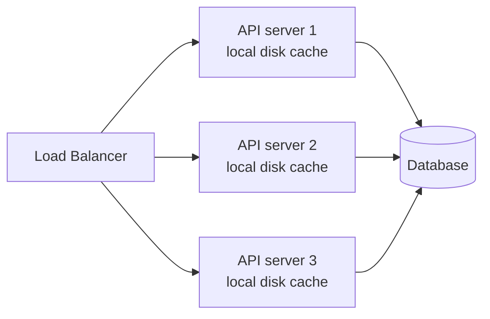

If API server 1 has a cached file and API server 2 does not, users may see different latency depending on where the load balancer sends them. If the profile changes, every server that cached it needs to expire or refresh it.

Local disk caching is best for:

- immutable or versioned objects
- public data where short staleness is acceptable
- expensive remote fetches
- large objects that should not occupy process RAM

It is risky for:

- private user data
- rapidly changing data
- data that must be consistent across all API servers immediately

### Remote Centralized Cache

When people say "add a cache," they often mean a centralized cache such as Redis or Memcached between the API servers and the database.

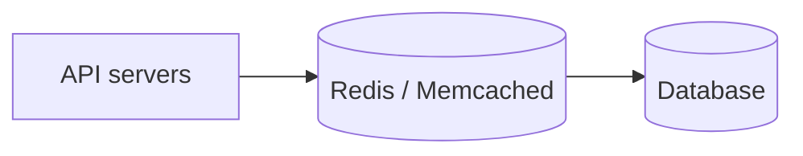

This is useful because all API servers share the same cache. If one server reads a popular blog post from the database and stores it in Redis, the next server can reuse the result.

For a blogging platform, good Redis or Memcached candidates are:

- public blog post metadata
- author profiles
- popular posts
- homepage feed results
- expensive permission or visibility checks

Example cache keys:

```text
post:{post_id}:v{published_version}
author_profile:{user_id}:v{profile_version}
homepage_feed:{locale}:{page}:v{feed_version}
```

This saves database reads, database connections, and repeated query computation. The cost is that Redis is still a remote network call. The cache hit must be meaningfully cheaper than the database path, otherwise the system has added complexity without enough benefit.

### Database Cache

The database is also a server. It usually listens on a TCP port, accepts queries, reads data from disk, and uses memory aggressively to avoid disk I/O.

A database with 8 GB of RAM does not use memory only for query execution. It may use memory for:

- buffer pool or page cache
- hot table pages
- frequently used index pages
- query execution memory
- query plan or statement metadata

The buffer pool is especially important. If a frequently accessed part of a table or index fits in RAM, the database can answer many queries without repeatedly reading those pages from disk.

Indexes are also a form of precomputed access path. If the blogging platform frequently runs:

```sql
SELECT *
FROM blogs
WHERE author_id = 42
  AND is_deleted = false
ORDER BY published_at DESC;
```

then an index on `(author_id, is_deleted, published_at)` can prevent a full table scan. If that index is hot and fits in memory, the database saves expensive disk I/O.

Some databases also have query-result caches, but this should not be assumed. For example, relying on a generic "query cache" is often less predictable than designing the right indexes, buffer pool sizing, and application-level cache keys.

### Materialized Views And Derived Tables

Some reads are expensive because they join or aggregate a lot of data.

Example:

```sql
SELECT author_id, COUNT(*) AS published_posts
FROM blogs
WHERE is_deleted = false
  AND published_at IS NOT NULL
GROUP BY author_id;
```

Running this from scratch on every dashboard request is wasteful. A materialized view or derived table can store the result ahead of time.

```text
author_stats
- author_id
- published_post_count
- last_published_at
```

This is caching at the database or data-model level. It saves repeated joins, scans, aggregations, disk I/O, and CPU. The tradeoff is freshness: the derived value must be updated when posts are published, deleted, restored, or backfilled.

### Choosing The Cache Level

The practical order is:

1. cache immutable static assets close to the user
2. use CDN caching for public content and media
3. use gateway caching only for safe public or infrastructure-level data
4. use API local disk or RAM only when the data can tolerate per-server differences
5. use Redis or Memcached for shared hot reads across API servers
6. design database indexes and buffer pool usage before assuming the database is the bottleneck
7. use materialized views or derived tables for expensive repeated joins and aggregations

Caching only earns its place if the cache hit is meaningfully cheaper than recomputing or refetching the data. Every cache also needs an invalidation story: TTL, versioned key, explicit delete, refresh on write, or rebuild in the background.

## Scaling

Scaling is the system's ability to handle a large number of concurrent requests without falling over or becoming too slow. A design that works for a few thousand users may need a different shape once reads, writes, or traffic spikes increase.

There are two basic scaling strategies:

- vertical scaling: make one machine bigger
- horizontal scaling: add more machines

### Vertical Scaling

Vertical scaling means making the infrastructure bulkier.

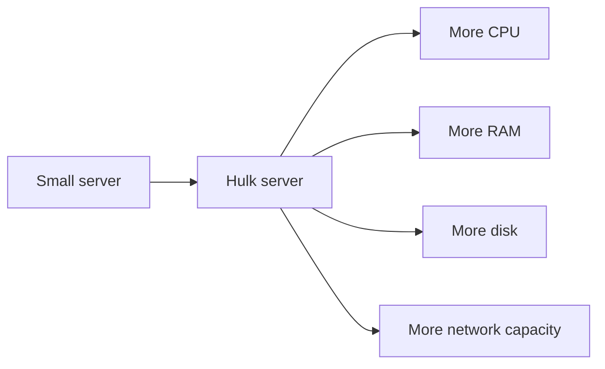

This is the "build a hulk" strategy. It is often the right first move because it keeps the architecture simple. One API server and one database are easier to operate than a fleet of API servers and a distributed database.

Vertical scaling helps when the current machine is running out of:

- CPU
- memory
- disk capacity
- disk I/O
- network bandwidth

But vertical scaling has limits. Hardware components still need to communicate with each other through buses, network cards, storage interfaces, and memory channels. Those interfaces have finite width and throughput. At some point, adding more CPU or storage does not produce a proportional improvement because another part of the machine becomes the bottleneck.

Vertical scaling also creates downtime and availability risk. If the one large server fails, the system may go down with it. One very large server also cannot handle every possible workload. A single vertically scaled machine is not a realistic plan for something like one million concurrent requests.

### Horizontal Scaling

Horizontal scaling means adding more machines.

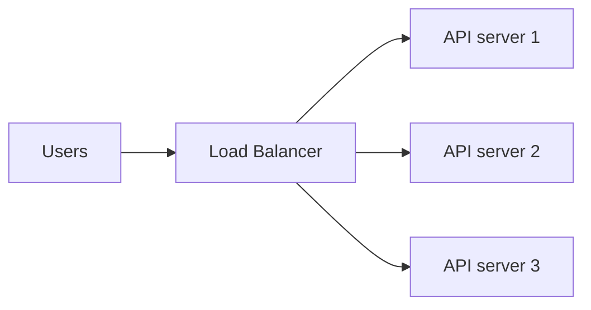

This is the "many minions" strategy. Instead of making one machine extremely powerful, the system spreads requests across many smaller machines.

Horizontal scaling gives two major advantages:

- more capacity
- better fault tolerance

If one API server can handle 1,000 requests per second, then 12,000 requests per second may require around 12 API servers, plus extra headroom. This is not perfect linear scaling, but it is the basic capacity-planning model.

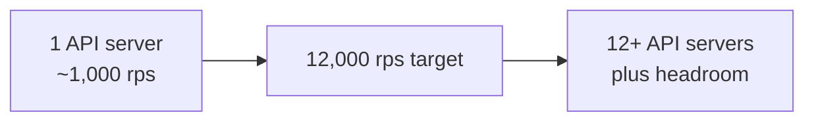

The way to know the number is load testing. Put realistic traffic on one machine and measure:

- requests per second
- p95 and p99 latency
- CPU usage
- memory usage
- database connections
- error rate

Then scale from measured capacity instead of guessing.

Horizontal scaling is powerful, but it increases architecture complexity. The system now has to deal with load balancers, deployments across many machines, distributed logs, network failures, retries, and stateful dependencies.

### A Practical Scaling Plan

For a Medium-like blogging platform, a practical plan is:

1. start simple
2. scale vertically first
3. move to horizontal scaling when business growth justifies the complexity

Early on, a bigger API server, a bigger database instance, better indexes, and good caching may be enough. Prematurely building a distributed architecture can waste engineering time before the product has enough traffic to need it.

Later, the system moves toward this shape:

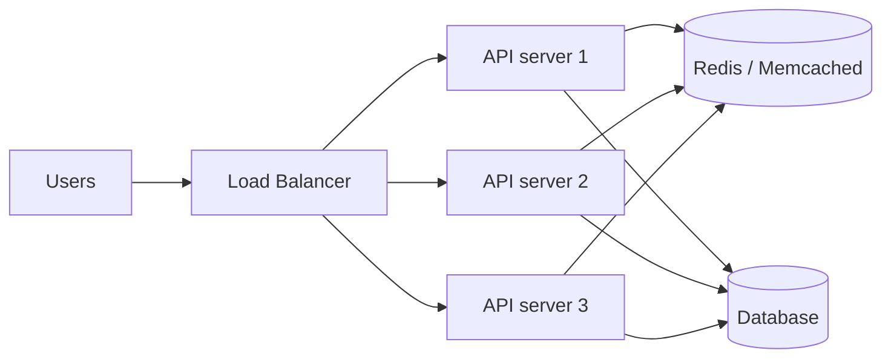

The API servers are usually the easiest part to scale horizontally because they should be mostly stateless. If any API server can handle any request, the load balancer can distribute traffic freely.

Stateful components are harder:

- database
- cache
- search index
- data warehouse
- object storage
- payment or subscription service
- notification service

Anything that stores data or becomes a dependency must be scaled carefully.

### Scale Bottom Up

The golden rule is: scale bottom up.

If the API server depends on the database, cache, search service, or payment service, those dependencies must be able to handle the extra load before more API servers are added.

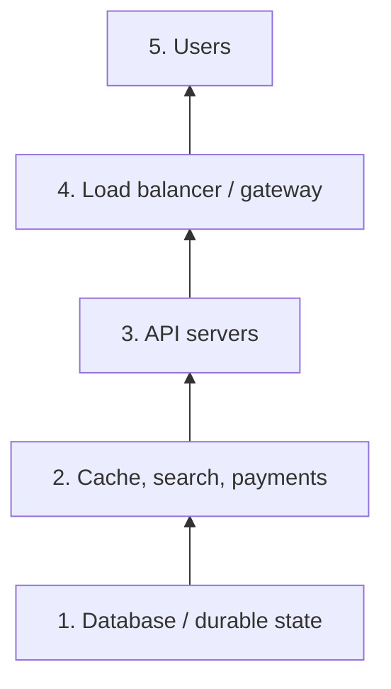

If the API tier is scaled from 3 machines to 30 machines but the database is still a single small instance, the database becomes the bottleneck. The user-facing symptom may look like "API is slow," but the real problem is that every API server is waiting on the same overloaded database.

This shows up in many systems. During a cricket match, a food-ordering app may receive a sudden spike in orders. Scaling only the order API is not enough if that API depends on payment, restaurant availability, inventory, delivery assignment, and notifications. The whole dependency chain must be ready.

For the blogging platform, scaling the homepage API is not enough if every homepage request still runs expensive database queries, calls the ranking service, and fetches profile data from a single small cache.

### Scaling The Database

Databases are stateful, so they are harder to scale than stateless API servers.

The usual order is:

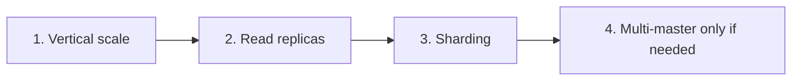

### Database Vertical Scaling

The first database scaling step is usually vertical:

- more RAM for buffer pool and hot indexes
- more CPU for query execution
- faster disk or higher IOPS
- more network throughput
- better instance class

This should be combined with database design work:

- add the right indexes
- remove unnecessary full table scans
- reduce over-fetching
- cache hot reads
- move expensive aggregations to derived tables or materialized views

Many systems get far with one well-tuned primary database before needing a distributed database.

### Read Replicas

Read replicas help when the workload is read-heavy.

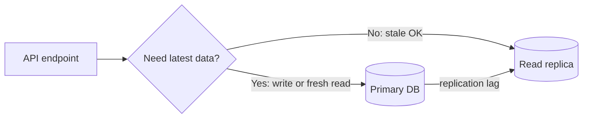

The primary database handles writes. Replicas copy changes from the primary and serve reads. This works well when there are many reads and fewer writes.

For a blogging platform, replica-friendly reads include:

- public author profiles
- public blog post pages
- older comments
- analytics dashboards that tolerate delay
- recommendation inputs that do not need exact current state

Reads that should usually go to the primary include:

- "show me the draft I just saved"
- account settings immediately after an update
- payment or subscription state
- permission checks that must reflect the latest write

In the API server, this often means two database configurations:

```text
PRIMARY_DB_URL=...
REPLICA_DB_URL=...
```

Endpoints that can tolerate stale data use the replica connection pool. Endpoints that need fresh data use the primary connection pool. Some teams put a database proxy between the API and the database to route reads and writes automatically, but the correctness decision still belongs to the application design.

The main risk is replica lag. A user may publish a post, then immediately hit a page served from a replica that has not received the write yet. That is why every endpoint needs an explicit freshness requirement.

### Sharding

Read replicas scale reads, but they do not solve every problem. If one primary database can no longer handle write volume, storage size, or hot working set, the next step may be sharding.

Sharding splits data into mutually exclusive subsets.

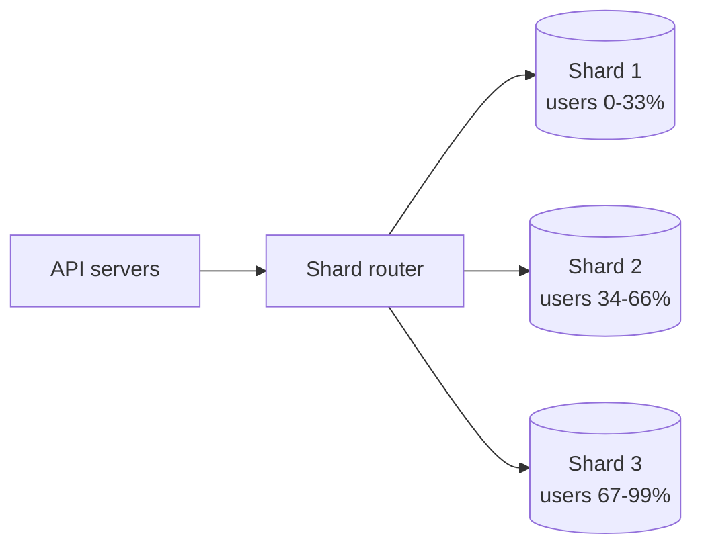

Instead of every row living in one database, one third of the data may live in shard 1, one third in shard 2, and one third in shard 3. Each shard is its own database system and can have its own primary and read replicas.

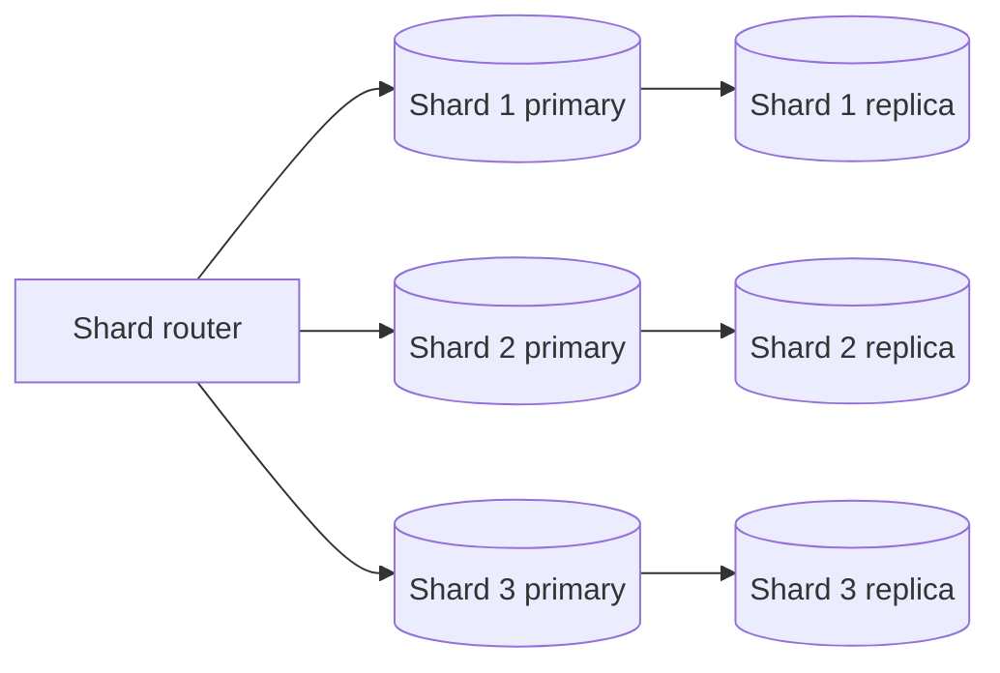

The routing layer decides where a request goes. The route may be based on:

- `user_id`
- `author_id`
- `blog_id`
- organization id
- hash of a stable key

For example:

```text
shard = hash(user_id) % number_of_shards
```

Then all data for that user can be routed to the same shard.

Some databases and data systems have sharding built in, such as Cassandra, MongoDB clusters, and Redis Cluster. In other systems, the application, a proxy, or a custom routing layer decides which database connection to use.

Sharding introduces hard design questions:

- Which key decides the shard?
- What happens if one shard becomes hot?
- How are cross-shard queries handled?
- How are joins handled when data lives on different shards?
- How do you reshard when the number of shards changes?

Sharding is powerful, but it is not the first move. It is usually introduced when vertical scaling, indexing, caching, and read replicas are no longer enough.

### Multi-Master Replication

Multi-master replication means more than one database node can accept writes for the same logical data.

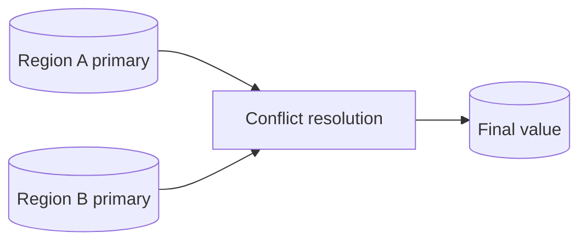

This can help with multi-region writes, high write availability, and lower write latency for users in different regions.

But it is harder than normal sharding because writes may conflict. If two regions update the same user profile at the same time, the system needs conflict resolution rules.

Conflict rules include last-write-wins, version vectors, field-level merge logic, or manual repair.

For most blogging-platform designs, multi-master replication is not the early answer. A single primary per shard is simpler and easier to reason about. Multi-master becomes relevant only when the product has a clear need for active-active writes or region-level write availability.

### Scaling Summary

The useful mental model is:

1. measure one machine with load testing
2. vertically scale while the architecture is simple
3. horizontally scale stateless API servers with a load balancer
4. scale dependencies before scaling the services that depend on them
5. scale the database vertically first
6. use read replicas for read-heavy workloads
7. use sharding when one primary cannot handle write volume or data size
8. use multi-master only when the system truly needs active-active writes

## Delegation

Not every task should happen in the request path. Some work can be delegated to background workers, such as sending notifications, rebuilding search indexes, or processing uploaded media.

## Concurrency

Concurrency becomes important when multiple users or processes interact with the same data at the same time. Draft updates, comment creation, and publish actions can all introduce race conditions if not handled carefully.

## Communication

Communication covers how the parts of the system talk to each other. That includes client-to-server communication, API boundaries, and service-to-service calls if the system grows beyond a single backend.

## Next Step

A useful way to continue this design is to take each factor one by one and ask:

- what is the simplest version?
- what breaks first?
- what should be improved next?
