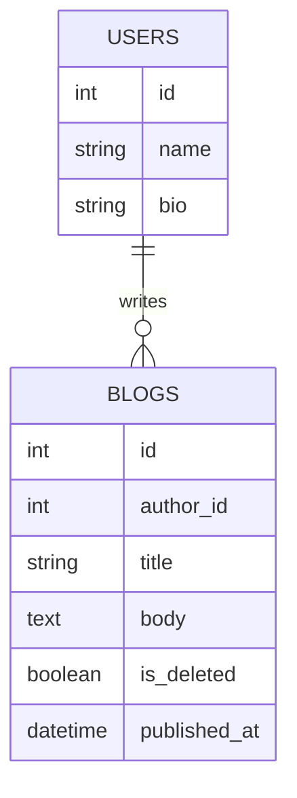
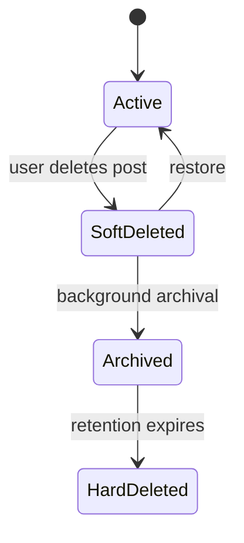
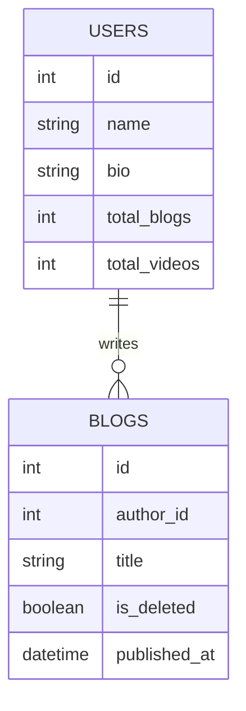

# Designing a Multi-User Blogging Platform

A multi-user blogging platform is a good system design exercise because even a simple product touches many foundational ideas. Users create accounts, write posts, edit drafts, publish content, and read material created by others. As more users and features are added, the design naturally starts depending on a few recurring system design factors.

This draft keeps those factors brief for now:

## The Six Factors

- Database
- Caching
- Scaling
- Delegation
- Concurrency
- Communication

Almost every design decision will affect one or more of these areas.

## Database

For a Medium-like multi-user blogging platform, a simple starting point is one user writing many blogs:



The database defines how users, drafts, published posts, comments, and metadata are stored. It also shapes how easily the system can answer common product questions such as:

- what posts belong to a user
- which posts are published
- how content is ordered

### Soft Delete

`is_deleted` is useful because user-generated content often should not be hard deleted immediately.

The row moves through a lifecycle:



The read path still fetches only active rows:

```sql
SELECT *
FROM blogs
WHERE author_id IN (1, 2, 3)
  AND is_deleted = false;
```

Why keep the row?

- recoverability if the user asks to restore the post
- archival, for example moving deleted content to S3 asynchronously
- audit and compliance reasons
- easier behavior for the storage engine than frequent hard deletes

Hard delete can still happen later during low-load windows, after the data has been archived or is no longer needed.

### Bio vs Body

`bio` and `body` should not be treated the same way.

- `bio` is short text
- `body` can be very large

Large text is often not stored inline with the rest of the row. Databases may keep a pointer in the row and store the large value elsewhere on disk. Short text is much more likely to live directly with the row.

```text
User row
+------------------+
| id | name | bio  |      bio is short, so it can live inline
+------------------+

Blog row
+-----------------------------+        +-------------------+
| id | author_id | title | ptr | -----> | large blog body   |
+-----------------------------+        +-------------------+
```

This can improve performance because common queries can read a smaller row first, and fetch the large body only when needed, such as when a user opens the full post page.

### Datetime Representation

Time columns also matter.

A natural design is to use a proper datetime column such as `published_at`. That is usually the right default, and modern databases are much better at handling datetime values than older systems were.

But representation can still matter at scale:

- string-like serialized timestamps are larger
- comparisons over integers are cheap
- if a feature only needs day-level granularity, a compact integer such as `YYYYMMDD` can sometimes work well

For example:

- datetime value: `2022-04-02T09:01:36Z`
- epoch integer: `1648890096`
- day-level integer: `20220402`

Some systems move from general datetime handling to integer-based representations for specific hot paths and see meaningful gains. The rule is not "always use epoch." The rule is: store time in the form that best matches the queries you actually run.

## Caching

Caching helps when the system keeps doing the same expensive work again and again. That expense may be network I/O, disk I/O, a database query, or a heavy computation. If a read is not repetitive, or if the source of truth is already fast enough, adding a cache may just add one more moving part.

The most important caching question is not "should we add Redis?" It is: where is the repeated work happening, and what is the cheapest safe place to remember the answer?

For a blogging platform, caching can exist at many levels:

```text
closer to user                                                   closer to source of truth

[Browser]
  cookies, CSS, images
      |
[DNS cache]
      |
[CDN]
  static files, public pages
      |
[API gateway / load balancer]
      |
[API server]
  RAM + local disk
      |
[Redis / Memcached]
      |
[Database]
  indexes + buffer pool
      |
[Materialized views / derived tables]
```

The left side of the diagram is closer to the user. If something can be cached safely near the user, the experience is usually better because the request avoids long network paths and backend work. The right side is closer to the source of truth. Those caches are still useful, but every step to the right usually means more latency and more shared infrastructure.

### Browser Cache

The browser is the closest cache to the user.

For a blogging platform, the browser can cache:

- CSS files
- JavaScript bundles
- logos and images
- fonts
- static HTML for public pages, if the product allows it

Versioned asset names make this safe:

```text
/assets/app.v104.css
/assets/logo.v12.png
```

If the content changes, the filename changes. That lets the browser keep old files for a long time without asking the server again. This saves network I/O, reduces page-load latency, and reduces work on the CDN or origin server.

Cookies are slightly different. A cookie is not a cache of page data. It is a small piece of state the browser sends back with requests, often a session id or auth token. It helps maintain the session so the user does not log in on every page load, but private user data should not be casually cached in the browser.

### DNS Query Cache

Before the browser can call the blogging platform, it needs to resolve the domain name to an IP address.

```text
medium-like.example.com -> 203.0.113.10
```

DNS resolvers and operating systems cache this answer for a TTL. That avoids repeatedly asking the global DNS hierarchy for the same domain. DNS caching saves network round trips before the application request even begins.

The tradeoff is freshness. If the platform changes IPs or routing, old DNS answers may live until the TTL expires.

### CDN Cache

A CDN caches content at edge locations closer to users.

For a blogging platform, a CDN is useful for:

- static assets such as CSS, JavaScript, images, and fonts
- uploaded media such as cover images
- public blog pages that do not change often

The CDN saves long network delays between the user and the origin server. It also protects the API servers and object storage from repeated reads for the same content.

Good cache keys are usually based on the request path and version:

```text
GET /assets/app.v104.css
GET /images/blog-cover-123.v3.jpg
GET /posts/how-caches-work?v=17
```

CDNs are strongest when the content is public, immutable, or versioned. They are risky for private personalized HTML unless the cache key includes the right user-specific dimensions and the headers are configured correctly.

### API Gateway And Load Balancer Cache

An API gateway or load balancer can also cache or remember small pieces of repeated work.

Common examples are:

- rate-limit counters
- auth token verification metadata
- route decisions
- safe `GET` responses for public data

For example, if many anonymous users request the same public blog post, the gateway may be able to serve a cached response without forwarding every request to an API server.

This layer must be conservative. A gateway cache sits before application logic, so it should not accidentally reuse one user's private response for another user.

### API Server Local Cache

The API server can cache in local RAM or local disk.

RAM is fast but limited. If an API server has 8 GB of RAM, the operating system and runtime may already use a meaningful part of it. Filling the rest with an unbounded cache can cause memory pressure and make the server less stable.

Local disk is often underrated. Many cloud instances include local or attached disk that is not fully used by the application. A local disk cache can be useful for data that is expensive to fetch but safe to keep near the API server.

Example:

```text
GET /users/elon-musk-profile
```

If a popular public profile is requested constantly, storing a flat file or serialized object on the API server's local disk can avoid a Redis network call and a database read.

But local disk has a distributed-systems problem: there are usually many API servers.

```text
                 +-----------------------------+
                 |        Load balancer        |
                 +-----------------------------+
                    |            |            |
                    v            v            v
              +----------+  +----------+  +----------+
              | API 1    |  | API 2    |  | API 3    |
              | disk hit |  | no file  |  | disk hit |
              +----------+  +----------+  +----------+
                    \            |            /
                     \           v           /
                      +---------------------+
                      |      Database       |
                      +---------------------+
```

If API server 1 has a cached file and API server 2 does not, users may see different latency depending on where the load balancer sends them. If the profile changes, every server that cached it needs to expire or refresh it.

Local disk caching is best for:

- immutable or versioned objects
- public data where short staleness is acceptable
- expensive remote fetches
- large objects that should not occupy process RAM

It is risky for:

- private user data
- rapidly changing data
- data that must be consistent across all API servers immediately

### Remote Centralized Cache

When people say "add a cache," they often mean a centralized cache such as Redis or Memcached between the API servers and the database.

```text
API servers
    |
    v
+-------------------+
| Redis / Memcached |
| shared hot reads  |
+-------------------+
    |
    v
+----------+
| Database |
+----------+
```

This is useful because all API servers share the same cache. If one server reads a popular blog post from the database and stores it in Redis, the next server can reuse the result.

For a blogging platform, good Redis or Memcached candidates are:

- public blog post metadata
- author profiles
- popular posts
- homepage feed results
- expensive permission or visibility checks

Example cache keys:

```text
post:{post_id}:v{published_version}
author_profile:{user_id}:v{profile_version}
homepage_feed:{locale}:{page}:v{feed_version}
```

This saves database reads, database connections, and repeated query computation. The cost is that Redis is still a remote network call. The cache hit must be meaningfully cheaper than the database path, otherwise the system has added complexity without enough benefit.

### Database Cache

The database is also a server. It usually listens on a TCP port, accepts queries, reads data from disk, and uses memory aggressively to avoid disk I/O.

A database with 8 GB of RAM does not use memory only for query execution. It may use memory for:

- buffer pool or page cache
- hot table pages
- frequently used index pages
- query execution memory
- query plan or statement metadata

The buffer pool is especially important. If a frequently accessed part of a table or index fits in RAM, the database can answer many queries without repeatedly reading those pages from disk.

Indexes are also a form of precomputed access path. If the blogging platform frequently runs:

```sql
SELECT *
FROM blogs
WHERE author_id = 42
  AND is_deleted = false
ORDER BY published_at DESC;
```

then an index on `(author_id, is_deleted, published_at)` can prevent a full table scan. If that index is hot and fits in memory, the database saves expensive disk I/O.

Some databases also have query-result caches, but this should not be assumed. For example, relying on a generic "query cache" is often less predictable than designing the right indexes, buffer pool sizing, and application-level cache keys.

### Materialized Views And Derived Tables

Some reads are expensive because they join or aggregate a lot of data.

Example:

```sql
SELECT author_id, COUNT(*) AS published_posts
FROM blogs
WHERE is_deleted = false
  AND published_at IS NOT NULL
GROUP BY author_id;
```

Running this from scratch on every dashboard request is wasteful. A materialized view or derived table can store the result ahead of time.

```text
author_stats
- author_id
- published_post_count
- last_published_at
```

This is caching at the database or data-model level. It saves repeated joins, scans, aggregations, disk I/O, and CPU. The tradeoff is freshness: the derived value must be updated when posts are published, deleted, restored, or backfilled.

### Choosing The Cache Level

The practical order is:

1. cache immutable static assets close to the user
2. use CDN caching for public content and media
3. use gateway caching only for safe public or infrastructure-level data
4. use API local disk or RAM only when the data can tolerate per-server differences
5. use Redis or Memcached for shared hot reads across API servers
6. design database indexes and buffer pool usage before assuming the database is the bottleneck
7. use materialized views or derived tables for expensive repeated joins and aggregations

Caching only earns its place if the cache hit is meaningfully cheaper than recomputing or refetching the data. Every cache also needs an invalidation story: TTL, versioned key, explicit delete, refresh on write, or rebuild in the background.

## Scaling

Scaling is the system's ability to handle a large number of concurrent requests without falling over or becoming too slow. A design that works for a few thousand users may need a different shape once reads, writes, or traffic spikes increase.

There are two basic scaling strategies:

- vertical scaling: make one machine bigger
- horizontal scaling: add more machines

### Vertical Scaling

Vertical scaling means making the infrastructure bulkier.

```text
Vertical scaling: build a bigger machine

+--------------+        +-------------------------------+
| small server |  --->  | hulk server                   |
+--------------+        | more CPU                      |
                        | more RAM                      |
                        | more disk                     |
                        | more network capacity         |
                        +-------------------------------+
```

This is the "build a hulk" strategy. It is often the right first move because it keeps the architecture simple. One API server and one database are easier to operate than a fleet of API servers and a distributed database.

Vertical scaling helps when the current machine is running out of:

- CPU
- memory
- disk capacity
- disk I/O
- network bandwidth

But vertical scaling has limits. Hardware components still need to communicate with each other through buses, network cards, storage interfaces, and memory channels. Those interfaces have finite width and throughput. At some point, adding more CPU or storage does not produce a proportional improvement because another part of the machine becomes the bottleneck.

Vertical scaling also creates downtime and availability risk. If the one large server fails, the system may go down with it. One very large server also cannot handle every possible workload. A single vertically scaled machine is not a realistic plan for something like one million concurrent requests.

### Horizontal Scaling

Horizontal scaling means adding more machines.

```text
Horizontal scaling: add more machines

Users
  |
  v
+----------------+
| Load balancer  |
+----------------+
   |        |        |
   v        v        v
+------+ +------+ +------+
| API1 | | API2 | | API3 |
+------+ +------+ +------+
```

This is the "many minions" strategy. Instead of making one machine extremely powerful, the system spreads requests across many smaller machines.

Horizontal scaling gives two major advantages:

- more capacity
- better fault tolerance

If one API server can handle 1,000 requests per second, then 12,000 requests per second may require around 12 API servers, plus extra headroom. This is not perfect linear scaling, but it is the basic capacity-planning model.

```text
Load test result:
    1 API server ~= 1,000 requests/second

Traffic target:
    12,000 requests/second

Capacity estimate:
    12 API servers + headroom
```

The way to know the number is load testing. Put realistic traffic on one machine and measure:

- requests per second
- p95 and p99 latency
- CPU usage
- memory usage
- database connections
- error rate

Then scale from measured capacity instead of guessing.

Horizontal scaling is powerful, but it increases architecture complexity. The system now has to deal with load balancers, deployments across many machines, distributed logs, network failures, retries, and stateful dependencies.

### A Practical Scaling Plan

For a Medium-like blogging platform, a practical plan is:

1. start simple
2. scale vertically first
3. move to horizontal scaling when business growth justifies the complexity

Early on, a bigger API server, a bigger database instance, better indexes, and good caching may be enough. Prematurely building a distributed architecture can waste engineering time before the product has enough traffic to need it.

Later, the system moves toward this shape:

```text
Users
  |
  v
+----------------+
| Load balancer  |
+----------------+
   |        |        |
   v        v        v
+------+ +------+ +------+
| API1 | | API2 | | API3 |
+------+ +------+ +------+
   |        |        |
   +--------+--------+-------> Redis / Memcached
   |        |        |
   +--------+--------+-------> Database
```

The API servers are usually the easiest part to scale horizontally because they should be mostly stateless. If any API server can handle any request, the load balancer can distribute traffic freely.

Stateful components are harder:

- database
- cache
- search index
- data warehouse
- object storage
- payment or subscription service
- notification service

Anything that stores data or becomes a dependency must be scaled carefully.

### Scale Bottom Up

The golden rule is: scale bottom up.

If the API server depends on the database, cache, search service, or payment service, those dependencies must be able to handle the extra load before more API servers are added.

```text
Scale from the bottom up:

5. Users
     ^
4. Load balancer / gateway
     ^
3. API servers
     ^
2. Cache, search, payments
     ^
1. Database / durable state
```

If the API tier is scaled from 3 machines to 30 machines but the database is still a single small instance, the database becomes the bottleneck. The user-facing symptom may look like "API is slow," but the real problem is that every API server is waiting on the same overloaded database.

This shows up in many systems. During a cricket match, a food-ordering app may receive a sudden spike in orders. Scaling only the order API is not enough if that API depends on payment, restaurant availability, inventory, delivery assignment, and notifications. The whole dependency chain must be ready.

For the blogging platform, scaling the homepage API is not enough if every homepage request still runs expensive database queries, calls the ranking service, and fetches profile data from a single small cache.

### Scaling The Database

Databases are stateful, so they are harder to scale than stateless API servers.

The usual order is:

```text
Database scaling path:

1. vertical scale
        |
        v
2. read replicas
        |
        v
3. sharding
        |
        v
4. multi-master only if needed
```

### Database Vertical Scaling

The first database scaling step is usually vertical:

- more RAM for buffer pool and hot indexes
- more CPU for query execution
- faster disk or higher IOPS
- more network throughput
- better instance class

This should be combined with database design work:

- add the right indexes
- remove unnecessary full table scans
- reduce over-fetching
- cache hot reads
- move expensive aggregations to derived tables or materialized views

Many systems get far with one well-tuned primary database before needing a distributed database.

### Read Replicas

Read replicas help when the workload is read-heavy.

```text
API endpoint asks: do I need the latest value?

yes: write or fresh read
        |
        v
    Primary DB

no: stale data is acceptable
        |
        v
    Read replica

Primary DB  --replication delay-->  Read replica
```

The primary database handles writes. Replicas copy changes from the primary and serve reads. This works well when there are many reads and fewer writes.

For a blogging platform, replica-friendly reads include:

- public author profiles
- public blog post pages
- older comments
- analytics dashboards that tolerate delay
- recommendation inputs that do not need exact current state

Reads that should usually go to the primary include:

- "show me the draft I just saved"
- account settings immediately after an update
- payment or subscription state
- permission checks that must reflect the latest write

In the API server, this often means two database configurations:

```text
PRIMARY_DB_URL=...
REPLICA_DB_URL=...
```

Endpoints that can tolerate stale data use the replica connection pool. Endpoints that need fresh data use the primary connection pool. Some teams put a database proxy between the API and the database to route reads and writes automatically, but the correctness decision still belongs to the application design.

The main risk is replica lag. A user may publish a post, then immediately hit a page served from a replica that has not received the write yet. That is why every endpoint needs an explicit freshness requirement.

### Sharding

Read replicas scale reads, but they do not solve every problem. If one primary database can no longer handle write volume, storage size, or hot working set, the next step may be sharding.

Sharding splits data into mutually exclusive subsets.

```text
API servers
    |
    v
+--------------+
| Shard router |
+--------------+
   |        |        |
   v        v        v
+------+ +------+ +------+
| DB 1 | | DB 2 | | DB 3 |
| 0-33%| |34-66%| |67-99%|
+------+ +------+ +------+
```

Instead of every row living in one database, one third of the data may live in shard 1, one third in shard 2, and one third in shard 3. Each shard is its own database system and can have its own primary and read replicas.

```text
              +--------------+
              | Shard router |
              +--------------+
                 |      |      |
                 v      v      v
              +-----+ +-----+ +-----+
Primary       | S1  | | S2  | | S3  |
              +-----+ +-----+ +-----+
                 |      |      |
                 v      v      v
Replica       +-----+ +-----+ +-----+
              | S1r | | S2r | | S3r |
              +-----+ +-----+ +-----+
```

The routing layer decides where a request goes. The route may be based on:

- `user_id`
- `author_id`
- `blog_id`
- organization id
- hash of a stable key

For example:

```text
shard = hash(user_id) % number_of_shards
```

Then all data for that user can be routed to the same shard.

Some databases and data systems have sharding built in, such as Cassandra, MongoDB clusters, and Redis Cluster. In other systems, the application, a proxy, or a custom routing layer decides which database connection to use.

Sharding introduces hard design questions:

- Which key decides the shard?
- What happens if one shard becomes hot?
- How are cross-shard queries handled?
- How are joins handled when data lives on different shards?
- How do you reshard when the number of shards changes?

Sharding is powerful, but it is not the first move. It is usually introduced when vertical scaling, indexing, caching, and read replicas are no longer enough.

### Multi-Master Replication

Multi-master replication means more than one database node can accept writes for the same logical data.

```text
Region A primary writes value A
            \
             v
        +---------------------+       +-------------+
        | conflict resolution | ----> | final value |
        +---------------------+       +-------------+
             ^
            /
Region B primary writes value B
```

This can help with multi-region writes, high write availability, and lower write latency for users in different regions.

But it is harder than normal sharding because writes may conflict. If two regions update the same user profile at the same time, the system needs conflict resolution rules.

Conflict rules include last-write-wins, version vectors, field-level merge logic, or manual repair.

For most blogging-platform designs, multi-master replication is not the early answer. A single primary per shard is simpler and easier to reason about. Multi-master becomes relevant only when the product has a clear need for active-active writes or region-level write availability.

### Scaling Summary

The useful mental model is:

1. measure one machine with load testing
2. vertically scale while the architecture is simple
3. horizontally scale stateless API servers with a load balancer
4. scale dependencies before scaling the services that depend on them
5. scale the database vertically first
6. use read replicas for read-heavy workloads
7. use sharding when one primary cannot handle write volume or data size
8. use multi-master only when the system truly needs active-active writes

## Delegation

Delegation means moving work out of the user-facing request path and giving it to another component to finish later. It is one of the most underused performance levers in backend design.

The performance mantra is:

```text
What does not need to be done in realtime should not be done in realtime.
```

The core idea is: delegate as much as correctness allows, then respond.

There are two common shapes:

- task delegation: "do this job later"
- event delegation: "this happened; interested systems can react"

```text
1. Client sends request
        |
        v
2. API validates and saves required state
        |
        +-----------------------> Broker stores task/event
        |                             |
        v                             v
3. API responds now              Workers process later
                                      |
                                      v
                                  update DB / search / metrics
```

The API should do only the work required to make the request correct, durable, and safe. Then it should hand off non-urgent work to a broker and return a response to the user.

### What Should Be Delegated

Good delegated work usually has one of these properties:

- long-running tasks, such as video encoding or spinning up a virtual machine
- heavy computation, such as analytics, ranking jobs, or a huge Redshift query over 1 TB of data
- batch reads or writes
- work that can be eventually consistent
- side effects, such as emails, notifications, search indexing, and metrics

Work that should usually stay in the request path:

- authentication and authorization
- validating the request
- saving the source-of-truth write
- payment confirmation before showing payment success
- anything the user must see immediately after the response

For example, when a user publishes a blog post, the API should save the blog before responding. But the API does not need to rebuild search indexes, recompute analytics, update recommendation features, and send emails before the user gets a response.

The same idea applies outside blogging. When a cloud provider provisions a virtual machine, the HTTP request usually registers a task and returns a job id. Workers then create the VM asynchronously. For a huge warehouse query, the request should register the query, let workers run it, and upload the result somewhere. The client should not keep a TCP connection open for the whole job.

### Analytics Example

Suppose the profile page shows the number of essays written by an author:

```text
Vallari Mehta
ML Engineer, interested in human behaviour
20 essays
0 videos
```

One way to compute this is to count blogs and videos every time the profile page loads:

```sql
SELECT COUNT(*)
FROM blogs
WHERE author_id = 42
  AND is_deleted = false
  AND published_at IS NOT NULL;
```

That is unnecessary repeated work. These counts do not need to be recomputed in realtime for every profile view.

A simple delegated design stores a precomputed counter:



When a blog is published or a video is added, emit an event and let a worker update the profile metrics:

```text
Author publishes blog or adds video
        |
        v
      API
        |
        +--> save source row in Database
        |
        +--> emit BlogPublished or VideoAdded
             into Broker
        |
        +--> respond now

Later:
Broker --> Profile metrics worker --> total_blogs++ / total_videos++ in DB
```

When a blog is deleted, emit a delete event and decrement the counter:

```text
BlogDeleted event
        |
        v
Broker  -->  Counter worker  -->  total_blogs-- in Database
```

This is a crude example, but it shows the pattern: avoid joins and runtime computation by maintaining a derived value asynchronously.

The tradeoff is freshness. The profile may show `20 essays` for a few seconds or minutes after the author publishes the 21st essay. That delay is acceptable for many metrics. If exact read-after-write behavior is required, the counter update must happen in the request path or the profile read must use the source table.

### Broker

A broker stores messages and lets consumers retrieve them later. It is the buffer between "the request happened" and "the background work finished."

```text
Producer
   |
   v
+------------------------------+
| Broker buffer                |
| tasks / events wait here     |
+------------------------------+
   |            |            |
   v            v            v
Consumer 1   Consumer 2   Consumer 3
```

The broker decouples the API from the workers:

- the API can respond without waiting for workers
- workers can be scaled independently
- temporary worker failures do not immediately break user requests
- traffic spikes become backlog instead of instant overload

In many systems, consumers poll the broker or maintain an open connection to receive work. The important point is that workers retrieve work from the broker instead of the API directly calling a specific worker.

Two common broker styles are message queues and message streams.

### Message Queues

Message queues are good when each task should be handled by one worker.

Examples:

- SQS
- RabbitMQ

```text
Producer adds a task at the back
            |
            v
        +-------------------------------+
Queue   | task-1 | task-2 | task-3 | ... |
        +-------------------------------+
                         |
                         | one task goes to one consumer
                         v
              +----------+----------+
              |          |          |
              v          v          v
          Consumer   Consumer   Consumer
```

The producer adds a message to the back of the queue. Consumers continuously read from the queue. Once a consumer finishes processing the message, it acknowledges or deletes the message so another consumer does not process the same job again.

Queue consumers are usually homogeneous. Any consumer can handle any job from that queue, and it does not matter which worker gets the message.

Good queue use cases for the blogging platform:

- send one welcome email
- resize one uploaded image
- process one export job
- update one author counter

A single queue is not ideal when the same event must be consumed by multiple independent systems. If both search indexing and analytics need the same `BlogPublished` event, one shared queue can cause only one consumer type to receive a given message.

With queue-based systems, fan-out usually means one queue per consumer type:

```text
                         +----------------+ --> Search worker
                         | Search queue   |
                         +----------------+
API -> fan-out publisher
                         +----------------+ --> Analytics worker
                         | Analytics queue|
                         +----------------+

                         +----------------+ --> Counter worker
                         | Counter queue  |
                         +----------------+
```

In AWS, this is commonly done with SNS publishing to multiple SQS queues.

### Message Streams

Message streams are good when the same event should be consumed by multiple independent systems.

Examples:

- Kafka
- Kinesis

```text
API appends events to the stream
            |
            v
        +--------------------------------------------------+
Stream  | e1 BlogPublished | e2 BlogDeleted | e3 VideoAdded |
        +--------------------------------------------------+
              |                   |                    |
              |                   |                    |
              v                   v                    v
        Search consumers    Analytics consumers    Counter consumers
        index in ES         update metrics         update DB counters
```

The stream stores events in retained logs. Messages are not deleted just because one consumer reads them. They remain until the stream retention policy removes them, for example after 7 days or 30 days.

Different consumer groups can read the same event independently:

```text
One event in the stream:

        BlogPublished(blog_id=10, author_id=42)
                         |
        +----------------+----------------+
        |                |                |
        v                v                v
   Search group    Analytics group   Counter group
   indexes blog    updates metrics   total_blogs++
```

For a blogging platform, this is useful because one `BlogPublished` event may need to drive several workflows:

- update `users.total_blogs`
- index the blog in Elasticsearch
- update analytics
- feed recommendation features
- notify followers

Each workflow can have its own workers, scaling, retry policy, and deployment lifecycle.

The difference is:

| Question | Message queue | Message stream |
| --- | --- | --- |
| Who should process a message? | One worker from a homogeneous pool | Many independent consumer groups |
| What happens after processing? | Message is acknowledged or deleted | Message remains until retention expires |
| Best for | Jobs and tasks | Events and fan-out |
| Examples | SQS, RabbitMQ | Kafka, Kinesis |

### Separation Of Concerns

This design is tempting:

```text
Bad long-term shape:

User
 |
 v
+-----+     on-publish       +------------------+
| API | -------------------> | SQS / queue      |
+-----+                      +------------------+
  |                                  |
  | save blog                        v
  v                           +-------------+
+----------+                  | one worker  |
| Database | <--------------- |             |
+----------+  total_blogs++   |             |
                              |             | ----> Elasticsearch
                              |             |       index blog
                              +-------------+

Problem: the same worker owns counters and search indexing.
```

It works for a demo, but it is not a good long-term design. One worker is doing two different jobs: maintaining counters and indexing search. Those jobs may belong to different teams, scale differently, fail differently, and need different retry behavior.

A cleaner design uses one event and multiple consumers:

```text
Cleaner shape:

Same event, consumed by two types of consumers:

User
 |
 v
+-----+     BlogPublished      +----------------------+
| API | ---------------------> | Kafka topic          |
+-----+                       | retained event log   |
  |                           +----------------------+
  | save blog                         |             |
  v                                   |             |
+----------+                          |             |
| Database | <------------------------+             |
+----------+   Counter service workers              |
               total_blogs++                        |
                                                    v
                                      +--------------------------+
                                      | Search service workers   |
                                      +--------------------------+
                                                    |
                                                    v
                                      +--------------------------+
                                      | Elasticsearch            |
                                      +--------------------------+
```

The API emits the fact that something happened. Other systems decide what to do with that fact.

This is the real value of the stream: each consumer group moves at its own pace. Analytics or counter workers may process events quickly, while search workers can lag behind because indexing is heavier, and neither blocks the other. Each team can own separate code, deploy independently, scale independently, and retry failures without forcing changes into the publishing API.

### Kafka Essentials

Kafka is a message stream. A topic is a named log of events.

An event is a fact that already happened:

- `BlogPublished`
- `BlogDeleted`
- `NotificationSent`
- `TweetPosted`
- `TweetLiked`

One system usually has many topics:

```text
Kafka cluster

+-----------------------+
| topic: blog_events    |  BlogPublished, BlogDeleted, VideoAdded
+-----------------------+

+-----------------------+
| topic: notify_events  |  NotificationSent, EmailRequested
+-----------------------+

+-----------------------+
| topic: tweet_events   |  TweetPosted, TweetLiked
+-----------------------+
```

Each message carries the details consumers need:

```text
BlogPublished
- event_id: evt_123
- blog_id: 10
- author_id: 42
- title: "Caching At Different Levels"
- published_at: 2026-05-09T10:00:00Z
```

Each topic has `n` partitions. When a producer publishes a message, Kafka places it into one partition. The partition is chosen from the partition key.

```text
Producer sends:
BlogPublished(blog_id=10, author_id=42)
key = author_id:42

partition = hash(author_id:42) % 3

                    topic: blog_events
                 +----------------------+
                 | partition 0          |
Producer --------> partition 1  event   |
                 | partition 2          |
                 +----------------------+
```

Partitions are the concurrency unit of Kafka. If a topic has 3 partitions, one consumer group can actively use at most 3 consumers for that topic.

```text
topic: blog_events

+----------------+   +----------------+   +----------------+
| partition 0    |   | partition 1    |   | partition 2    |
+----------------+   +----------------+   +----------------+

Case A: one search consumer

search consumer 1 owns partition 0, partition 1, partition 2

Case B: three search consumers

partition 0  -->  search consumer 1
partition 1  -->  search consumer 2
partition 2  -->  search consumer 3

Case C: five search consumers

partition 0  -->  search consumer 1
partition 1  -->  search consumer 2
partition 2  -->  search consumer 3
no partition -->  search consumer 4 waits idle
no partition -->  search consumer 5 waits idle
```

Adding more consumers than partitions does not increase throughput inside the same consumer group. To use more consumers, add more partitions and let Kafka rebalance partition ownership.

Ordering is only guaranteed inside one partition.

```text
partition 1

+----------------+----------------+----------------+
| message 101    | message 102    | message 103    |
+----------------+----------------+----------------+
      first              then              then
```

There is no global ordering across partitions:

```text
partition 0:  message A1 -> message A2 -> message A3
partition 1:  message B1 -> message B2 -> message B3
partition 2:  message C1 -> message C2 -> message C3

Kafka does not promise one total order across A, B, and C.
```

That is why partition-key design matters. Choose the key based on what the consumer needs to process in order.

Good partition-key examples:

- `author_id` for author counters, because `BlogPublished` and `BlogDeleted` for one author should update `total_blogs` in order
- `blog_id` for search indexing, because `BlogPublished`, `BlogUpdated`, and `BlogDeleted` for one blog should reach search workers in order
- `user_id` for notifications, because notification state for one user is often processed sequentially
- `tweet_id` for likes on a tweet, if the consumer maintains derived counters per tweet

A poor key can create hot partitions. If one celebrity author gets most traffic and the key is `author_id`, one partition may become overloaded while others sit mostly empty. In that case, you may need a different key, more partitions, or a separate design for hot entities.

Consumer groups track their own position in each partition using offsets.

```text
topic: blog_events, partition 1

+-----------+-----------+-----------+-----------+-----------+
| offset 0  | offset 1  | offset 2  | offset 3  | offset 4  |
+-----------+-----------+-----------+-----------+-----------+
                  ^
                  |
        search group has processed through offset 1
```

Kafka does not delete a message when a consumer reads it. Messages stay until the retention policy deletes them, for example after 7 days or 30 days. The consumer group only records, "I have processed this far."

This means workers should be designed for at-least-once processing:

```text
1. consumer reads offset 0
2. consumer processes offset 0
3. consumer commits progress through offset 0

4. consumer reads offset 1
5. consumer crashes while processing offset 1
6. progress through offset 1 was not committed
7. consumer restarts and reads offset 1 again
```

So a Kafka consumer may process the same event more than once. Do not rely on exactly-once side effects in your database, Elasticsearch, email provider, or payment system. Use `event_id`, idempotent writes, and deduplication tables where needed.

Different consumer groups are independent. Each group has its own committed offsets.

```text
Same Kafka topic, independent consumer groups:

                         +--> Search group offsets
Kafka topic partitions --+--> Analytics group offsets
                         +--> Counter group offsets
```

Analytics or counter workers may be caught up while search workers lag behind because indexing is heavier. They do not block each other because they are separate consumer groups.

### Delegation Design For This Blog Platform

When a user clicks publish, split the work into two lanes.

The fast lane is the work the user is waiting for:

```text
Fast lane: user is waiting

User
  |
  | publish blog
  v
+-----+       save source-of-truth write       +----------+
| API | -------------------------------------> | Database |
+-----+                                        +----------+
  |
  | return success
  v
User sees: "published"
```

The background lane is the work the user should not wait for:

```text
Background lane: user is not waiting

                  BlogPublished event
                         |
                         v
                  +-------------+
                  | Kafka topic |
                  | blog_events |
                  +-------------+
                    |     |      |
        +-----------+     |      +----------------+
        |                 |                       |
        v                 v                       v
+----------------+ +----------------+ +----------------------+
| Search workers | | Counter workers| | Notification workers |
+----------------+ +----------------+ +----------------------+
        |                 |                       |
        v                 v                       v
+---------------+ +----------------+ +----------------------+
| Elasticsearch | | DB counters    | | emails / push notif  |
+---------------+ +----------------+ +----------------------+
```

Read the design like this:

- the API owns correctness of the publish request
- Kafka owns storing the fact that publish happened
- each worker group owns one side effect
- the user response does not wait for search, counters, notifications, or analytics

The event should contain enough information for consumers to work without calling the API again:

```text
BlogPublished
- event_id
- blog_id
- author_id
- title
- published_at
- version
```

The same applies to delete:

```text
BlogDeleted
- event_id
- blog_id
- author_id
- deleted_at
- version
```

One correctness risk is the gap between saving to the database and publishing the event. If the API saves the blog and crashes before sending `BlogPublished`, search and counters may never update.

A broken version looks like this:

```text
API -> Database: save blog as published
API crashes before this step:
API -> Kafka: emit BlogPublished

Result:
- blog is published in DB
- no event reaches Kafka
- search, counters, notifications never update
```

A common fix is the outbox pattern. Store the blog row and the event row in one database transaction:

```text
One database transaction

+-----------------------------------------------+
| blogs table                                    |
| blog_id=10, status=published                  |
|                                               |
| outbox table                                  |
| event_id=evt_123, type=BlogPublished, pending |
+-----------------------------------------------+
```

Then a separate relay publishes pending outbox events to Kafka:

```text
Database outbox
      |
      | relay reads pending events
      v
+------------+      publish event       +-------------+
| Outbox     | -----------------------> | Kafka topic |
| relay      |                          | blog_events |
+------------+                          +-------------+
      |
      | mark event as sent
      v
Database outbox
```

Now if the API crashes after saving the blog, the event is still safely stored in the outbox table. The relay can publish it later.

The full production-safe picture looks like this:

```text
User
  |
  | publish blog
  v
+-----+      one DB transaction       +----------------------+
| API | ----------------------------> | Database             |
+-----+                               | blogs row            |
  |                                   | outbox event row     |
  | return success                    +----------------------+
  v                                             |
User sees: "published"                         | later
                                                v
                                         +-------------+
                                         | Outbox relay|
                                         +-------------+
                                                |
                                                | publish BlogPublished
                                                v
                                         +-------------+
                                         | Kafka topic |
                                         | blog_events |
                                         +-------------+
                                           |     |      |
                              +------------+     |      +----------------+
                              |                  |                       |
                              v                  v                       v
                       Search workers     Counter workers      Notification workers
                       index in ES         total_blogs++        send follower alerts
```

If the relay crashes after publishing to Kafka but before marking the outbox row as sent, the same event may be published again. Workers must be idempotent because brokers often provide at-least-once delivery. A message may be processed more than once.

Good worker behavior:

- store or check `event_id` before applying a side effect
- use idempotent upserts for search indexing
- retry temporary failures
- send poison messages to a dead-letter queue
- monitor broker lag and worker error rate

Delegation improves performance because the user-facing request path stays small. It improves reliability because slow or failing side workflows do not immediately break publishing. The cost is eventual consistency, retries, idempotency, and operational complexity.

## Concurrency

Concurrency means doing multiple pieces of work at the same time or overlapping them so the system can use hardware better.

```text
Why concurrency exists:

more concurrent work
        |
        v
better use of CPU, network, disk, and waiting time
        |
        +--> threads
        |
        +--> multiple processes
        |
        +--> multiple machines
```

A server spends a lot of time waiting for the database, network, disk, cache, or another service. Concurrency lets the server handle other requests while one request is waiting.

The problem is that concurrent work often touches shared resources.

```text
Shared resources:

API request A ----+
                  +----> same database row
API request B ----+

worker 1 --------+
                 +----> same in-memory variable
worker 2 --------+
```

The two common concurrency problems are:

- communication between concurrent workers, threads, or services
- concurrent use of shared resources, such as database rows, counters, files, and in-memory variables

Common ways to handle concurrency:

- locks, either optimistic or pessimistic
- mutexes and semaphores
- database transactions
- atomic instructions, such as compare-and-swap
- lock-free designs when the data structure and hardware support it

Locking is a deep topic, so this section stays focused on the blogging platform.

### Like Count Race

Suppose a blog currently has `10` likes. Two users like it at the same time.

The correct final count is always `12`.

```text
Initial state:

blog_id=10, likes_count=10

Two users act at the same time:

User A likes blog 10
User B likes blog 10

Required final state:

blog_id=10, likes_count=12
```

The bug happens when the application does a read-modify-write in separate steps.

```text
Bad design: lost update

Database has likes_count = 10

User A request                         User B request
--------------                         --------------
read likes_count = 10                  read likes_count = 10
new_count = 10 + 1                     new_count = 10 + 1
write likes_count = 11                 write likes_count = 11

Final count = 11

But two users liked the blog, so final count should be 12.
```

Both requests read the same old value. Both compute `11`. One increment is lost.

The safer design is to let the database perform the increment atomically.

```sql
UPDATE blogs
SET likes_count = likes_count + 1
WHERE id = 10;
```

Now the database owns the shared state change:

```text
Good design: atomic database increment

Database has likes_count = 10

User A request ----+
                   +----> DB serializes the increments
User B request ----+

DB applies:
likes_count = 10 + 1
likes_count = 11 + 1

Final count = 12
```

If a user is allowed to like a blog only once, the design also needs a `blog_likes` table with a uniqueness rule.

```text
blog_likes

+---------+---------+
| blog_id | user_id |
+---------+---------+
| 10      | 501     |
| 10      | 777     |
+---------+---------+

unique(blog_id, user_id)
```

Then the API should insert the like row and increment the counter in one transaction.

```text
One transaction:

1. insert into blog_likes(blog_id, user_id)
2. if insert succeeds, increment blogs.likes_count
3. commit

If the same user already liked the blog:

1. insert fails because unique(blog_id, user_id) already exists
2. do not increment likes_count
3. return "already liked" or a no-op success
```

Visually:

```text
User A like request
        |
        v
+-----------------------------+
| Database transaction        |
|                             |
| insert blog_likes row       |
| increment likes_count       |
| commit both changes         |
+-----------------------------+
        |
        v
count is correct
```

The rule is simple: if two requests modify the same logical value, the modification must be protected by an atomic operation, a transaction, or a lock. Otherwise the system may look correct under one user and break under concurrent users.

## Communication

Communication is how clients, servers, databases, and services exchange data. The shape of communication matters because every open connection, request, response, retry, and timeout consumes resources.

### Before HTTP: TCP Handshake

Before a client can send an HTTP request over TCP, it first opens a TCP connection with the server.

TCP uses a 3-way handshake:

```text
TCP connection setup:

Client                                      Server
  |                                           |
  |  1. SYN                                  |
  |  "I want to open a connection" --------> |
  |                                           |
  |  2. SYN-ACK                              |
  |  "OK, I am ready too"       <---------- |
  |                                           |
  |  3. ACK                                  |
  |  "confirmed"                ----------> |
  |                                           |
  |  4. connection established               |
  |                                           |
  |  5. HTTP request can now be sent         |
  |  GET /blogs/10              ----------> |
```

So the mental model is:

```text
TCP handshake first
        |
        v
connection established
        |
        v
HTTP request / response happens over that connection
```

For HTTPS, there is also a TLS handshake after TCP and before the HTTP request. That is how the client and server agree on encryption.

### Normal HTTP Request Response

The usual web communication is request-response.

```text
The usual communication:

+----------+        request         +----------+
| client   | ---------------------> | server   |
+----------+                        +----------+
     ^                                  |
     |            response              |
     +----------------------------------+

Connection is kept open until the response returns or times out.
```

This is one request lifecycle. It is not a realtime channel. After the response is delivered, that request is done. The underlying TCP connection may be closed or reused through HTTP keep-alive, but the client is not continuously receiving updates.

Example: a mobile app opens a blog post.

```text
Phone / browser
      |
      | HTTP GET /blogs/10
      v
+-------------+
| API server  |
|             |
| validate    |
| query DB    |
| compute     |
| serialize   |
+-------------+
      |
      | HTTP 200
      | JSON / HTML / image / file
      v
Phone / browser renders response
```

The server does the heavy lifting: authentication, validation, database queries, cache reads, business logic, and serialization into JSON, HTML, or another response format.

This is simple and works well for most APIs, but it has one important property: while the client is waiting, the communication remains open. If the server takes a long time, the client waits, the server holds resources, and the connection may eventually timeout.

This is why heavy work should often be delegated instead of keeping the HTTP request open.

### Short Polling

Short polling means the client repeatedly asks the server, "is anything new?"

```text
Short polling:

+----------+      request       +----------+
| client   | -----------------> | server   |
+----------+ <----------------- +----------+
                 response

wait a few seconds

+----------+      request       +----------+
| client   | -----------------> | server   |
+----------+ <----------------- +----------+
                 response

repeat...
```

Examples:

- refresh cricket score every few seconds
- check whether a provisioned server is ready
- check whether a background export job is complete
- browser JavaScript calls `/status` every few seconds

For EC2-style provisioning:

```text
Client creates server
        |
        v
API returns job_id
        |
        v
Client polls:

GET /servers/job_123/status  -->  pending
GET /servers/job_123/status  -->  pending
GET /servers/job_123/status  -->  ready
```

The advantage is simplicity. The disadvantage is repeated HTTP overhead. If many clients poll every few seconds, the server receives many requests even when nothing has changed.

### Long Polling

Long polling moves the waiting loop from the client side to the server side.

```text
Long polling:

+----------+      request       +----------+
| client   | -----------------> | server   |
+----------+                    +----------+
                                      |
                                      | server waits
                                      | until data is available
                                      v
+----------+      response      +----------+
| client   | <----------------- | server   |
+----------+                    +----------+

This request is now done.
Client immediately opens another long-poll request.
```

Short polling asks again and again even when nothing changed. Long polling sends a response only when something changed or when the request times out.

```text
Short polling:
client loop: ask -> response -> wait -> ask -> response -> wait

Long polling:
server loop: hold request -> respond when ready -> client reconnects
```

Example: provisioning a server.

```text
Short polling:
client asks for status every few seconds

Long polling:
client asks once
server responds only when status changes or timeout happens
```

Long polling reduces empty responses, but it is not a persistent realtime channel. It holds one HTTP request open until data is available or the request times out. After the response returns, that request is complete, and the client opens another request.

The underlying HTTP request runs over TCP. Depending on keep-alive and infrastructure, the TCP connection may be reused or closed, but the long-poll pattern is still repeated request/response cycles, not one permanent channel like WebSockets or SSE.

### WebSockets

WebSockets keep a bidirectional channel open between client and server.

```text
WebSocket:

+----------+  <====================>  +----------+
| client   |     bidirectional        | server   |
+----------+     kept open            +----------+

client can send messages
server can proactively send messages
```

After the WebSocket connection is established, both sides can send messages without creating a new HTTP request for every update. This reduces repeated request/response overhead and avoids repeated handshakes.

WebSockets are useful when the client and server both need to talk in realtime:

- chat systems
- multiplayer games
- live collaboration
- stock market tickers
- live experiences
- realtime reactions, likes, or clap counts

For the blog platform:

```text
Realtime blog interactions:

Reader A claps article
        |
        | HTTP POST /blogs/10/likes
        v
+-------------+       persistent TCP       +----------+
| API server  | <------------------------> | Database |
+-------------+                            +----------+
        |
        | publish count update
        v
+-------------------+
| Realtime likes    |
| WebSocket service |
+-------------------+
        |
        | push new count
        v
Readers currently viewing the article
```

This is useful when readers should see the like count update without refreshing the page. Twitter-like counters, Medium-style claps, Instagram Live interactions, and celebrity live sessions are good examples.

### Server-Sent Events

Server-sent events, or SSE, are a persistent server-to-client event stream.

```text
Server-sent events:

+----------+  <=====================  +----------+
| client   |  persistent HTTP stream  | server   |
+----------+  server sends events     +----------+

Application-level direction:
server --> client

Client does not send app messages back on this same SSE stream.
```

SSE is useful when the server needs to stream updates but the client does not need to send messages on that same channel. TCP itself is bidirectional, but SSE uses the connection as a one-way application-level event stream from server to client. If the client needs to send something back, it usually makes a separate HTTP request.

Examples:

- stock market ticker
- deployment logs streaming in a browser
- build progress logs
- notification feed
- read-only live dashboards

For deployment logs:

```text
Browser opens log stream
        |
        v
+----------------+
| deploy service |
+----------------+
        |
        | "pulling image..."
        | "starting container..."
        | "health check passed"
        v
Browser appends logs to the page
```

### Communication In This Blog Platform

A practical communication plan:

```text
User / browser
     |
     | HTTP request-response
     v
+-------------+      persistent TCP      +----------+
| API server  | <----------------------> | Database |
+-------------+                          +----------+
     |
     | WebSocket for live interactions
     v
+-------------------+
| Realtime service  |
| likes, claps      |
+-------------------+
```

Use normal HTTP for most blog actions:

- sign up
- log in
- create draft
- publish blog
- open blog page
- add comment
- like or clap

Use short polling for simple background status checks:

- export job status
- image processing status
- server provisioning status
- "is the generated report ready?"

Use long polling when the client wants fewer empty responses but WebSockets are unnecessary.

Use WebSockets for interactive realtime product behavior:

- live like count while many users read the same article
- realtime comments on a live article
- live Q&A with an author
- celebrity live session reactions

Use SSE for one-way streams:

- deployment logs
- moderation queue updates
- analytics dashboard updates
- read-only notification stream

The default should still be HTTP. Move to polling, WebSockets, or SSE only when the product needs waiting, streaming, or realtime updates.

## Next Step

A useful way to continue this design is to take each factor one by one and ask:

- what is the simplest version?
- what breaks first?
- what should be improved next?
