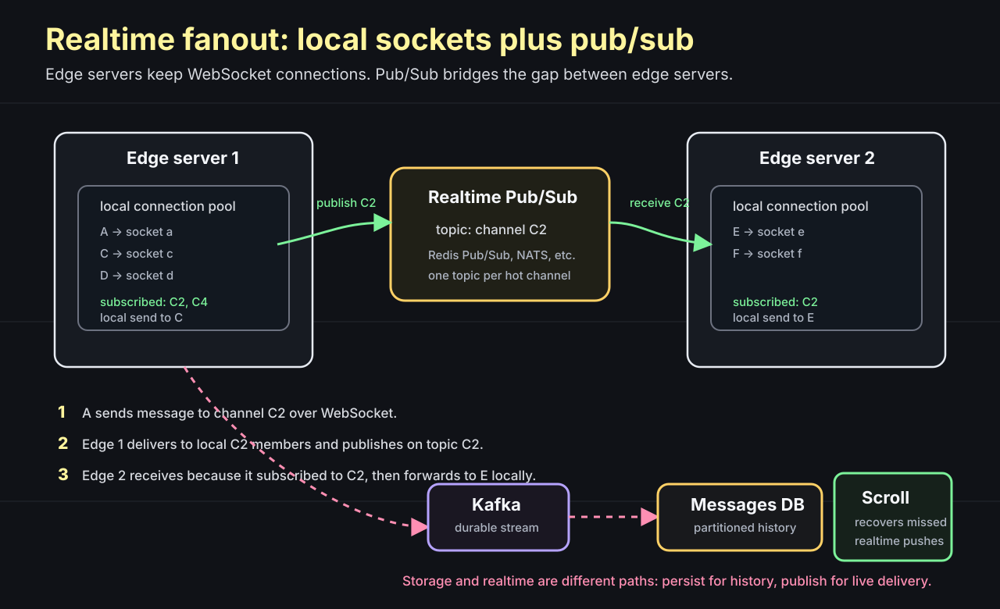
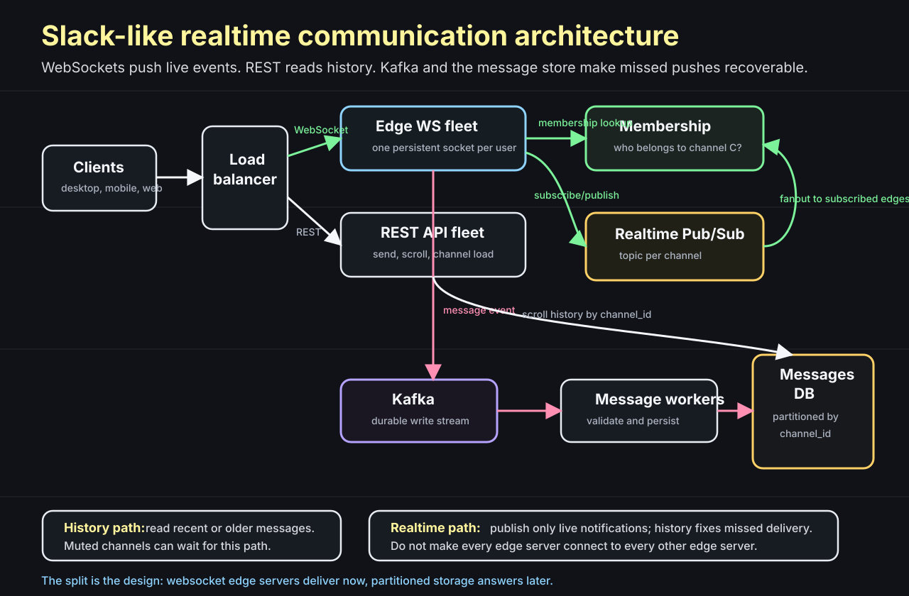

# Designing Slack's Realtime Communication

Question: when someone sends a Slack message, what is the system really doing?

It is tempting to answer "send it to everyone in the channel." That is only half the system.

The real design has two different jobs:

```text
history storage -> make sure the message can be read later
realtime push   -> make online users see it now
```

If we mix those two jobs too early, the architecture becomes confusing. So we will build it in layers.

First, store messages so channel history can be scrolled. Then add realtime delivery. Then handle the case where realtime delivery misses.

The memory hook is:

```text
storage is channel-sharded
realtime is edge-local plus pub/sub
history recovers missed pushes
```

## Start with the Database Question

Question: does "non-relational database" mean SQL cannot scale?

No.

A non-relational database is usually chosen because the data model and access pattern are simple enough to avoid joins and distribute the data cleanly. SQL databases can also scale when the data is modeled well. The stronger statement is:

```text
systems scale when the data model matches the access pattern
```

For this lecture, the useful NoSQL categories are:

```text
Document database
  JSON-like documents
  flexible schema
  richer queries than a key-value store

Key-value store
  key-wise access pattern
  heavily partitioned
  no complex query model

Column-oriented database
  reads only the columns needed for analytics
  useful for large analytical scans

Graph database
  nodes and edges
  useful for traversals, fraud detection, and recommendations
```

Slack message storage looks most like a partitioned message store. The important part is not the product label of the database. The important part is that the access pattern is almost always scoped to one channel.

```text
send message to channel C
read recent messages from channel C
scroll older messages from channel C
```

That makes `channel_id` the natural partition key.

## What Are We Designing?

Question: what are the core requirements?

We need:

- multiple workspaces
- multiple users
- multiple channels
- direct messages
- realtime chat
- historical messages that can be scrolled

Similar systems show up everywhere:

```text
Slack channels
multiplayer games
realtime polls
collaborative creator tools
live comment streams
```

The common problem is the same: many users are connected now, but the system must also remember what happened.

## Model DMs as Channels

Question: should direct messages and channels be separate message systems?

No. That creates two designs for the same thing.

A direct message is just a channel with two members.

```text
channel C1:
  members: A, B, C, D

direct message DM7:
  members: A, B
```

Once we accept this, we only need to model channels well.

The basic entities are:

```text
workspace
  id
  name

channel
  id
  workspace_id
  name

message
  id
  channel_id
  user_id
  text
  timestamp

membership
  channel_id
  user_id
  checkpoint
```

`checkpoint` can track where a user last read in a channel.

Now ask the storage question.

Question: if a channel has millions of messages, where should those messages live?

Put all messages for the same channel on the same shard.


The routing rule can be simple:

```text
shard = partition(channel_id)
```

This gives us a useful property:

```text
read channel C history -> query one shard
scroll channel C older -> query the same shard again
```

No cross-shard query is needed for normal channel scroll.

That is why the data model matters. The system is not sharded randomly. It is sharded around the thing users read together: the channel.

## The First Flow Is Not Realtime

Question: what is the smallest useful message flow?

Start with REST and storage.

```text
send_message(from_user, channel_id, text)
  API server receives request
  API server computes shard from channel_id
  API server writes the message to that shard
```

Reading is similarly direct:

```text
read_messages(channel_id)
  API server computes shard from channel_id
  API server returns recent messages

scroll_older(channel_id, before_timestamp)
  API server queries the same shard
  API server returns the next page
```

This solves history.

It does not solve realtime.

If another user is sitting in the channel, they do not want to refresh the page or wait for short polling. Messaging with REST polling is a poor user experience because the client keeps asking:

```text
any new messages?
any new messages?
any new messages?
```

The answer is to keep a connection open.

## Pick the Persistence Path

Question: should the system persist the message before pushing it live?

It depends on how critical message durability is.

There are a few possible shapes:

```text
Slack-like:
  user -> API -> message DB

WhatsApp-like:
  user -> WebSocket -> Kafka -> message DB

ephemeral massive chat:
  user -> realtime fanout
  no durable persistence
```

For Slack-like communication, messages are important. Once a user sends a message, the product should be able to show that message later. So we should design with durable history in mind.

That gives us a useful simplification:

```text
if realtime delivery fails, history still exists
```

This matters later.

## Add WebSockets

Question: why not keep using REST?

Because realtime communication wants a server-to-client path.

A WebSocket gives each client one persistent connection to the backend. The client does not need to ask every second. The server can push an event when something happens.

Browsers also have practical limits on concurrent TCP connections. So a Slack-like app should multiplex realtime features over one WebSocket:

```text
one WebSocket:
  chat messages
  typing indicators
  notifications
  presence
  other realtime events
```

This pushes us toward a fleet of edge servers.

An edge server's job is to hold WebSocket connections. Each edge server knows which users are connected to it locally:

```text
Edge server 1 local pool:
  user A -> socket a
  user B -> socket b
  user C -> socket c
```

If A sends a direct message to B and both users are connected to the same edge server, the server can deliver it locally.

But do not answer too quickly. What if the message is for a channel with 50 people? What if half of them are connected to other edge servers?

That is where the next component appears.

## Do Edge Servers Connect to Each Other?

Question: if there are 100 edge servers, should every edge server open a TCP connection to every other edge server?

No. That becomes a messy full mesh.

```text
100 edge servers
each connected to every other server
lots of connections
hard to reason about
hard to rebalance
```

The better shape is a realtime pub/sub layer.

Think of every Slack channel as having a corresponding pub/sub topic:

```text
Slack channel C2 -> realtime topic C2
Slack channel C9 -> realtime topic C9
```

Each edge server subscribes only to topics it needs. It needs a topic if one of its locally connected users is a member of that channel.

Example:

```text
Edge server 1 has users A, C, D
A and C are in channel C2
Edge server 1 subscribes to topic C2

Edge server 2 has users E, F
E is in channel C2
Edge server 2 subscribes to topic C2
```

Now when A sends a message to C2:

1. Edge server 1 receives the message.
2. The message is persisted through the durable write path.
3. Edge server 1 publishes an event to pub/sub topic C2.
4. Edge server 2 receives that event because it subscribed to C2.
5. Edge server 2 forwards the message to local user E.



This is the key realtime idea:

```text
edge servers do local delivery
pub/sub moves events between edge servers
```

The edge server does not need to know every socket in the whole system. It only needs to know its own local sockets.

## What About Membership?

Question: how does an edge server know which channels to subscribe to?

It needs membership information.

When a user connects, the system can load the channels that user belongs to:

```text
user A connects to edge server 1
edge server 1 loads A's channel memberships
edge server 1 subscribes to those channel topics
```

When the user joins a new channel, the edge server subscribes to the new topic.

When the user disconnects, the edge server can eventually drop subscriptions that no local user needs anymore.

The exact implementation can vary. The concept is simple:

```text
local users determine local subscriptions
```

This avoids broadcasting every channel event to every edge server.

## What If Realtime Delivery Misses?

Question: if a socket disconnects for a moment, is the message lost?

It should not be.

This is why the history path exists.

If a message is not delivered in realtime, the user can still fetch it when they open the channel:

```text
open channel C2
  REST API reads recent messages from C2 shard
  client catches up
```

For stronger recovery, the system can buffer delivery events in a durable stream and replay them when sockets reconnect:

```text
socket disconnects
events continue through Kafka
socket reconnects
server replays missed events or client catches up from history
```

There is also a product optimization here. Not every message needs to be pushed.

Muted channels are a good example. A user may belong to a channel but not want live pushes from it. Those messages can be loaded when the user clicks the channel.

```text
important active channel -> push realtime
muted channel            -> load on click from history
```

That saves realtime fanout work without losing correctness.

## Put the Architecture Together

Question: what does the whole system look like now?

We have two request paths.

The realtime path:

```text
client
  -> WebSocket edge server
  -> realtime pub/sub topic
  -> other subscribed edge servers
  -> local connected users
```

The history path:

```text
client
  -> REST API
  -> partitioned messages DB
  -> recent or older messages
```

The durable write path can use Kafka and workers:

```text
edge/API
  -> Kafka
  -> messaging workers
  -> partitioned messages DB
```



The final design is easier to remember if we separate responsibilities:

```text
Edge WebSocket servers:
  hold client connections
  know local sockets
  publish and receive realtime events

Realtime Pub/Sub:
  connects edge servers without full mesh
  routes events by channel topic

REST API:
  sends messages when using HTTP
  reads channel history
  supports scroll and muted channels

Kafka:
  buffers durable message events
  allows workers to persist reliably
  can help replay missed delivery events

Partitioned messages DB:
  stores history
  shards by channel_id
  supports scrolling without cross-shard fanout

Membership:
  knows who belongs to which channel
  lets edge servers subscribe to the right topics
```

## Why Channel Sharding Works

Question: what would go wrong if messages were sharded by `message_id` instead?

Scrolling a channel would scatter across shards.

```text
channel C2 messages:
  message 1 -> shard A
  message 2 -> shard D
  message 3 -> shard B
  message 4 -> shard A
```

Now `read_messages(C2)` has to query many shards and merge results by timestamp. That is unnecessary pain for the core product flow.

With `channel_id` sharding:

```text
all messages for C2 -> same shard
```

This is why access patterns should drive partitioning.

The tradeoff is that very large or very hot channels can become hot partitions. That is a later scaling problem. Start with the common case first:

```text
most reads are channel-scoped
therefore store messages by channel
```

## What to Remember

Do not start with the final diagram. Build the system from the questions.

```text
Can we model DMs and channels the same way?
Yes: a DM is a channel with two users.

Can history reads stay simple?
Yes: shard messages by channel_id.

Can REST polling give good realtime UX?
No: use one WebSocket connection per user.

Can every edge server connect to every other edge server?
No: use pub/sub topics per channel.

Can realtime delivery be the only source of truth?
No: persist messages so scroll/catch-up recovers missed pushes.
```

The compact version is:

```text
DMs are channels.
History is channel-sharded.
WebSockets terminate at edge servers.
Pub/Sub bridges edge servers.
Kafka and the message store make realtime misses recoverable.
```
