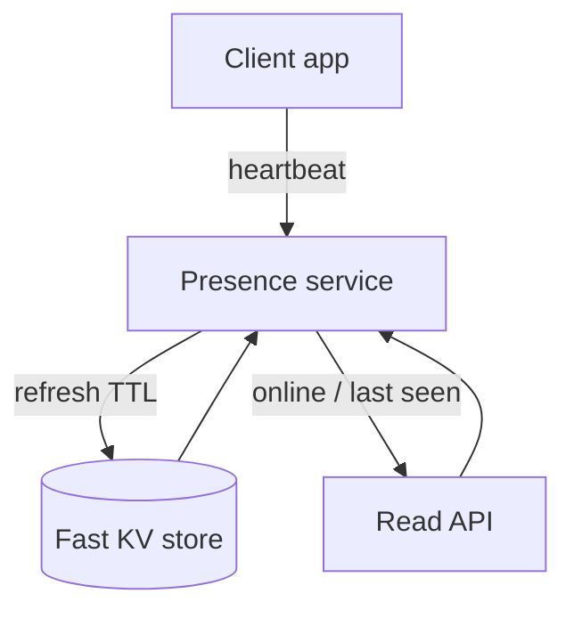
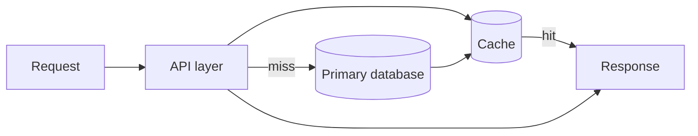

# Designing Systems from First Principles

System design gets easier when it stops sounding mysterious. Most systems are not complicated because they have many boxes on a diagram. They are complicated because they make promises about state, time, and failure. Once those promises are written down clearly, the architecture usually becomes much less dramatic.

The first practical step is to describe the product in verbs instead of components. A reader opens a feed. A writer publishes a post. A client sends a heartbeat. A service updates a cache. Those verbs expose the real work. They also expose the parts that need to be cheap, the parts that need to be correct, and the parts that can afford approximation.

## Start with state and access patterns

The fastest way to overcomplicate a system is to begin with tools. A better sequence is:

1. Define the object model.
2. Write down the hot reads and writes.
3. Estimate rough scale.
4. Decide which invariants are strict and which signals can be approximate.
5. Add infrastructure only where it removes a specific bottleneck.

For a publishing product, that means asking simple questions early:

- What is the difference between a draft and a published post?
- Does the product sort by `created_at` or `published_at`?
- Can deletion be reversed?
- Is online presence exact, or is "active recently" good enough?

Those questions shape the schema more than any vendor comparison ever will.

## Presence is a time problem

One of the best foundational examples is an online/offline indicator. It looks trivial until it is deployed at scale. A boolean field on the user record sounds simple, but it collapses under delay, reconnects, and stale reads. Presence is better modeled as a short-lived lease refreshed by client heartbeats.



This design has three useful properties:

- writes are small and frequent
- reads avoid the primary database
- uncertainty is explicit rather than hidden

That last point matters. Real systems do not know exact liveness all the time. They know that a user refreshed a lease recently. That is enough for many products, and admitting it leads to a healthier design.

## A schema should reflect product behavior

Foundational design work is often really schema work. The schema is where product semantics turn into durable structure.

```sql
CREATE TABLE blog_posts (
  id BIGINT PRIMARY KEY,
  author_id BIGINT NOT NULL,
  slug VARCHAR(128) NOT NULL UNIQUE,
  title VARCHAR(255) NOT NULL,
  body LONGTEXT NOT NULL,
  status VARCHAR(16) NOT NULL,
  published_at TIMESTAMP NULL,
  deleted_at TIMESTAMP NULL,
  created_at TIMESTAMP NOT NULL DEFAULT CURRENT_TIMESTAMP,
  updated_at TIMESTAMP NOT NULL DEFAULT CURRENT_TIMESTAMP
);
```

This table says a few important things:

- publication is a state transition, not a side effect
- deletion is recoverable
- ordering can be based on publish time instead of creation time
- large text deserves a different storage strategy than short metadata

Soft delete is worth calling out. It looks like a small implementation detail, but it changes the operational story. A post can be restored, audited, or removed asynchronously from derived systems such as caches, search indexes, and notification logs.

## Caching is a shortcut, not a source of truth

Caches are most useful when the uncached path is already correct. That sounds obvious, but a lot of systems treat caching as if it can cover for vague data ownership. It cannot.

The right way to think about a cache is as a latency optimization over a clearly defined primary path:



Keys should follow the object model. A cache key like `post:42` is tractable. A cache blob that mixes unrelated fragments from separate writes is not. Once a system knows what its source of truth is, invalidation gets much easier to reason about.

## A minimal example

Even a toy implementation makes the core idea concrete:

```python
from dataclasses import dataclass
import time


@dataclass
class PresenceRecord:
    user_id: str
    expires_at: float


class PresenceTracker:
    def __init__(self, ttl_seconds: int = 30) -> None:
        self.ttl_seconds = ttl_seconds
        self.records: dict[str, PresenceRecord] = {}

    def heartbeat(self, user_id: str, now: float | None = None) -> None:
        now = now if now is not None else time.time()
        self.records[user_id] = PresenceRecord(user_id, now + self.ttl_seconds)

    def online_users(self, now: float | None = None) -> list[str]:
        now = now if now is not None else time.time()
        stale = [uid for uid, rec in self.records.items() if rec.expires_at <= now]
        for uid in stale:
            del self.records[uid]
        return sorted(self.records)
```

This is not production software, but it demonstrates the real abstraction: liveness is lease-based, not boolean.

## What to look for in a first draft

Strong first drafts of a system usually have the same qualities:

- the main reads and writes are named explicitly
- ordering rules are unambiguous
- recovery is possible
- time-dependent signals are modeled as leases or timestamps
- caches have clear ownership and invalidation boundaries

That is why foundational design matters. It creates the habits that keep later scale work from turning into chaos.
