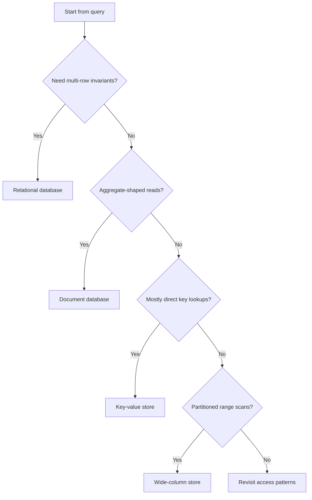
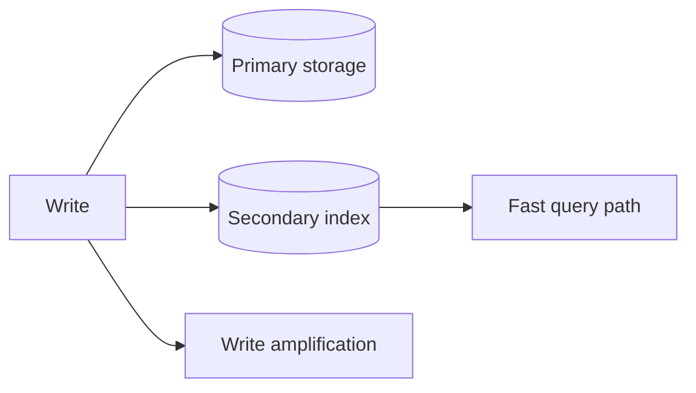

# Choosing and Shaping Data Models

The relational versus non-relational discussion is usually framed too loosely. The useful question is not which category is fashionable. The useful question is which data model makes the dominant query cheap while still protecting the invariants that matter.

A storage system is only a good fit when it helps answer the product's hardest question without turning correctness into an afterthought.

## Model the query before the table

A surprising number of storage mistakes come from designing rows before designing reads. The better sequence is to ask:

- What does the hottest request need?
- Which fields are used to filter?
- Which field defines ordering?
- How often do those fields change?
- Which updates must be transactional?

That short checklist narrows the design space quickly.



The point is not to turn architecture into a flowchart. The point is to force the design to justify itself with workload facts.

## Why relational systems are still the default

Relational databases stay popular because they solve the hardest correctness problems directly:

- uniqueness
- referential integrity
- multi-row transactions
- expressive indexing
- mature operational tooling

If a product depends on consistent identity, billing, bookings, permissions, or strongly related entities, a relational design usually buys clarity.

```sql
CREATE TABLE customers (
  id BIGINT PRIMARY KEY,
  email VARCHAR(255) NOT NULL UNIQUE,
  created_at TIMESTAMP NOT NULL DEFAULT CURRENT_TIMESTAMP
);

CREATE TABLE orders (
  id BIGINT PRIMARY KEY,
  customer_id BIGINT NOT NULL REFERENCES customers(id),
  status VARCHAR(32) NOT NULL,
  total_cents BIGINT NOT NULL,
  created_at TIMESTAMP NOT NULL DEFAULT CURRENT_TIMESTAMP
);

CREATE INDEX idx_orders_customer_created
  ON orders(customer_id, created_at DESC);
```

This model says more than "store some rows." It says the product values strong ownership, uniqueness, and queryable order.

## Transactions and ACID guarantees

A transaction is a group of database changes that should behave like one logical change. A money transfer is the classic example: debit one account and credit another account. Those two updates should succeed together or fail together.

```sql
BEGIN;

UPDATE accounts
SET balance = balance - 100
WHERE id = 'A';

UPDATE accounts
SET balance = balance + 100
WHERE id = 'B';

COMMIT;
```

ACID describes the correctness promises a relational database tries to provide around transactions.

**Atomicity** means all-or-nothing. A transaction is allowed to apply every change or discard every change. It should not leave the database with only half the work applied.

```text
Initial state
    |
    | transaction: debit A, credit B
    v

Allowed:      both changes applied
Allowed:      no changes applied
Not allowed:  only debit or only credit applied
```

Databases usually implement atomicity with transaction logs or rollback data. The engine records what started, what changed, and whether the transaction finished. If the transaction fails midway, the database can drop or undo the partial work.

**Consistency** means the database moves from one valid state to another valid state. Validity comes from rules such as constraints, cascades, and triggers.

```text
Consistent state
    |
    | transaction runs
    | checks: foreign keys, unique constraints, check constraints, cascades
    v
Consistent state
```

Examples of consistency rules:

- an account balance cannot be negative
- an order must belong to an existing customer
- a deleted customer should not leave orphaned dependent rows unless the schema permits it

If a transaction violates one of these rules, the database rolls it back and returns to the previous consistent state.

**Isolation** means concurrent transactions should not corrupt one another. If many users book seats, buy flash-sale items, or transfer money at the same time, the final result still needs to respect the business rules.

```text
Initial state
    |
    v
Concurrent transactions
    |  locks or versioning prevent unsafe overlap
    v
Final state
```

One common implementation tool is locking. Before changing a row, a transaction may take a shared or exclusive lock so conflicting transactions have to wait until the first one commits or rolls back. The strictness depends on the isolation level, such as read uncommitted, read committed, repeatable read, or serializable. Locks and isolation levels deserve their own deeper discussion.

**Durability** means committed data survives failures. Once the database says a transaction committed, the result should not vanish because the process crashed or the machine restarted.

```text
Change requested
    |
    v
Transaction log on durable storage
    |
    v
Apply change to database
    |
    v
Crash and reboot
    |
    v
Replay log and recover committed state
```

The usual mechanism is a fast append-only transaction log, often called a write-ahead log. The database writes enough information to durable storage before treating the transaction as safely committed. On restart, it can replay committed changes and ignore incomplete ones.

For distributed transactions, durability and atomicity become harder because multiple database nodes must agree on the outcome. Protocols such as two-phase commit split the work into a prepare phase and a commit phase so participants either commit together or roll back together.

## Why non-relational systems are powerful

Non-relational systems shine when the application wants aggregates rather than joins, or when partitionable scale dominates the problem.

A document store, for example, works well when the application naturally loads an object with its nested children in one read:

```python
from dataclasses import dataclass, asdict


@dataclass
class OrderItem:
    sku: str
    quantity: int
    price_cents: int


@dataclass
class OrderDocument:
    order_id: str
    customer_id: str
    status: str
    items: list[OrderItem]

    def total_cents(self) -> int:
        return sum(item.quantity * item.price_cents for item in self.items)

    def to_document(self) -> dict:
        return {
            "order_id": self.order_id,
            "customer_id": self.customer_id,
            "status": self.status,
            "items": [asdict(item) for item in self.items],
            "total_cents": self.total_cents(),
        }
```

This is useful when the aggregate itself is the unit of work. It becomes less comfortable when the business rule spans many aggregates and those rules must hold under concurrency.

## Normalization is not morality

Normalization is a tool. Denormalization is also a tool. The right choice depends on which cost hurts more.

Normalize when:

- correctness across entities is difficult
- duplicated state would drift
- updates are frequent and broad

Denormalize when:

- the read path is too expensive otherwise
- the application already consumes an aggregate
- some duplication is cheaper than repeated joins or fan-in

The moment data is duplicated, a new requirement appears: repair. That repair may be synchronous, asynchronous, or periodic, but it has to exist.

## Indexes are a write tax you choose deliberately

Indexes make reads fast by charging writes and storage. That trade is usually worthwhile, but it should be made consciously.

Disk reads happen in blocks, not in neat little row-sized bites. If one needed byte sits inside a disk block, the storage layer reads that whole block into memory and then extracts the useful part.

Imagine a table where each row is 200 bytes and the disk block size is 600 bytes. Each block can hold three rows:

```text
Block 1: rows 1, 2, 3
Block 2: rows 4, 5, 6
Block 3: rows 7, 8, 9
...
Block 34: row 100
```

A 100-row table would need 34 blocks because `100 / 3` rounds up. If the query is `WHERE age = 23` and there is no useful index, the database may need to read all 34 table blocks, check each row, and collect the matching rows in an output buffer.

An index gives the database a smaller structure to inspect first. Conceptually, an index on `age` is a compact lookup table from age to row id, ordered by age:

```text
age -> row id
21  -> 2
22  -> 3
22  -> 5
23  -> 1
23  -> 4
24  -> 6
```

Each index entry is much smaller than a full row. If `age` is 4 bytes and `id` is 4 bytes, each entry is 8 bytes. For 100 rows, the index is about 800 bytes, which fits in two 600-byte blocks.

Now the `age = 23` query can work in two phases:

```text
1. Read the index blocks and collect matching row ids: 1 and 4.
2. Read only the table blocks containing rows 1 and 4.
```

In this toy layout, rows 1 and 4 live in two different table blocks, so the database reads two index blocks and two table blocks: four block reads total instead of 34. The exact numbers vary by storage engine, but the idea is stable: indexes make reads faster by replacing broad table scans with smaller index scans plus targeted row fetches.



A well-designed index matches real filter and sort prefixes. A poorly designed index makes every write heavier without rescuing the hot query. Every insert, update, or delete now has to maintain both the primary data and the index, which is why indexes make reads faster but writes slower.

## A practical storage conversation

A productive design review sounds like this:

- The user opens their recent orders page.
- We filter by `customer_id`.
- We order by `created_at`.
- We need exact order totals.
- We do not need joins beyond customer ownership on this path.

That level of specificity leads to a defensible data model. General statements about preferring SQL or preferring NoSQL do not.

## What good storage decisions optimize

The best storage choices make three things true at once:

- the dominant read is cheap
- the critical invariant is enforceable
- the operational model is understandable by the team

That last point matters. A theoretically elegant system that nobody can debug under load is not a good storage choice. Good data modeling is part query design, part correctness design, and part operational restraint.
