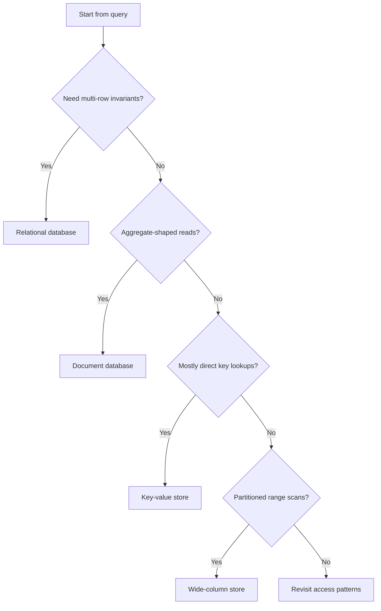
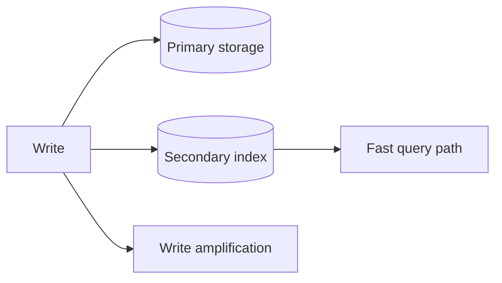

# Choosing and Shaping Data Models

The relational versus non-relational discussion is usually framed too loosely. The useful question is not which category is fashionable. The useful question is which data model makes the dominant query cheap while still protecting the invariants that matter.

A storage system is only a good fit when it helps answer the product's hardest question without turning correctness into an afterthought.

## Model the query before the table

A surprising number of storage mistakes come from designing rows before designing reads. The better sequence is to ask:

- What does the hottest request need?
- Which fields are used to filter?
- Which field defines ordering?
- How often do those fields change?
- Which updates must be transactional?

That short checklist narrows the design space quickly.



The point is not to turn architecture into a flowchart. The point is to force the design to justify itself with workload facts.

## Why relational systems are still the default

Relational databases stay popular because they solve the hardest correctness problems directly:

- uniqueness
- referential integrity
- multi-row transactions
- expressive indexing
- mature operational tooling

If a product depends on consistent identity, billing, bookings, permissions, or strongly related entities, a relational design usually buys clarity.

```sql
CREATE TABLE customers (
  id BIGINT PRIMARY KEY,
  email VARCHAR(255) NOT NULL UNIQUE,
  created_at TIMESTAMP NOT NULL DEFAULT CURRENT_TIMESTAMP
);

CREATE TABLE orders (
  id BIGINT PRIMARY KEY,
  customer_id BIGINT NOT NULL REFERENCES customers(id),
  status VARCHAR(32) NOT NULL,
  total_cents BIGINT NOT NULL,
  created_at TIMESTAMP NOT NULL DEFAULT CURRENT_TIMESTAMP
);

CREATE INDEX idx_orders_customer_created
  ON orders(customer_id, created_at DESC);
```

This model says more than "store some rows." It says the product values strong ownership, uniqueness, and queryable order.

## Why non-relational systems are powerful

Non-relational systems shine when the application wants aggregates rather than joins, or when partitionable scale dominates the problem.

A document store, for example, works well when the application naturally loads an object with its nested children in one read:

```python
from dataclasses import dataclass, asdict


@dataclass
class OrderItem:
    sku: str
    quantity: int
    price_cents: int


@dataclass
class OrderDocument:
    order_id: str
    customer_id: str
    status: str
    items: list[OrderItem]

    def total_cents(self) -> int:
        return sum(item.quantity * item.price_cents for item in self.items)

    def to_document(self) -> dict:
        return {
            "order_id": self.order_id,
            "customer_id": self.customer_id,
            "status": self.status,
            "items": [asdict(item) for item in self.items],
            "total_cents": self.total_cents(),
        }
```

This is useful when the aggregate itself is the unit of work. It becomes less comfortable when the business rule spans many aggregates and those rules must hold under concurrency.

## Normalization is not morality

Normalization is a tool. Denormalization is also a tool. The right choice depends on which cost hurts more.

Normalize when:

- correctness across entities is difficult
- duplicated state would drift
- updates are frequent and broad

Denormalize when:

- the read path is too expensive otherwise
- the application already consumes an aggregate
- some duplication is cheaper than repeated joins or fan-in

The moment data is duplicated, a new requirement appears: repair. That repair may be synchronous, asynchronous, or periodic, but it has to exist.

## Indexes are a write tax you choose deliberately

Indexes make reads fast by charging writes and storage. That trade is usually worthwhile, but it should be made consciously.



A well-designed index matches real filter and sort prefixes. A poorly designed index makes every write heavier without rescuing the hot query.

## A practical storage conversation

A productive design review sounds like this:

- The user opens their recent orders page.
- We filter by `customer_id`.
- We order by `created_at`.
- We need exact order totals.
- We do not need joins beyond customer ownership on this path.

That level of specificity leads to a defensible data model. General statements about preferring SQL or preferring NoSQL do not.

## What good storage decisions optimize

The best storage choices make three things true at once:

- the dominant read is cheap
- the critical invariant is enforceable
- the operational model is understandable by the team

That last point matters. A theoretically elegant system that nobody can debug under load is not a good storage choice. Good data modeling is part query design, part correctness design, and part operational restraint.
