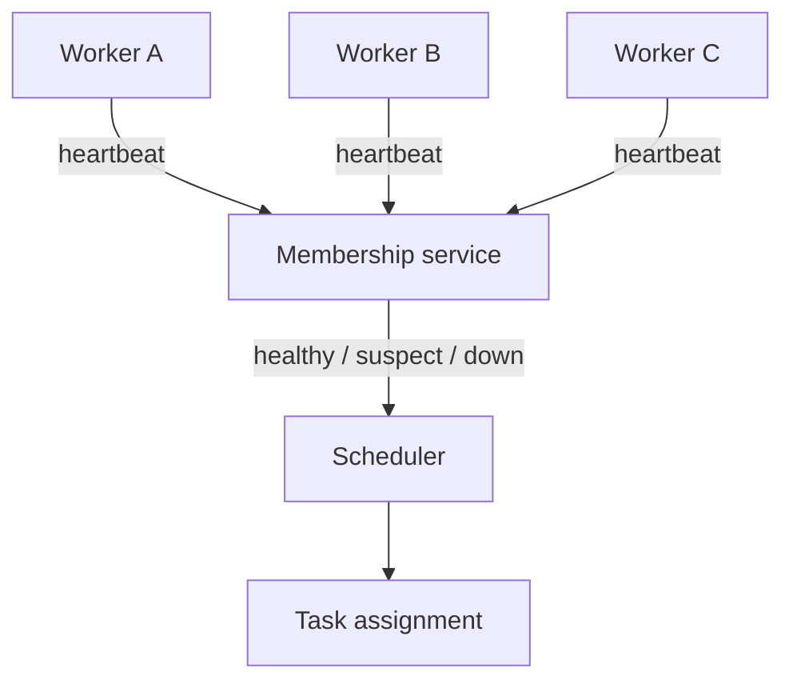
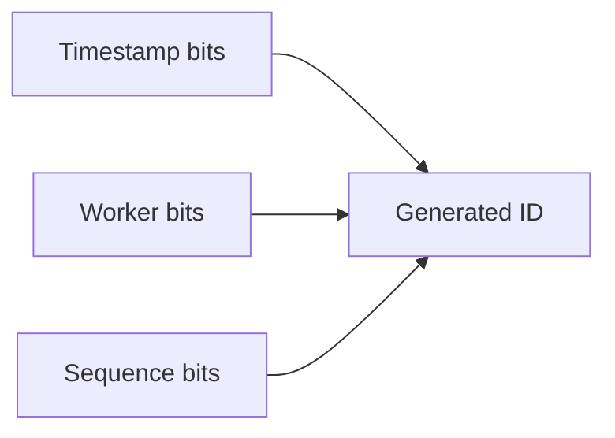

# Distributed Systems and Scalable Identifiers

Distributed systems are hard for a simple reason: the network does not behave like memory. Calls can be delayed, duplicated, reordered, or dropped. A service can do real work after the caller has timed out. Two machines can disagree about time. Once those facts are accepted, the design becomes less idealized and more useful.

## Treat remote work as uncertain work

The most important mental shift is to stop treating a network request like a function call. Local code either returned or it did not. Distributed code may have succeeded, failed, or succeeded after the caller gave up.

That is why retries and idempotency belong at the center of the design rather than at the edge.

## The baseline failure model

Any serious system should assume:

- transient timeouts
- duplicate requests
- delayed delivery
- partial commits
- node restarts
- clock skew

If those cases are not discussed explicitly, they still exist. They just appear later as production incidents instead of design constraints.

## Membership and health are approximate

Cluster health is a good example. A heartbeat does not prove a machine is correct; it proves a machine was reachable recently enough to send a signal.



This is why three states are often better than two:

- healthy
- suspect
- down

A suspect state gives the system room to degrade conservatively without overreacting to brief noise.

## A small implementation sketch

```python
import time


class MembershipTable:
    def __init__(self, suspect_after: int = 5, dead_after: int = 15) -> None:
        self.suspect_after = suspect_after
        self.dead_after = dead_after
        self.last_seen: dict[str, float] = {}

    def heartbeat(self, node_id: str, now: float | None = None) -> None:
        self.last_seen[node_id] = now if now is not None else time.time()

    def status(self, node_id: str, now: float | None = None) -> str:
        now = now if now is not None else time.time()
        age = now - self.last_seen[node_id]
        if age >= self.dead_after:
            return "down"
        if age >= self.suspect_after:
            return "suspect"
        return "healthy"
```

Again, the point is not to build a production-grade system in a snippet. The point is to show the core abstraction clearly.

## Distributed identifiers are architecture decisions

ID generation looks like a bookkeeping task until scale exposes its hidden assumptions.

An auto-increment counter is easy to reason about, but it centralizes coordination. A random UUID removes coordination, but it can be large and unfriendly to locality-sensitive indexes. A structured identifier sits in the middle: it preserves local generation while keeping some temporal or machine-level meaning.



This structure is common because it reflects the shape of the real problem:

- many machines need IDs independently
- order often matters at least roughly
- bursts can produce several IDs in the same millisecond

## A compact generator

```python
import time


class SnowflakeGenerator:
    def __init__(self, worker_id: int, epoch_ms: int = 1_700_000_000_000) -> None:
        self.worker_id = worker_id
        self.epoch_ms = epoch_ms
        self.last_ms = -1
        self.sequence = 0

    def _timestamp_ms(self) -> int:
        return int(time.time() * 1000)

    def next_id(self) -> int:
        now = self._timestamp_ms()
        if now < self.last_ms:
            raise RuntimeError("clock moved backwards")
        if now == self.last_ms:
            self.sequence = (self.sequence + 1) & 0xFFF
            if self.sequence == 0:
                while now <= self.last_ms:
                    now = self._timestamp_ms()
        else:
            self.sequence = 0
        self.last_ms = now
        return ((now - self.epoch_ms) << 22) | (self.worker_id << 12) | self.sequence
```

Three design concerns are embedded in that small class:

- rollback in wall-clock time
- local sequence overflow
- worker identity allocation

Each of those becomes an operational concern in real deployments.

## Coordination is the real cost

The main lesson from distributed systems is not that the network is scary. The main lesson is that coordination is expensive. Every shared ordering rule, global lock, central counter, or strongly synchronized view of the world costs latency and availability.

That does not mean coordination is bad. It means it should earn its keep.

## What a good distributed design makes explicit

Strong distributed designs answer these questions clearly:

- What happens if the caller times out but the server later succeeds?
- Can the operation be replayed safely?
- Who owns ordering?
- What happens when clocks disagree?
- Which signals are approximate?

Once those answers exist, the rest of the architecture stops being hand-wavy. It becomes a set of controlled trade-offs instead.
