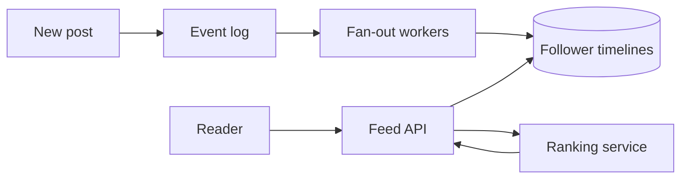
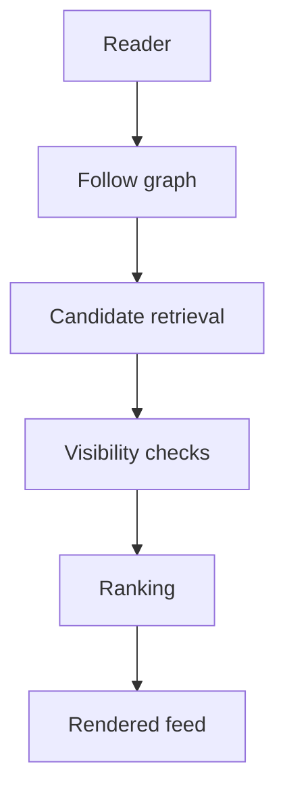

# Building Social Features at Scale

Social products are often described as if they are a single system. They are not. A social product is at least a graph system, a content system, a feed system, and a moderation system sharing the same user identifiers.

That decomposition matters because the scaling pressure is different in each layer. Follows shape candidate retrieval. Posts shape storage. Feeds shape fan-out and ranking. Moderation shapes deletion, visibility, and replay behavior.

## The graph is the first constraint

Every social product has some relationship graph:

- follows
- friendships
- subscriptions
- memberships

Those edges are not just metadata. They define how much work a single action can trigger. A single post from an account with ten followers is a small write. A post from an account with ten million followers is a broadcast problem.

## Timeline generation is a cost-placement problem

The central trade-off is where to pay for feed assembly.

Fan-out on write spends effort at publish time so reads stay simple later. Fan-out on read defers the cost until a reader opens the app.



Neither model is universally best:

- fan-out on write works well for ordinary users with many reads per write
- fan-out on read works better for extreme hot accounts or highly dynamic ranking
- hybrid strategies precompute some work and defer some work

That hybrid approach is common because user distributions are skewed. Most users are ordinary. A few users are effectively infrastructure-scale.

## Candidate retrieval and ranking should be separate

A useful discipline in feed design is to separate three concerns:

1. what the user is allowed to see
2. what the system should consider as candidates
3. how the final ranking is computed



When these are mixed together, the system becomes hard to evolve. A new ranking signal suddenly changes permission logic. A cache key accidentally ignores privacy state. A moderation deletion becomes difficult to propagate cleanly.

## Counters are not the same as identity

A large social system usually stores at least two kinds of truth:

- strict truth, such as account identity or visibility state
- soft truth, such as like counts or approximate view metrics

Those categories should not be engineered with the same guarantees. A delayed counter is often acceptable. A delayed privacy update is not.

This is why event-driven counters are so common. A write path emits an event, and background workers aggregate likes or views without blocking the core publish path.

## A small fan-out example

```python
from collections import defaultdict


def fanout_on_write(followers: dict[str, list[str]], author: str, post_id: str) -> dict[str, list[str]]:
    timelines: dict[str, list[str]] = defaultdict(list)
    for follower in followers.get(author, []):
        timelines[follower].append(post_id)
    return timelines
```

That tiny function captures the core scalability problem. The work done by one publish depends on the size of the audience. Once the audience is large enough, the system needs queueing, chunking, retries, and backpressure.

## Deletion and moderation are part of the architecture

Social systems are especially sensitive to stale derived state:

- timeline caches
- notifications
- search indexes
- recommendation features
- analytics sinks

Deleting a row is not enough. The system needs a tombstone story that propagates through all derived layers. The larger the amount of precomputed state, the more important that story becomes.

## What strong social designs optimize

The best social architectures usually optimize three things simultaneously:

- they keep the common read path fast
- they survive skew from unusually hot users
- they treat visibility and moderation as first-class constraints

That is what makes social architecture interesting. It is not just about posting and reading content. It is about deciding where precomputation belongs, where approximation is safe, and where the system must remain exact.
