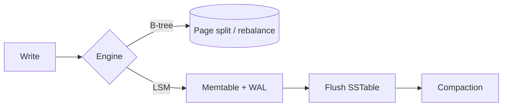
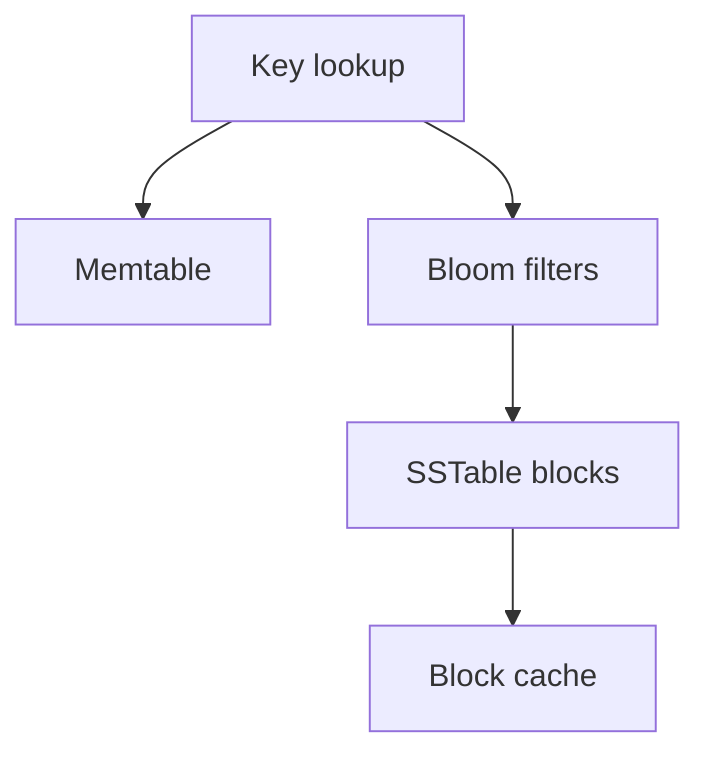

# How Storage Engines Shape Behavior

Storage engines are easy to ignore when everything fits in a tutorial-sized database. Once the system grows, that abstraction breaks down. Latency variance, write stalls, compaction pressure, and recovery time all leak upward into application behavior.

The application does not need to implement a storage engine, but it does need to understand what the engine is optimized to do.

## Two broad families, two different bets

B-tree systems and log-structured merge systems make different performance bets.



A B-tree keeps data in sorted pages and updates those pages in place. An LSM tree absorbs writes into memory and immutable files, then pays the ordering cost later through compaction.

This difference explains a lot of behavior that otherwise looks mysterious.

## Why B-trees feel stable

B-trees are good at:

- point lookups
- range scans
- update-heavy transactional workloads
- predictable locality for ordered keys

They work well because the sorted structure is maintained continuously. The cost shows up in page rewrites, page splits, and rebalancing when mutation patterns are unfriendly.

## Why LSM trees handle write-heavy workloads well

LSM systems are attractive because they defer expensive work:

- writes go to a memory structure first
- durability is captured through a write-ahead log
- sorted files are flushed lazily
- background compaction merges files later

This can make sustained ingest much cheaper than repeatedly rewriting sorted pages. The trade-off is that reads may have to consult multiple files or levels unless filters and caches help prune the search.



## Bloom filters and block caches are read-path features

These supporting structures are not internal trivia. They directly shape user-visible performance.

- Bloom filters reject files that definitely do not contain a key.
- Block caches keep hot disk blocks in memory.
- Write-ahead logs define crash recovery behavior.
- Compaction policies define how much deferred work can accumulate.

An engine is not just "disk plus indexes." It is a set of cooperating structures that decide where cost lands.

## A tiny LSM sketch

```python
from bisect import bisect_left


class TinyLSM:
    def __init__(self, flush_threshold: int = 4) -> None:
        self.flush_threshold = flush_threshold
        self.memtable: dict[str, str] = {}
        self.sstables: list[list[tuple[str, str]]] = []

    def put(self, key: str, value: str) -> None:
        self.memtable[key] = value
        if len(self.memtable) >= self.flush_threshold:
            self.flush()

    def flush(self) -> None:
        self.sstables.insert(0, sorted(self.memtable.items()))
        self.memtable.clear()

    def get(self, key: str) -> str | None:
        if key in self.memtable:
            return self.memtable[key]
        for table in self.sstables:
            keys = [item[0] for item in table]
            index = bisect_left(keys, key)
            if index < len(table) and table[index][0] == key:
                return table[index][1]
        return None
```

It is intentionally small, but it shows the core idea: writes are cheap up front because structure is deferred.

## Application choices that interact with engines

A few application decisions are really engine decisions in disguise:

- random keys versus ordered keys
- narrow versus wide secondary indexes
- soft deletes versus physical deletes
- heavy updates versus append-oriented mutations

For example, tombstones in an LSM tree are not free. They preserve correctness, but they still need future compaction work to reclaim space and simplify reads.

## The practical takeaway

Storage engines matter because they decide how a system spends work across time:

- now versus later
- memory versus disk
- write cost versus read cost
- steady performance versus bursty maintenance work

A strong system design does not need to be database-internals-heavy. It just needs to respect the fact that the engine is part of the product's performance model.
