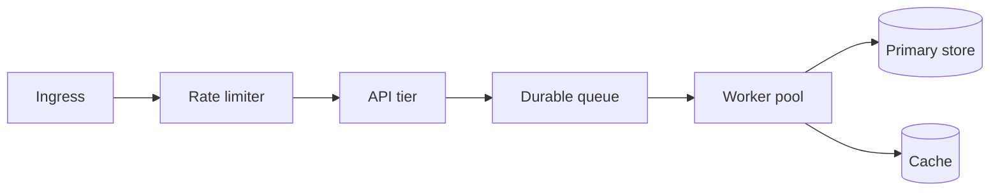
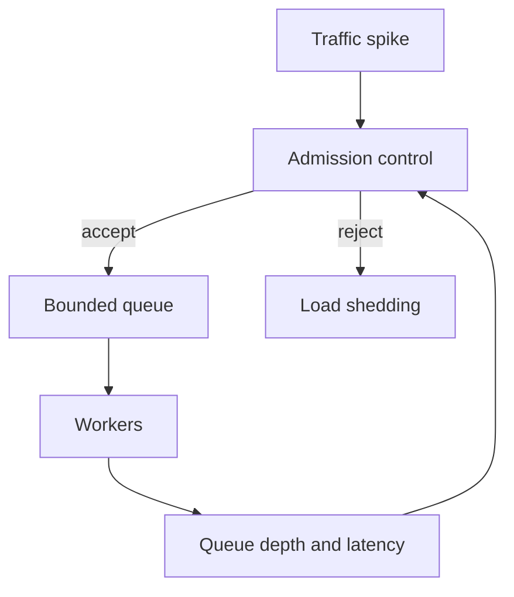

# Designing for Throughput and Backpressure

Throughput engineering is often misunderstood as a hardware problem. In practice it is usually a work-shaping problem. The hardest question is rarely "can this machine handle one request quickly?" The harder question is "what happens when too much work arrives at once?"

A system that survives sustained load usually wins by smoothing work, bounding queues, and rejecting low-value pressure early.

## Throughput is sustainable work, not peak work

A meaningful throughput number includes a quality bar:

- acceptable latency
- acceptable error rate
- acceptable operational strain

Without those constraints, throughput becomes a vanity metric. Almost any service can accept more work temporarily if it is allowed to accumulate silent pain.

## The main levers

High-throughput systems repeatedly use the same levers:

- horizontal partitioning
- batching
- queueing
- asynchronous execution
- caching
- rate limiting
- admission control



Each lever changes not only capacity but also failure mode. That second part is easy to forget.

## Queues are useful and dangerous

Queues absorb burstiness. That makes them valuable. But they also hide overload temporarily, which makes them dangerous when they are unbounded.

If a queue grows without a clear control loop, latency turns into a silent liability. The request is not failing yet, but it is aging in place.

This is why queue depth is often a more meaningful signal than CPU usage. CPU can look calm while the real failure has already started in the backlog.

## Backpressure keeps failure local

A system with no backpressure tends to fail everywhere at once. A system with backpressure tries to contain overload near the boundary where it begins.



This design makes a simple point: not all work should be admitted equally. Protecting the important path often requires rejecting or degrading the less important path.

## Two simple examples

### Token bucket rate limiter

```python
import time


class TokenBucket:
    def __init__(self, rate_per_second: float, capacity: int) -> None:
        self.rate_per_second = rate_per_second
        self.capacity = capacity
        self.tokens = float(capacity)
        self.last_refill = time.time()

    def allow(self, cost: float = 1.0) -> bool:
        now = time.time()
        elapsed = now - self.last_refill
        self.tokens = min(self.capacity, self.tokens + elapsed * self.rate_per_second)
        self.last_refill = now
        if self.tokens < cost:
            return False
        self.tokens -= cost
        return True
```

### Batching small jobs

```python
from itertools import islice


def batched(iterable, size: int):
    iterator = iter(iterable)
    while batch := list(islice(iterator, size)):
        yield batch
```

Both snippets are small, but they encode throughput ideas directly:

- rate limiting bounds incoming pressure
- batching amortizes fixed overhead

## Timeouts and retries must be tuned together

Retries are useful. They are also a common source of amplification. If the dependency is already slow and every caller retries aggressively, the system manufactures more load exactly when it can least afford it.

Good throughput design treats timeouts, retries, and admission control as a connected policy, not separate library settings.

## What high-throughput systems really optimize

The best high-throughput systems do not just go fast. They stay understandable under stress. They make it easy to answer:

- where the queue is
- what fills it
- when work is shed
- which tier saturates first
- how the system recovers after pressure drops

That is why throughput is an architectural topic rather than a micro-optimization topic. It is about shaping demand so the system remains predictable.
