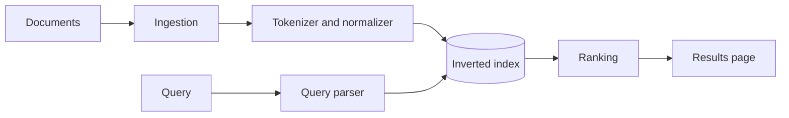
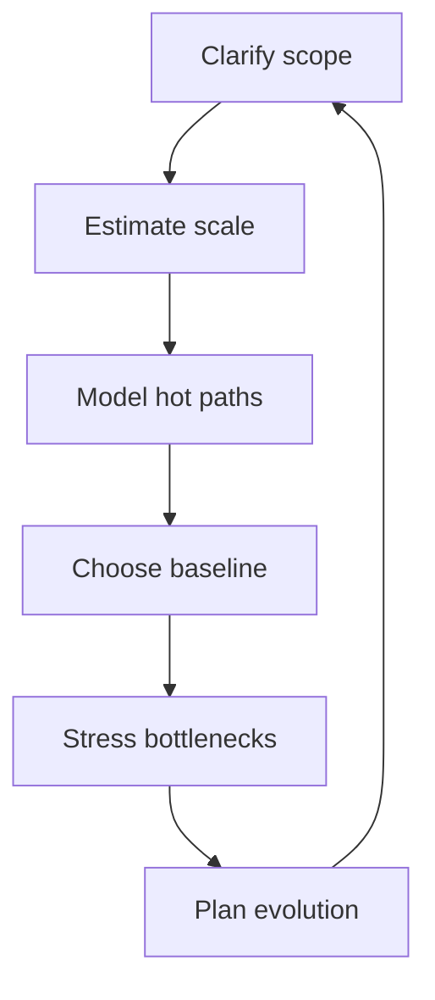

# Search Systems and Ad Hoc Architecture

Search systems are useful to study because they force clean decomposition. Documents are ingested, normalized, indexed, retrieved, and ranked. That structure makes search a good training ground for a broader skill: designing unfamiliar systems by breaking them into stages.

The connection between information retrieval and ad hoc architecture is practical. Search teaches how to think in pipelines. Ad hoc design teaches how to reuse that pipeline mindset in domains that do not arrive with obvious boundaries.

## Search starts before the query

Search quality is shaped heavily by work that happens before a user types anything:

- tokenization
- normalization
- indexing
- field weighting
- update propagation

Once the index is built poorly, ranking can only repair so much.



This decomposition matters because each stage has different scaling behavior. Ingestion is write-heavy. Retrieval is latency-sensitive. Ranking is often compute-heavy. Treating them as one thing makes optimization harder.

## The inverted index is the core structure

At the center of many retrieval systems is a simple idea: map each token to the documents that contain it.

```python
import re
from collections import defaultdict


class InvertedIndex:
    def __init__(self) -> None:
        self.postings: dict[str, set[str]] = defaultdict(set)

    def add(self, doc_id: str, text: str) -> None:
        for token in re.findall(r"[a-z0-9]+", text.lower()):
            self.postings[token].add(doc_id)

    def search(self, token: str) -> list[str]:
        return sorted(self.postings.get(token.lower(), set()))
```

That small example omits ranking and compression, but it captures the central abstraction. Search gets fast when retrieval can jump directly to the plausible documents rather than scanning everything.

## Retrieval and ranking should not be confused

Retrieval answers a coarse question: which documents are plausible matches?

Ranking answers a finer question: which plausible matches should appear first?

This distinction becomes more important as the system grows. Retrieval must stay cheap enough to produce candidates quickly. Ranking can then spend more effort on a smaller set.

## Autocomplete is a different workload

Autocomplete often looks like search from the product surface, but it behaves differently:

- queries are short and partial
- latency budgets are tighter
- updates can be frequent
- prefix matching matters more than document scoring

```python
class TrieNode:
    def __init__(self) -> None:
        self.children: dict[str, "TrieNode"] = {}
        self.words: list[str] = []


class AutocompleteTrie:
    def __init__(self) -> None:
        self.root = TrieNode()

    def add(self, word: str) -> None:
        node = self.root
        for char in word:
            node = node.children.setdefault(char, TrieNode())
            if word not in node.words:
                node.words.append(word)

    def complete(self, prefix: str) -> list[str]:
        node = self.root
        for char in prefix:
            if char not in node.children:
                return []
            node = node.children[char]
        return sorted(node.words)
```

The useful lesson is not "always use a trie." The useful lesson is that similar product features can require different internal structures.

## A repeatable ad hoc design loop

When the domain is unfamiliar, structure matters more than cleverness. A repeatable loop keeps the conversation grounded.



That loop is intentionally generic. It works for search, messaging, analytics, and many other systems because the core questions stay similar:

- what is the user trying to do?
- what path must be cheap?
- what state must be correct?
- what changes first as scale grows?

## Why this pairing matters

Search architecture and ad hoc design belong together because both reward decomposition. Strong designers do not wait for perfect familiarity. They look for stages, interfaces, and pressure points, then build a baseline that can survive scrutiny.

That is the real transferable skill: not memorizing canned answers, but learning how to slice a vague problem into parts that can be reasoned about.
