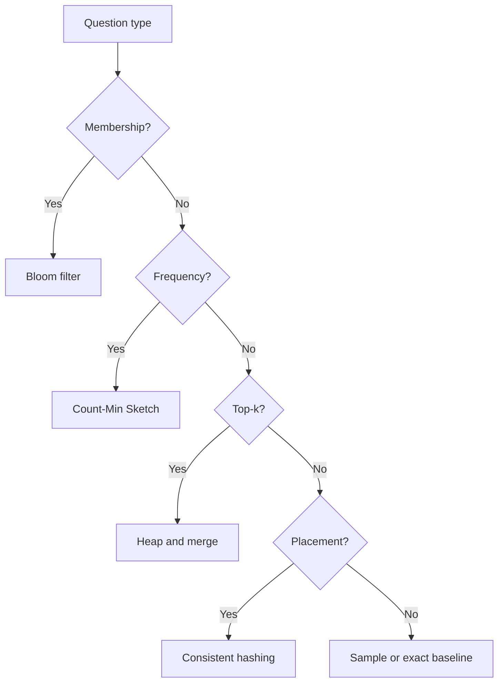

# Algorithmic Tools for Large Systems

At small scale, exact answers feel natural. At large scale, exact answers can become too expensive in memory, latency, or coordination. Algorithmic system design is about choosing the right approximation or summary structure when a direct solution no longer fits the operating budget.

This is not a niche concern. Large systems ask the same questions repeatedly:

- Have I seen this item before?
- Which keys are getting hot?
- What are the top results right now?
- How can I place data with minimal reshuffling?

Those questions often need algorithmic help as much as infrastructural help.

## Choose the structure that matches the question

Different questions want different tools.



The value of this framing is that it starts with product intent rather than with an algorithm catalogue.

## Bloom filters: cheap rejection

A Bloom filter answers one question efficiently: is this item definitely absent, or might it be present?

That is surprisingly powerful because many systems spend too much work on negative lookups.

```python
import hashlib


class BloomFilter:
    def __init__(self, size: int = 128, hash_count: int = 3) -> None:
        self.size = size
        self.hash_count = hash_count
        self.bits = [0] * size

    def _hashes(self, value: str):
        for salt in range(self.hash_count):
            digest = hashlib.sha256(f"{salt}:{value}".encode()).hexdigest()
            yield int(digest, 16) % self.size

    def add(self, value: str) -> None:
        for index in self._hashes(value):
            self.bits[index] = 1

    def might_contain(self, value: str) -> bool:
        return all(self.bits[index] for index in self._hashes(value))
```

The trade is straightforward:

- no false negatives
- some false positives
- very small memory footprint

That trade is often worth it when a probable hit simply leads to a deeper lookup.

## Count-Min Sketch: useful counts without full maps

Exact frequency maps are expensive when the key space is huge and the distribution is skewed.

```python
import hashlib


class CountMinSketch:
    def __init__(self, width: int = 64, depth: int = 4) -> None:
        self.width = width
        self.depth = depth
        self.table = [[0] * width for _ in range(depth)]

    def _indexes(self, key: str):
        for row in range(self.depth):
            digest = hashlib.md5(f"{row}:{key}".encode()).hexdigest()
            yield row, int(digest, 16) % self.width

    def add(self, key: str, count: int = 1) -> None:
        for row, column in self._indexes(key):
            self.table[row][column] += count

    def estimate(self, key: str) -> int:
        return min(self.table[row][column] for row, column in self._indexes(key))
```

This structure is useful when the exact long tail does not matter, but hot keys do.

## Approximation is a product choice

Algorithmic design is not just math. It is product negotiation.

Questions worth asking:

- Is a bounded overestimate acceptable?
- Can this summary be merged across shards?
- Does the structure support deletion?
- Is the error understandable enough to explain to non-infrastructure stakeholders?

Approximation is only safe when the consumer of the answer understands what kind of approximation it is.

## Placement and movement matter too

Some algorithmic choices are about where data lives rather than how it is counted. Consistent hashing is a classic example. It reduces reshuffling when membership changes, which is often more valuable than perfectly even distribution.

That is a recurring theme in large systems: a slightly imperfect steady state can be better than a theoretically cleaner design that causes excessive movement during change.

## The real lesson

Algorithmic system design matters because infrastructure alone is not enough. Scaling a system is partly about more machines and better queues, but it is also about choosing data structures that ask less of the hardware in the first place.

The most useful habit is to translate the workload into a question shape:

- membership
- frequency
- ranking
- sampling
- placement

Once that translation is done, the right algorithmic tool is often much easier to justify.
